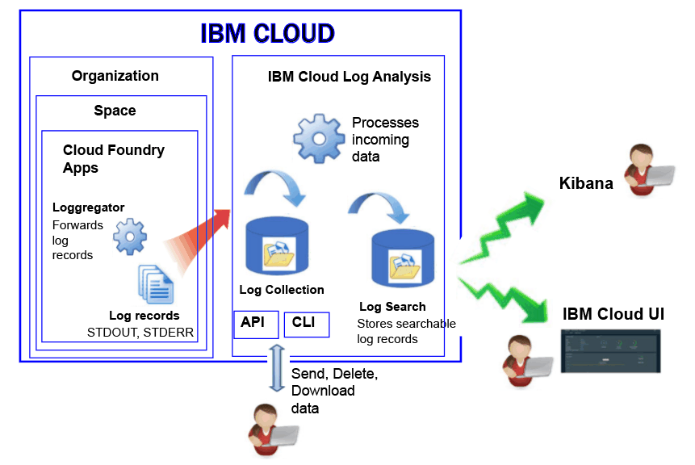

---

copyright:
  years: 2017

lastupdated: "2017-11-09"

---

{:shortdesc: .shortdesc}
{:new_window: target="_blank"}
{:codeblock: .codeblock}
{:screen: .screen}
{:pre: .pre}

# Logging for Cloud Foundry apps in the {{site.data.keyword.Bluemix_notm}}
{: #logging_bluemix_cf_apps}

In the {site.data.keyword.Bluemix}}, you can view, filter, and analyze Cloud Foundry (CF) logs through the {{site.data.keyword.Bluemix_notm}} dashboard, Kibana, and the command line interface. In addition, you can stream log records to an external log management tool. 
{:shortdesc}

{{site.data.keyword.Bluemix_notm}} records log data that is generated by the Cloud Foundry platform and by Cloud Foundry applications. In the logs, you can view the errors, warnings, and informational messages that are produced for your app. 

When you run your apps in a cloud platform-as-a-service (PaaS) like Cloud Foundry on the {{site.data.keyword.Bluemix_notm}}, you cannot SSH or FTP into the infrastructure where your apps are running to access the logs. The platform is controlled by the cloud provider. Cloud Foundry apps running on the {{site.data.keyword.Bluemix_notm}} use the Loggerator component to forward log records from inside of the Cloud Foundry infrastructure. The Loggregator automatically picks up STDOUT and STDERR data. You can visualize and analyze these logs through the {{site.data.keyword.Bluemix_notm}} dashboard, Kibana, and the command line interface.

The following figure shows a high level view of logging for Cloud Foundry apps in {{site.data.keyword.Bluemix_notm}}:

 
Logging of Cloud Foundry apps is automatically enabled when you use the Cloud Foundry infrastructure to run your apps on the {{site.data.keyword.Bluemix_notm}}. To view Cloud Foundry runtime logs, you must write your logs to STDOUT and STDERR. For more information, see [Runtime application logging through CF apps](/docs/services/CloudLogAnalysis/cfapps/logging_writing_to_log_from_cf_app.html#logging_writing_to_log_from_cf_app).

The {{site.data.keyword.Bluemix_notm}} keeps a limited amount of log information. When information is logged, the old information is replaced by the newer information. If you have to comply with organizational or industry policies that require you to keep part or all the log information for audit or other purposes, you can stream your logs to an external log host, such as a third-party log management service or other host. For more information, see [Configuring external log hosts](/docs/services/CloudLogAnalysis/external/logging_external_hosts.html#thirdparty_logging).

## Log ingestion
{: #log_ingestion}

You can send logs into the {{site.data.keyword.loganalysisshort}} by using the multi-tenant Logstash Forwarder. For more information, see [Send log data by using a Multi-Tenant Logstash Forwarder (mt-logstash-forwarder).](/docs/services/CloudLogAnalysis/how-to/send-data/send_data_mt.html#send_data_mt).

The {{site.data.keyword.loganalysisshort}} service offers different plans. All plans, with the exception of the *Lite* plan, include the ability to send logs into Log Collection. For more information about the plans, see [Service plans](/docs/services/CloudLogAnalysis/log_analysis_ov.html#plans).

## Log collection
{: #log_collection}

By default, the {{site.data.keyword.loganalysisshort}} service stores log data in Log Search for up to 3 days:   

* A maximum of 500MB per space of data is stored per day. Any logs beyond that 500 MB cap are discarded. Cap allotments reset each 
day at 12:30 AM UTC.
* Up to 1.5 GB of data is searchable for a maximum of 3 days. Log data rolls over (First In, First Out) after either 1.5 GB of data is reached or after 3 days.

The {{site.data.keyword.loganalysisshort}} service provides additional plans that allow you to store logs in Log Collection for as long as you require. 

* You can configure a log retention policy to define the number of days that you want to keep logs in Log Collection. For more information, see [Log Retention policy](/docs/services/CloudLogAnalysis/log_analysis_ov.html#policies).
* You can delete logs manually by using the command line or the API.

For more information about the price of each plan, see [Service plans](/docs/services/CloudLogAnalysis/log_analysis_ov.html#plans).

## Log search
{: #log_search}

By default, you can use Kibana to search up to 500 MB of logs per day in {{site.data.keyword.Bluemix_notm}}. 

The {{site.data.keyword.loganalysisshort}} service provides multiple plans. Each plan has different log search capabilities, for example, the *Log Collection* plan allows you to search up to 1 GB of data per day. For more information about the plans, see [Service plans](/docs/services/CloudLogAnalysis/log_analysis_ov.html#plans).

## Methods to analyze CF app logs
{: #logging_bluemix_cf_apps_log_methods}

You can choose any of the following methods to analyze the logs of your Cloud Foundry application:

* Analyze the log in the {{site.data.keyword.Bluemix_notm}} UI to view the latest actvity of the application.
    
    In the {{site.data.keyword.Bluemix_notm}}, you can view, filter, and analyze logs through the **Log** tab that is available for each Cloud Foundry application. For more information, see [Analyzing CF app logs from the {{site.data.keyword.Bluemix_notm}} UI](/docs/services/CloudLogAnalysis/logging_view_dashboard.html#analyzing_logs_bmx_ui).
    
* Analyze logs in Kibana to perform advanced analytical tasks.
    
    In the {{site.data.keyword.Bluemix_notm}}, you can use Kibana, an open source analytics and visualization platform, to monitor, search, analyze, and visualize your data in a variety of graphs, for example charts and tables. For more information, see [Analyzing logs in Kibana](/docs/services/CloudLogAnalysis/kibana/analyzing_logs_Kibana.html#analyzing_logs_Kibana).
	
	**Tip:** To launch kibana, see [Navigating to Kibana from the dashboard of a CF app](/docs/services/CloudLogAnalysis/kibana/launch.html#launch_Kibana_from_cf_app).

* Analyze logs through the CLI to use commands to manage logs programmatically.
    
    In the {{site.data.keyword.Bluemix_notm}}, you can view, filter, and analyze logs through the command line interface by using the **cf logs** command. For more information, see [Analyzing Cloud Foundry app logs from the command line interface](/docs/services/CloudLogAnalysis/logging_view_cli.html#analyzing_logs_cli).

## Log sources for CF apps deployed on Diego
{: #cf_apps_log_sources_diego}

For Cloud Foundry (CF) applications that are deployed in the Cloud Foundry architecture that is based on Diego, the following log sources are available:
    
| Log source | Component name | Description | 
|------------|----------------|-------------|
| LGR | Loggregator | The LGR component provides information about the Cloud Foundry Loggregator, which forwards logs from inside of Cloud Foundry. |
| RTR | Router | The RTR component provides information about HTTP requests to an application. | 
| STG | Staging | The STG component provides information on how an application is staged or restaged. | 
| APP | Application | The APP component provides logs from the application. This is where stderr and stdout in your code will show up. | 
| API | Cloud Foundry API | The API component provides information about the internal actions that result from a user's request to change the state of an application. | 
| CELL | Diego cell | The CELL component provides information about the start, stop, or crash of an application.|
| SSH | SSH | The SSH component provides information every time a user accesses an application by using the **cf ssh** command. |
{: caption="Table 1. Log sources for CF apps that are deployed in a CF architecture that is based on Diego" caption-side="top"}

The following figure shows the different components (log sources) in a Cloud Foundry architecture that is based on Diego: 

 in a Cloud Foundry architecture that is based on Diego.")
	
## Log sources for CF apps deployed on DEA
{: #logging_bluemix_cf_apps_log_sources}

For Cloud Foundry (CF) applications that are deployed on a Droplet Execution Agent (DEA) architecture, the following log sources are available:
    
| Log source | Component name | Description | 
|------------|----------------|-------------|
| LGR | Loggregator | The LGR component provides information about the Cloud Foundry Loggregator, which forwards logs from inside of Cloud Foundry. |
| RTR | Router | The RTR component provides information about HTTP requests to an application. | 
| STG | Staging | The STG component provides information on how an application is staged or restaged. | 
| APP | Application | The APP component provides logs from the application. This is where stderr and stdout in your code will show up. | 
| API | Cloud Foundry API | The API component provides information about the internal actions that result from a user's request to change the state of an application. | 
| DEA | Droplet Execution Agent | The DEA component provides information about the start, stop, or crash of an application.   This component is only available if your application is deployed in the Cloud Foundry architecture that is based on DEA. | 
{: caption="Table 2. Log sources for CF apps that are deployed in a CF architecture that is based on DEA" caption-side="top"}

The following figure shows the different components (log sources) in a Cloud Foundry architecture that is based on DEA: 

 in a Cloud Foundry architecture that is based on the Droplet Execution Agent (DEA).")

