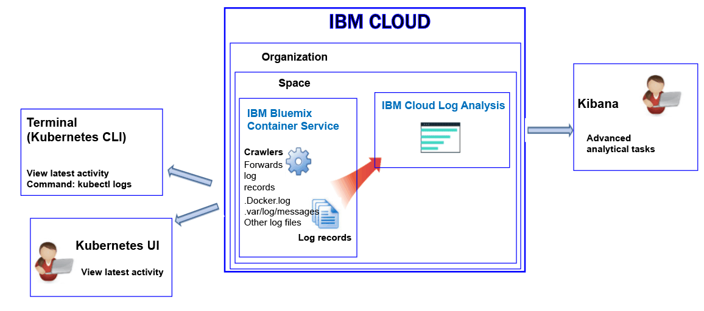

---

copyright:
  years: 2017

lastupdated: "2017-11-09"

---

{:shortdesc: .shortdesc}
{:new_window: target="_blank"}
{:codeblock: .codeblock}
{:screen: .screen}
{:pre: .pre}


# Logging for a container that runs in a Kubernetes cluster
{: #containers_kubernetes}

You can view, filter, and analyze logs for Docker containers that run in Kubernetes clusters in the {{site.data.keyword.Bluemix_notm}}. Logging for these containers is automatically enabled when you deploy the container.
{:shortdesc}

Container logs are monitored and forwarded from outside of the container by using crawlers. The data is sent by the crawlers to a multi-tenant Elasticsearch in {{site.data.keyword.Bluemix_notm}}.

The following figure shows a high level view of logging for the {{site.data.keyword.containershort}}:



In the {{site.data.keyword.Bluemix_notm}}, when you deploy applications in a Kubernetes cluster, consider the following information:

* In the {{site.data.keyword.Bluemix_notm}} account, you can have 1 or more organizations. 
* Each organization can have 1 or more spaces. 
* You can have 1 or more Kubernetes clusters in an organization. 
* A Kubernetes cluster is agnostic of spaces. However, the log data of a cluster and its resources is associated with a space.
* Collection of logs is enabled automatically when you create a Kubernetes cluster. **Note:** The account owner must have *Developer* and *Manager* Cloud Foundry roles for the space that is associated with the cluster.
* Log data is collected for an application as soon as the pod is deployed.
* To analyze log data for a cluster, you must access the Kibana dashboards for the Cloud Public region where the cluster is created. 

Before you create a cluster, either through the [{{site.data.keyword.Bluemix_notm}} UI](/docs/containers/cs_cluster.html#cs_cluster_ui) or through the [command line](/docs/containers/cs_cluster.html#cs_cluster_cli), you must log into a specific {{site.data.keyword.Bluemix_notm}} region, account, organization, and space. The space where you are logged in is the space where logging data for the cluster and its resources is collected.

By default, information that any container process prints to stdout (standard output) and stderr (standard error) is collected. Sending information to stdout and stderr is the standard Docker convention for exposing the information of a container. 

If you forward the log data of an app that runs in a container to the Docker log collector in JSON format, you can search and analyze log data in Kibana by using JSON fields. For more information, see [Configuring custom fields as Kibana search fields](logging_containers_ov.html#send_data_in_json).

**Note:** When you work with a Kubernetes cluster, the namespaces *ibm-system* and *kube-system* are reserved. Do not create, delete, modify, or change permissions of resources that are available in these namespaces. Logs for these namespaces are for {{site.data.keyword.IBM_notm}} use.


## Analyzing container logs
{: #logging_containers_ov_methods}

To analyze container log data, use Kibana to perform advanced analytical tasks. You can use Kibana, an open source analytics and visualization platform, to monitor, search, analyze, and visualize your data in a variety of graphs, for example charts and tables. For more information, see [Analyzing logs in Kibana](/docs/services/CloudLogAnalysis/kibana/analyzing_logs_Kibana.html#analyzing_logs_Kibana).


## Sending logs so you can use the fields in a message as Kibana search fields
{: #send_data_in_json}

By default, logging is automatically enabled for containers. Every entry in the Docker log file is displayed in Kibana in the field `message`. If you need to filter and analyze your data in Kibana by using a specific field that is part of the container log entry, configure your application to send valid JSON formatted output. Log the message in JSON format to stdout (standard output) and stderr (standard error).

Each field that is available in the message is parsed to the type of field that matches is value. For example, each field in the following JSON message:
    
```
{"field1":"string type",
 "field2":123,
 "field3":false,
 "field4":"4567"
}
```
{: codeblock}
    
is available as a field that you can use for filtering and searches:
    
* `field1` is parsed as `field1_str` of type string.
* `field2` is parsed as `field1_int` of type integer.
* `field3` is parsed as `field3_bool` of type boolean.
* `field4` is parsed as `field4_str` of type string.
    

## Storing logs in Log Collection
{: #log_collection}

By default, the {{site.data.keyword.Bluemix_notm}} stores log data for up to 3 days:   

* A maximum of 500MB per space of data is stored per day. Any logs beyond that 500 MB cap are discarded. Cap allotments reset each 
day at 12:30 AM UTC.
* Up to 1.5 GB of data is searchable for a maximum of 3 days. Log data rolls over (First In, First Out) after either 1.5 GB of data is reached or after 3 days.

The {{site.data.keyword.loganalysisshort}} service provides additional plans that allow you to store logs in Log Collection for as long as you require. For more information about the price of each plan, see [Service plans](/docs/services/CloudLogAnalysis/log_analysis_ov.html#plans).

* You can configure a log retention policy that you can use to define the number of days that you want to keep logs in Log Collection. For more information, see [Log Retention policy](/docs/services/CloudLogAnalysis/log_analysis_ov.html#policies).
* You can delete logs manually by using the Log Collection CLI or the API. 


## Retrieving the space ID for a cluster
{: #logging_containers_ov_spaceid}

When a cluster is created in an account, the logs are associated with a space within that account. When you create queries to view cluster logs, you need the space ID.

To find the space ID for a cluster, run the `bx cs cluster-get` command and locate the space ID in the **Log Space** field. 

For more information, see [Retrieving the space ID for a cluster](/docs/services/CloudLogAnalysis/containers/containers_spaceid.html#containers_spaceid).


## Searching logs
{: #log_search}

By default, you can use Kibana to search up to 500 MB of logs per day in the {{site.data.keyword.Bluemix_notm}}. 

{{site.data.keyword.loganalysisshort}} service provides multiple plans. Each plan has different log search capabilities, for example, the *Log Collection* plan allows you to search up to 1 GB of data per day. For more information about the plans, see [Service plans](/docs/services/CloudLogAnalysis/log_analysis_ov.html#plans).


## Viewing container logs for a container that runs in a Kubernetes cluster
{: #logging_containers_ov_methods_view_kube}

You can view the latest logs for a container in a Kubernetes pod by using any of the following methods:

* View logs through the Kubernetes UI. For each pod, you can select it and access its logs. For more information, see [Web UI Dashboard ](https://kubernetes.io/docs/tasks/access-application-cluster/web-ui-dashboard/){: new_window}.

* View logs by using the Kubernetes CLI command [kubectl logs ](https://kubernetes-v1-4.github.io/docs/user-guide/kubectl/kubectl_logs/){: new_window}. 

To view long-term logs, you can use Kibana. Check the [service plans](/docs/services/CloudLogAnalysis/log_analysis_ov.html#plans) for information about data retention period policies.


## Tutorial: Analyze logs in Kibana for an app that is deployed in a Kubernetes cluster
{: #tutorial1}

To learn how to use Kibana to analyze the logs of a container that is deployed in a Kubernetes cluster, see [Tutorial: Analyze logs in Kibana for an app that is deployed in a Kubernetes cluster](/docs/services/CloudLogAnalysis/containers/tutorials/kibana_tutorial_1.html#kibana_tutorial_1).


