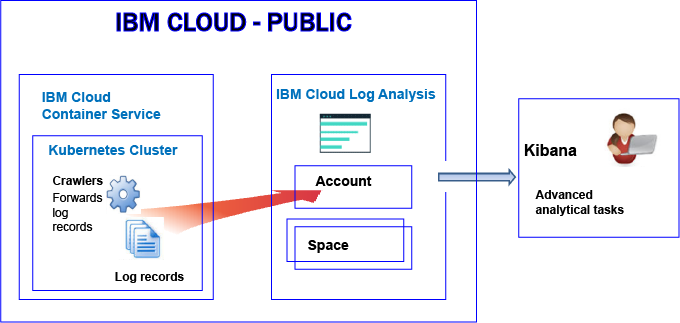
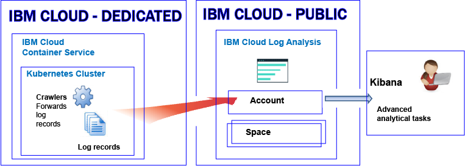

---

copyright:
  years: 2017

lastupdated: "2017-11-29"

---

{:shortdesc: .shortdesc}
{:new_window: target="_blank"}
{:codeblock: .codeblock}
{:screen: .screen}
{:pre: .pre}


# Logging for resources in a Kubernetes cluster
{: #containers_kubernetes}

You can view, filter, and analyze logs for containers that run in Kubernetes clusters in the {{site.data.keyword.Bluemix_notm}}. 
{:shortdesc}

By default, information that a container process prints to stdout (standard output) and stderr (standard error) is collected automatically by the {{site.data.keyword.containershort}} and forwarded to the {{site.data.keyword.loganalysisshort}} service. 

* Sending information to stdout and stderr is the standard Docker convention for exposing the information of a container.
* Container logs are monitored and forwarded from outside of the container by using crawlers. 
* The data is sent by the crawlers to a multi-tenant Elasticsearch in the {{site.data.keyword.Bluemix_notm}}. 

In addition, you can configure your cluster to forward other application logs, worker node logs, the Kubernetes system component logs, and the Ingress controller logs to the {{site.data.keyword.loganalysisshort}} service. For more information, see [Collecting additional application and cluster logs](/docs/services/CloudLogAnalysis/containers/containers_kubernetes.html#collect_logs).

## About logging in Public
{: #public}

In the {{site.data.keyword.Bluemix_notm}}, you can use the {{site.data.keyword.loganalysisshort}} service to store and analyze container logs and Kubernetes cluster logs that are collected automatically by the {{site.data.keyword.containershort}} in Public.

You can have 1 or more Kubernetes clusters in an account. Logs are collected automatically by the {{site.data.keyword.containershort}} as soon as the cluster is provisioned. To have those logs available for analysis in the {{site.data.keyword.loganalysisshort}} service, you must configure your cluster to forward cluster logs into {{site.data.keyword.loganalysisshort}}. 

* Clusters that are available in the US South region, send logs to the {{site.data.keyword.loganalysisshort}} service that is available in the US South region.
* Clusters that are available in the US East region, send logs to the {{site.data.keyword.loganalysisshort}} service that is available in the US South region.
* Clusters that are available in the German region, send logs to the {{site.data.keyword.loganalysisshort}} service that is available in the German region.
* Clusters that are available in the Sydney region, send logs to the {{site.data.keyword.loganalysisshort}} service that is available in the Sydney region.
* Clusters that are available in the United Kingdom region, send logs to the {{site.data.keyword.loganalysisshort}} service that is available in the German region.

Application logs are collected as soon as the pod is deployed. Information that a container process prints to stdout (standard output) and stderr (standard error) is collected automatically by the {{site.data.keyword.containershort}} and forwarded to the {{site.data.keyword.loganalysisshort}} service. You can also send additional application log files by configuring the cluster to forward additional application logs to the {{site.data.keyword.loganalysisshort}} service.

If you create a cluster at the account level, logs are available through the account domain view in Kibana. If you create a cluster that is associated to a space, logs are available through the space domain view in Kibana.

To analyze log data for a cluster, 

* You must launch Kibana in the Public region where the {{site.data.keyword.loganalysisshort}} instance that you use to view logs is provisioned. 
* Your user ID must have permissions to view logs. To see logs in the account domain, a user needs an IAM policy for the {{site.data.keyword.loganalysisshort}} service. The user needs  **Viewer** permissions. To see logs in the space domain, the user needs a CF role. For more information, see [Roles that are required by a user to view logs](/docs/services/CloudLogAnalysis/kibana/analyzing_logs_Kibana.html#roles).

To manage log data that is in long-term storage (Log Collection), you user ID must have an IAM policy to work with the {{site.data.keyword.loganalysisshort}} service. Your user ID must have **Administrator** permissions or **Editor** permissions.  For more information, see [Roles that are required by a user to manage logs](/docs/services/CloudLogAnalysis/manage_logs.html#roles).

**Note:** When you work with a Kubernetes cluster, the namespaces *ibm-system* and *kube-system* are reserved. Do not create, delete, modify, or change permissions of resources that are available in these namespaces. Logs for these namespaces are for {{site.data.keyword.IBM_notm}} use.

### High level view of logging for a cluster that is created at the account level
{: #acc}

The following figure shows a high level view of logging in Public for the {{site.data.keyword.containershort}} when the cluster is created at the account level:



Collection of logs is enabled automatically when you create a cluster. Logs that are collected by the {{site.data.keyword.containershort}} and forwarded to the {{site.data.keyword.loganalysisshort}} service are stored in the account domain. 

**NOTE:** Currently, the account domain has a limit quota of 500MB per day, and you cannot send those logs to Log Collection for long term storage.


### High level view of logging for a cluster that is associated to a space
{: #space}

The following figure shows a high level view of logging in Public for the {{site.data.keyword.containershort}} when the cluster is associated with a space:


In an {{site.data.keyword.Bluemix_notm}} account, you can have 1 or more organizations. Each organization can have 1 or more spaces. You can have 1 or more Kubernetes clusters in an account. 

* A Kubernetes cluster is an account resource that is agnostic of spaces. However, when you create the cluster within the context of a space, the log data of the cluster and its resources is associated with a Cloud Foundry space.

   To create a cluster within the context of a space, you must create the cluster from a session that has set the target organization and space.
   
   Before you create a cluster, either through the [{{site.data.keyword.Bluemix_notm}} UI](/docs/containers/cs_cluster.html#cs_cluster_ui) or through the [command line](/docs/containers/cs_cluster.html#cs_cluster_cli), you must log into a specific region, account, organization, and space. The space where you are logged in is the space where logging data for the cluster and its resources is collected.
   
* For logs to be forwarded to the {{site.data.keyword.loganalysisshort}} service from the {site.data.keyword.containershort}}:

    * The account owner must have *Developer* and *Manager* Cloud Foundry roles for the space that is associated with the cluster.
	* The Kubernetes cluster must be a standard cluster. For more information about the features supported by a standard cluster, see [Planning clusters and apps](/docs/containers/cs_planning.html#cs_planning_cluster_type).

Collection of logs is enabled automatically when you create a cluster. Logs that are collected by the {{site.data.keyword.containershort}} and forwarded to the {{site.data.keyword.loganalysisshort}} service are stored in the space domain that is associated with the Kubernetes cluster. 


## About logging in Dedicated
{: #dedicated}

In the {{site.data.keyword.Bluemix_notm}}, you can use the {{site.data.keyword.loganalysisshort}} service in Public to store and analyze container logs and Kubernetes cluster logs that are collected automatically by the {{site.data.keyword.containershort}} in Dedicated.

You can have 1 or more Kubernetes clusters in an account. Logs are collected automatically by the {{site.data.keyword.containershort}} as soon as the cluster is provisioned, and forwarded to the {{site.data.keyword.loganalysisshort}} service. To have those logs available for analysis in the {{site.data.keyword.loganalysisshort}} service, you must configure your cluster to forward cluster logs into {{site.data.keyword.loganalysisshort}}. 

* Clusters that are available in the US South region, send logs to the {{site.data.keyword.loganalysisshort}} service that is available in the US South region.
* Clusters that are available in the US East region, send logs to the {{site.data.keyword.loganalysisshort}} service that is available in the US South region.
* Clusters that are available in the German region, send logs to the {{site.data.keyword.loganalysisshort}} service that is available in the German region.
* Clusters that are available in the Sydney region, send logs to the {{site.data.keyword.loganalysisshort}} service that is available in the Sydney region.
* Clusters that are available in the United Kingdom region, send logs to the {{site.data.keyword.loganalysisshort}} service that is available in the German region.

**Note:** 

* Logs are forwarded to the account domain in the same Public region where the Dedicated {{site.data.keyword.containershort}} is running.
* Currently, the account domain has a limit quota of 500MB per day, and you cannot send those logs to Log Collection for long term storage.

Log data is collected for an application as soon as the pod is deployed. Information that a container process prints to stdout (standard output) and stderr (standard error) is collected automatically by the {{site.data.keyword.containershort}} and forwarded to the {{site.data.keyword.loganalysisshort}} service. You can also enable the cluster to send additonal application logs to the {{site.data.keyword.loganalysisshort}} service.

Logs are available through the account domain view in Kibana. 

To analyze log data for a cluster, 

* You must launch Kibana for the Cloud Public region where the {{site.data.keyword.loganalysisshort}} instance is provisioned. 
* You user ID must have an IAM policy to work with the {{site.data.keyword.loganalysisshort}} service. You need to have **Viewer** permissions to see logs in the account domain.  

To manage log data that is in long-term storage (Log Collection), you user ID must have an IAM policy to work with the {{site.data.keyword.loganalysisshort}} service. You need to have **Administrator** permissions or **Editor** permissions.  

The following figure shows a high level view of logging in Dedicated for the {{site.data.keyword.containershort}}:




## Collecting additional application and cluster logs
{: #collect_logs}

By default, information that a container process prints to stdout (standard output) and stderr (standard error) is collected automatically by the {{site.data.keyword.containershort}} and forwarded to the {{site.data.keyword.loganalysisshort}} service. 

In addition, you can configure your cluster to forward other application logs, worker node logs, the Kubernetes system component logs, and the Ingress controller logs to the {{site.data.keyword.loganalysisshort}} service. 

<table>
  <caption>Log sources for a Kuberenetes cluster</caption>
  <tr>
    <th>Log source</th>
	<th>Description</th>
	<th>Log Paths</th>
  </tr>
  <tr>
    <td>Application</td>
	<td>Logs for your own application that runs in a Kubernetes cluster.</td>
	<td>*/var/log/apps/**/*.log* </br>*/var/log/apps/**/*.err*</td>
  </tr>
  <tr>
    <td>Worker</td>
	<td>Logs for virtual machine worker nodes within a Kubernetes cluster. </td>
	<td>*/var/log/syslog* </br>*/var/log/auth.log*</td>
  </tr>
  <tr>
    <td>Kubernetes system component</td>
	<td>Logs for the Kubernetes system component.</td>
	<td>*/var/log/kubelet.log* </br>*/var/log/kube-proxy.log*</td>
  </tr>
  <tr>
    <td>Ingress controller</td>
	<td>Logs for an Ingress controller that manages network traffic coming into a Kubernetes cluster.</td>
	<td>*/var/log/alb/ids/*.log* </br>*/var/log/alb/ids/*.err* </br>*/var/log/alb/customerlogs/*.log* </br>*/var/log/alb/customerlogs/*.err*</td>
  </tr>
</table>

For information about how to configure your cluster to forward log files to the {{site.data.keyword.loganalysisshort}} service, see the section [Enabling automatic collection of cluster logs](/docs/services/CloudLogAnalysis/containers/containers_kube_other_logs.html#containers_kube_other_logs).

## Configuring network traffic for custom firewall configurations in the {{site.data.keyword.Bluemix_notm}}
{: #ports}

When you have an additional firewall set up, or you have customized the firewall settings in your {{site.data.keyword.Bluemix_notm}} infrastructure (SoftLayer), you need to allow outgoing network traffic from the worker node to the {{site.data.keyword.loganalysisshort}} service. 

You must open TCP port 443 and TCP port 9091 from each worker to the {{site.data.keyword.loganalysisshort}} service for the following IP addresses in your customized firewall:

<table>
  <tr>
    <th>Region</th>
    <th>Ingestion URL</th>
	<th>Public IP addresses</th>
  </tr>
  <tr>
    <td>Germany</td>
	<td>ingest-eu-fra.logging.bluemix.net</td>
	<td>158.177.88.43 <br>159.122.87.107</td>
  </tr>
  <tr>
    <td>United Kingdom</td>
	<td>ingest.logging.eu-gb.bluemix.net</td>
	<td>169.50.115.113</td>
  </tr>
  <tr>
    <td>US South</td>
	<td>ingest.logging.ng.bluemix.net</td>
	<td>169.48.79.236 <br>169.46.186.113</td>
  </tr>
  <tr>
    <td>Sydney</td>
	<td>ingest-au-syd.logging.bluemix.net</td>
	<td>130.198.76.125 <br>168.1.209.20</td>
  </tr>
</table>


## Searching logs
{: #log_search}

By default, you can use Kibana to search up to 500 MB of logs per day in the {{site.data.keyword.Bluemix_notm}}. 

To search for larger logs, you can use the {{site.data.keyword.loganalysisshort}} service. The service provides multiple plans. Each plan has different log search capabilities, for example, the *Log Collection* plan allows you to search up to 1 GB of data per day. For more information about the plans that are available, see [Service plans](/docs/services/CloudLogAnalysis/log_analysis_ov.html#plans).

When you search your logs, consider the following fields that are available in Kibana:

Fields that are common to any log entry:

<table>
  <caption>List of common fields</caption>
  <tr>
    <th>Field name</th>
	<th>Description</th>
	<th>Value</th>
  </tr>
  <tr>
    <td>ibm-containers.region_str</td>
	<td>Region where the cluster is available</td>
	<td>For example, `us-south` is the value for a cluster that is available in the US South region.</td>
  </tr>
  <tr>
    <td>ibm-containers.account_id_str</td>
	<td>Account ID</td>
	<td></td>
  </tr>
  <tr>
    <td>ibm-containers.cluster_id_str</td>
	<td>Cluster ID</td>
	<td></td>
  </tr>
</table>

Fields that might be useful when analyzing application logs:

<table>
  <caption>List of fields for applications</caption>
  <tr>
    <th>Field name</th>
	<th>Description</th>
	<th>Value</th>
  </tr>
  <tr>
    <td>kubernetes.container_name_str</td>
	<td>Name of the container</td>
	<td></td>
  </tr>
  <tr>
    <td>kubernetes.namespace_name_str</td>
	<td>Namespace name where the application is running in the cluster</td>
	<td></td>
  </tr>
  <tr>
    <td>stream_str</td>
	<td>Type of log</td>
	<td>*stdout* </br>*stderr*</td>
  </tr>
</table>

Fields that might be useful when analyzing worker logs:

<table>
  <caption>List of fields that are relevant to workers</caption>
  <tr>
    <th>Field name</th>
	<th>Description</th>
	<th>Value</th>
  </tr>
  
  <tr>
    <td>filename_str</td>
	<td>Path and name of the file</td>
	<td>*/var/log/syslog*  </br>*/var/log/auth.log*</td>
  </tr>
  <tr>
    <td>tag_str</td>
	<td>Type of log</td>
	<td>*logfiles.worker.var.log.syslog* </br>*logfiles.worker.var.log.auth.log*</td>
  </tr>
  <tr>
    <td>worker_str</td>
	<td>Worker name</td>
	<td>For example, *w1*</td>
  </tr>
</table>

Fields that might be useful when analyzing Kubernetes system component logs:

<table>
  <caption>List of fields that are relevant to the Kubernetes system component</caption>
  <tr>
    <th>Field name</th>
	<th>Description</th>
	<th>Value</th>
  </tr>
  <tr>
    <td>tag_str</td>
	<td>Type of log</td>
	<td>*logfiles.kubernetes.var.log.kubelet.log* </br>*logfiles.kubernetes.var.log.kube-proxy.log*</td>
  </tr>
  <tr>
    <td>filename_str</td>
	<td>Path and name of the file</td>
	<td>*/var/log/kubelet.log* </br>*/var/log/kube-proxy.log*</td>
  </tr>
 </table>

Fields that might be useful when analyzing Ingress controller logs:
 
<table>
  <caption>List of fields that are relevant to the Ingress controller</caption>
  <tr>
    <th>Field name</th>
	<th>Description</th>
	<th>Value</th>
  </tr>
 <tr>
    <td>tag_str</td>
	<td>Type of log</td>
	<td></td>
  </tr>
  <tr>
    <td>filename_str</td>
	<td>Path and name of the file</td>
	<td>*/var/log/alb/ids/*.log* </br>*/var/log/alb/ids/*.err* </br>*/var/log/alb/customerlogs/*.log* </br>*/var/log/alb/customerlogs/*.err*</td>
  </tr>
</table>


## Sending logs so you can use the fields in a message as Kibana search fields
{: #send_data_in_json}

By default, logging is automatically enabled for containers. Every entry in the Docker log file is displayed in Kibana in the field `message`. If you need to filter and analyze your data in Kibana by using a specific field that is part of the container log entry, configure your application to send valid JSON formatted output. For example, log the message in JSON format to stdout (standard output) and stderr (standard error).

Each field that is available in the message is parsed to the type of field that matches is value. For example, each field in the following JSON message:
    
```
{"field1":"string type",
 "field2":123,
 "field3":false,
 "field4":"4567"
}
```
{: codeblock}
    
is available as a field that you can use for filtering and searches:
    
* `field1` is parsed as `field1_str` of type string.
* `field2` is parsed as `field1_int` of type integer.
* `field3` is parsed as `field3_bool` of type boolean.
* `field4` is parsed as `field4_str` of type string.
    

## Storing logs in Log Collection
{: #log_collection}

By default, the {{site.data.keyword.Bluemix_notm}} stores log data for up to 3 days:   

* A maximum of 500MB per space of data is stored per day. Any logs beyond that 500 MB cap are discarded. Cap allotments reset each day at 12:30 AM UTC.
* Up to 1.5 GB of data is searchable for a maximum of 3 days. Log data rolls over (First In, First Out) after either 1.5 GB of data is reached or after 3 days.

The {{site.data.keyword.loganalysisshort}} service provides additional plans that allow you to store logs in Log Collection for as long as you require. For more information about the price of each plan, see [Service plans](/docs/services/CloudLogAnalysis/log_analysis_ov.html#plans).

* You can configure a log retention policy that you can use to define the number of days that you want to keep logs in Log Collection. For more information, see [Log Retention policy](/docs/services/CloudLogAnalysis/log_analysis_ov.html#policies).
* You can delete logs manually by using the Log Collection CLI or the Log Collection API. 

By default, logs are stored and available for analysis through the account domain. **NOTE:** Currently, the account domain has a limit quota of 500MB per day, and you cannot send those logs to Log Collection for long term storage. To save logs in Log Collection, you must forward logs to a space. The way to forward the logs to a space is by creating a cluster with an associated space.


## Viewing and analyzing logs
{: #logging_containers_ov_methods}

To analyze log data, use Kibana to perform advanced analytical tasks. Kibana is an open source analytics and visualization platform, that you can use to monitor, search, analyze, and visualize your data in a variety of graphs, for example charts and tables. For more information, see [Analyzing logs in Kibana](/docs/services/CloudLogAnalysis/kibana/analyzing_logs_Kibana.html#analyzing_logs_Kibana).

* You can launch Kibana directly from a web browser. For more information, see [Navigating to Kibana from a web browser](/docs/services/CloudLogAnalysis/kibana/launch.html#launch_Kibana_from_browser).
* You can launch Kibana from the [{{site.data.keyword.Bluemix_notm}} UI within the context of a cluster. For more information, see [Navigating to Kibana from the dashboard of a container that is deployed in a Kubernetes cluster](/docs/services/CloudLogAnalysis/kibana/launch.html#launch_Kibana_for_containers_kube).

If you forward the log data of an app that runs in a container to the Docker log collector in JSON format, you can search and analyze log data in Kibana by using JSON fields. For more information, see [Configuring custom fields as Kibana search fields](logging_containers_ov.html#send_data_in_json).

To view logs in Kibana, consider the following information:

* In Public, to see logs in a space domain, the user must have the **developer** role in the space that is associated with the cluster.
* In Dedicated, to see logs in the account domain, the user must have an IAM policy to work with the {{site.data.keyword.loganalysisshort}} service. The minimum role that allows viewing log entries is **Viewer**.


## Retrieving the space ID for a cluster
{: #logging_containers_ov_spaceid}

When a cluster is created in an account, the logs are associated with a space within that account. When you create queries to view cluster logs, you need the space ID.

To find the space ID for a cluster, run the `bx cs cluster-get` command and locate the space ID in the **Log Space** field. 

For more information, see [Retrieving the space ID for a cluster](/docs/services/CloudLogAnalysis/containers/containers_spaceid.html#containers_spaceid).


## Tutorial: Analyze logs in Kibana for an app that is deployed in a Kubernetes cluster
{: #tutorial1}

To learn how to use Kibana to analyze the logs of a container that is deployed in a Kubernetes cluster, see [Tutorial: Analyze logs in Kibana for an app that is deployed in a Kubernetes cluster](/docs/services/CloudLogAnalysis/containers/tutorials/kibana_tutorial_1.html#kibana_tutorial_1).


