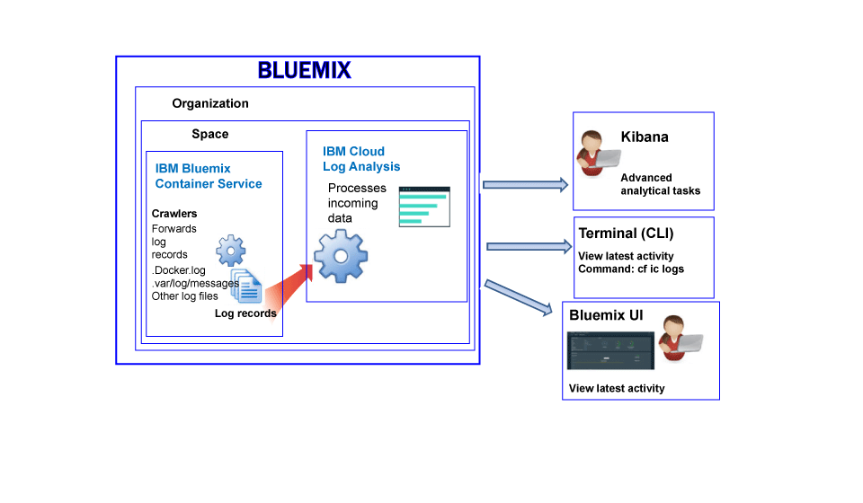

---

copyright:
  years: 2017

lastupdated: "2017-09-19"

---

{:shortdesc: .shortdesc}
{:new_window: target="_blank"}
{:codeblock: .codeblock}
{:screen: .screen}
{:pre: .pre}


# Logging for the IBM Bluemix Container Service
{: #logging_containers_ov}

You can view, filter, and analyze logs for Docker containers that are deployed in the {{site.data.keyword.IBM}}-managed cloud infrastructure and for Docker containers that run in Kubernetes clusters. Logging of containers is automatically enabled when you deploy a container in {{site.data.keyword.Bluemix_notm}} or in a Kubernetes cluster.
{:shortdesc}

Container logs are monitored and forwarded from outside of the container by using crawlers. The data is sent by the crawlers to a
multi-tenant Elasticsearch in {{site.data.keyword.Bluemix_notm}}.


## Collecting logs for a container that runs in a Kubernetes cluster
{: #logging_containers_ov_logs_collected_kubernetes}

The following figure shows a high level view of logging for the {{site.data.keyword.containershort}}:


In {{site.data.keyword.Bluemix_notm}}, when you deploy applications in a Kubernetes cluster, consider the following information:

* In a {{site.data.keyword.Bluemix_notm}} account, you can have 1 or more organizations. 
* Each organization can have 1 or more {{site.data.keyword.Bluemix_notm}} spaces. 
* You can have 1 or more Kubernetes clusters in an organization. 
* Collection of logs is enabled automatically when you create a Kubernetes cluster. 
* A Kubernetes cluster is agnostic of {{site.data.keyword.Bluemix_notm}} spaces. However, the log data of a cluster and its resources is associated with a {{site.data.keyword.Bluemix_notm}} space.
* Log data is collected for an application as soon as the pod is deployed.
* To analyze log data for a cluster, you must access the Kibana dashboards for the Cloud Public region where the cluster is created.

Before you create a cluster, either through the [{{site.data.keyword.Bluemix_notm}} UI](/docs/containers/cs_cluster.html#cs_cluster_ui) or through the [command line](/docs/containers/cs_cluster.html#cs_cluster_cli), you must log into a specific {{site.data.keyword.Bluemix_notm}} region, account, organization, and space. The space where you are logged in is the space where logging data for the cluster and its resources is collected.

By default, information that any container process prints to stdout (standard output) and stderr (standard error) is collected. Sending information to stdout and stderr is the standard Docker convention for exposing the information of a container. 

If you forward the log data of an app that runs in a container to the Docker log collector in JSON format, you can search and analyze log data in Kibana by using JSON fields. For more information, see [Configuring custom fields as Kibana search fields](logging_containers_ov.html#send_data_in_json).

**Note:** When you work with a Kubernetes cluster, the namespaces *ibm-system* and *kube-system* are reserved. Do not create, delete, modify, or change permissions of resources that are available in these namespaces. Logs for these namespaces are for {{site.data.keyword.IBM_notm}} use.


## Collecting logs for a container managed by Bluemix
{: #logging_containers_ov_logs_collected}

The following figure shows a high level view of logging for the {{site.data.keyword.containershort}}:



By default, the following logs are collected for a container that is deployed in the {{site.data.keyword.Bluemix_notm}}-managed cloud infrastructure:

<table>
  <caption>Table 2. Logs collected for containers deployed in the Bluemix-managed cloud infrastructure</caption>
  <tbody>
    <tr>
      <th align="center">Log</th>
      <th align="center">Description</th>
    </tr>
    <tr>
      <td align="left" width="30%">/var/log/messages</td>
      <td align="left" width="70%"> By default, Docker messages are stored in the /var/log/messages folder of the container. This log includes system messages.
      </td>
    </tr>
    <tr>
      <td align="left">./docker.log</td>
      <td align="left">This log is the Docker log. <br> The Docker log file is not stored as a file inside of the container, but it is collected anyway. This log file is collected by default as it is the standard Docker convention for exposing the stdout (standard output) and stderr (standard error) information for the container. Information that any container process prints to stdout or stderr is collected. 
      </td>
     </tr>
  </tbody>
</table>

To collect additional logs, add the **LOG_LOCATIONS** environment variable with a path to the log file when you create the container. You can add multiple log files by separating them with commas. For more information, see [Collecting non-default log data from a container](logging_containers_other_logs.html#logging_containers_collect_data).


##  Configuring custom fields as Kibana search fields 
{: #send_data_in_json}

By default, logging is automatically enabled for containers. Every entry in the Docker log file is displayed in Kibana in the field `message`. If you need to filter and analyze your data in Kibana by using a specific field that is part of the container log entry, configure your application to send valid JSON formatted output.

Consider the following information:

* For containers that are deployed in a Kubernetes cluster, log the message in JSON format to stdout (standard output) and stderr (standard error).

    Each field that is available in the message is parsed to the type of field that matches is value. For example, each field in the following JSON message:
    
    ```
    {"field1":"string type",
        "field2":123,
        "field3":false,
        "field4":"4567"
    }
    ```
    
    is available as a field that you can use for filtering and searches:
    
    * `field1` is parsed as `field1_str` of type string.
    * `field2` is parsed as `field1_int` of type integer.
    * `field3` is parsed as `field3_bool` of type boolean.
    * `field4` is parsed as `field4_str` of type string.
    
* For containers that are deployed in the {{site.data.keyword.Bluemix_notm}}-managed cloud infrastructure, complete the following steps to parse container log entries into individual fields:

    1. Log the message to a file. 
    2. Add the log file to the list of non-default logs that are available for analysis from a container. For more information, see [Collecting non-default log data from a container](logging_containers_other_logs.html#logging_containers_collect_data). 
    
    When JSON log entries are sent to the Docker log file of a container as STDOUT, they are not parsed as JSON. 
    
    If you log the message to a file, and a message is determined to be valid JSON, the fields are parsed and new fields are created for each field in the message. Only string-type field values are available for filtering and sorting in Kibana

## Log ingestion
{: #log_ingestion}

The {{site.data.keyword.loganalysisshort}} service offers different plans. Each plan defines whether or not you can send logs into Log Collection. All plans, with the exception of the *Lite* plan, include the ability to send logs into Log Collection. For more information about the plans, see [Service plans](/docs/services/CloudLogAnalysis/log_analysis_ov.html#plans).

You can send logs into the {site.data.keyword.loganalysisshort}} by using the multi-tenant Logstash Forwarder. For more information, see [Send log data by using a Multi-Tenant Logstash Forwarder (mt-logstash-forwarder).](/docs/services/CloudLogAnalysis/how-to/send-data/send_data_mt.html#send_data_mt).


## Log collection
{: #log_collection}

By default, {{site.data.keyword.Bluemix_notm}} stores log data for up to 3 days:   

* A maximum of 500MB per space of data is stored per day. Any logs beyond that 500 MB cap are discarded. Cap allotments reset each 
day at 12:30 AM UTC.
* Up to 1.5 GB of data is searchable for a maximum of 3 days. Log data rolls over (First In, First Out) after either 1.5 GB of data is reached or after 3 days.

The {{site.data.keyword.loganalysisshort}} service provides additional plans that allow you to store logs in Log Collection for as long as you require. For more information about the price of each plan, see [Service plans](/docs/services/CloudLogAnalysis/log_analysis_ov.html#plans).

You can configure a log retention policy that you can use to define the number of days that you want to keep logs in Log Collection. For more information, see [Log Retention policy](/docs/services/CloudLogAnalysis/log_analysis_ov.html#policies).


## Log search
{: #log_search}

By default, you can use Kibana to search up to 500 MB of logs per day in {{site.data.keyword.Bluemix_notm}}. 

{{site.data.keyword.loganalysisshort}} service provides multiple plans. Each plan has different log search capabilities, for example, the *Log Collection* plan allows you to search up to 1 GB of data per day. For more information about the plans, see [Service plans](/docs/services/CloudLogAnalysis/log_analysis_ov.html#plans).


## Viewing container logs for a container that runs in a Kubernetes cluster
{: #logging_containers_ov_methods_view_kube}

You can view the latest logs for a container in a Kubernetes pod by using any of the following methods:

* View logs through the Kubernetes UI. For each pod, you can select it and access its logs. For more information, see [Web UI Dashboard ](https://kubernetes.io/docs/tasks/access-application-cluster/web-ui-dashboard/){: new_window}.

* View logs by using the Kubernetes CLI command [kubectl logs ](https://kubernetes-v1-4.github.io/docs/user-guide/kubectl/kubectl_logs/){: new_window}. 

To view long-term logs, you can use Kibana. Check the [service plans](/docs/services/CloudLogAnalysis/log_analysis_ov.html#plans) for information about data retention period policies.


## Viewing container logs for a container managed by Bluemix
{: #logging_containers_ov_methods_view_bmx}

You can view the latest logs for a container that is deployed in the {{site.data.keyword.Bluemix_notm}}-managed cloud infrastructure by using any of the following methods:

* View logs through the {{site.data.keyword.Bluemix_notm}} UI to monitor the latest activity of the container.
    
    You can view, filter, and analyze logs through the **Monitoring and Logs** tab that is available for each container. For more information, see [Analyzing logs from the Bluemix dashboard](/docs/services/CloudLogAnalysis/logging_view_dashboard.html#analyzing_logs_bmx_ui).
    
    
* View logs by using the {{site.data.keyword.containershort}} CLI. Use commands to manage logs programmatically.
    
    You can view, filter, and analyze logs through the command line interface by using the **cf ic logs** command. For more information, see [Analyzing logs from the command line interface](/docs/services/CloudLogAnalysis/logging_view_cli.html#analyzing_logs_cli).


## Analyzing container logs
{: #logging_containers_ov_methods}

To analyze container log data, use Kibana to perform advanced analytical tasks. You can use Kibana, an open source analytics and visualization platform, to monitor, search, analyze, and visualize your data in a variety of graphs, for example charts and tables. For more information, see [Analyzing logs in Kibana](/docs/services/CloudLogAnalysis/kibana/analyzing_logs_Kibana.html#analyzing_logs_Kibana).


## Retrieving the space ID for a cluster
{: #logging_containers_ov_spaceid}

A cluster is deployed to a {{site.data.keyword.Bluemix_notm}} account, but cluster logs are associated with a {{site.data.keyword.Bluemix_notm}} space within that account. When you create queries for the cluster logs, you might need the space ID.

To find the space ID for a cluster, run the `bx cs cluster-get` command and locate the space ID in the `Log Space` field.

```
bx cs cluster-get cluster-name
```
{: pre}

Output example:

```
Name:			  cluster-name
ID:			    c213f81296db4c68b84e212c19135a99
State:			 normal
Created:		   2017-08-22T18:18:59+0000
Datacenter:		dal10
Master URL:		https://169.46.7.242:21210
Ingress subdomain: cluster-name.us-south.containers.mybluemix.net
Ingress secret:    cluster-name
Workers:		   5
Log Space:		 fa277ff8-8a73-324b-9b75-0f11d54a3ae2
```
{: screen}


## Tutorial: Analyze logs in Kibana for an app that is deployed in a Kubernetes cluster
{: #tutorial1}

To learn how to use Kibana to analyze the logs of a container that is deployed in a Kubernetes cluster, see [Tutorial: Analyze logs in Kibana for an app that is deployed in a Kubernetes cluster](/docs/services/CloudLogAnalysis/containers/tutorials/kibana_tutorial_1.html#kibana_tutorial_1).


