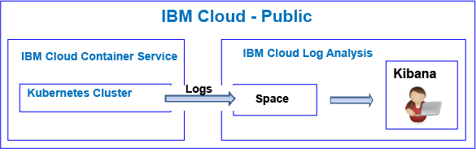
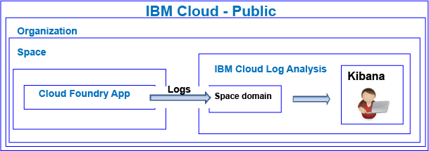

---

copyright:
  years: 2017, 2019

lastupdated: "2019-03-06"

keywords: IBM Cloud, logging

subcollection: cloudloganalysis

---

{:new_window: target="_blank"}
{:shortdesc: .shortdesc}
{:screen: .screen}
{:pre: .pre}
{:table: .aria-labeledby="caption"}
{:codeblock: .codeblock}
{:tip: .tip}
{:download: .download}
{:important: .important}
{:note: .note}

# Getting started tutorial
{: #getting-started-with-cla}

Use this tutorial to learn how to start working with the {{site.data.keyword.loganalysislong}} service in the {{site.data.keyword.Bluemix}}. 
{:shortdesc}

By default, {{site.data.keyword.Bluemix_notm}} offers integrated logging capabilities for selected services. You can use the {{site.data.keyword.loganalysisshort}} service to expand your collection and retention capabilities when working with logs.

## Before you begin
{: #prereqs}

Your must have a user ID that is a member or an owner of an {{site.data.keyword.Bluemix_notm}} account. To get an {{site.data.keyword.Bluemix_notm}} user ID, go to: [Registration ](https://console.bluemix.net/registration/){:new_window}

## Step1: Choose a cloud resource for which you want to see logs
{: #step1}

In the {{site.data.keyword.Bluemix_notm}}, CF applications, containers that run on the {{site.data.keyword.containershort}}, and selected services collect log data automatically and they forward it to the {{site.data.keyword.loganalysisshort}} service.

The following table lists different cloud resources. Complete the tutorial for a resource to get started working with the {{site.data.keyword.loganalysisshort}} service:

<table>
  <caption>Tutorials to get started working with the {{site.data.keyword.loganalysisshort}} service </caption>
  <tr>
    <th>Resource</th>
    <th>Tutorial</th>
    <th>Cloud environment</th>
    <th>Scenario</th>
  </tr>
  <tr>
    <td>Containers running on the {{site.data.keyword.containershort}}</td>
    <td>[Analyze logs in Kibana for an app that is deployed in a Kubernetes cluster](/docs/services/CloudLogAnalysis/tutorials?topic=cloudloganalysis-container_logs#container_logs)</td>
    <td>Public </br>Dedicated</td>
    <td></td>
  </tr>
  <tr>
    <td>CF apps</td>
    <td>[Analyze logs in Kibana for a Cloud Foundry app](https://console.bluemix.net/docs/tutorials/application-log-analysis.html#generate-access-and-analyze-application-logs)</td>
    <td>Public</td>
    <td></td>
  </tr>
</table>


## Step 2: Set permissions for a user to view logs
{: #step24}

To control the {{site.data.keyword.loganalysisshort}} actions that a user is allowed to perform, you can assign roles and policies to a user. 

There are two types of security permissions in the {{site.data.keyword.Bluemix_notm}} that control the actions users can do when they work with the {{site.data.keyword.loganalysisshort}} service:

* Cloud Foundry (CF) roles: You grant a user a CF role to define the permissions that the user has to view logs in a space.
* IAM roles: You grant a user an IAM policy to define the permissions that the user has to view logs in the account domain.

### Set permissions for a user to view logs in a space domain
{: #step42a}

Complete the following steps to grant a user permissions to view logs in a space:

1. Log in to the {{site.data.keyword.Bluemix_notm}} console.

    Open a web browser and launch the {{site.data.keyword.Bluemix_notm}} dashboard: [http://bluemix.net ](http://bluemix.net){:new_window}
	
	After you log in with your user ID and password, the {{site.data.keyword.Bluemix_notm}} UI opens.

2. From the menu bar, click **Manage > Account > Users**. 

    The *Users* window displays a list of users with their email addresses for the currently selected account.
	
3. If the user is a member of the account, select the user name from the list, or click **Manage user** from the *Actions* menu.

    If the user is not a member of the account, see [Inviting users](/docs/iam?topic=iam-iamuserinv#iamuserinv).

4. Select **Cloud Foundry access**, then select the organization.

    The list of spaces available in that organization are listed.

5. Choose the space where you provisioned the {{site.data.keyword.loganalysisshort}} service. Then, from the menu action, select **Edit space role**.

6. Select *Auditor*. 

    You can select 1 or more space roles. All of the following roles allow a user to view logs: *Manager*, *Developer*, and *Auditor*
	
7. Click **Save role**.


### Set permissions for a user to view logs in an account domain
{: #step24b}


Complete the following steps to grant a user permissions to view account logs:

1. Log in to the {{site.data.keyword.Bluemix_notm}} console.

    Open a web browser and launch the {{site.data.keyword.Bluemix_notm}} dashboard: [http://bluemix.net ](http://bluemix.net){:new_window}
	
	After you log in with your user ID and password, the {{site.data.keyword.Bluemix_notm}} UI opens.

2. From the menu bar, click **Manage > Account > Users**. 

    The *Users* window displays a list of users with their email addresses for the currently selected account.
	
3. If the user is a member of the account, select the user name from the list, or click **Manage user** from the *Actions* menu.

    If the user is not a member of the account, see [Inviting users](/docs/iam?topic=iam-iamuserinv#iamuserinv).

4. In the **Access policies** section, click **Assign access**, then select **Assign access to resources**.

    The *Assign resource access to user** window opens.

5. Enter information about the policy. The following table lists the fields that are required to define a policy: 

    <table>
	  <caption>List of fields to configure an IAM policy.</caption>
	  <tr>
	    <th>Field</th>
		<th>Value</th>
	  </tr>
	  <tr>
	    <td>Services</td>
		<td>*IBM Cloud Log Analysis*</td>
	  </tr>	  
	  <tr>
	    <td>Regions</td>
		<td>You can specify the regions where the user is going to be granted access to work with logs. Select one or more regions individually, or select **All current regions** to grant access to all regions.</td>
	  </tr>
	  <tr>
	    <td>Service instance</td>
		<td>Select *All service instances*.</td>
	  </tr>
	  <tr>
	    <td>Roles</td>
		<td>Select one or more IAM roles. <br>Valid roles are: *administrator*, *operator*, *editor*, and *viewer*. <br>For more information about the actions that are allowed per role, see [IAM roles](/docs/services/CloudLogAnalysis?topic=cloudloganalysis-security_ov#iam_roles).
		</td>
	  </tr>
     </table>
	
6. Click **Assign**.
	
The policy that you configure is applicable to the selected regions. 


## Next steps 
{: #next_steps}

**Note:** A user must access Kibana in the cloud Public region where the log data is available to view and analyze log data. 

For example, to launch Kibana in the US South region, open a web browser, and enter the following URL:

```
https://logging.ng.bluemix.net/ 
```
{: codeblock}


For more information on how to launch Kibana in other regions, see [Navigating to Kibana from a web browser](/docs/services/CloudLogAnalysis/kibana?topic=cloudloganalysis-launch#launch_Kibana_from_browser).

**Note:** When you launch Kibana, if you get a message that indicates *bearer token not valid*, check your permissions in the account. This message is an indication that your user ID does not have permissions to see logs.

Next, customize Kibana to view and analyze your log data. For more information, see [Viewing and analyzing logs](/docs/services/CloudLogAnalysis/kibana?topic=cloudloganalysis-analyzing_logs_Kibana#analyzing_logs_Kibana)
    


