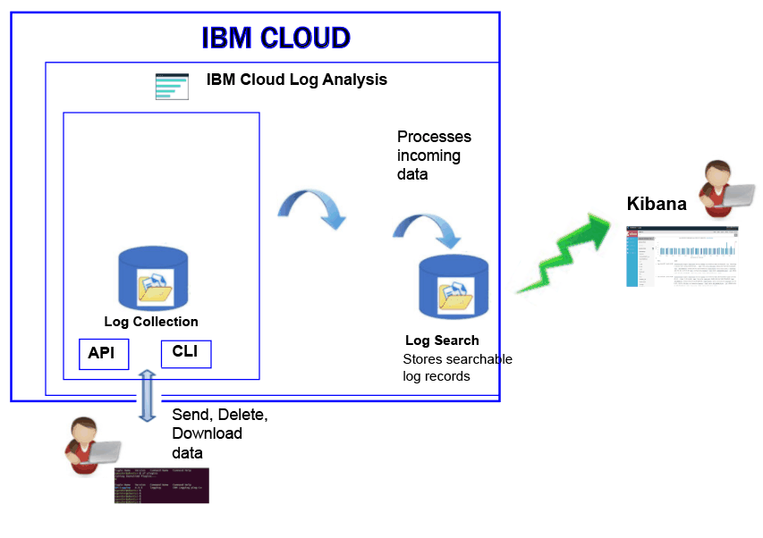

---

copyright:
  years: 2017

lastupdated: "2017-07-31"

---

{:shortdesc: .shortdesc}
{:new_window: target="_blank"}
{:codeblock: .codeblock}
{:screen: .screen}
{:pre: .pre}

# Logging in Bluemix
{: #log_analysis_ov}

Use the {{site.data.keyword.loganalysisfull}} service to expand your log collection, log retention, and log search abilities in {{site.data.keyword.Bluemix}}. Empower your DevOps team with features such as aggregation of application and environment logs for consolidated application or environment insights, encryption of logs, retention of log data for as long as it is required, and quick detection and troubleshooting of issues. Use Kibana for advanced analysis tasks.
{:shortdesc}

{{site.data.keyword.Bluemix_notm}} logging capabilities are integrated in the platform:

* Collection of data is automatically enabled for cloud resources. {{site.data.keyword.Bluemix_notm}}, by default, collects and displays logs for your apps, apps runtimes, and compute runtimes where those apps run. 
* You can search up to 500 MB of logs per day. 
* Logs for the last 3 days are stored in Log Search, a component of the {{site.data.keyword.loganalysisshort}} service.

You can use the logging capabilities in {{site.data.keyword.Bluemix_notm}} to understand the behavior of the cloud platform and the resources that are running in it. No special instrumentation is required to collect the standard out and the standard err logs. For example, you can use logs to provide an audit trail for an application, detect problems in your service, identify vulnerabilities, troubleshoot your app deployments and runtime behavior, detect problems in the infrastructure where your app is running, trace your app across components in the cloud platform, and detect patterns that you can use to preempt actions that could affect your service SLA.

The {{site.data.keyword.loganalysisfull}} service provides log collection and log search services for the {{site.data.keyword.Bluemix_notm}} platform, automatically collecting application and {{site.data.keyword.Bluemix_notm}} services’ data from select {{site.data.keyword.Bluemix_notm}} services.

The following figure shows a high level view of the {{site.data.keyword.loganalysisshort}} service components: 

To collect and search logs of cloud resources, you must provision an instance of the {{site.data.keyword.loganalysisshort}} service in the same {{site.data.keyword.Bluemix_notm}} space where those cloud resources are running.

Logs are collected and stored in Log Search by default. When you select a service plan that includes extended search and collection capabilities, logs are also collected and stored in the Log Collection component. Log data that is stored in Log Collection is encrypted.

The log size that you can collect and store in Log Collection is determined by the service plan that you choose. You pay per GB of data per month for the data that is stored. Logs are stored in Log Collection as JSON.

You can use Kibana 5.1 for advanced log search analysis tasks:

* Each plan limits the log size that you can search per day. 
* Searches only cover data from the past 3 days.

To access logs that are older than 3 days, you can use the Log Collection CLI or the Log Collection API to download logs locally or you can pipe logs to other applications or 3rs party cloud services. 

You can delete logs automatically by setting a retention policy or manually by using the {{site.data.keyword.loganalysisshort}} CLI.

## Why use the Logging service
{: #value}

1. **Spend less time instrumenting your application and more time enhancing its value**

    {{site.data.keyword.loganalysislong_notm}} automatically collects data from selected {{site.data.keyword.IBM_notm}} cloud services, no instrumentation is necessary.
	
	You can choose the amount of logs that you can search per day.  Different plans are available that you can use to search up to 500MB,  2GB, 5GB, and 10GB of logs per day.

2. **Keep your log data near your application workloads and safe guarded on cloud class economical storage solutions**

    Collect and store log data from traditional and micro-service driven applications running in the {{site.data.keyword.IBM_notm}} Cloud in a centralized log. Retain log data for as long as you need.
	
	Logs are stored on {{site.data.keyword.IBM_notm}} Cloud storage. You can download logs when you need them.

3. **Gain insights into your environment to quickly detect, diagnose, and identify issues**

    Visualize, analyze and interact with your data through customizable dashboards. Built on the Elastic stack platform, log search features offer you the flexibility and familiarity of Kibana to quickly build your dashboard to your application needs.

4. **Robust integration with APIs**

    Integrate your log data into your applications and operations through the service’s APIs. Use the {{site.data.keyword.loganalysisshort}} service APIs to manage your retained logs and send log data from outside the {{site.data.keyword.IBM_notm}} Cloud.

	
## Collecting logs
{: #log_collection}

By default, {{site.data.keyword.Bluemix_notm}} stores log data for up to 3 days in Log Search:   

* A maximum of 500MB per space of data is stored per day. Any logs beyond that 500 MB cap are discarded. Cap allotments reset each 
day at 12:30 AM UTC.
* Up to 1.5 GB of data is searchable for a maximum of 3 days. Log data rolls over (First In, First Out) after either 1.5 GB of data is reached or after 3 days.

The {{site.data.keyword.loganalysisshort}} service provides additional plans that allow you to store logs in Log Collection for as long as you require. For more information about each plan, see [Service plans](/docs/services/CloudLogAnalysis/log_analysis_ov.html#plans).

## Deleting logs
{: #log_deletion}

Logs that are stored in Log search are deleted after 3 days.

Logs that are stored in Log collection are automatically deleted after 30 days unless you configure a retention policy. 

* You can configure a log retention policy to define the number of days that you want to keep logs in Log Collection. For more information, see [Log Retention policy](/docs/services/CloudLogAnalysis/log_analysis_ov.html#policies).

* You can disable the policy by setting its value to *-1*. 

You can use the Log Collection API or the Log Collection CLI to delete logs manually from Log Collection. For more information about deleting logs manually through the CLI, see [cf logging delete](/docs/services/CloudLogAnalysis/reference/logging_cli.html#delete).

## Ingesting logs
{: #log_ingestion}

All the {{site.data.keyword.loganalysisshort}} service plans, with the exception of the *Lite* plan, include the ability to send logs into Log Collection from outside the {{site.data.keyword.IBM_notm}} Cloud. 

* For more information about the plans, see [Service plans](/docs/services/CloudLogAnalysis/log_analysis_ov.html#plans).
* For more information about the ingestion URLs, see [Ingestion URLs](/docs/services/CloudLogAnalysis/log_analysis_ov.html#log_ingestion_urls).

You can send logs into the {{site.data.keyword.loganalysisshort}} by using the multi-tenant Logstash Forwarder. For more information, see [Send log data by using a Multi-Tenant Logstash Forwarder (mt-logstash-forwarder)](/docs/services/CloudLogAnalysis/how-to/send-data/send_data_mt.html#send_data_mt).

## Ingestion URLs
{: #log_ingestion_urls}

The following table lists the URLs that you must use to send logs into {{site.data.keyword.Bluemix_notm}}:

<table>
  <caption>Ingestion URLs</caption>
    <tr>
      <th>Region</th>
      <th>URL</th>
    </tr>
  <tr>
    <td>US South</td>
	<td>ingest.logging.ng.bluemix.net:9091</td>
  </tr>
  <tr>
    <td>United Kingdom</td>
	<td>logs.eu-gb.opvis.bluemix.net:9091</td>
  </tr>
  <tr>
    <td>Frankfurt</td>
	<td>ingest.logging.eu-de.bluemix.net</td>
  </tr>
</table>

## Searching logs
{: #log_search}

By default, you can use Kibana to search up to 500 MB of logs per day in {{site.data.keyword.Bluemix_notm}}. For more information on how to define custom search queries in Kibana, see [Defining custom search queries in Kibana](/docs/services/CloudLogAnalysis/kibana/define_search.html#define_search).

To launch Kibana, see [Navigating to the Kibana dashboard](/docs/services/CloudLogAnalysis/kibana/launch.html#launch).

The {{site.data.keyword.loganalysisshort}} service provides multiple plans. Each plan has different log search capabilities, for example, the *Log Collection* plan allows you to search up to 1 GB of data per day. For more information about the plans, see [Service plans](/docs/services/CloudLogAnalysis/log_analysis_ov.html#plans).

## Log analysis in Bluemix
{: #logging_bmx_ov_ui}

In {{site.data.keyword.Bluemix_notm}}, you can view the recent logs or tail logs in real time for CF apps or containers that are deployed in a {{site.data.keyword.Bluemix_notm}} managed infrastructure:

* You can view, filter, and analyze logs through the UI. For more information, see [Analyzing logs from the Bluemix console](/docs/services/CloudLogAnalysis/logging_view_dashboard.html#analyzing_logs_bmx_ui).

* You can view, filter, and analyze logs by using the the command line to manage logs programmatically. For more information, see [Analyzing logs from the CLI](/docs/services/CloudLogAnalysis/logging_view_cli.html#analyzing_logs_cli).

* You can perform advance analysis by using Kibana.

## Advanced log analysis with Kibana
{: #logging_bmx_ov_kibana}

In {{site.data.keyword.Bluemix_notm}}, you can use Kibana, an open source analytics and visualization platform, to monitor, search, analyze, and visualize your data in a variety of graphs, for example charts and tables. For more information, see [Advanced log analysis with Kibana](/docs/services/CloudLogAnalysis/kibana/analyzing_logs_Kibana.html#analyzing_logs_Kibana).

For more information on how to launch Kibana, see [Navigating to the Kibana dashboard](/docs/services/CloudLogAnalysis/kibana/launch.html#launch).

## Managing logs through the CLI
{: #managing_logs}

Use the {{site.data.keyword.loganalysisshort}} CLI to manage logs.

* To learn how to install the CLI, see [Installing the logging CLI](/docs/services/CloudLogAnalysis/how-to/manage-logs/config_log_collection_cli.html#config_log_collection_cli).
* To check the version of the CLI, run the command [cf logging](/docs/services/CloudLogAnalysis/reference/logging_cli.html#base) with the parameter * -version*.
* To get help on how to run commands, see [Getting command line help to run commands](/docs/services/CloudLogAnalysis/how-to/manage-logs/config_log_collection_cli.html#cli_help).

To obtain general information about your logs, use the `cf logging status` command. For example, you can:

* [Get information about logs over a period of time](/docs/services/CloudLogAnalysis/how-to/manage-logs/viewing_log_information.html#viewing_logs).
* [Get information about a type of log over a period of time](/docs/services/CloudLogAnalysis/how-to/manage-logs/viewing_log_information.html#viewing_logs_by_log_type).
* [Get account information about logs](/docs/services/CloudLogAnalysis/how-to/manage-logs/viewing_log_information.html#viewing_logs_account).

To keep cost under control, you might want to monitor the size of the logs of your apps over a period of time. For example, you might want to know the size of each log type during a week for a {{site.data.keyword.Bluemix_notm}} space to identify if any app or service is generating more logs than expected. To check the size of your logs, use the `cf logging status` command. For more information, see [Viewing log information](/docs/services/CloudLogAnalysis/how-to/manage-logs/viewing_log_information.html#viewing_log_status).

You can search logs for the last 3 days in Kibana. To be able to analyze older log data, you can download logs to a local file, or you can pipe these logs to other programs such as a local Elastic Stack. For more information, see [Downloading logs](/docs/services/CloudLogAnalysis/how-to/manage-logs/downloading_logs.html#downloading_logs).

To manually delete logs that you no longer require, use the command [cf logging delete](/docs/services/CloudLogAnalysis/reference/logging_cli.html#delete). 

## Policies
{: #policies}

**Log retention policy**

You can use the {{site.data.keyword.loganalysisshort}} CLI to view and configure the log retention policy. This policy specifies the number of days that logs are kept in Log Collection. 

* By default, logs are kept for 30 days. 
* After the retention period has expired, logs are deleted automatically from Log Collection and they cannot be recovered.
* You can specify a retention period for an account. The retention period is automatically configured for all the spaces in that account. 
* You can specify a retention period for a {{site.data.keyword.Bluemix_notm}} space.
* You can change at any time the retention policy.
* You can disable the policy by setting its value to *-1*. 

**Note:** When you disable the log retention policy, you must maintain the logs in Log Collection. You can use the CLI command [cf logging delete](/docs/services/CloudLogAnalysis/reference/logging_cli.html#delete) to delete old logs.

For more information, see [Viewing and configuring the log retention policy](/docs/services/CloudLogAnalysis/how-to/manage-logs/configuring_retention_policy.html#configuring_retention_policy).

## Regions
{: #regions}

The {{site.data.keyword.loganalysisfull_notm}} service is available in the following region:

* US South

## Service plans
{: #plans}

The {{site.data.keyword.loganalysisshort}} service provides multiple plans. Each plan has different log collection and log search capabilities. 

You can change a plan through the {{site.data.keyword.Bluemix_notm}} UI or through the command line. You can upgrade or reduce your plan at any time. For more information about service plan upgrades in {{site.data.keyword.Bluemix_notm}}, see [Changing the plan](/docs/services/CloudLogAnalysis/plan/change_plan.html#change_plan). 

The following table outlines the plans that are available:

<table>
    <caption>Summary of Log Search and Log Collection capabilities per plan</caption>
      <tr>
        <th>Plan</th>
        <th>Log Ingestion</th>
        <th>Log Retention</th>
        <th>Data Encryption</th>
        <th>Log Search</th>
      </tr>
      <tr>
        <td>Lite (default)</td>
        <td>No</td>
        <td>Last 3 days</td>
        <td>No</td>
        <td>Search up to 500 MB</td>
      </tr>
      <tr>
        <td>Log Collection</td>
        <td>Yes</td>
        <td>Configurable number of days.</td>
        <td>Yes</td>
        <td>Search up to 500 MB per day</td>
      </tr>
      <tr>
        <td>Log Collection with 2GB/Day Search</td>
        <td>Yes</td>
        <td>Configurable number of days.</td>
        <td>Yes</td>
        <td>Search up to 2 GB per day</td>
      </tr>
      <tr>
        <td>Log Collection with 5GB/Day Search</td>
        <td>Yes</td>
        <td>Configurable number of days.</td>
        <td>Yes</td>
        <td>Search up to 5 GB per day</td>
      </tr>
       <tr>
        <td>Log Collection with 10GB/Day Search</td>
        <td>Yes</td>
        <td>Configurable number of days.</td>
        <td>Yes</td>
        <td>Search up to 10 GB per day</td>
      </tr>
</table>

**Note:** The monthly cost of Log Collection storage is calculated as an average of the billing cycle.

## URLs to launch Kibana
{: #urls_kibana}

The following table lists the URLs to launch Kibana, and the versions of Kibana per region:

<table>
    <caption>URLs to launch Kibana</caption>
    <tr>
      <th>Region</th>
      <th>URL</th>
      <th>Kibana version</th>
    </tr>
    <tr>
      <td>US South</td>
      <td>[https://logging.ng.bluemix.net](https://logging.ng.bluemix.net)</td>
	  <td>Kibana 5.1</td>
    </tr>
    <tr>
      <td>United Kingdom</td>
	  <td>[https://logmet.eu-gb.bluemix.net](https://logmet.eu-gb.bluemix.net)</td>
	  <td>Kibana 4, Kibana 3</td>
    </tr>
    <tr>
      <td>Frankfurt</td>
	  <td>[https://logging.eu-de.bluemix.net](https://logging.eu-de.bluemix.net)</td>
	  <td>Kibana 4</td>
    </tr>
</table>

