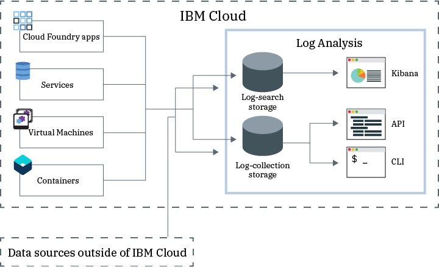

---

copyright:
  years: 2017, 2019

lastupdated: "2019-03-06"

keywords: IBM Cloud, logging

subcollection: cloudloganalysis

---

{:new_window: target="_blank"}
{:shortdesc: .shortdesc}
{:screen: .screen}
{:pre: .pre}
{:table: .aria-labeledby="caption"}
{:codeblock: .codeblock}
{:tip: .tip}
{:download: .download}
{:important: .important}
{:note: .note}

# IBM Cloud Log Analysis
{: #log_analysis_ov}

Use the {{site.data.keyword.loganalysisfull}} service to expand your log collection, log retention, and log search abilities in the {{site.data.keyword.Bluemix}}. Empower your DevOps team with features such as aggregation of application and environment logs for consolidated application or environment insights, encryption of logs, retention of log data for as long as it is required, and quick detection and troubleshooting of issues. Use Kibana for advanced analysis tasks.
{:shortdesc}

The {{site.data.keyword.Bluemix_notm}} logging capabilities are integrated in the platform:

* Collection of data is automatically enabled for cloud resources. {{site.data.keyword.Bluemix_notm}}, by default, collects and displays logs for your apps, apps runtimes, and compute runtimes where those apps run. 
* You can search up to 500 MB of logs per day. 
* Logs for the last 3 days are stored in Log Search, a component of the {{site.data.keyword.loganalysisshort}} service.

You can use the logging capabilities in the {{site.data.keyword.Bluemix_notm}} to understand the behavior of the cloud platform and the resources that are running in it. No special instrumentation is required to collect the standard out and the standard err logs. For example, you can use logs to provide an audit trail for an application, detect problems in your service, identify vulnerabilities, troubleshoot your app deployments and runtime behavior, detect problems in the infrastructure where your app is running, trace your app across components in the cloud platform, and detect patterns that you can use to preempt actions that could affect your service SLA.

The {{site.data.keyword.loganalysisfull}} service provides log collection and log search services for the {{site.data.keyword.Bluemix_notm}} platform, automatically collecting application and {{site.data.keyword.Bluemix_notm}} services’ data from select {{site.data.keyword.Bluemix_notm}} services.

The following figure shows a high level view of the {{site.data.keyword.loganalysisshort}} service: 

To collect and search logs of cloud resources that run in a space, you must provision an instance of the {{site.data.keyword.loganalysisshort}} service in the same space where those cloud resources are running. Logs are collected and stored in Log Search by default. When you select a service plan that includes extended search and collection capabilities, logs are also collected and stored in the Log Collection component. Log data that is stored in Log Collection is encrypted.

By default, the {{site.data.keyword.Bluemix_notm}} stores log data for up to 3 days in Log Search:   

* A maximum of 500MB per space of data is stored per day. Any logs beyond that 500 MB cap are discarded. Cap allotments reset each 
day at 12:30 AM UTC.
* Up to 1.5 GB of data is searchable for a maximum of 3 days. Log data rolls over (First In, First Out) after either 1.5 GB of data is reached or after 3 days.

The {{site.data.keyword.loganalysisshort}} service provides additional plans that allow you to store logs in Log Collection for as long as you require. The log size that you can collect and store in Log Collection is determined by the service plan that you choose. You pay per GB of data per month for the data that is stored. Logs are stored in Log Collection as JSON.

You can use Kibana 5.1 for advanced log search analysis tasks:

* Each plan limits the log size that you can search per day. 
* Searches only cover data from the past 3 days.

To access logs that are older than 3 days, you can use the Log Collection CLI or the Log Collection API to download logs locally or you can pipe logs to other applications or 3rs party cloud services. 

You can delete logs automatically by setting a retention policy or manually by using the {{site.data.keyword.loganalysisshort}} CLI.

## Why use the Log Analysis service
{: #value}

1. **Spend less time instrumenting your application and more time enhancing its value**

    {{site.data.keyword.loganalysislong_notm}} automatically collects data from selected {{site.data.keyword.Bluemix_notm}} services, no instrumentation is necessary.
	
	You can choose the amount of logs that you can search per day.  Different plans are available that you can use to search up to 500MB,  2GB, 5GB, and 10GB of logs per day.

2. **Keep your log data near your application workloads and safe guarded on cloud class economical storage solutions**

    Collect and store log data from traditional and micro-service driven applications running in the {{site.data.keyword.Bluemix_notm}} in a centralized log. Retain log data for as long as you need.
	
	Logs are stored on {{site.data.keyword.IBM_notm}} Cloud storage. You can download logs when you need them.

3. **Gain insights into your environment to quickly detect, diagnose, and identify issues**

    Visualize, analyze and interact with your data through customizable dashboards. Built on the Elastic stack platform, log search features offer you the flexibility and familiarity of Kibana to quickly build your dashboard to your application needs.

4. **Robust integration with APIs**

    Integrate your log data into your applications and operations through the service’s APIs. Use the {{site.data.keyword.loganalysisshort}} service APIs to manage your retained logs and send log data from outside the {{site.data.keyword.IBM_notm}} Cloud.

## Regions
{: #regions}

The {{site.data.keyword.loganalysisfull_notm}} service is available in the following regions:

* Germany
* United Kingdom
* US South
* Sydney

## Data locality
{: #data_location}

The following table lists the location of logs per region:

<table>
  <caption>Location of logs per region</caption>
  <tr>
    <th>Region</th>
	<th>Log Search logs</th>
	<th>Log Collection logs</th>
  </tr>
  <tr>
    <td>Germany</td>
	  <td>Hosted in Germany</td>
	  <td>Hosted in Germany</td>
  </tr>
  <tr>
    <td>United Kingdom</td>
	  <td>Hosted in United Kingdom</td>
	  <td>Hosted in United Kingdom</td>
  </tr>
  <tr>
    <td>US South</td>
	  <td>Hosted in US South</td>
	  <td>Hosted in US South</td>
  </tr>
  <tr>
    <td>Sydney</td>
	  <td>Hosted in Sydney</td>
	  <td>Hosted in US South (*)</td>
  </tr>
</table>

(*) For Sydney, Log Collection logs are hosted in US South currently. Data locality of Log Collection logs in Sydney is in plan.

## Service plans
{: #plans}

The {{site.data.keyword.loganalysisshort}} service provides multiple plans. Each plan has different log collection and log search capabilities. 

**NOTE:** The features that are included in a service plan are enabled only in the space where you provision the {{site.data.keyword.loganalysisshort}} service with that plan.

You can change a plan through the {{site.data.keyword.Bluemix_notm}} UI or through the command line. You can upgrade or reduce your plan at any time. For more information about service plan upgrades, see [Changing the plan](/docs/services/CloudLogAnalysis/how-to/change_plan.html#change_plan). 

The following table outlines the plans that are available:

<table>
    <caption>Summary of Log Search and Log Collection capabilities per plan</caption>
      <tr>
        <th>Plan</th>
        <th>Log Ingestion</th>
        <th>Log Retention</th>
        <th>Data Encryption</th>
        <th>Log Search</th>
      </tr>
      <tr>
        <td>Lite (default)</td>
        <td>No</td>
        <td>Last 3 days</td>
        <td>No</td>
        <td>Search up to 500 MB</td>
      </tr>
      <tr>
        <td>Log Collection</td>
        <td>Yes</td>
        <td>Configurable number of days.</td>
        <td>Yes</td>
        <td>Search up to 500 MB per day</td>
      </tr>
      <tr>
        <td>Log Collection with 2GB/Day Search</td>
        <td>Yes</td>
        <td>Configurable number of days.</td>
        <td>Yes</td>
        <td>Search up to 2 GB per day</td>
      </tr>
      <tr>
        <td>Log Collection with 5GB/Day Search</td>
        <td>Yes</td>
        <td>Configurable number of days.</td>
        <td>Yes</td>
        <td>Search up to 5 GB per day</td>
      </tr>
       <tr>
        <td>Log Collection with 10GB/Day Search</td>
        <td>Yes</td>
        <td>Configurable number of days.</td>
        <td>Yes</td>
        <td>Search up to 10 GB per day</td>
      </tr>
</table>

**Note:** The monthly cost of Log Collection storage is calculated as an average of the billing cycle.

