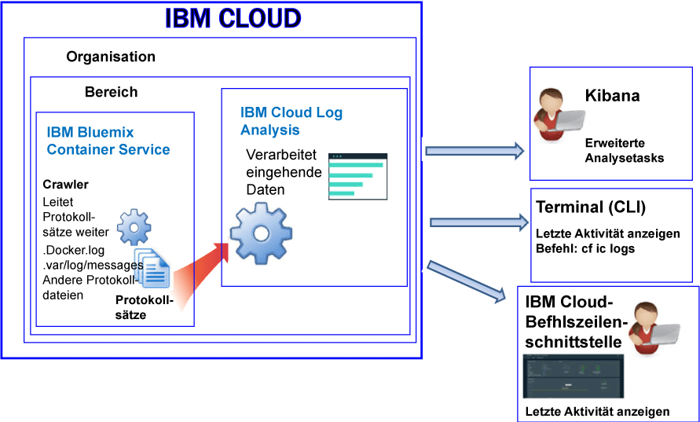

---

copyright:
  years: 2017, 2018

lastupdated: "2018-01-10"

---

{:shortdesc: .shortdesc}
{:new_window: target="_blank"}
{:codeblock: .codeblock}
{:screen: .screen}
{:pre: .pre}

# Protokollierung für einen über IBM Cloud verwalteten Container (veraltet)
{: #containers_bluemix}

Sie können Protokolle für Docker-Container anzeigen, filtern und analysieren, die in der von {{site.data.keyword.IBM}} verwalteten Infrastruktur bereitgestellt werden.
{:shortdesc}

Containerprotokolle werden von außerhalb der Container mithilfe von Crawlern überwacht und weitergeleitet. Die Daten werden von den Crawlern an eine Multi-Tenant-Elasticsearch-Instanz in {{site.data.keyword.Bluemix_notm}} gesendet.

Die folgende Abbildung zeigt eine Übersicht über die Protokollierung für den {{site.data.keyword.containershort}}:

Standardmäßig werden für einen Container, der in der {{site.data.keyword.Bluemix_notm}}-verwalteten Cloudinfrastruktur bereitgestellt wird, die folgenden Protokolle erfasst:

<table>
  <caption>Tabelle 2. Protokolle für die Container, die in einer von {{site.data.keyword.Bluemix_notm}}-verwalteten Infrastruktur bereitgestellt werden</caption>
  <tbody>
    <tr>
      <th align="center">Protokoll</th>
      <th align="center">Beschreibung</th>
    </tr>
    <tr>
      <td align="left" width="30%">/var/log/messages</td>
      <td align="left" width="70%"> Docker-Nachrichten werden standardmäßig im Ordner '/var/log/messages' des Containers gespeichert. Dieses Protokoll enthält Systemnachrichten.
      </td>
    </tr>
    <tr>
      <td align="left">./docker.log</td>
      <td align="left">Dieses Protokoll ist das Docker-Protokoll.   Die Docker-Protokolldatei wird nicht als Datei innerhalb des Containers gespeichert, jedoch trotzdem erfasst. Diese Protokolldatei wird standardmäßig erfasst, da sie die Docker-Standardkonvention zur Bereitstellung der Informationen der Standardausgabe (stdout) und der Standardfehlerausgabe (stderr) für den Container darstellt. Informationen, die ein Containerprozess an die Standardausgabe oder Standardfehlerausgabe sendet, werden erfasst. 
      </td>
     </tr>
  </tbody>
</table>

## Protokolle analysieren
{: #logging_containers_ov_methods}

Zum Analysieren von Containerprotokollen verwenden Sie Kibana, um erweiterte Analysetasks auszuführen. Sie können Kibana, eine quelloffene Analyse- und Visualisierungsplattform, dazu verwenden, Ihre Daten mit verschiedenen Darstellungsarten (Diagramme, Tabellen usw.) zu überwachen, zu durchsuchen, zu analysieren und zu visualisieren. Weitere Informationen finden Sie unter [Protokolle in Kibana analysieren](/docs/services/CloudLogAnalysis/kibana/analyzing_logs_Kibana.html#analyzing_logs_Kibana).

## Angepasste Protokolle erfassen
{: #collect_custom_logs}

Um zusätzliche Protokolle zu erfassen, fügen Sie die Umgebungsvariable **LOG_LOCATIONS** mit einem Pfad zur Protokolldatei hinzu, wenn Sie den Container erstellen. 

Sie können mehrere Protokolldateien hinzufügen, indem Sie sie durch Kommas getrennt angeben. 

Weitere Informationen finden Sie unter [Vom Standard abweichende Protokolldaten aus einem Container erfassen](logging_containers_other_logs.html#logging_containers_collect_data).

## Protokolle durchsuchen
{: #log_search}

Standardmäßig können Sie Kibana verwenden, um 500 MB Protokolle pro Tag in {{site.data.keyword.Bluemix_notm}} zu durchsuchen. 

Der {{site.data.keyword.loganalysisshort}}-Service bietet mehrere Pläne. Für jeden Plan gibt es unterschiedliche Protokollsuchfunktionen. Z. B. können Sie beim *Log Collection*-Plan bis zu 1 GB an Daten pro Tag durchsuchen. Weitere Informationen zu den Plänen finden Sie unter [Servicepläne](/docs/services/CloudLogAnalysis/log_analysis_ov.html#plans).

## Protokolle senden, um die Felder in einer Nachricht als Suchfelder in Kibana verwenden zu können
{: #send_data_in_json}

Standardmäßig ist die Protokollierung für Container automatisch aktiviert. Jeder Eintrag in der Docker-Protokolldatei wird in Kibana im Feld `message` angezeigt. Wenn Sie Ihre Daten in Kibana mit einem bestimmten Feld, das Teil des Containerprotokolleintrags ist, filtern und analysieren müssen, konfigurieren Sie Ihre Anwendung so, dass sie eine gültige JSON-formatierte Ausgabe sendet.

Führen Sie die folgenden Schritte zum Senden von Protokollen aus, wobei Containerprotokolleinträge in einzelne Felder geparst werden:

1. Protokollieren Sie die Nachricht in einer Datei. 
2. Fügen Sie die Protokolldatei der Liste der vom Standard abweichenden Protokolle hinzu, die zur Analyse aus einem Container verfügbar sind. Weitere Informationen finden Sie unter [Vom Standard abweichende Protokolldaten aus einem Container erfassen](logging_containers_other_logs.html#logging_containers_collect_data). 
    
Wenn JSON-Protokolleinträge an die Docker-Protokolldatei für einen Container als STDOUT gesendet werden, werden sie nicht als JSON analysiert. 
    
Wenn Sie die Nachricht in einer Datei protokollieren und eine Nachricht als gültige JSON ermittelt wird, werden die Felder analysiert und für jedes Feld in der Nachricht neue Felder erstellt. Nur Feldwerte eines Zeichenfolgetyps sind für die Filterung und Sortierung in Kibana verfügbar.

## Protokolle in 'Log Collection' speichern
{: #store_logs}

Standardmäßig speichert {{site.data.keyword.Bluemix_notm}} Protokolldaten für bis zu drei Tage:   

* Maximal werden 500 MB pro Datenbereich und Tag gespeichert. Alle Protokolle oberhalb der Kapazitätsgrenze von 500 MB werden nicht berücksichtigt. Die Kapazitätsgrenze wird täglich um 12:30 AM (UTC) zurückgesetzt.
* Bis zu 1,5 GB Daten können für einen Zeitraum von maximal 3 Tagen durchsucht werden. Das Rollover der Protokolldaten (First In, First Out) erfolgt bei 1,5 GB an Daten oder nach drei Tagen.

Der {{site.data.keyword.loganalysisshort}}-Service bietet zusätzliche Pläne, mit denen Sie Protokolle so lange wie erforderlich in 'Log Collection' speichern können. Weitere Informationen zu den Preisen der einzelnen Pläne finden Sie unter [Servicepläne](/docs/services/CloudLogAnalysis/log_analysis_ov.html#plans).

Wenn Sie Protokolle speichern oder größere Protokolle durchsuchen müssen, können Sie den {{site.data.keyword.loganalysisshort}}-Service bereitstellen und einen anderen Serviceplan auswählen. Mit zusätzlichen Plänen können Sie Protokolle so lange wie erforderlich in 'Log Collection' speichern und umfangreichere Protokolle durchsuchen. Weitere Informationen finden Sie unter [Servicepläne](/docs/services/CloudLogAnalysis/log_analysis_ov.html#plans).

## Protokolle anzeigen
{: #logging_containers_ov_methods_view_bmx}

Sie können die aktuellen Protokolle für einen Container anzeigen, der in der von {{site.data.keyword.Bluemix_notm}} verwalteten Infrastruktur bereitgestellt ist, indem Sie eine der folgenden Methoden verwenden:

* Anzeigen von Protokollen über die {{site.data.keyword.Bluemix_notm}}-Benutzerschnittstelle, um die letzten Aktivitäten des Containers anzuzeigen.
    
    Sie können Protokolle über die Registerkarte **Überwachung und Protokolle** anzeigen, filtern und analysieren, die für jeden Container verfügbar ist. 
	
	Führen Sie die folgenden Schritte aus, um die Bereitstellungs- oder Laufzeitprotokolle eines Docker-Containers anzuzeigen, der in der von {{site.data.keyword.IBM_notm}} verwalteten Infrastruktur bereitgestellt ist:

    1. Klicken Sie im Dashboard 'Apps' auf einen einzelnen Container oder eine Containergruppe. 
    
    2. Klicken Sie auf der Seite 'App-Details' auf **Überwachung und Protokolle**.

    3. Wählen Sie die Registerkarte **Protokollierung** aus. Auf der Registerkarte **Protokollierung** können Sie die neuesten Protokolle für Ihren Container anzeigen oder die Protokolle per Tailing in Echtzeit verfolgen. 
	
* Anzeigen von Protokollen über die {{site.data.keyword.containershort}}-Befehlszeilenschnittstelle. Verwenden Sie Befehle, um die Protokolle programmgesteuert zu verwalten.
    
    Sie können Protokolle über die Befehlszeilenschnittstelle (CLI) mit dem Befehl **cf ic logs** anzeigen, filtern und analysieren. 
	
	Verwenden Sie den Befehl `bx cf ic logs`, um Protokolle von einem Container in {{site.data.keyword.Bluemix_notm}} anzuzeigen. Sie können die Protokolle z. B. verwenden, um zu analysieren, warum ein Container gestoppt wurde, oder um die Ausgabe des Containers zu überprüfen. 
	
	Um die Anwendungsfehler für die in einem Container ausgeführte App über den Befehl `cf ic logs` anzuzeigen, muss die Anwendung ihre Protokolle in die Standardausgabedatenströme STDOUT und STDERR schreiben. Wenn Sie Ihre Anwendung so konzipieren, dass sie in diese Standardausgabedatenströme schreibt, können Sie die Protokolle über die Befehlszeile anzeigen, auch wenn der Container beendet wird oder ausfällt.

    Weitere Informationen zu dem Befehl `cf ic logs` finden Sie unter [Befehl 'cf ic logs'](/docs/containers/container_cli_reference_cfic.html#container_cli_reference_cfic__logs).

