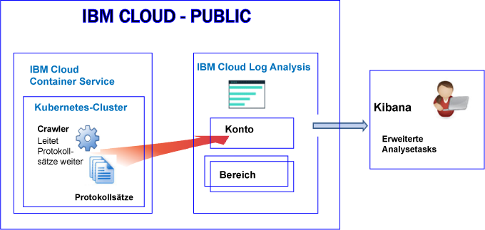
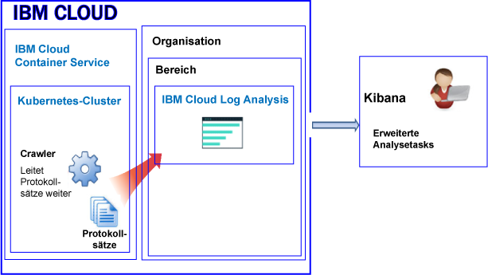
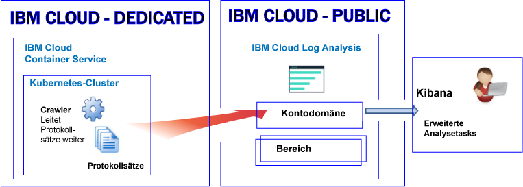

---

copyright:
  years: 2017, 2018

lastupdated: "2018-02-01"

---

{:new_window: target="_blank"}
{:shortdesc: .shortdesc}
{:screen: .screen}
{:pre: .pre}
{:table: .aria-labeledby="caption"}
{:codeblock: .codeblock}
{:tip: .tip}
{:download: .download}


# Protokollierung für Ressourcen in einem Kubernetes-Cluster
{: #containers_kubernetes}

Sie können Protokolle für Ressourcen in einem Kubernetes-Cluster über den {{site.data.keyword.loganalysisshort}}-Service in {{site.data.keyword.Bluemix_notm}} anzeigen, filtern und analysieren.
{:shortdesc}

Standardmäßig ist das Senden von Protokollen aus einem Cluster an den {{site.data.keyword.loganalysisshort}}-Service nicht automatisch aktiviert. **Hinweis:** Dies ist eine neue Änderung für neue Cluster. Bisher wurden beim Erstellen eines Clusters die Informationen, die ein Containerprozess als 'stdout' (Standardausgabe) und als 'stderr' (Standardfehler) ausgab, automatisch vom {{site.data.keyword.containershort}} erfasst und an den {{site.data.keyword.loganalysisshort}}-Service weitergeleitet. Jetzt müssen Sie mindestens eine Protokollierungskonfiguration im Cluster erstellen, damit Protokolle automatisch an den {{site.data.keyword.loganalysisshort}}-Service weitergeleitet werden.

Beachten Sie beim Arbeiten mit Clusterprotokollen die folgenden Informationen:

* Das Senden von Informationen an 'stdout' und 'stderr' ist die Standard-Docker-Konvention zur Bereitstellung von Informationen über einen Container.
* Containerprotokolle werden von außerhalb der Container mithilfe von Crawlern überwacht und weitergeleitet. 
* Die Daten werden von den Crawlern an eine Multi-Tenant-Elasticsearch-Instanz in {{site.data.keyword.Bluemix_notm}} gesendet. 
* Sie können Ihren Cluster so konfigurieren, dass 'stdout'- und 'stderr'-Protokolle, andere Anwendungsprotokolle, Workerknotenprotokolle, die Protokolle von Kubernetes-Systemkomponenten und die Protokolle des Ingress-Controllers an den {{site.data.keyword.loganalysisshort}}-Service weitergeleitet werden. Weitere Informationen hierzu finden Sie unter [Zusätzliche Anwendungs- und Clusterprotokolle erfassen](/docs/services/CloudLogAnalysis/containers/containers_kubernetes.html#collect_logs).

## Informationen zur Protokollierung in Public
{: #public}

In {{site.data.keyword.Bluemix_notm}} können Sie mit dem {{site.data.keyword.loganalysisshort}}-Service Containerprotokolle und Kubernetes-Clusterprotokolle speichern und analysieren, die automatisch vom {{site.data.keyword.containershort}} in Public erfasst werden.

In einem Konto können Sie einen oder mehr Kubernetes-Cluster haben. Protokolle werden automatisch vom {{site.data.keyword.containershort}} erfasst, sobald der Cluster bereitgestellt wurde. 

* Anwendungsprotokolle werden erfasst, sobald der Pod bereitgestellt wurde. 
* Informationen, die ein Containerprozess als 'stdout' (Standardausgabe) und als 'stderr' (Standardfehler) ausgibt, werden automatisch vom {{site.data.keyword.containershort}} erfasst.

Damit diese Protokolle zum Analysieren im {{site.data.keyword.loganalysisshort}}-Service zur Verfügung stehen, müssen Sie den Cluster so konfigurieren, dass Clusterprotokolle an {{site.data.keyword.loganalysisshort}} weitergeleitet werden. Sie können Protokolle an Ihre Kontodomäne oder an eine Bereichsdomäne in Ihrem Konto weiterleiten.

* Cluster, die in der Region 'USA (Süden)' aktiv sind, senden Protokolle an den {{site.data.keyword.loganalysisshort}}-Service, der in dieser Region verfügbar ist.
* Cluster, die in der Region 'USA (Osten)' aktiv sind, senden Protokolle an den {{site.data.keyword.loganalysisshort}}-Service, der in dieser Region verfügbar ist.
* Cluster, die in der Region "Deutschland" aktiv sind, senden Protokolle an den {{site.data.keyword.loganalysisshort}}-Service, der in dieser Region verfügbar ist.
* Cluster, die in der Region 'Sydney' aktiv sind, senden Protokolle an den {{site.data.keyword.loganalysisshort}}-Service, der in dieser Region verfügbar ist.
* Cluster, die in der Region 'Vereinigtes Königreich' aktiv sind, senden Protokolle an den {{site.data.keyword.loganalysisshort}}-Service, der in dieser Region verfügbar ist.


Wenn Sie Protokolldaten in Kibana für einen Cluster analysieren, berücksichtigen Sie die folgenden Informationen:

* Sie müssen Kibana in der öffentlichen Region starten, in der die {{site.data.keyword.loganalysisshort}}-Instanz, über die Sie Protokolle anzeigen, bereitgestellt ist. 
* Ihre Benutzer-ID muss über eine entsprechende Berechtigung zum Anzeigen von Protokollen verfügen. 

    Um Protokolle in der Kontodomäne anzeigen zu können, benötigt ein Benutzer eine IAM-Richtlinie für den {{site.data.keyword.loganalysisshort}}-Service. Der Benutzer muss über die Berechtigung **Anzeigeberechtigter** verfügen. 
    
    Zum Anzeigen von Protokollen in der Bereichsdomäne muss dem Benutzer eine CF-Rolle zugewiesen sein. Weitere Informationen finden Sie unter [Rollen zum Anzeigen von Protokollen](/docs/services/CloudLogAnalysis/kibana/analyzing_logs_Kibana.html#roles).

Um Protokolldaten zu verwalten, die sich in einem Langzeitspeicher ('Log Collection') befinden, muss Ihre Benutzer-ID über eine entsprechende IAM-Richtlinie für die Arbeit mit dem {{site.data.keyword.loganalysisshort}}-Service verfügen. Die Benutzer-ID benötigt die Berechtigung des **Administrators** oder des **Editors**.  Weitere Informationen finden Sie unter [Rollen für die Verwaltung von Protokollen](/docs/services/CloudLogAnalysis/manage_logs.html#roles).

**Hinweis:** Wenn Sie mit einem Kubernetes-Cluster arbeiten, sind die Namensbereiche *ibm-system* und *kube-system* reserviert. Erstellen, löschen oder ändern Sie keine Berechtigungen für Ressourcen, die in diesen Namensbereiche verfügbar sind. Die Protokolle für diese Namensbereiche sind für die Verwendung durch {{site.data.keyword.IBM_notm}} reserviert.


### Übersicht über die Protokollierung für einen Cluster, der Protokolle an die Kontodomäne weiterleitet
{: #acc}


Die folgende Abbildung zeigt eine Übersicht über die Protokollierung in der öffentlichen Region für den {{site.data.keyword.containershort}}, wenn der Cluster Protokolle an die Kontodomäne weiterleitet:




### Übersicht über die Protokollierung für einen Cluster, der Protokolle an eine Bereichsdomäne weiterleitet
{: #space}

Die folgende Abbildung zeigt eine Übersicht über die Protokollierung in der öffentlichen Region für den {{site.data.keyword.containershort}}, wenn der Cluster Protokolle an eine Bereichsdomäne weiterleitet:



   


## Informationen zur Protokollierung in Dedicated
{: #dedicated}

In {{site.data.keyword.Bluemix_notm}} können Sie mit dem {{site.data.keyword.loganalysisshort}}-Service in Public Containerprotokolle und Kubernetes-Clusterprotokolle speichern und analysieren, die automatisch vom {{site.data.keyword.containershort}} in Dedicated erfasst werden.

Beachten Sie die folgenden Informationen:

* In einem Konto können Sie einen oder mehr Kubernetes-Cluster haben. Protokolle werden automatisch vom {{site.data.keyword.containershort}} erfasst, sobald ein Cluster bereitgestellt wird. 
* Zum Anzeigen von Anwendungs- und Clusterprotokollen über den {{site.data.keyword.loganalysisshort}}-Service müssen Sie mindestens eine Protokollierungskonfiguration in einem Cluster definieren. Jeder Konfigurationseintrag definiert, welche Protokollinformationen an den {{site.data.keyword.loganalysisshort}}-Service weitergeleitet werden. Zum Beispiel werden 'stdout'- und 'stderr'-Protokolldaten erfasst, sobald der Pod bereitgestellt wird. Damit diese Protokolle weitergeleitet werden, müssen Sie eine Protokollierungskonfiguration für eine Protokollquelle des Typs *Container* definieren.
* Wenn Sie eine Protokollierungskonfiguration definieren, entscheiden Sie, ob Protokolle an die Kontodomäne oder an eine Bereichsdomäne gesendet werden. **Hinweis:** Aktuell gilt für die Kontodomäne ein Suchkontingent von 500 MB pro Tag und es ist zudem nicht möglich, Protokolle zur Langzeitspeicherung in 'Log Collection' abzulegen. Um nach größeren Protokollen suchen und Protokolle in 'Log Collection' speichern zu können, senden Sie Ihre Protokolle an eine Bereichsdomäne.
* Wenn Sie definieren, dass eine Protokollierungskonfiguration Protokolle an die Kontodomäne sendet, werden Protokolle an die Kontodomäne in derselben öffentlichen Region weitergeleitet, in der auch der {{site.data.keyword.containershort}} von Dedicated ausgeführt wird.

    Cluster, die in der Region 'USA (Süden)' aktiv sind, senden Protokolle an den {{site.data.keyword.loganalysisshort}}-Service, der in dieser Region verfügbar ist.</br>
    Cluster, die in der Region 'USA (Osten)' aktiv sind, senden Protokolle an den {{site.data.keyword.loganalysisshort}}-Service, der in dieser Region verfügbar ist. </br>
    Cluster, die in der Region "Deutschland" aktiv sind, senden Protokolle an den {{site.data.keyword.loganalysisshort}}-Service, der in dieser Region verfügbar ist. </br>
    Cluster, die in der Region 'Sydney' aktiv sind, senden Protokolle an den {{site.data.keyword.loganalysisshort}}-Service, der in dieser Region verfügbar ist. </br>
    Cluster, die in der Region 'Vereinigtes Königreich' aktiv sind, senden Protokolle an den {{site.data.keyword.loganalysisshort}}-Service, der in dieser Region verfügbar ist.


Wenn Sie Protokolldaten für einen Cluster in Kibana anzeigen und analysieren, berücksichtigen Sie die folgenden Informationen:

* Sie müssen Kibana in der öffentlichen Cloudregion starten, in der die {{site.data.keyword.loganalysisshort}}-Instanz bereitgestellt ist. 
* Ihre Benutzer-ID muss für die Arbeit mit dem {{site.data.keyword.loganalysisshort}}-Service über eine IAM-Richtlinie verfügen. Sie müssen über die Berechtigungen eines **Prüfers** verfügen, um Protokolle in der Kontodomäne anzuzeigen.  

Um Protokolldaten zu verwalten, die sich in einem Langzeitspeicher ('Log Collection') befinden, muss Ihre Benutzer-ID über eine entsprechende IAM-Richtlinie für die Arbeit mit dem {{site.data.keyword.loganalysisshort}}-Service verfügen. Sie benötigen die Berechtigung des **Administrators** oder des **Editors**.  

Die folgende Abbildung zeigt eine Übersicht über die Protokollierung in Dedicated für den {{site.data.keyword.containershort}}:




## Protokollquellen
{: #log_sources}


Sie können Ihren Cluster so konfigurieren, dass Protokolle an den {{site.data.keyword.loganalysisshort}}-Service weitergeleitet werden. Die folgende Tabelle listet die verschiedenen Protokollquellen auf, die Sie dafür aktivieren können, Protokolle an den {{site.data.keyword.loganalysisshort}}-Service weiterzuleiten:

<table>
  <caption>Protokollquellen für einen Kuberenetes-Cluster</caption>
  <tr>
    <th>Protokollquelle</th>
	<th>Beschreibung</th>
	<th>Protokollpfade</th>
  </tr>
  <tr>
    <td>Container</td>
	<td>Containerprotokolle.</td>
	<td>Protokolle für 'stdout' (Standardausgabe) und 'stderr' (Standardfehlerausgabe).</td>
  </tr>
  <tr>
    <td>Anwendung</td>
	<td>Protokolle für Ihre eigene Anwendung, die in einem Kubernetes-Cluster ausgeführt wird.</td>
	<td>`/var/log/apps/**/*.log`  </br>`/var/log/apps/**/*.err`</br>**HINWEIS:** Auf einem Pod können Protokolle in `/var/logs/apps/` oder in ein beliebiges Unterverzeichnis unter `/var/logs/apps/` geschrieben werden. Auf dem Worker müssen Sie `/var/log/apps/` in dem Verzeichnis in dem Pod bereitstellen, in dem Ihre App Protokolle in den Pod schreibt.</td>
  </tr>
  <tr>
    <td>Worker</td>
	<td>Protokolle für Workerknoten für virtuelle Maschinen in einem Kubernetes-Cluster. </td>
	<td>`/var/log/syslog` </br>`/var/log/auth.log`</td>
  </tr>
  <tr>
    <td>Kubernetes-Systemkomponente</td>
	<td>Protokolle für die Kubernetes-Systemkomponente.</td>
	<td>*/var/log/kubelet.log* </br>*/var/log/kube-proxy.log*</td>
  </tr>
  <tr>
    <td>Ingress-Controller</td>
	<td>Protokolle für einen Ingress-Controller, der eingehenden Netzverkehr in einem Kubernetes-Cluster verwaltet.</td>
	<td>`/var/log/alb/ids/*.log` </br>`/var/log/alb/ids/*.err` </br>`/var/log/alb/customerlogs/*.log` </br>`/var/log/alb/customerlogs/*.err`</td>
  </tr>
</table>


## Aspekte für die Weiterleitung von Anwendungsprotokollen
{: #forward_app_logs}

Um die Protokollweiterleitung von Anwendungsprotokollen zu aktivieren, müssen Sie eine Protokollierungskonfiguration für den Cluster definieren, bei der **Protokollquelle** auf **Anwendung** festgelegt ist.

Informieren Sie sich über die folgenden Aspekte der Weiterleitung von Anwendungsprotokollen:

* Sie können Protokolle weiterleiten, die in einem bestimmten Verzeichnis auf dem Hostknoten verfügbar sind. Dies kann durch das Bereitstellen eines Hostpfaddatenträgers in Ihren Containern mit einem Mountpfad erfolgen. Dieser Mountpfad dient als das Verzeichnis in Ihren Containern, an das die Anwendungsprotokolle gesendet werden. Das vordefinierte Hostpfadverzeichnis `/var/log/apps` wird automatisch erstellt, wenn Sie den Datenträgermount erstellen.

    Hier einige Beispiele für einen Abschnitt 'volumeMounts' des Implementierungsdeskriptors und einen Abschnitt 'Datenträger':

    ```
    volumeMounts:
            - mountPath: /var/app
              name: application-log
    volumes:
        - name: application-log
          hostPath:
            path: /var/log/apps

    ```
    {: codeblock}

* Die Protokolle werden rekursiv aus dem Pfad `/var/log/apps` gelesen. Sie können Anwendungsprotokolle in Unterverzeichnisse des Pfades `/var/log/apps` einreihen.
    
* Nur Anwendungsprotokolldateien mit den Dateierweiterungen **.log** oder **.err** werden weitergeleitet.

* Wenn Sie die Protokollweiterleitung zum ersten Mal aktivieren, werden für die Anwendungsprotokolle 'tail'-Aufrufe durchgeführt, anstatt von oben her gelesen zu werden. 

    Die Inhalte aller Protokolle, die bereits vor Aktivierung der Anwendungsprotokollierung vorhanden waren, werden nicht gelesen. Die Protokolle werden ab dem Punkt gelesen, an dem die Protokollierung aktiviert wurde. Nach der ersten Aktivierung der Protokollweiterleitung jedoch werden die Protokolle immer ab dem Punkt gelesen, an dem sie zuletzt verlassen wurden.

* Wenn Sie den Hostpfaddatenträger */var/log/apps* in mehreren Containern bereitstellen, schreiben alle Container in dasselbe Verzeichnis auf dem Host (Worker). Wenn Ihre Container in denselben Dateinamen schreiben, schreiben sie in genau dieselbe Datei auf dem Host und sie werden überschrieben. 

    **HINWEIS:** Wenn alle Container in denselben Dateinamen schreiben, aktivieren Sie nicht die Weiterleitung von Protokollen, deren 'Protokollquelle' auf *Anwendung* festgelegt ist, um Anwendungsprotokolle für ReplicaSets größer als 1 weiterzuleiten. Stattdessen können Sie Protokolle aus der Anwendung in STDOUT und STDERR schreiben, die als Containerprotokolle aufgenommen werden. Um Anwendungsprotokolle weiterzuleiten, die in STDOUT und STDERR geschrieben wurden, aktivieren Sie die Protokollweiterleitung, wobei 'Protokollquelle' auf *Container* festgelegt ist.


## Aspekte für die Weiterleitung von Protokollen an eine Protokolldomäne
{: #forward_logs_domain}

Sie können Ihren Cluster so konfigurieren, dass Protokolldateien an den {{site.data.keyword.loganalysisshort}}-Service weitergeleitet werden. 

Protokolle können an die Kontodomäne oder an eine Bereichsdomäne weitergeleitet werden.

Für die Entscheidung, ob Protokolle an eine Bereichsdomäne oder an die Kontodomäne weitergeleitet werden, berücksichtigen Sie die folgenden Informationen:

* Wenn Sie Protokolle an die Kontodomäne senden, beträgt das Suchkontingent 500 MB pro Tag und es ist zudem nicht möglich, Protokolle zur Langzeitspeicherung in 'Log Collection' abzulegen.
* Wenn Sie Protokolle an eine Bereichsdomäne senden, können Sie einen {{site.data.keyword.loganalysisshort}}-Serviceplan auswählen, der das tägliche Suchkontingent definiert, und Sie können Protokolle zur Langzeitspeicherung in 'Log Collection' ablegen.


## Anwendungs- und Clusterprotokolle weiterleiten
{: #forward_logs}

Führen Sie die folgenden Schritte aus, um Ihren Cluster für die Weiterleitung von Protokollen an den {{site.data.keyword.loganalysisshort}}-Service zu konfigurieren:

1. Überprüfen Sie, ob Ihre Benutzer-ID über die Berechtigung zum Hinzufügen einer Protokollierungskonfiguration zum Cluster verfügt. 

    Nur Benutzer mit einer IAM-Richtlinie für den {{site.data.keyword.containershort}} mit Berechtigungen zum Verwalten von Clustern können eine Protokollierungskonfiguration für einen Cluster erstellen, aktualisieren oder löschen. Dazu ist mindestens eine der folgenden Rollen erforderlich: Administrator, Operator.

2. Öffnen Sie ein Terminal und richten Sie den Clusterkontext ein.

3. Erstellen Sie Ihre Protokollierungskonfigurationen für den Cluster. Sie können festlegen, welche Clusterprotokolle an den Log Analysis-Service weitergeleitet werden sollen.

    Informationen zur automatischen Protokollerfassung und Weiterleitung von 'stdout' und 'stderr' finden Sie unter [Automatische Protokollerfassung und Weiterleitung von Containerprotokollen aktivieren](/docs/services/CloudLogAnalysis/containers/containers_kube_other_logs.html#containers). </br>
    Informationen zur automatischen Erfassung von Protokollen und Weiterleitung von Anwendungsprotokollen finden Sie unter [Automatische Erfassung von Protokollen und Weiterleitung von Anwendungsprotokollen aktivieren](/docs/services/CloudLogAnalysis/containers/containers_kube_other_logs.html#apps). </br>
    Informationen zur automatischen Erfassung von Protokollen und Weiterleitung von Workerprotokollen finden Sie unter [Automatische Erfassung von Protokollen und Weiterleitung von Workerprotokollen aktivieren](/docs/services/CloudLogAnalysis/containers/containers_kube_other_logs.html#workers). </br>
    Informationen zur automatischen Erfassung von Protokollen und Weiterleitung von Protokollen von Kubernetes-Systemkomponenten finden Sie unter [Automatische Erfassung von Protokollen und Weiterleitung von Protokollen von Kubernetes-Systemkomponenten aktivieren](/docs/services/CloudLogAnalysis/containers/containers_kube_other_logs.html#system). </br>
    Informationen zur automatischen Erfassung von Protokollen und Weiterleitung von Kubernetes-Ingress-Controllerprotokollen finden Sie unter [Automatische Erfassung von Protokollen und Weiterleitung von Kubernetes-Ingress-Controllerprotokollen aktivieren](/docs/services/CloudLogAnalysis/containers/containers_kube_other_logs.html#controller).
    
4. Wenn Sie Protokolle an einen Bereich weiterleiten, müssen Sie auch Cloud Foundry (CF)-Berechtigungen an den {{site.data.keyword.containershort}}-Schlüsseleigner in der Organisation und im Bereich erteilen. Der Schlüsseleigner benötigt die Rolle *Organisationsmanager* für die Organisation sowie die Rollen *Bereichsmanager* und *Entwickler* für den Bereich.

Weitere Informationen darüber, wie Sie einen Cluster für die Weiterleitung von Protokolldateien an den {{site.data.keyword.loganalysisshort}}-Service konfigurieren, finden Sie im Abschnitt [Automatische Erfassung von Clusterprotokollen aktivieren](/docs/services/CloudLogAnalysis/containers/containers_kube_other_logs.html#containers_kube_other_logs).


## Netzverkehr für angepasste Firewallkonfigurationen in {{site.data.keyword.Bluemix_notm}} konfigurieren
{: #ports}

Wenn Sie zusätzlich eine Firewall eingerichtet haben oder die Firewalleinstellungen in der {{site.data.keyword.Bluemix_notm}} Infrastructure (SoftLayer) angepasst haben, müssen Sie ausgehenden Netzverkehr vom Workerknoten zum {{site.data.keyword.loganalysisshort}}-Service zulassen. 

Sie müssen den TCP-Port 443 und den TCP-Port 9091 von jedem Workerknoten zum {{site.data.keyword.loganalysisshort}}-Service für die folgenden IP-Adressen in der angepassten Firewall öffnen:

<table>
  <tr>
    <th>Region</th>
    <th>Einpflege-URL</th>
	<th>Öffentliche IP-Adressen</th>
  </tr>
  <tr>
    <td>Deutschland</td>
	<td>ingest-eu-fra.logging.bluemix.net</td>
	<td>158.177.88.43 <br>159.122.87.107</td>
  </tr>
  <tr>
    <td>Vereinigtes Königreich</td>
	<td>ingest.logging.eu-gb.bluemix.net</td>
	<td>169.50.115.113</td>
  </tr>
  <tr>
    <td>USA (Süden)</td>
	<td>ingest.logging.ng.bluemix.net</td>
	<td>169.48.79.236 <br>169.46.186.113</td>
  </tr>
  <tr>
    <td>Sydney</td>
	<td>ingest-au-syd.logging.bluemix.net</td>
	<td>130.198.76.125 <br>168.1.209.20</td>
  </tr>
</table>


## Protokolle durchsuchen
{: #log_search}

Standardmäßig können Sie Kibana verwenden, um 500 MB Protokolle pro Tag in {{site.data.keyword.Bluemix_notm}} zu durchsuchen. 

Für die Suche in umfangreicheren Protokollen können Sie den {{site.data.keyword.loganalysisshort}}-Service verwenden. Der Service bietet mehrere Pläne. Für jeden Plan gibt es unterschiedliche Protokollsuchfunktionen. Z. B. können Sie beim *Log Collection*-Plan bis zu 1 GB an Daten pro Tag durchsuchen. Weitere Informationen zu den verfügbaren Plänen finden Sie unter [Servicepläne](/docs/services/CloudLogAnalysis/log_analysis_ov.html#plans).

Berücksichtigen Sie bei der Suche nach den Protokollen die folgenden Felder, die in Kibana verfügbar sind:

Felder, die einheitlich in Protokolleinträgen verwendet werden:

<table>
  <caption>Liste gängiger Felder</caption>
  <tr>
    <th>Feldname</th>
	<th>Beschreibung</th>
	<th>Wert</th>
  </tr>
  <tr>
    <td>ibm-containers.region_str</td>
	<td>Region, in der der Cluster verfügbar ist.</td>
	<td>Beispielsweise ist `us-south` der Wert für einen Cluster, der in der Region 'USA (Süden)' verfügbar ist.</td>
  </tr>
  <tr>
    <td>ibm-containers.account_id_str</td>
	<td>Konto-ID.</td>
	<td></td>
  </tr>
  <tr>
    <td>ibm-containers.cluster_id_str</td>
	<td>Cluster-ID.</td>
	<td></td>
	<tr>
    <td>ibm-containers.cluster_name_str</td>
	<td>Clustername</td>
	<td></td>
  </tr>
</table>

Felder, die bei der Analyse von 'stdout'- und 'stderr'-Containerprotokollen hilfreich sein könnten:

<table>
  <caption>Liste der Felder für Anwendungen</caption>
  <tr>
    <th>Feldname</th>
	<th>Beschreibung</th>
	<th>Wert</th>
  </tr>
  <tr>
    <td>kubernetes.container_name_str</td>
	<td>Name des Containers.</td>
	<td></td>
  </tr>
  <tr>
    <td>kubernetes.namespace_name_str</td>
	<td>Name des Namensbereichs, in dem die Anwendung im Cluster ausgeführt wird.</td>
	<td></td>
  </tr>
  <tr>
    <td>stream_str</td>
	<td>Protokolltyp.</td>
	<td>*stdout* </br>*stderr *</td>
  </tr>
</table>

Felder, die bei der Analyse von Workerprotokollen hilfreich sein könnten:

<table>
  <caption>Liste der Felder, die für Worker relevant sind</caption>
  <tr>
    <th>Feldname</th>
	<th>Beschreibung</th>
	<th>Wert</th>
  </tr>
  
  <tr>
    <td>filename_str</td>
	<td>Pfad und Name der Datei.</td>
	<td>*/var/log/syslog*  </br>*/var/log/auth.log*</td>
  </tr>
  <tr>
    <td>tag_str</td>
	<td>Protokolltyp.</td>
	<td>*logfiles.worker.var.log.syslog* </br>*logfiles.worker.var.log.auth.log*</td>
  </tr>
  <tr>
    <td>worker_str</td>
	<td>Workername.</td>
	<td>Beispiel: *w1*</td>
  </tr>
</table>

Felder, die bei der Analyse von Protokollen der Kubernetes-Systemkomponente hilfreich sein könnten:

<table>
  <caption>Liste der Felder, die für die Kubernetes-Systemkomponente relevant sind</caption>
  <tr>
    <th>Feldname</th>
	<th>Beschreibung</th>
	<th>Wert</th>
  </tr>
  <tr>
    <td>tag_str</td>
	<td>Protokolltyp.</td>
	<td>*logfiles.kubernetes.var.log.kubelet.log* </br>*logfiles.kubernetes.var.log.kube-proxy.log*</td>
  </tr>
  <tr>
    <td>filename_str</td>
	<td>Pfad und Name der Datei.</td>
	<td>*/var/log/kubelet.log* </br>*/var/log/kube-proxy.log*</td>
  </tr>
 </table>

Felder, die bei der Analyse von Protokollen des Ingress-Controllers hilfreich sein könnten:
 
<table>
  <caption>Liste der Felder, die für den Ingress-Controller relevant sind</caption>
  <tr>
    <th>Feldname</th>
	<th>Beschreibung</th>
	<th>Wert</th>
  </tr>
 <tr>
    <td>tag_str</td>
	<td>Protokolltyp.</td>
	<td></td>
  </tr>
  <tr>
    <td>filename_str</td>
	<td>Pfad und Name der Datei.</td>
	<td>*/var/log/alb/ids/*.log* </br>*/var/log/alb/ids/*.err* </br>*/var/log/alb/customerlogs/*.log* </br>*/var/log/alb/customerlogs/*.err*</td>
  </tr>
</table>


## Protokolle senden, um die Felder in einer Nachricht als Suchfelder in Kibana verwenden zu können
{: #send_data_in_json}

Standardmäßig ist die Protokollierung für Container automatisch aktiviert. Jeder Eintrag in der Docker-Protokolldatei wird in Kibana im Feld **message** angezeigt. Wenn Sie Ihre Daten in Kibana mit einem bestimmten Feld, das Teil des Containerprotokolleintrags ist, filtern und analysieren müssen, konfigurieren Sie Ihre Anwendung so, dass sie eine gültige JSON-formatierte Ausgabe sendet. Protokollieren Sie die Nachricht im JSON-Format für 'stdout' (Standardausgabe) und 'stderr' (Standardfehlerausgabe).

Jedes Feld, das in der Nachricht verfügbar ist, wird in den Feldtyp analysiert, der mit dem Wert übereinstimmt. Beispiel: Jedes Feld in der folgenden JSON-Nachricht
    
```
{"field1":"string type",
        "field2":123,
        "field3":false,
        "field4":"4567"
    }
```
{: codeblock}
    
ist als Feld verfügbar, das Sie zum Filtern und Suchen verwenden können:
    
* `field1` wird als `field1_str` mit dem Typ 'Zeichenfolge' analysiert.
* `field2` wird als `field1_int` mit dem Typ 'Integer' analysiert.
* `field3` wird als `field3_bool` mit dem Typ 'Boolesch' analysiert.
* `field4` wird als `field4_str` mit dem Typ 'Zeichenfolge' analysiert.
    

## Protokolle in 'Log Collection' speichern
{: #log_collection}

Wenn Sie mit Protokollen arbeiten, berücksichtigen Sie die folgenden Informationen zum Standardverhalten in {{site.data.keyword.Bluemix_notm}}:

* {{site.data.keyword.Bluemix_notm}} speichert Protokolldaten für bis zu drei Tage.
* Maximal werden 500 MB Daten pro Tag gespeichert. Alle Protokolle oberhalb der Kapazitätsgrenze von 500 MB werden nicht berücksichtigt. Die Kapazitätsgrenze wird täglich um 12:30 AM (UTC) zurückgesetzt.
* Bis zu 1,5 GB Daten können für einen Zeitraum von maximal 3 Tagen durchsucht werden. Das Rollover der Protokolldaten (First In, First Out) erfolgt bei 1,5 GB an Daten oder nach drei Tagen.
* Die Protokolle werden nicht in 'Log Collection' für die Langzeitspeicherung abgelegt.

Der {{site.data.keyword.loganalysisshort}}-Service bietet zusätzliche Pläne, mit denen Sie Protokolle so lange wie erforderlich in 'Log Collection' speichern können. Weitere Informationen zu den Preisen der einzelnen Pläne finden Sie unter [Servicepläne](/docs/services/CloudLogAnalysis/log_analysis_ov.html#plans). 

Berücksichtigen Sie bei der Verwaltung von Protokollen in 'Log Collection' die folgenden Informationen:

* Sie können eine Protokollaufbewahrungsrichtlinie konfigurieren, die die Anzahl Tage definiert, für die Protokolle in 'Log Collection' aufbewahrt werden. Weitere Informationen finden Sie unter [Protokollaufbewahrungsrichtlinie](/docs/services/CloudLogAnalysis/log_analysis_ov.html#policies).
* Sie können die API oder die Befehlszeilenschnittstelle von 'Log Collection' verwenden, um Protokolle manuell zu löschen. 
* Zum Verwalten von Protokollen in 'Log Collection' benötigt der Benutzer eine IAM-Richtlinie mit Berechtigungen für die Arbeit mit dem {{site.data.keyword.loganalysisshort}}-Service in {{site.data.keyword.Bluemix_notm}}. Weitere Informationen finden Sie unter [IAM-Rollen](/docs/services/CloudLogAnalysis/security_ov.html#iam_roles).

## Protokolle anzeigen und analysieren
{: #logging_containers_ov_methods}

Zum Analysieren von Protokolldaten verwenden Sie Kibana, um erweiterte Analysetasks auszuführen. Kibana ist eine eine quelloffene Analyse- und Visualisierungsplattform, mit der Sie Ihre Daten mit verschiedenen Darstellungsarten (Diagramme, Tabellen usw.) überwachen, durchsuchen, analysieren und visualisieren können. Weitere Informationen finden Sie unter [Protokolle in Kibana analysieren](/docs/services/CloudLogAnalysis/kibana/analyzing_logs_Kibana.html#analyzing_logs_Kibana).

* Sie können Kibana direkt über einen Web-Browser starten. Weitere Informationen finden Sie unter [Zu Kibana über einen Web-Browser navigieren](/docs/services/CloudLogAnalysis/kibana/launch.html#launch_Kibana_from_browser).
* Sie können Kibana über die {{site.data.keyword.Bluemix_notm}}-Benutzerschnittstelle im Kontext eines Clusters starten. Weitere Informationen finden Sie unter [Vom Dashboard eines in einem Kubernetes-Cluster bereitgestellten Containers zu Kibana navigieren](/docs/services/CloudLogAnalysis/kibana/launch.html#launch_Kibana_for_containers_kube).

Wenn Sie die Protokolldaten einer App, die in einem Container ausgeführt wird, im JSON-Format an den Docker-Protokollcollector weiterleiten, können Sie in Kibana Protokolldaten suchen und analysieren, indem Sie JSON-Felder verwenden. Weitere Informationen finden Sie unter [Angepasste Felder als Kibana-Suchfelder konfigurieren](logging_containers_ov.html#send_data_in_json).

Berücksichtigen Sie beim Anzeigen von Protokollen in Kibana die folgenden Informationen:

* Um Protokolle in einer Bereichsdomäne anzuzeigen, muss der Benutzer über die Rolle **Prüfer** oder **Entwickler** in dem Bereich verfügen, der dem Cluster zugeordnet ist.
* Um Protokolle in der Kontodomäne anzuzeigen, muss der Benutzer über eine IAM-Richtlinie für die Arbeit mit dem {{site.data.keyword.loganalysisshort}}-Service verfügen. Die zum Anzeigen von Protokolleinträgen erforderlich Mindestrolle ist **Anzeigeberechtigter**.


## Lernprogramm: Protokolle in Kibana für eine App analysieren, die in einem Kubernetes-Cluster bereitgestellt ist
{: #tutorial1}

Informationen dazu, wie Sie mit Kibana die Protokolle eines Containers, der in einem Kubernetes-Cluster implementiert ist, analysieren können, finden Sie unter [Protokolle in Kibana für eine App analysieren, die in einem Kubernetes-Cluster bereitgestellt ist](/docs/services/CloudLogAnalysis/tutorials/container_logs.html#container_logs).
