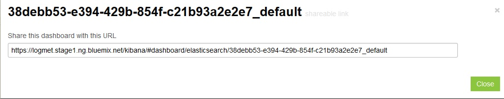

---

copyright:
  years: 2015, 2018

lastupdated: "2018-01-10"

---
{:new_window: target="_blank"}
{:shortdesc: .shortdesc}
{:screen:.screen}
{:codeblock:.codeblock}

# Kibana-Dashboard exportieren und gemeinsam nutzen
{: #exporting_sharing_kibana_dash}

Exportieren Sie Ihr Dashboard-Schema als eine JSON-Datei oder geben Sie eine URL zu angepassten Kibana-Dashboards mit den Protokolldaten frei. 
{:shortdesc}

Mit Kibana können Sie mit anderen Beteiligten zusammenarbeiten, indem Sie Ihre Dashboards als JSON-Datei exportieren oder URLs für Ihre Dashboards freigeben.

Führen Sie die folgenden Schritte aus, um ein Kibana-Dashboard als eine JSON-Datei zu exportieren:

1. Klicken Sie auf das **Speichersymbol**  und anschließend auf **Advanced** **>** **Export schema**.

    

2. Wählen Sie einen aussagekräftigen Namen für die JSON-Datei und klicken Sie dann auf **Save**. Jeder Benutzer, der über diese JSON-Datei verfügt, kann diese Datei in seinem Kibana-Dashbaord öffnen. 

Führen Sie die folgenden Schritte aus, um eine URL zu erstellen und für ein Kibana-Dashboard freizugeben:

1. Klicken Sie im Kibana-Dashboard auf das **Ordnersymbol** , um ein Menü anzuzeigen, in dem alle kürzlich verwendeten Dashboards aufgeführt sind. Neben den Dashboards, die mit Namen gespeichert wurden, enthält das Menü auch Dashboards ohne Namen im folgenden Format: *ALCH_TENANT-ID_Anwendungs-ID*. 

    

2. Klicken Sie für das Dashboard, das Sie zur gemeinsamen Nutzung freigeben möchten, auf das **Freigabesymbol** . Es wird eine gemeinsam nutzbare URL erstellt und angezeigt. 

    

    Kopieren Sie die URL, um Ihr Dashboard mit anderen Benutzern gemeinsam zu nutzen. Klicken Sie auf **Close**, um zum Dashboard zurückzukehren.
