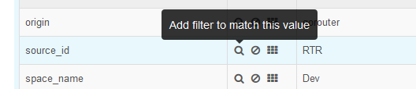
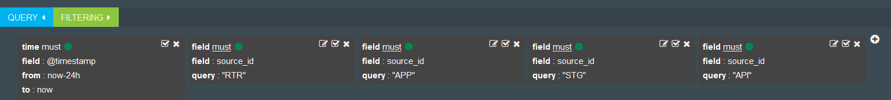

---

copyright:
  years: 2015, 2018

lastupdated: "2018-01-10"

---
{:new_window: target="_blank"}
{:shortdesc: .shortdesc}
{:screen:.screen}
{:codeblock:.codeblock}

# Protokolle der Cloud Foundry-App nach Protokolltyp in Kibana filtern
{: #logging_kibana_component_filter}

Zeigen Sie {{site.data.keyword.Bluemix_notm}}-Anwendungsprotokolle im Kibana-Dashboard an und filtern Sie sie nach Komponente (Protokolltyp). Sie können über die Registerkarte **Protokolle** für Ihre Cloud Foundry-App auf das Kibana-Dashboard zugreifen. 
{:shortdesc}

Führen Sie die folgenden Schritte aus, um die Cloud Foundry-Anwendungsprotokolle nach Protokolltyp im Kibana-Dashboard zu filtern:

1. Greifen Sie auf die Registerkarte **Protokolle** Ihrer Cloud Foundry-App zu. 

    1. Klicken Sie im **Apps**-Dashboard von {{site.data.keyword.Bluemix_notm}} auf den App-Namen.
    2. Klicken Sie auf die Registerkarte **Protokolle**. 
    
    Die Protokolle für Ihre App werden angezeigt.

2. Greifen Sie auf das Kibana-Dashboard für Ihre App zu. Klicken Sie auf **Erweiterte Ansicht** . Das Kibana-Dashboard wird angezeigt.

3. Klicken Sie im Fenster **ALL EVENTS** auf den Rechtspfeil, um alle Felder anzuzeigen. 

    

4. Wählen Sie im Fenster **Fields** die Option **source_id** aus, um die Komponente anzuzeigen, mit der die einzelnen Protokolleinträge im Fenster **ALL EVENTS** generiert wurden.

    

5. Klicken Sie im Fenster **ALL EVENTS** auf die Zeile mit dem Protokollereignis, um die Details zu diesem Ereignis anzuzeigen. Wählen Sie ein Ereignis aus, das die Quellen-ID anzeigt, die Sie filtern möchten.

    

6. Fügen Sie einen Filter hinzu, um Informationen zu einer Komponente (Protokolltyp) ein- oder auszuschließen. 

    * Um einen Filter hinzuzufügen, der einen Komponentenwert einschließt, klicken Sie in der Zeile 'source_id' der Tabelle auf das **Lupensymbol** . 

         

    * Um einen Filter hinzuzufügen, der einen Komponentenwert ausschließt, klicken Sie in der Zeile 'source_id' der Tabelle auf das **Ausschlusssymbol** . 
    
          
     
     Eine neue Filterbedingung wird zum Kibana-Dashboard hinzugefügt.

7. Optional können Sie den vorherigen Schritt wiederholen und Filter für jede Komponente hinzufügen. Die vollständige Liste der Komponenten finden Sie unter [Protokollformat](../logging_view_kibana3.html#kibana_log_format_cf).

    Die folgende Abbildung zeigt das Dashboard mit mehreren Filtern für verschiedene Komponenten:
    
    

8. Speichern Sie das Dashboard. 

    Wenn Sie mit dem Hinzufügen von Filtern und Anpassen des Dashboards fertig sind, klicken Sie auf das **Speichersymbol**  und geben Sie einen Namen für das Dashboard ein. 
      
    **Hinweis:** Wenn Sie versuchen, das Dashboard unter einem Namen mit Leerzeichen zu speichern, kann es nicht gespeichert werden. Geben Sie einen Namen ohne Leerzeichen ein und klicken Sie auf das Symbol für **Speichern**.
    
    

Sie haben ein Dashboard erstellt, mit dem Protokolleinträge nach Komponente (Protokolltyp) gefiltert werden können. Sie können das gespeicherte Dashboard jederzeit laden, indem Sie auf das **Ordnersymbol**  klicken und anhand des Namens das gewünschte Dashboard auswählen.

