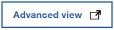
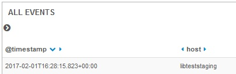
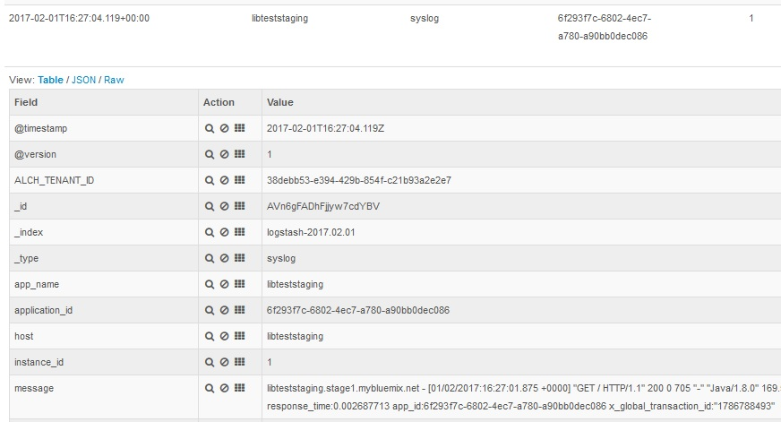
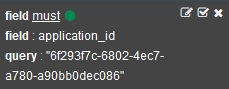

---

copyright:
  years: 2015, 2018

lastupdated: "2018-01-10"

---
{:new_window: target="_blank"}
{:shortdesc: .shortdesc}
{:screen:.screen}
{:codeblock:.codeblock}

# Protokolle der Cloud Foundry-App nach Instanz-ID in Kibana filtern
{: #logging_kibana_instance_id}

Sie können Protokolle für {{site.data.keyword.Bluemix_notm}}-Instanzen nach Instanz-ID (instance_id) der App im Kibana-Dashboard anzeigen und filtern. Sie können über die Registerkarte **Protokolle** für Ihre Cloud Foundry-App auf das Kibana-Dashboard zugreifen. 
{:shortdesc}

Führen Sie die folgenden Schritte aus, um die Cloud Foundry-Anwendungsprotokolle nach Instanz-ID im Kibana-Dashboard zu filtern:

1. Greifen Sie auf die Registerkarte **Protokolle** Ihrer Cloud Foundry-App zu. 

    1. Klicken Sie im **Apps**-Dashboard von {{site.data.keyword.Bluemix_notm}} auf den App-Namen.
    2. Klicken Sie auf die Registerkarte **Protokolle**. 
    
    Die Protokolle für Ihre App werden angezeigt.

2. Greifen Sie auf das Kibana-Dashboard für Ihre App zu. Klicken Sie auf **Erweiterte Ansicht** . Das Kibana-Dashboard wird angezeigt.

3. Klicken Sie im Kibana-Dashboard auf das Symbol **Go to saved default** , um alle Protokolle für einen Bereich anzuzeigen. Klicken Sie im Fenster **ALL EVENTS** auf den Rechtspfeil, um alle Felder anzuzeigen. 

    

4. Wählen Sie im Fenster **Fields** die Optionen **application_id** und **instance_id** aus, um die Felder für die Anwendungs-ID und die Instanz-ID im Fenster **ALL EVENTS** anzuzeigen.

    

5. Klicken Sie im Fenster **ALL EVENTS** auf die Zeile mit dem Protokollereignis, um die Details zu diesem Ereignis anzuzeigen. Wählen Sie ein Ereignis aus, das die Instanz-ID anzeigt, die Sie filtern möchten.

    

6. Fügen Sie einen Filter hinzu, um Informationen zu einer App-ID ein- oder auszuschließen. 

    * Um einen Filter hinzuzufügen, der Informationen zu einer bestimmten Anwendungs-ID einschließt, klicken Sie in der Zeile 'application_id' der Tabelle auf das **Lupensymbol** . 
    
           
    
    * Um einen Filter hinzuzufügen, der Informationen zu einer bestimmten Anwendungs-ID einschließt, klicken Sie in der Zeile 'application_id' der Tabelle auf das **Ausschlusssymbol** . 
    
           
    
    Eine neue Filterbedingung wird zum Kibana-Dashboard hinzugefügt.
 

7. Fügen Sie einen Filter hinzu, um Informationen zu einer Instanz-ID ein- oder auszuschließen. 

    * Um einen Filter hinzuzufügen, der Informationen zu einer bestimmten Instanz-ID einschließt, klicken Sie in der Zeile 'instance_id' der Tabelle auf das **Lupensymbol** . 

    

     * Um einen Filter hinzuzufügen, der Informationen zu einer bestimmten Instanz-ID einschließt, klicken Sie in der Zeile 'instance_id' der Tabelle auf das **Ausschlusssymbol** . 
    
           
    
    Eine neue Filterbedingung wird zum Kibana-Dashboard hinzugefügt.

9. Speichern Sie das Dashboard. Wenn Sie mit dem Erstellen des Filters fertig sind, klicken Sie auf das **Speichersymbol**  und geben Sie einen Namen für das Dashboard ein. 

    **Hinweis:** Wenn Sie versuchen, das Dashboard unter einem Namen mit Leerzeichen zu speichern, kann es nicht gespeichert werden. Geben Sie einen Namen ohne Leerzeichen ein und klicken Sie auf das Symbol für **Speichern**.

    .

Sie haben ein Dashboard erstellt, mit dem Protokolleinträge nach Instanz-ID gefiltert werden können. Sie können das gespeicherte Dashboard jederzeit laden, indem Sie auf das **Ordnersymbol**  klicken und anhand des Namens das gewünschte Dashboard auswählen. 
