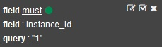

---

copyright:
  years: 2015, 2018

lastupdated: "2018-01-10"

---
{:new_window: target="_blank"}
{:shortdesc: .shortdesc}
{:screen:.screen}
{:codeblock:.codeblock}

# Protokolle der Cloud Foundry-App nach bekannter Anwendungs-ID in Kibana filtern
{: #logging_kibana_known_application_id}

Wenn Sie die Anwendungs-ID Ihrer Cloud Foundry-App kennen, können Sie die Protokolle schnell anhand dieser ID (application_id) im Kibana-Dashboard anzeigen und filtern. Sie können über die Registerkarte **Protokolle** für Ihre Cloud Foundry-App auf das Kibana-Dashboard zugreifen. 
{:shortdesc}

Führen Sie die folgenden Schritte aus, um die Cloud Foundry-Anwendungsprotokolle nach einer bekannter Anwendungs-ID im Kibana-Dashboard anzuzeigen und zu filtern:

1. Greifen Sie auf die Registerkarte **Protokolle** Ihrer Cloud Foundry-App zu. 

    1. Klicken Sie im **Apps**-Dashboard von {{site.data.keyword.Bluemix_notm}} auf den App-Namen.
    2. Klicken Sie auf die Registerkarte **Protokolle**. 
    
    Die Protokolle für Ihre App werden angezeigt.

2. Greifen Sie auf das Kibana-Dashboard für Ihre App zu. Klicken Sie auf **Erweiterte Ansicht** . Das Kibana-Dashboard wird angezeigt.

3. Klicken Sie im Kibana-Dashboard auf das **Ordnersymbol** , um ein Menü anzuzeigen, in dem alle kürzlich verwendeten Dashboards aufgeführt sind. 

    **Hinweis:** Neben den Dashboards, die mit Namen gespeichert wurden, enthält das Menü auch Dashboards ohne Namen im folgenden Format: *ALCH_TENANT-ID_Anwendungs-ID*. 

    

4. Wählen Sie das Dashboard mit dem Namen aus, der Ihre bekannte Anwendungs-ID enthält. 

    Das Dashboard wird geladen und enthält anhand Ihrer Anwendungs-ID gefilterte Informationen.

5. Optional können Sie weitere Felder, beispielsweise **instance_id**, zum Filterbereich hinzufügen, um das Filtern von Datensätzen nach Instanz-ID zu aktivieren oder zu inaktivieren. 
  
    1. Klicken Sie im Fenster **ALL EVENTS** auf die Zeile mit dem Protokollereignis, um die Details zu diesem Ereignis anzuzeigen. 
	
        
	
    2. Wählen Sie ein Ereignis aus, das den Feldwert anzeigt, den Sie filtern möchten.
	
    3. Fügen Sie einen Filter hinzu.
    
        Um einen Filter hinzuzufügen, der Informationen zu diesem bestimmten Feldwert einschließt, klicken Sie in der Zeile der Tabelle, die das zu filternde Feld enthält, auf das **Lupensymbol** . 
	
        Um einen Filter hinzuzufügen, der Informationen zu diesem bestimmten Feldwert ausschließt, klicken Sie in der Zeile der Tabelle, die das zu filternde Feld enthält, auf das **Ausschlusssymbol** .  

        Eine neue Filterbedingung wird zum Kibana-Dashboard hinzugefügt.
	
	    
	
6. Speichern Sie dieses Dashboard unter einem Namen mit Wiedererkennungswert. 

    Klicken Sie auf das **Speichersymbol**  und geben Sie einen Namen für das Dashboard ein. 

    **Hinweis:** Wenn Sie versuchen, das Dashboard unter einem Namen mit Leerzeichen zu speichern, kann es nicht gespeichert werden. Geben Sie einen Namen ohne Leerzeichen ein und klicken Sie auf das Symbol für **Speichern**.

    .

Sie haben ein Dashboard erstellt, mit dem Protokolleinträge nach Anwendungs-ID und Instanz-ID gefiltert werden können. Sie können das gespeicherte Dashboard jederzeit laden, indem Sie auf das **Ordnersymbol**  klicken und anhand des Namens das gewünschte Dashboard auswählen.
