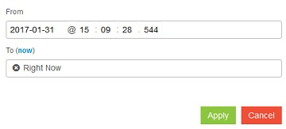

---

copyright:
  years: 2015, 2018

lastupdated: "2018-01-10"

---

{:new_window: target="_blank"}
{:shortdesc: .shortdesc}
{:screen:.screen}
{:codeblock:.codeblock}

# Protokolle der Cloud Foundry-App nach Zeit in Kibana filtern
{: #logging_kibana_time_filter}

Zeigen Sie {{site.data.keyword.Bluemix_notm}}-Anwendungsprotokolle im Kibana-Dashboard an und filtern Sie sie nach Zeit. Sie können über die Registerkarte **Protokolle** für Ihre Cloud Foundry-App auf das Kibana-Dashboard zugreifen. 
{:shortdesc}

Führen Sie die folgenden Schritte aus, um die Cloud Foundry-Anwendungsprotokolle nach Zeit im Kiban-Dashboard zu filtern:

1. Greifen Sie auf die Registerkarte **Protokolle** Ihrer Cloud Foundry-App zu. 

    1. Klicken Sie im **Apps**-Dashboard von {{site.data.keyword.Bluemix_notm}} auf den App-Namen.
    2. Klicken Sie auf die Registerkarte **Protokolle**. 
    
    Die Protokolle für Ihre App werden angezeigt.

2. Greifen Sie auf das Kibana-Dashboard für Ihre App zu. Klicken Sie auf **Erweiterte Ansicht** . Das Kibana-Dashboard wird angezeigt.

3. Klicken Sie im Kibana-Dashboard auf den **Zeitfilter**  und wählen Sie dann **Custom** aus dem Dropdown-Menü aus. Das folgende Fenster wird angezeigt:

    

4. Klicken Sie auf die Felder **From** und **To**, um die Anfangs- und die Endzeit für den Filter zu bearbeiten. 
    
    Um Protokolle bis zum aktuellen Zeitpunkt einzuschließen, klicken Sie auf den Link **now**. 
    Wenn Sie mit dem Zeitraum zufrieden sind, klicken Sie auf **Apply**. 

Im Kibana-Dashboard werden nun protokollierte Ereignisse für Ihren angepassten Zeitfilter angezeigt.
