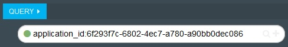
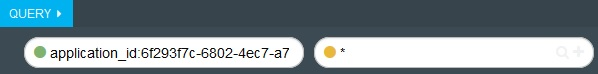
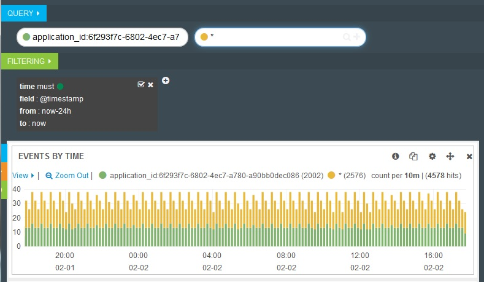
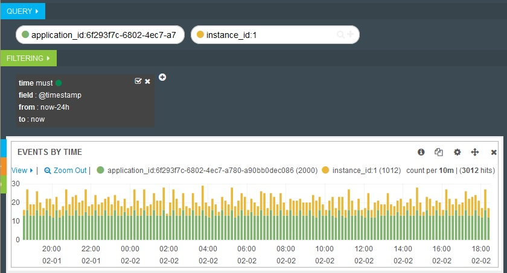

---

copyright:
  years: 2015, 2018

lastupdated: "2018-01-10"

---
{:new_window: target="_blank"}
{:shortdesc: .shortdesc}
{:screen:.screen}
{:codeblock:.codeblock}

# Protokolle der Cloud Foundry-App mit Abfragen in Kibana filtern
{: #logging_kibana_query}

Mit Kibana können Sie Abfragen erstellen, mit denen Sie Ihre Protokolle nach Schlüsselbegriffen durchsuchen und anhand dieser Begriffe filtern können. Mit Kibana können Sie außerdem Abfragen in visueller Form im Dashboard miteinander vergleichen. Sie können über die Registerkarte **Protokolle** für Ihre Cloud Foundry-App auf das Kibana-Dashboard zugreifen. 
{:shortdesc}

Führen Sie die folgenden Schritte aus, um im Kibana-Dashboard eine Abfrage für die Protokolle Ihrer Cloud Foundry-App erstellen zu können:

1. Greifen Sie auf die Registerkarte **Protokolle** Ihrer Cloud Foundry-App zu. 

    1. Klicken Sie im **Apps**-Dashboard von {{site.data.keyword.Bluemix_notm}} auf den App-Namen.
    2. Klicken Sie auf die Registerkarte **Protokolle**. 
    
    Die Protokolle für Ihre App werden angezeigt.

2. Greifen Sie auf das Kibana-Dashboard für Ihre App zu. Klicken Sie auf **Erweiterte Ansicht** . Das Kibana-Dashboard wird angezeigt.

3. Klicken Sie im Kibana-Dashboard auf **QUERY** , um das Feld anzuzeigen. Wenn Sie auf Kibana zugreifen, um die App-Protokolle von der Registerkarte **Protokolle** Ihrer App anzuzeigen, wird eine Abfrage erstellt, um alle Protokolle für die Anwendungs-ID (application_id) Ihrer App anzuzeigen.
	
    Um die Abfrage zu bearbeiten, klicken Sie auf das Feld **QUERY** und geben Sie einen Suchbegriff ein.

    * Um nach einem Schlüsselwort bzw. einem Teil eines Schlüsselworts zu suchen, geben Sie ein Wort ein, gefolgt von einem Platzhaltersymbol \*; Beispiel: `Java*`. 
	* Um nach einem bestimmten Ausdruck zu suchen, geben Sie den Ausdruck in doppelten Anführungszeichen ein; Beispiel: `"Java/1.8.0"`.
	* Um komplexere Suchen zu erstellen, können Sie die logischen Operatoren AND und OR verwenden; `"Java/1.8.0" OR "Java/1.7.0"`.
	* Um in einem bestimmten Feld nach einem Wert zu suchen, geben Sie Ihre Suche in folgendem Format ein: *Protokollfeldname:Suchbegriff*; z. B. `instance_id:1`.
	* Um nach einem Wertebereich für ein bestimmtes Protokollfeld zu suchen, geben Sie Ihre Suche in folgendem Format ein: *Protokollfeldname:[Anfang_des_Bereichs TO Ende_des_Bereichs]*; z. B. `instance_id:[1 TO 2]`.

4. Wenn Sie die Ergebnisse von zwei einzelnen Abfragen miteinander vergleichen möchten, können Sie im Dashboard einen weiteren Abfragebegriff hinzufügen. Um eine weitere Abfrage hinzuzufügen, klicken Sie am Ende des Feldes **QUERY** auf das Pluszeichen (**+**).

    
	
    Es wird eine neues Feld **QUERY** angezeigt, das das Platzhalterzeichen \* enthält. Diese Abfrage gibt an, dass alle Einträge eingeschlossen werden sollen.
	
    
	
    Ihr Dashboard wird mit den Ergebnissen der neuen Abfrage aktualisiert. Im Fenster **EVENTS BY TIME** werden eine grafische Darstellung für beide Abfragen sowie die Anzahl der Begriffe für jede Abfrage in Klammern angezeigt. 
	
    
	
5. Klicken Sie auf das neue Feld **QUERY**, um dessen Inhalt zu bearbeiten und eine Abfragebedingung, beispielsweise `instance_id:1`, hinzuzufügen. Im Fenster **EVENTS BY TIME** können Sie die Ergebnisse der Abfragen miteinander vergleichen.

    

6. Um eine Abfrage zu löschen, bewegen Sie den Mauscursor über das Feld **QUERY**, das Sie löschen möchten, um das Symbol **delete** anzuzeigen. Klicken Sie auf das Symbol **delete**.

    

7. Um das Dashboard mit einem Namen mit Wiedererkennungswert zu speichern, klicken Sie auf das **Speichersymbol**  und geben Sie einen Namen für das Dashboard ein. 

    **Hinweis:** Wenn Sie versuchen, das Dashboard unter einem Namen mit Leerzeichen zu speichern, kann es nicht gespeichert werden. Geben Sie einen Namen ohne Leerzeichen ein und klicken Sie auf das Symbol für **Speichern**.

    

