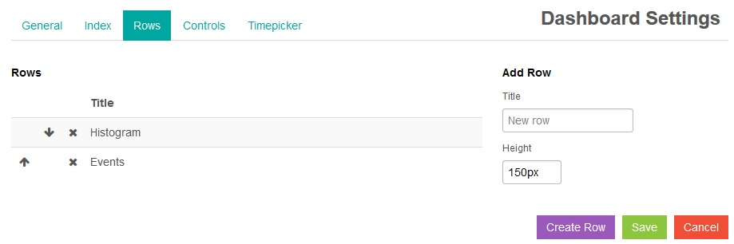
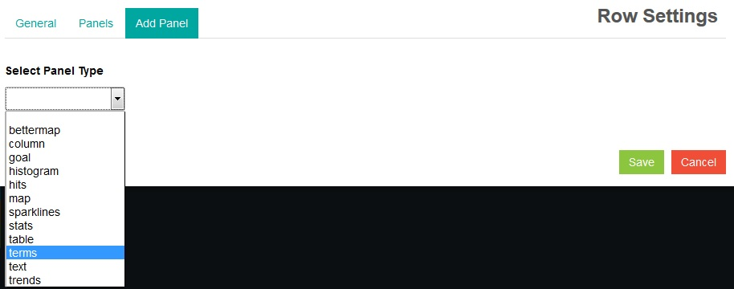

---

copyright:
  years: 2015, 2018

lastupdated: "2018-01-10"

---
{:new_window: target="_blank"}
{:shortdesc: .shortdesc}
{:screen:.screen}
{:codeblock:.codeblock}

# Tabellen und Diagramme aus Abfragen in Kibana erstellen
{: #logging_kibana_tables_graphs}

Mit Kibana können Sie Diagramme und Tabellen für Abfragen erstellen, um Protokolldaten zu visualisieren und Ergebnisse zu vergleichen. Sie können über die Registerkarte **Protokolle** für Ihre Cloud Foundry-App auf das Kibana-Dashboard zugreifen. 
{:shortdesc}

Das Kibana-Dashboard setzt sich aus einer Reihe von Zeilen zusammen, wobei jede Zeile mindestens einen Fensterbereich aufweist. Sie können Fensterbereiche so konfigurieren, dass sie grafische Darstellungen Ihrer Daten enthalten. Anhand von Abfragen können Sie festlegen, welche Daten angezeigt werden sollen. Zum Erstellen eines Diagramms oder einer Tabelle müssen Sie zuerst eine leere Zeile und anschließend einen Fensterbereich erstellen. Wenn Sie über die Registerkarte **Protokolle** Ihrer CF-App auf das Kibana-Dashboard zugreifen, werden im Dashboard automatisch zwei Fensterbereiche angezeigt: ein Histogramm und eine Tabelle.

Führen Sie die folgenden Schritte aus, um im Kibana-Dashboard ein Diagramm oder eine Tabelle hinzuzufügen:

1. Um auf die Registerkarte **Protokolle** der Cloud Foundry-App zuzugreifen, klicken Sie in der Tabelle **Cloud Foundry-Apps** des **Apps**-Dashboards in {{site.data.keyword.Bluemix_notm}} auf den Namen der App und anschließend auf die Registerkarte **Protokolle**. Die Protokolle für Ihre App werden angezeigt.

2. Um auf die Kibana-Dashboardanzeige für Ihre App zuzugreifen, klicken Sie auf **Erweiterte Ansicht** . Das Kibana-Dashboard wird angezeigt.

3. Blättern Sie im Kibana-Dashboard nach unten und klicken Sie auf **ADD A ROW** , um eine Zeile für den Fensterbereich zu erstellen, der hinzugefügt werden soll. Das Fenster für die Dashboardeinstellungen wird angezeigt. 
	
	
	
	Geben Sie im Bereich zum Hinzufügen einer Zeile den Namen der Zeile im Feld **Title** ein und klicken Sie dann auf **Create Row**. Es wird eine neue Zeile hinzugefügt. Sie können die Reihenfolge der Zeilen anpassen, indem Sie neben den Zeilentiteln auf den **Aufwärtspfeil** oder **Abwärtspfeil** klicken. Wenn Sie die Reihenfolge der Zeilen festgelegt haben, klicken Sie auf **Save**. Im Kibana-Dashboard wird eine leere Zeile erstellt.

4. Fügen Sie einen Fensterbereich hinzu, indem Sie auf **Add panel to empty row** klicken. Das Fenster für die Zeileneinstellungen wird angezeigt.

    
	
	Aus der Dropdown-Liste **Select Panel Type** können Sie auch einen anderen Fensterbereichstyp auswählen, z. B. **table**, **histogram** oder **terms**. Wählen Sie **terms** aus, um basierend auf Ihren Abfragen ein Balkendiagramm, ein Kreisdiagramm oder eine Tabelle zu erstellen. Im Fenster mit den Zeileneinstellungen werden eine Reihe von Konfigurationsoptionen angezeigt.
	
	
	
	Konfigurieren Sie den Fensterbereich. Geben Sie einen **Titel** für die grafische Anzeige ein. Wählen Sie die **Spanne** Ihres Fensterbereichs aus der Dropdown-Liste aus; die **Spanne** legt die Breite des Fensterbereichs innerhalb des Dashboards an. Löschen Sie im Abschnitt mit den Parametern den Inhalt von **Field** und geben Sie ein gültiges Protokollfeld, wie `instance_id`, ein. 

5. Wählen Sie im Abschnitt mit den Anzeigeoptionen **bar**, **pie** oder **table** aus der Dropdown-Liste **Style** aus, um ein Balkendiagramm, ein Kreisdiagramm oder eine Tabelle auszuwählen. Wählen Sie im Abschnitt mit den Abfragen die Option **selected** aus der Dropdown-Liste **Queries** aus, um die Protokolldaten aus den Dashboardabfragen zu verwenden. Klicken Sie abschließend auf **Save**. Der neue Fensterbereich wird im Dashboard angezeigt.

	
	
6. Um diesen Fensterbereich so zu ändern, dass eine Tabelle angezeigt wird, klicken Sie auf das Symbol **Configure** . Das Fenster mit den Bedingungseinstellungen wird angezeigt. 

	
	
	Klicken Sie auf die Registerkarte **Panel** und wählen Sie dann **table** aus der Dropdown-Liste **Style** aus. Klicken Sie auf **Save**, um den Fensterbereich zu aktualisieren und zum Dashboard zurückzukehren.

7. Fügen Sie weitere Zeilen und Fensterbereiche zu Ihrem Dashboard hinzu. Wenn Sie damit fertig sind, speichern Sie die Änderungen an diesem Dashboard, indem Sie auf das Symbol für **Speichern** klicken.

    **Hinweis:** Wenn Sie versuchen, das Dashboard unter einem Namen mit Leerzeichen zu speichern, kann es nicht gespeichert werden. Geben Sie einen Namen ohne Leerzeichen ein und klicken Sie auf das Symbol für **Speichern**.

    .

