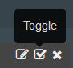

---

copyright:
  years: 2015, 2018

lastupdated: "2018-01-10"

---

{:shortdesc: .shortdesc}
{:new_window: target="_blank"}
{:codeblock: .codeblock}
{:screen: .screen}

# Protokolle in Kibana 3 analysieren (veraltet)
{: #analyzing_logs_Kibana3}

In {{site.data.keyword.Bluemix}} können Sie Kibana, eine quelloffene Analyse- und Visualisierungsplattform, dazu verwenden, Ihre Daten mit verschiedenen Darstellungsarten (Diagramme, Tabellen usw.) zu überwachen, zu durchsuchen, zu analysieren und zu visualisieren. Verwenden Sie Kibana für erweiterte Analysetasks.
{:shortdesc}

## Daten in einem Kibana-Dashboard filtern
{: #filter_data_kibana_dashboard}

In {{site.data.keyword.Bluemix}} können Sie Daten im Kibana-Standarddashboard analysieren, das je Ressource oder {{site.data.keyword.Bluemix}}-Bereich bereitgestellt wird. Standardmäßig werden in diesen Dashboards alle Daten aus den letzten 24 Stunden angezeigt. Sie können jedoch auch die Informationen einschränken, die in einem Dashboard angezeigt werden. Sie können Abfragen und Filter zu einem Standarddashboard hinzufügen und diese dann für eine zukünftige Wiederverwendung speichern.

In einem Dashboard können Sie mehrere Abfragen und Filter hinzufügen. Eine Abfrage definiert eine Untergruppe von Protokolleinträgen.  Ein Filter verfeinert die Datenauswahl durch Ein- oder Ausschließen von Informationen. 

Für Cloud Foundry-Apps enthält die folgende Liste Beispiele zum Filtern von Daten:
* Wenn Sie in Ihren Protokollen nach Informationen suchen, die Schlüsselbegriffe enthalten, können Sie Abfragen erstellen, mit denen Sie anhand dieser Begriffe Filtervorgänge durchführen können. Mit Kibana können Sie Abfragen in visueller Form im Dashboard miteinander vergleichen. Weitere Informationen finden Sie unter [Protokolle der Cloud Foundry-App mit Abfragen in Kibana filtern](kibana3/logging_kibana_query.html#logging_kibana_query).

* Wenn Sie Informationen aus einem bestimmten Zeitraum benötigen, können Sie Daten in einem Zeitraum filtern. Weitere Informationen finden Sie unter [Protokolle der Cloud Foundry-App nach Zeit in Kibana filtern](kibana3/logging_kibana_filter_by_time_period.html#logging_kibana_time_filter).

* Wenn Sie Informationen für eine bestimmte Instanz-ID benötigen, können Sie Daten nach Instanz-ID filtern. Weitere Informationen finden Sie unter [Protokolle der Cloud Foundry-App nach Instanz-ID in Kibana filtern](kibana3/logging_kibana_filter_by_instance_id.html#logging_kibana_instance_id) und [Protokolle der Cloud Foundry-App nach bekannter Anwendungs-ID in Kibana filtern](kibana3/logging_kibana_filter_by_known_application_id.html#logging_kibana_known_application_id).

* Wenn Sie Informationen für eine bestimmte Komponente benötigen, können Sie Daten nach Komponente (Protokolltyp) filtern. Weitere Informationen finden Sie unter [Protokolle der Cloud Foundry-App nach Protokolltyp in Kibana filtern](kibana3/logging_kibana_filter_by_component.html#logging_kibana_component_filter).

* Wenn Sie nach allgemeinen Informationen, wie Fehlernachrichten, suchen, können Sie Daten nach Nachrichtentyp filtern. Weitere Informationen finden Sie unter [Protokolle der Cloud Foundry-App nach Nachrichtentyp in Kibana filtern](kibana3/logging_kibana_filter_by_message_type.html#logging_kibana_message_type_filter).

## Kibana-Dashboard anpassen
{: #customize_kibana_dashboard}

Es gibt verschiedene Typen von Dashboards, die Sie zum Visualisieren und Analysieren der Daten anpassen können:
* Dashboard für einzelne CF-App: Dieses Dashboard zeigt Informationen zu einer einzelnen Cloud Foundry-Anwendung an.  
* Dashboard für mehrere CF-Apps: Dieses Dashboard zeigt Informationen zu allen Cloud Foundry-Anwendungen an, die in demselben {{site.data.keyword.Bluemix}}-Bereich bereitgestellt werden. 

Wenn Sie ein Dashboard anpassen, können Sie Abfragen und Filter konfigurieren, um eine Untergruppe der Protokolldaten auszuwählen und über das Dashboard anzuzeigen.

Zum Visualisieren von Daten können Sie Fensterbereiche konfigurieren. Kibana enthält verschiedene Fensterbereiche, wie zum Beispiel Tabellen, Trends und Histogramme, die Sie zur Analyse der Informationen verwenden können. Sie können Fensterbereiche im Dashboard hinzufügen, entfernen und neu anordnen. Der Zweck jedes Fensterbereichs variiert. Einige Fensterbereiche zeigen zeilenweise die Ergebnisse einer oder mehrerer Abfragen. Andere Fensterbereiche enthalten Dokumente oder angepasste Informationen. Sie können beispielsweise ein Balkendiagramm, ein Kreisdiagramm oder eine Tabelle konfigurieren, um die Daten zu visualisieren und zu analysieren.  

## Kibana-Dashboard speichern
{: #save_Kibana_dashboard}

Führen Sie die folgenden Schritte aus, um ein Kibana-Dashboard zu speichern, nachdem Sie es angepasst haben:

1. Klicken Sie in der Symbolleiste auf das Symbol für **Speichern**.

2. Geben Sie einen Namen für das Dashboard ein.

    **Hinweis:** Wenn Sie versuchen, das Dashboard unter einem Namen mit Leerzeichen zu speichern, kann es nicht gespeichert werden.

3. Klicken Sie neben dem Namensfeld auf das Symbol für **Speichern**.

## Protokolle über ein Kibana-Dashboard analysieren
{: #analyze_kibana_logs}

Nach der Anpassung eines Kibana-Dashboards können Sie die Daten über die entsprechenden Fensterbereiche visualisieren und analysieren. 

Um nach Informationen zu suchen, können Sie Abfragen fixieren oder freigeben. 

* Wenn Sie eine Abfrage für das Dashboard fixieren, wird die Suche automatisch aktiviert.
* Um Inhalte aus dem Dashboard zu entfernen, können Sie die Abfrage inaktivieren.

Um Informationen zu filtern, können Sie Filter aktivieren oder inaktivieren. 

* Sie können das Kontrollkästchen zum Umschalten (**Toggle**)  in einem Filter aktivieren, um den Filter zu aktivieren.   
* Sie können das Kontrollkästchen zum Umschalten (**Toggle**)  in einem Filter abwählen, um den Filter zu inaktivieren. 

Die Daten werden in den Grafiken und Diagrammen des Dashboards angezeigt. Sie können die Grafiken und Diagramme in Ihrem Dashboard zur Überwachung der Daten verwenden. 

Bei einem Dashboard für eine einzelne CF-App enthält das Dashboard beispielsweise Informationen zu einer Cloud Foundry-Anwendung. Die Daten, die visualisiert und analysiert werden können, sind auf diese App beschränkt. Sie können über das Dashboard Daten für alle Instanzen der App analysieren. Außerdem können Sie Instanzen vergleichen. Dabei können die Informationen nach Instanz-ID gefiltert werden. 

Sie können eine Abfrage für jede Instanz-ID im Dashboard fixieren. 

Sie können dann je nach den Instanzinformationen, die im Dashboard angezeigt werden sollen, einzelne Anfragen aktivieren oder inaktivieren. 

Die folgende Abbildung zeigt eine Abfrage, die aktiviert ist, und eine zweite, die inaktiviert ist:

Wenn Sie zwei Instanzen in einem Histogramm vergleichen möchten, können Sie zwei Abfragen im selben Dashboard (eines für jede Instanz-ID) definieren. Mit einem Aliasnamen und einer eindeutigen Farbe können Sie die Abfrage leicht kennzeichnen. In Kibana können mehrere Abfrage verarbeitet werden, indem diese mit dem logischen Oder-Zeichen miteinander verknüpft werden. 

Die folgende Abbildung zeigt den Fensterbereich, in dem ein Aliasname und eine Farbe für eine Abfrage konfiguriert und diese Abfrage für das Dashboard fixiert und inaktiviert werden kann:

