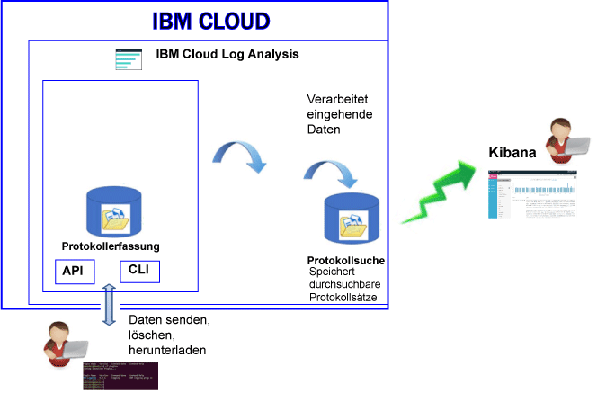

---

copyright:
  years: 2017

lastupdated: "2017-07-19"

---

{:shortdesc: .shortdesc}
{:new_window: target="_blank"}
{:codeblock: .codeblock}
{:screen: .screen}
{:pre: .pre}

# Produktinformation
{: #log_analysis_ov}

Verwenden Sie den {{site.data.keyword.loganalysisfull}}-Service, um die Funktionen für die Protokollerfassung (Log Collection), Protokollaufbewahrung (Log Retention) und die Suche in Protokollen (Log Search) in {{site.data.keyword.Bluemix}} zu erweitern. Unterstützen Sie Ihr DevOps-Team mit folgender Funktionalität: Zusammenfassung von Anwendungs- und Umgebungsprotokollen zur Konsolidierung der Anwendungs- und Umgebungsinformationen, Verschlüsselung von Protokollen, Aufbewahrung von Protokolldaten, solange dies erforderlich ist, sowie schnelle Erkennung und Behebung von Problemen. Verwenden Sie Kibana für erweiterte Analysetasks.
{:shortdesc}

{{site.data.keyword.Bluemix_notm}}-Protokollierungsfunktionen sind in die Plattform integriert:

* Die Datenerfassung wird automatisch für Cloudressourcen aktiviert. {{site.data.keyword.Bluemix_notm}} ermöglicht die Erfassung und Anzeige von Protokollen für Ihre Apps sowie für die App-Laufzeitumgebungen und Rechenlaufzeitumgebungen, in denen diese Apps ausgeführt werden. 
* Sie können bis zu 500 MB Protokolldaten pro Tag zu durchsuchen. 
* Die Protokolle für die letzten drei Tage werden in 'Log Search' gespeichert, einer Komponente des {{site.data.keyword.loganalysisshort}}-Service.

Sie können die Protokollfunktionen in {{site.data.keyword.Bluemix_notm}} verwenden, um Informationen über das Verhalten der Cloudplattform und der in ihr ausgeführten Ressourcen zu gewinnen. Es ist keine spezielle Instrumentierung für die Erfassung der STDOUT- und STDERR-Protokolle erforderlich. Beispielsweise können Sie Protokolle verwenden, um Prüfaufzeichnungen (Audit Trail) für eine Anwendung zu erstellen, um Probleme in Ihrem Service zu erkennen, um Sicherheitslücken zu bestimmen, Fehler in den bereitgestellten Apps und im Laufzeitverhalten zu beheben, um Probleme in der Infrastruktur, in der Ihre App ausgeführt wird, zu erkennen, um einen komponentenübergreifenden Trace in der Cloudplattform durchzuführen und um Muster zu erkennen, anhand derer Sie Situationen entgegenwirken können, die Ihr Service-SLA beeinträchtigen könnten.

Die folgende Abbildung zeigt eine Übersicht über die Servicekomponenten von {{site.data.keyword.loganalysisshort}}: 

Zum Erfassen und Durchsuchen von Protokollen für Cloudressourcen müssen Sie eine Instanz des {{site.data.keyword.loganalysisshort}}-Service in demselben {{site.data.keyword.Bluemix_notm}}-Bereich einrichten, in dem diese Cloudressourcen ausgeführt werden.

Protokolle werden standardmäßig in 'Log Search' erfasst und gespeichert. Wenn Sie einen Serviceplan auswählen, der erweiterte Such- und Erfassungsfunktionen enthält, werden die Protokolle auch in 'Log Collection' erfasst und gespeichert. Die in 'Log Collection' gespeicherten Protokolldaten werden verschlüsselt.

Die Größe der Protokolle, die Sie in 'Log Collection' erfassen und speichern können, richtet sich nach dem von Ihnen gewählten Serviceplan. Der Preis für die Datenspeicherung richtet sich nach der Menge der gespeicherten Daten (GB pro Monat). Protokolle werden in 'Log Collection' im JSON-Format gespeichert. 

Sie können Kibana 5.1 für erweiterte Tasks zur Log Search-Analyse verwenden:

* Jeder Plan begrenzt die Protokollgröße, die Sie pro Tag durchsuchen können. 
* Es werden nur die Daten der letzten drei Tage durchsucht.

Für den Zugriff auf Protokolle, die älter als drei Tage sind, können Sie die Befehlszeilenschnittstelle oder API von 'Log Collection' verwenden, um Protokolle lokal herunterladen, oder Sie können Protokolle an andere Anwendungen oder an Cloud-Services anderer Anbieter umleiten. 

Sie können Protokolle automatisch durch Festlegen einer Aufbewahrungsrichtlinie oder manuell über die Befehlszeilenschnittstelle von {{site.data.keyword.loganalysisshort}} löschen.

## Zweck des Protokollierungsservice
{: #value}

1. **Investieren Sie weniger Zeit in die Instrumentierung Ihrer Anwendung - konzentrieren Sie sich stattdessen darauf, den Nutzen Ihrer Anwendung zu steigern.**

    {{site.data.keyword.loganalysislong_notm}} erfasst automatisch Daten aus ausgewählten {{site.data.keyword.IBM_notm}}-Cloud-Services - es ist keine Instrumentierung erforderlich.
	
	Sie können die Anzahl der Protokolle festlegen, die Sie pro Tag durchsuchen können. Zum Durchsuchen von Protokollen bestehend aus 500 MB, 2 GB, 5 GB und 10 GB pro Tag stehen unterschiedliche Pläne zur Verfügung. 

2. **Halten Sie die Protokolldaten in der Nähe Ihrer Anwendungen und schützen Sie sie durch wirtschaftliche cloudbasierte Speicherlösungen.**

    Sie können Protokolldaten aus traditionellen und Mikroservice-gesteuerten Anwendungen erfassen und speichern, die in der {{site.data.keyword.IBM_notm}} Cloud in einem zentralen Protokoll ausgeführt werden. Die Protokolldaten können so lange aufbewahrt werden, wie dies erforderlich ist.
	
	Die Protokolle werden im {{site.data.keyword.IBM_notm}} Cloudspeicher gespeichert. Sie können die Protokolle bei Bedarf herunterladen. 

3. **Machen Sie sich mit Ihrer Umgebung vertraut, um Probleme schnell erkennen, diagnostizieren und identifizieren zu können.**

    Sie können konfigurierbare Dashboards verwenden, um Ihre Daten zu visualisieren, zu analysieren und mit ihnen zu interagieren. Protokollsuchfunktionen auf der Basis der Elastic Stack-Plattform bieten die Vorteile der Flexibilität und Vertrautheit von Kibana und damit die Möglichkeit, in kürzester Zeit ein Dashboard entsprechend den Anwendungsanforderungen zu erstellen.

4. **Leistungsfähige Integration mit APIs**

    Über die APIs des Service können Sie die Protokolldaten in Ihre Anwendungen und Operationen integrieren. Verwenden Sie die APIs des {{site.data.keyword.loganalysisshort}}-Service zum Verwalten der aufbewahrten Protokolle und zum Senden von Protokolldaten von außerhalb der {{site.data.keyword.IBM_notm}} Cloud. 

	
## Protokolle erfassen
{: #log_collection}

Standardmäßig speichert {{site.data.keyword.Bluemix_notm}} Protokolldaten für bis zu drei Tage in 'Log Search'.   

* Maximal werden 500 MB pro Datenbereich und Tag gespeichert. Alle Protokolle oberhalb der Kapazitätsgrenze von 500 MB werden nicht berücksichtigt. Die Kapazitätsgrenze wird täglich um 12:30 AM (UTC) zurückgesetzt.
* Bis zu 1,5 GB Daten können für einen Zeitraum von maximal 3 Tagen durchsucht werden. Das Rollover der Protokolldaten (First In, First Out) erfolgt bei 1,5 GB an Daten oder nach drei Tagen.

Der {{site.data.keyword.loganalysisshort}}-Service bietet zusätzliche Pläne, mit denen Sie Protokolle so lange wie erforderlich in 'Log Collection' speichern können. Weitere Informationen zu jedem einzelnen Plan finden Sie unter [Servicepläne](/docs/services/CloudLogAnalysis/log_analysis_ov.html#plans). 

## Protokolle löschen
{: #log_deletion}

Protokolle, die in 'Log Search' gespeichert sind, werden nach drei Tagen gelöscht.

Protokolle, die in 'Log Collection' gespeichert sind, werden automatisch nach 30 Tagen gelöscht, es sei denn, Sie konfigurieren eine Aufbewahrungsrichtlinie. 

* Sie können eine Protokollaufbewahrungsrichtlinie konfigurieren, die die Anzahl Tage definiert, für die Protokolle in 'Log Collection' aufbewahrt werden. Weitere Informationen finden Sie unter [Protokollaufbewahrungsrichtlinie](/docs/services/CloudLogAnalysis/log_analysis_ov.html#policies).

* Sie können die Richtlinie inaktivieren, indem Sie ihren Wert auf *-1* einstellen. 

Sie können die API und die Befehlszeilenschnittstelle von 'Log Collection' verwenden, um Protokolle manuell aus 'Log Collection' zu löschen. Weitere Informationen zum manuellen Löschen von Protokollen über die Befehlszeilenschnittstelle finden Sie unter [cf logging delete](/docs/services/CloudLogAnalysis/reference/logging_cli.html#delete).

## Protokolle einpflegen
{: #log_ingestion}

Alle {{site.data.keyword.loganalysisshort}}-Servicepläne - mit Ausnahme des *Lite*-Plans - beinhalten die Möglichkeit, Protokolle von außerhalb der {{site.data.keyword.IBM_notm}} Cloud an 'Log Collection' zu senden. Weitere Informationen zu den Plänen finden Sie unter [Servicepläne](/docs/services/CloudLogAnalysis/log_analysis_ov.html#plans).

Sie können Protokolle über den Multi-Tenant Logstash Forwarder an {{site.data.keyword.loganalysisshort}} senden. Weitere Informationen finden Sie unter [Protokolldaten mit Multi-Tenant Logstash Forwarder (mt-logstash-forwarder) senden](/docs/services/CloudLogAnalysis/how-to/send-data/send_data_mt.html#send_data_mt).

## Protokolle durchsuchen
{: #log_search}

Standardmäßig können Sie Kibana 5.1 verwenden, um 500 MB Protokolle pro Tag in {{site.data.keyword.Bluemix_notm}} zu durchsuchen. 

Der {{site.data.keyword.loganalysisshort}}-Service bietet mehrere Pläne. Für jeden Plan gibt es unterschiedliche Protokollsuchfunktionen. Z. B. können Sie beim *Log Collection*-Plan bis zu 1 GB an Daten pro Tag durchsuchen. Weitere Informationen zu den Plänen finden Sie unter [Servicepläne](/docs/services/CloudLogAnalysis/log_analysis_ov.html#plans).

## Protokollanalyse in Bluemix
{: #logging_bmx_ov_ui}

In {{site.data.keyword.Bluemix_notm}} können Sie die neuesten Protokolle für die in einer {{site.data.keyword.Bluemix_notm}}-verwalteten Infrastruktur bereitgestellten CF-Apps oder Container anzeigen oder diese Protokolle per Tailing in Echtzeit verfolgen.

* Sie können Protokolle über die Benutzerschnittstelle anzeigen, filtern und analysieren. Weitere Informationen finden Sie unter [Protokolle über die Bluemix-Konsole analysieren](/docs/services/CloudLogAnalysis/logging_view_dashboard.html#analyzing_logs_bmx_ui).

* Sie können Protokolle über die Befehlszeile anzeigen, filtern und analysieren, um Protokolle programmgesteuert zu verwalten. Weitere Informationen finden Sie unter [Protokolle über die Befehlszeilenschnittstelle analysieren](/docs/services/CloudLogAnalysis/logging_view_cli.html#analyzing_logs_cli).

* Mithilfe von Kibana können Sie eine erweiterte Analyse ausführen.

## Erweiterte Protokollanalyse mit Kibana
{: #logging_bmx_ov_kibana}

In {{site.data.keyword.Bluemix_notm}} können Sie Kibana, eine quelloffene Analyse- und Visualisierungsplattform, dazu verwenden, Ihre Daten mit verschiedenen Darstellungsarten (Diagramme, Tabellen usw.) zu überwachen, zu durchsuchen, zu analysieren und zu visualisieren. Weitere Informationen finden Sie unter [Erweiterte Protokollanalyse mit Kibana](/docs/services/CloudLogAnalysis/kibana/analyzing_logs_Kibana.html#analyzing_logs_Kibana).

## Protokolle über die Befehlszeilenschnittstelle verwalten
{: #managing_logs}

Sie können die Befehlszeilenschnittstelle von {{site.data.keyword.loganalysisshort}} verwenden, um Protokolle zu verwalten.

* Informationen zur Installation der Befehlszeilenschnittstelle (CLI) finden Sie unter [Befehlszeilenschnittstelle für Protokollierung installieren](/docs/services/CloudLogAnalysis/how-to/manage-logs/config_log_collection_cli.html#config_log_collection_cli).
* Um die Version der Befehlszeilenschnittstelle zu prüfen, führen Sie den Befehl [cf logging](/docs/services/CloudLogAnalysis/reference/logging_cli.html#base) mit dem Parameter * -version* aus. 
* Hilfeinformationen zur Befehlsausführung finden Sie unter [Befehlszeilenhilfe für die Befehlsausführung abrufen](/docs/services/CloudLogAnalysis/how-to/manage-logs/config_log_collection_cli.html#cli_help).

Allgemeine Informationen zu Ihren Protokollen können Sie über den Befehl `cf logging status` abrufen. Beispielsweise haben Sie folgende Möglichkeiten:

* [Informationen zu Protokollen über einen Zeitraum abrufen](/docs/services/CloudLogAnalysis/how-to/manage-logs/viewing_log_information.html#viewing_logs).
* [Informationen zu einem Protokolltyp über einen Zeitraum abrufen](/docs/services/CloudLogAnalysis/how-to/manage-logs/viewing_log_information.html#viewing_logs_by_log_type).
* [Kontoinformationen über Protokolle abrufen](/docs/services/CloudLogAnalysis/how-to/manage-logs/viewing_log_information.html#viewing_logs_account).

Zur Kostenkontrolle können Sie die Größe der Protokolle Ihrer Apps über einen bestimmten Zeitraum überwachen. Sie können sich beispielsweise über die Größe der einzelnen Protokolltypen für einen {{site.data.keyword.Bluemix_notm}}-Bereich innerhalb einer Woche informieren, um zu ermitteln, ob eine App oder ein Service mehr Protokolle erstellt als erwartet. Um die Größe Ihrer Protokolle zu überprüfen, können Sie den Befehl `cf logging status` verwenden. Weitere Informationen finden Sie unter [Protokollinformationen anzeigen](/docs/services/CloudLogAnalysis/how-to/manage-logs/viewing_log_information.html#viewing_log_status). 

In Kibana können Sie Protokolle für die letzten 3 Tage durchsuchen. Wenn Sie ältere Protokolldaten analysieren möchten, können Sie die betreffenden Protokolle in eine lokale Datei herunterladen oder Sie können diese Protokolle an andere Programme (zum Beispiel eine lokale Elastic Stack-Instanz) umleiten. Weitere Informationen finden Sie unter [Protokolle herunterladen](/docs/services/CloudLogAnalysis/how-to/manage-logs/downloading_logs.html#downloading_logs).

Um Protokolle manuell zu löschen, die Sie nicht mehr benötigen, verwenden Sie den Befehl [cf logging delete](/docs/services/CloudLogAnalysis/reference/logging_cli.html#delete). 

## Richtlinien
{: #policies}

**Protokollaufbewahrungsrichtlinie**

Sie können die Befehlszeilenschnittstelle von {{site.data.keyword.loganalysisshort}} verwenden, um eine Protokollaufbewahrungsrichtlinie zu konfigurieren. Diese Richtlinie gibt die Dauer (in Tagen) an, für die die Protokolle in 'Log Collection' aufbewahrt werden. 

* Standardmäßig werden Protokolle 30 Tage lang aufbewahrt. 
* Wenn der Aufbewahrungszeitraum abgelaufen ist, werden die Protokolle automatisch aus 'Log Collection' gelöscht und können nicht wiederhergestellt werden.
* Sie können einen Aufbewahrungszeitraum für ein Konto angeben. Der Aufbewahrungszeitraum wird automatisch für alle Bereiche in diesem Konto konfiguriert. 
* Sie können einen Aufbewahrungszeitraum für einen {{site.data.keyword.Bluemix_notm}}-Bereich angeben.
* Sie können die Aufbewahrungsrichtlinie jederzeit ändern.
* Sie können die Richtlinie inaktivieren, indem Sie ihren Wert auf *-1* einstellen. 

**Hinweis:** Wenn Sie die Protokollaufbewahrungsrichtlinie inaktivieren, müssen Sie die Protokolle in 'Log Collection' selbst verwalten. Sie können den CLI-Befehl [cf logging delete](/docs/services/CloudLogAnalysis/reference/logging_cli.html#delete) verwenden, um alte Protokolle zu löschen.

Weitere Informationen finden Sie unter [Protokollaufbewahrungsrichtlinie anzeigen und konfigurieren](/docs/services/CloudLogAnalysis/how-to/manage-logs/configuring_retention_policy.html#configuring_retention_policy).

## Servicepläne
{: #plans}

Der {{site.data.keyword.loganalysisshort}}-Service bietet mehrere Pläne. Die Pläne beinhalten unterschiedliche Funktionen von 'Log Collection' und 'Log Search'. 

Sie können einen Plan über die {{site.data.keyword.Bluemix_notm}}-Benutzerschnittstelle oder über die Befehlszeile ändern. Sie können Ihren Plan jederzeit aktualisieren oder reduzieren. Weitere Informationen zu Upgrades für Servicepläne in {{site.data.keyword.Bluemix_notm}} finden Sie unter [Plan ändern](/docs/services/CloudLogAnalysis/plan/change_plan.html#change_plan). 

In der folgenden Tabelle werden die verfügbaren Pläne beschrieben:

<table>
    <caption>Übersicht über die Funktionen von 'Log Search' und 'Log Collection' nach Plan</caption>
      <tr>
        <th>Plan</th>
        <th>Einpflegen</th>
        <th>Aufbewahren</th>
        <th>Verschlüsseln</th>
        <th>Durchsuchen</th>
      </tr>
      <tr>
        <td>Lite (Standard)</td>
        <td>Nein</td>
        <td>Letzte drei Tage</td>
        <td>Nein</td>
        <td>Suche: Bis 500 MB</td>
      </tr>
      <tr>
        <td>Log Collection</td>
        <td>Ja</td>
        <td>Konfigurierbare Anzahl von Tagen.</td>
        <td>Ja</td>
        <td>Suche: Bis 500 MB pro Tag</td>
      </tr>
      <tr>
        <td>Log Collection mit Suche bis 2GB/Tag</td>
        <td>Ja</td>
        <td>Konfigurierbare Anzahl von Tagen.</td>
        <td>Ja</td>
        <td>Suche: Bis 2 GB pro Tag</td>
      </tr>
      <tr>
        <td>Log Collection mit Suche bis 5GB/Tag</td>
        <td>Ja</td>
        <td>Konfigurierbare Anzahl von Tagen.</td>
        <td>Ja</td>
        <td>Suche: Bis 5 GB pro Tag</td>
      </tr>
       <tr>
        <td>Log Collection mit Suche bis 10GB/Tag</td>
        <td>Ja</td>
        <td>Konfigurierbare Anzahl von Tagen.</td>
        <td>Ja</td>
        <td>Suche: Bis 10 GB pro Tag</td>
      </tr>
</table>

**Hinweis:** Für die Berechnung der monatlichen Kosten des Log Collection-Speichers wird der Durchschnitt des Abrechnungszyklus verwendet. 

## Regionen
{: #regions}

Der {{site.data.keyword.loganalysisfull_notm}}-Service ist in den folgenden Regionen verfügbar:

* USA (Süden)

