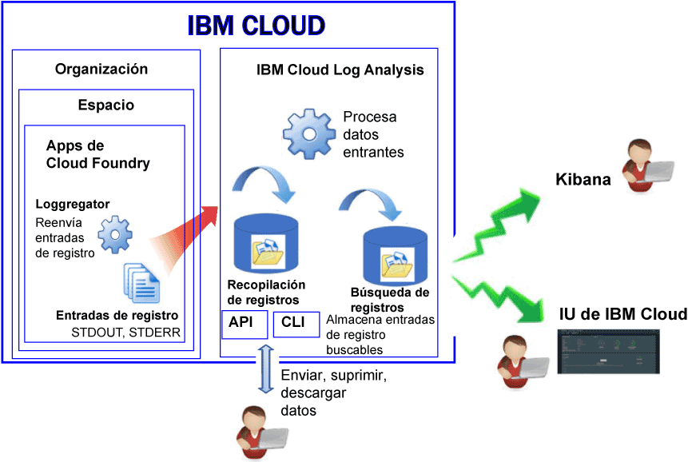

---

copyright:
  years: 2017

lastupdated: "2017-07-19"

---

{:shortdesc: .shortdesc}
{:new_window: target="_blank"}
{:codeblock: .codeblock}
{:screen: .screen}
{:pre: .pre}

# Registro para apps de Cloud Foundry en Bluemix
{: #logging_bluemix_cf_apps}

En {{site.data.keyword.Bluemix}}, puede ver, filtrar y analizar registros de Cloud Foundry (CF) mediante el panel de control de {{site.data.keyword.Bluemix_notm}}, Kibana y la interfaz de línea de mandatos. Además, puede dirigir los registros a una herramienta externa de gestión de registros. 
{:shortdesc}

{{site.data.keyword.Bluemix_notm}} registra los datos de registro que genera la plataforma Cloud Foundry y las aplicaciones de Cloud Foundry. En los registros puede ver los errores, avisos y mensajes informativos que se generan para la app. 

Cuando ejecuta sus apps en una plataforma como servicio (PaaS) de nube como Cloud Foundry en {{site.data.keyword.Bluemix_notm}}, no puede utilizar SSH ni FTP en la infraestructura en la que se ejecutan las apps para acceder a los registros. La plataforma la controla el proveedor de la nube. Las apps de Cloud Foundry que se ejecutan en {{site.data.keyword.Bluemix_notm}} utilizan el componente Loggerator para reenviar los registros internos de la infraestructura de Cloud Foundry. El componente Loggregator selecciona automáticamente los datos de STDOUT y STDERR. Puede visualizar y analizar estos registros mediante el panel de control de {{site.data.keyword.Bluemix_notm}}, Kibana y la interfaz de línea de mandatos.

En la figura siguiente se muestra una vista de nivel alto del registro de las apps de Cloud Foundry de {{site.data.keyword.Bluemix_notm}}:

 
El registro de apps de Cloud Foundry se habilita automáticamente cuando se utiliza la infraestructura de Cloud Foundry para ejecutar las apps en {{site.data.keyword.Bluemix_notm}}. Para ver los registros de tiempo de ejecución de Cloud Foundry, debe grabar los registros en STDOUT y STDERR. Para obtener más información, consulte [Registro de aplicaciones en tiempo de ejecución mediante apps CF](/docs/services/CloudLogAnalysis/cfapps/logging_writing_to_log_from_cf_app.html#logging_writing_to_log_from_cf_app).

{{site.data.keyword.Bluemix_notm}} conserva una cantidad limitada de información de registro. Cuando se registra información, la información antigua se sustituye por la nueva. Si tiene que cumplir con políticas de la organización o de la industria que requieren que conserve parte o toda la información de registro para realizar una auditoría o por otros motivos, puede guardar los registros en un host de registro externo, como un servicio de gestión de registros de terceros u otro host. Para obtener más información, consulte [Configuración de hosts de registro externo](/docs/services/CloudLogAnalysis/external/logging_external_hosts.html#thirdparty_logging).

## Ingestión de registros
{: #log_ingestion}

El servicio {{site.data.keyword.loganalysisshort}} ofrece diversos planes. Cada plan define si el usuario puede o no enviar registros al componente de recopilación de registros. Todos los planes, excepto el plan *Lite*, incluyen la posibilidad de enviar registros a la recopilación de registros. Para obtener más información sobre los planes, consulte [Planes de servicio](/docs/services/CloudLogAnalysis/log_analysis_ov.html#plans).

Puede enviar registros a {{site.data.keyword.loganalysisshort}} mediante el reenviador de Logstash multiarrendatario. Para obtener más información, consulte el apartado sobre [Envío de datos de registro mediante el reenviador de Logstash multiarrendatario (mt-logstash-forwarder).](/docs/services/CloudLogAnalysis/how-to/send-data/send_data_mt.html#send_data_mt).

## Recopilación de registros
{: #log_collection}

De forma predeterminada, {{site.data.keyword.Bluemix_notm}} almacena los datos de registro en la base de búsqueda de registro durante un máximo de 3 días:   

* Se almacena un máximo de 500 MB por espacio de datos al día. Cualquier registro que supere dicha capacidad de 500 MB se descartará. Las asignaciones de capacidades se restablecen todos los días a las 12:30 AM UTC.
* Se pueden buscar hasta 1,5 GB de datos para un máximo de 3 días. Los datos de registro se renuevan (Primero en entrar, primero en salir) una vez que se ha alcanzado 1,5 GB de datos o después de 3 días.

El servicio {{site.data.keyword.loganalysisshort}} proporciona planes adicionales que le permiten almacenar registros en la recopilación de registros tanto tiempo como desee. Para obtener más información sobre el precio de cada plan, consulte [Planes de servicio](/docs/services/CloudLogAnalysis/log_analysis_ov.html#plans).

Puede configurar una política de retención de registros que puede utilizar para definir el número de días que desea conservar los registros en la recopilación de registros. Para obtener más información, consulte [Política de retención de registros](/docs/services/CloudLogAnalysis/log_analysis_ov.html#policies).

## Búsqueda de registros
{: #log_search}

De forma predeterminada, puede utilizar Kibana para buscar un máximo de 500 MB de registros al día en {{site.data.keyword.Bluemix_notm}}. 

El servicio {{site.data.keyword.loganalysisshort}} proporciona varios planes. Cada plan tiene distintas funciones de búsqueda de registros; por ejemplo, el plan *Recopilación de registros* le permite buscar un máximo de 1 GB de datos al día. Para obtener más información sobre los planes, consulte [Planes de servicio](/docs/services/CloudLogAnalysis/log_analysis_ov.html#plans).

## Métodos para analizar los registros de app de CF
{: #logging_bluemix_cf_apps_log_methods}

Puede elegir cualquiera de los siguientes métodos para analizar los registros de la aplicación de Cloud Foundry:

* Analizar el registro en {{site.data.keyword.Bluemix_notm}} para ver la actividad más reciente de la aplicación.
    
    En {{site.data.keyword.Bluemix_notm}}, puede ver, filtrar y analizar registros desde el separador **Registro** disponible para cada aplicación de Cloud Foundry. Para obtener más información, consulte [Análisis de registros de apps de CF desde el panel de control de Bluemix](/docs/services/CloudLogAnalysis/logging_view_dashboard.html#analyzing_logs_bmx_ui).
    
* Analizar registros en Kibana para realizar tareas avanzadas de análisis.
    
    En {{site.data.keyword.Bluemix_notm}}, puede utilizar Kibana, una plataforma de visualización y análisis de código abierto, para supervisar, buscar, analizar y visualizar datos en diversos gráficos, como diagramas y tablas. Para obtener más información, consulte [Análisis de registros en Kibana](/docs/services/CloudLogAnalysis/kibana/analyzing_logs_Kibana.html#analyzing_logs_Kibana).
	
	**Consejo:** Para iniciar kibana, consulte [Navegación a Kibana desde el panel de control de una app CF](/docs/services/CloudLogAnalysis/kibana/launch.html#launch_Kibana_from_cf_app).

* Analizar registros mediante la CLI para utilizar mandatos a fin de gestionar registros mediante programación.
    
    En {{site.data.keyword.Bluemix_notm}}, puede ver, filtrar y analizar registros mediante la interfaz de línea de mandatos con el mandato **cf logs**. Para obtener más información, consulte [Análisis de registros de apps de Cloud Foundry desde la interfaz de línea de mandatos](/docs/services/CloudLogAnalysis/logging_view_cli.html#analyzing_logs_cli).

## Orígenes de registros para apps de CF en Diego
{: #cf_apps_log_sources_diego}

Para aplicaciones Cloud Foundry (CF) desplegadas en la arquitectura de Cloud Foundry que se basa en Diego, están disponibles los siguientes orígenes de registros:
    
| Origen reg. | Nombre comp. | Descripción | 
|------------|----------------|-------------|
| LGR | Loggregator | El componente LGR proporciona información sobre Cloud Foundry Loggregator, que reenvía registros desde dentro de Cloud Foundry. |
| RTR | Direccionador | El componente RTR proporciona información sobre las solicitudes HTTP enviadas a una aplicación. | 
| STG | Transferencia | El componente STG proporciona información sobre cómo se transfiere o se vuelve a transferir una aplicación. | 
| APP | Aplicación | El componente APP proporciona los registros procedentes de la aplicación. Aquí es donde se mostrarán los valores de stderr y stdout en el código. | 
| API | API de Cloud Foundry | El componente API proporciona información sobre las acciones internas resultantes de la solicitud de un usuario de cambiar el estado de una aplicación. | 
| CELL | Célula Diego | El componente CELL proporciona información sobre el inicio, detención o bloqueo de una aplicación.|
| SSH | SSH | El componente SSH proporciona información cada vez que un usuario accede a una aplicación con el mandato **cf ssh**. |
{: caption="Tabla 1. Orígenes de registro para las apps CF desplegadas en una arquitectura CF que se basa en Diego" caption-side="top"}

En la figura siguiente se muestran los distintos componentes (orígenes de registro) de una arquitectura Cloud Foundry basada en Diego: 

 de una arquitectura Cloud Foundry basada en Diego.")
	
## Orígenes de registros para apps de CF desplegadas en DEA
{: #logging_bluemix_cf_apps_log_sources}

Para aplicaciones Cloud Foundry (CF) desplegadas en una arquitectura de Droplet Execution Agent (DEA), están disponibles los siguientes orígenes de registros:
    
| Origen reg. | Nombre comp. | Descripción | 
|------------|----------------|-------------|
| LGR | Loggregator | El componente LGR proporciona información sobre Cloud Foundry Loggregator, que reenvía registros desde dentro de Cloud Foundry. |
| RTR | Direccionador | El componente RTR proporciona información sobre las solicitudes HTTP enviadas a una aplicación. | 
| STG | Transferencia | El componente STG proporciona información sobre cómo se transfiere o se vuelve a transferir una aplicación. | 
| APP | Aplicación | El componente APP proporciona los registros procedentes de la aplicación. Aquí es donde se mostrarán los valores de stderr y stdout en el código. | 
| API | API de Cloud Foundry | El componente API proporciona información sobre las acciones internas resultantes de la solicitud de un usuario de cambiar el estado de una aplicación. | 
| DEA | Droplet Execution Agent | El componente DEA proporciona información sobre el inicio, detención o bloqueo de una aplicación.   Este componente sólo está disponible si la aplicación se ha desplegado en la arquitectura de Cloud Foundry que se basa en DEA. | 
{: caption="Tabla 2. Orígenes de registro para las apps CF desplegadas en una arquitectura CF que se basa en DEA" caption-side="top"}

En la figura siguiente se muestran los distintos componentes (orígenes de registro) de una arquitectura Cloud Foundry basada en DEA: 

 de una arquitectura Cloud Foundry basada en Droplet Execution Agent (DEA).")

