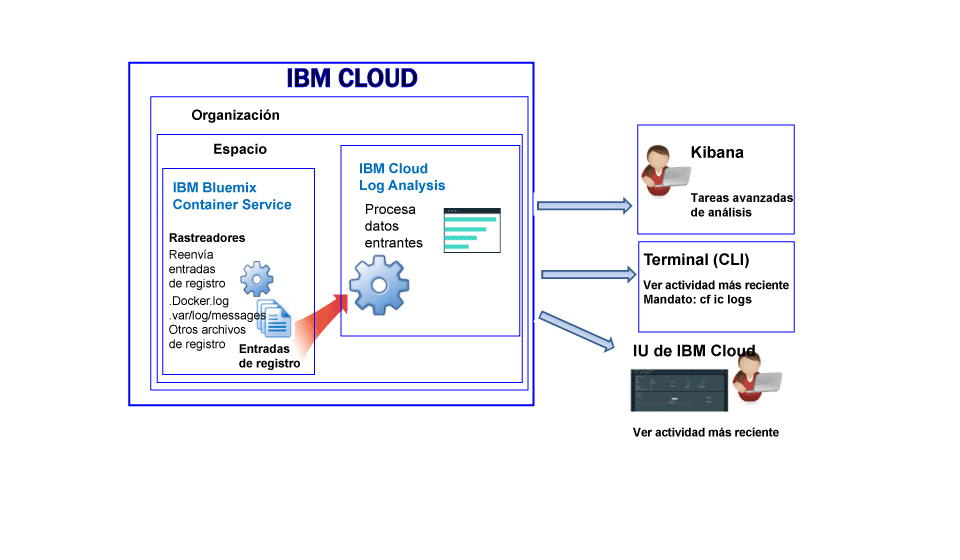

---

copyright:
  years: 2017, 2018

lastupdated: "2018-01-10"

---

{:shortdesc: .shortdesc}
{:new_window: target="_blank"}
{:codeblock: .codeblock}
{:screen: .screen}
{:pre: .pre}

# Registro de un contenedor gestionado por IBM Cloud (en desuso)
{: #containers_bluemix}

Tiene la posibilidad de visualizar, filtrar y analizar registros de contenedores Docker desplegados en la infraestructura gestionada de {{site.data.keyword.IBM}}. {:shortdesc}

Los registros de contenedor se supervisan y se reenvía desde fuera del contenedor mediante rastreadores. Los rastreadores envían los datos a un sistema Elasticsearch multiarrendatario de {{site.data.keyword.Bluemix_notm}}.

En la siguiente figura se muestra una vista de alto nivel de la recopilación de registros para {{site.data.keyword.containershort}}:

De forma predeterminada, los siguientes registros se recopilan para un contenedor desplegado en una infraestructura de nube gestionada de {{site.data.keyword.Bluemix_notm}}:

<table>
  <caption>Tabla 2. Registros recopilados para contenedores desplegados en una infraestructura gestionada de {{site.data.keyword.Bluemix_notm}}</caption>
  <tbody>
    <tr>
      <th align="center">Registro</th>
      <th align="center">Descripción</th>
    </tr>
    <tr>
      <td align="left" width="30%">/var/log/messages</td>
      <td align="left" width="70%"> De forma predeterminada, los mensajes de Docker se almacenan en la carpeta /var/log/messages del contenedor. Este registro incluye los mensajes del sistema.
      </td>
    </tr>
    <tr>
      <td align="left">./docker.log</td>
      <td align="left">Este es el registro de Docker.   El archivo de registro de Docker no se almacena como archivo dentro del contenedor, pero se recopila igualmente. Este archivo de registro se recopila de forma predeterminada, ya que constituye el convenio estándar de Docker para exponer la información
stdout (salida estándar) y stderr (error estándar) del contenedor. Se recopila la información que los procesos de contenedor imprimen en stdout o stderr. 
      </td>
     </tr>
  </tbody>
</table>

## Cómo analizar registros
{: #logging_containers_ov_methods}

Utilice Kibana para realizar tareas de análisis avanzado con los registros de contenedor. Puede utilizar Kibana, una plataforma de visualización y análisis de código abierto, para supervisar, buscar, analizar y visualizar datos en diversos gráficos, como diagramas y tablas. Para obtener más información, consulte [Análisis de registros en Kibana](/docs/services/CloudLogAnalysis/kibana/analyzing_logs_Kibana.html#analyzing_logs_Kibana).

## Recopilación de registros personalizados
{: #collect_custom_logs}

Para recopilar registros adicionales, añada la variable de entorno de **LOG_LOCATIONS** con una vía de acceso al archivo de registro cuando cree el contenedor. 

Puede añadir varios archivos de registro separándolos con comas. 

Para obtener más información, consulte [Recopilación de datos de registro no predeterminado desde un contenedor](logging_containers_other_logs.html#logging_containers_collect_data).

## Búsquedas en los registros
{: #log_search}

De forma predeterminada, puede utilizar Kibana para buscar un máximo de 500 MB de registros al día en {{site.data.keyword.Bluemix_notm}}. 

El servicio {{site.data.keyword.loganalysisshort}} proporciona varios planes. Cada plan tiene distintas funciones de búsqueda de registros; por ejemplo, el plan *Recopilación de registros* le permite buscar un máximo de 1 GB de datos al día. Para obtener más información sobre los planes, consulte [Planes de servicio](/docs/services/CloudLogAnalysis/log_analysis_ov.html#plans).

## Envío de registros para poder utilizar los campos en un mensaje como campos de búsqueda de Kibana
{: #send_data_in_json}

De forma predeterminada, la creación de registros se habilita de forma automática para los contenedores. Cada entrada en el archivo de registro Docker se visualiza en Kibana en el campo `message`. Si necesita filtrar y analizar sus datos en Kibana mediante un campo específico que sea parte de la entrada de registro del contenedor, configure su aplicación para enviar la salida en un formato JSON que sea válido.

Siga los pasos siguientes para enviar registros en los que las entradas de registro de contenedor se analizan como campos individuales: 

1. Registre el mensaje en un archivo. 
2. Añada el archivo de registro a la lista de registros no predeterminados que están disponibles para su análisis de un contenedor. Para obtener más información, consulte [Recopilación de datos de registro no predeterminado desde un contenedor](logging_containers_other_logs.html#logging_containers_collect_data). 
    
Cuando las entradas de registro de JSON se envían al archivo de registro de Docker de un contenedor como STDOUT, no se analizan como JSON. 
    
Si registra el mensaje en un archivo, y si se determina que su formato JSON es válido, los campos se analizan y se crean nuevos campos para cada campo en el mensaje. En Kibana, únicamente están disponibles los campos de tipo serie para filtrar y clasificar.

## Almacenamiento de registros en el componente de recopilación de registros
{: #store_logs}

De forma predeterminada, {{site.data.keyword.Bluemix_notm}} almacena los datos de registro durante un máximo de 3 días:   

* Se almacena un máximo de 500 MB por espacio de datos al día. Cualquier registro que supere dicha capacidad de 500 MB se descartará. Las asignaciones de capacidades se restablecen todos los días a las 12:30 AM UTC.
* Se pueden buscar hasta 1,5 GB de datos para un máximo de 3 días. Los datos de registro se renuevan (Primero en entrar, primero en salir) una vez que se ha alcanzado 1,5 GB de datos o después de 3 días.

El servicio {{site.data.keyword.loganalysisshort}} proporciona planes adicionales que le permiten almacenar registros en la recopilación de registros tanto tiempo como desee. Para obtener más información sobre el precio de cada plan, consulte [Planes de servicio](/docs/services/CloudLogAnalysis/log_analysis_ov.html#plans).

Si necesita almacenar registros o buscar registros de mayor tamaño, puede suministrar el servicio {{site.data.keyword.loganalysisshort}} y elegir otro plan de servicio. Los planes adicionales le permiten almacenar registros en el componente de recopilación de registros tanto tiempo como necesite y buscar registros de mayor tamaño. Para obtener más información, consulte [Planes de servicio](/docs/services/CloudLogAnalysis/log_analysis_ov.html#plans).

## Visualización de registros
{: #logging_containers_ov_methods_view_bmx}

Visualice los registros más recientes de un contenedor desplegado en la infraestructura gestionada de {{site.data.keyword.Bluemix_notm}} utilizando cualquiera de los siguientes métodos:

* Visualizar registros a través de la interfaz de usuario de {{site.data.keyword.Bluemix_notm}} para supervisar la actividad más reciente del contenedor.
    
    Puede ver, filtrar y analizar registros desde el separador **Supervisión y registro** disponible para cada contenedor. 
	
	Para ver los registros de tiempo de ejecución o despliegue de un contenedor Docker desplegado en una infraestructura gestionada de {{site.data.keyword.IBM_notm}}, complete los siguientes pasos:

    1. En el panel de control Apps, pulse en un contenedor o grupo de contenedores. 
    
    2. En la página de detalles de la app, pulse **Supervisión y registros**.

    3. Seleccione el separador **Registro**. En el separador **Registro**, puede ver los registros recientes del contenedor o la parte más reciente de los registros en tiempo real. 
	
* Visualice registros utilizando la interfaz de línea de mandatos de {{site.data.keyword.containershort}}. Utilice mandatos para gestionar los registros mediante programación.
    
    Puede ver, filtrar y analizar registros mediante la interfaz de línea de mandatos con el mandato **cf ic logs**. 
	
	Utilice el mandato `bx cf ic logs` para visualizar los registros de un contenedor en {{site.data.keyword.Bluemix_notm}}. Por ejemplo, puede utilizar los registros para analizar por qué un contenedor se ha detenido o para revisar la salida del contenedor. 
	
	Para ver errores de aplicación correspondientes a la app que se ejecuta en un contenedor mediante el mandato `cf ic logs`, la aplicación debe grabar sus registros en las secuencias de salida estándar (STDOUT) y de error estándar (STDERR). Si diseña la aplicación para que grabe en estas secuencias de salida estándar, podrá ver los registros a través de la línea de mandatos aunque el contenedor se haya concluido o se haya colgado.

    Para obtener más información sobre el mandato `cf ic logs`, consulte [Mandato cf ic logs](/docs/containers/container_cli_reference_cfic.html#container_cli_reference_cfic__logs).

