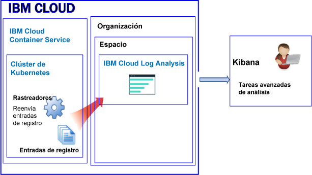

---

copyright:
  years: 2017, 2018

lastupdated: "2018-02-01"

---

{:new_window: target="_blank"}
{:shortdesc: .shortdesc}
{:screen: .screen}
{:pre: .pre}
{:table: .aria-labeledby="caption"}
{:codeblock: .codeblock}
{:tip: .tip}
{:download: .download}


# Registro de recursos en un clúster Kubernetes
{: #containers_kubernetes}

Puede ver, filtrar y analizar registros para recursos en un clúster de Kubernetes mediante el servicio de {{site.data.keyword.loganalysisshort}} en {{site.data.keyword.Bluemix_notm}}.
{:shortdesc}

De forma predeterminada, el envío de registros de un clúster al servicio de {{site.data.keyword.loganalysisshort}} no está habilitado automáticamente. **Nota:** Este es un cambio reciente para clústeres nuevos. Antes, cuando se ha creado un clúster, la información que imprime un proceso de contenedor en stdout (salida estándar) y stderr (error estándar) la ha recopilado automáticamente {{site.data.keyword.containershort}} y se ha reenviado al servicio de {{site.data.keyword.loganalysisshort}}. Ahora, debe crear una o varias configuraciones de registro en el clúster para reenviar automáticamente registros al servicio de {{site.data.keyword.loganalysisshort}}.

Tenga en cuenta la siguiente información al trabajar con los registros de clúster:

* El envío de información a stdout y stderr corresponde a la convención de Docker para exponer la información de un contenedor.
* Los registros de contenedor se supervisan y se reenvía desde fuera del contenedor mediante rastreadores. 
* Los rastreadores envían los datos a un sistema Elasticsearch multiarrendatario de {{site.data.keyword.Bluemix_notm}}. 
* Puede configurar el clúster para reenviar los registros stdout y stderr, otros registros de aplicación, registros del nodo trabajador, los registros de componentes del sistema de Kubernetes, y los registros de controlador de Ingress al servicio de {{site.data.keyword.loganalysisshort}}. Para obtener más información, consulte [Recopilación de registros adicionales de aplicación y de clúster](/docs/services/CloudLogAnalysis/containers/containers_kubernetes.html#collect_logs).

## Acerca del registro en un entorno público
{: #public}

En {{site.data.keyword.Bluemix_notm}}, puede utilizar el servicio {{site.data.keyword.loganalysisshort}} para almacenar y analizar registros de contenedor y registros de clúster Kubernetes recopilados automáticamente por {{site.data.keyword.containershort}} en el entorno público. 

Puede tener uno o varios clústeres Kubernetes en una cuenta. {{site.data.keyword.containershort}} recupera los registros automáticamente en cuanto se suministra el clúster.  

* Los registros de la aplicación se recopilan en cuanto se despliega el pod.  
* La información que imprime un proceso de contenedor en stdout (salida estándar) y stderr (error estándar) la recopila automáticamente el {{site.data.keyword.containershort}}.

Para que estos registros estén disponibles para su análisis en el servicio {{site.data.keyword.loganalysisshort}}, debe configurar el clúster de modo que reenvíe los registros del clúster a {{site.data.keyword.loganalysisshort}}. Puede reenviar registros a su dominio de cuenta o a un dominio de espacio de su cuenta.

* Los clústeres que están disponibles en la región EE.UU. Sur envían los registros al servicio {{site.data.keyword.loganalysisshort}} que está disponible en la región EE.UU. Sur. 
* Los clústeres que están disponibles en la región EE.UU. Este envían los registros al servicio {{site.data.keyword.loganalysisshort}} que está disponible en la región EE.UU. Sur. 
* Los clústeres que están disponibles en la región alemana envían los registros al servicio {{site.data.keyword.loganalysisshort}} que está disponible en la región alemana. 
* Los clústeres que están disponibles en la región Sídney envían los registros al servicio {{site.data.keyword.loganalysisshort}} que está disponible en la región Sidney. 
* Los clústeres que están disponibles en la región Reino Unido envían los registros al servicio {{site.data.keyword.loganalysisshort}} que está disponible en la región alemana. 


Para analizar datos de registro en Kibana para un clúster, tenga en cuenta la siguiente información:

* Debe iniciar Kibana en la región pública en la que se suministra la instancia de {{site.data.keyword.loganalysisshort}} que se utiliza para ver los registros.  
* El ID de usuario debe tener permisos para ver registros.  

    Para ver los registros en el dominio de la cuenta, un usuario necesita una política de IAM para el servicio {{site.data.keyword.loganalysisshort}}. El usuario necesita permisos de **Visor**.  
    
    Para ver registros en el dominio del espacio, el usuario necesita un rol de CF. Para obtener más información, consulte [Roles que necesita un usuario a ver registros](/docs/services/CloudLogAnalysis/kibana/analyzing_logs_Kibana.html#roles).

Para gestionar los datos de registro que están en el almacenamiento a largo plazo (recopilación de registros), el ID de usuario debe tener una política de IAM para poder trabajar con el servicio {{site.data.keyword.loganalysisshort}}. El ID de usuario debe tener permisos de **Administrador** o permisos de **Editor**. Para obtener más información, consulte [Roles que necesita un usuario para gestionar registros](/docs/services/CloudLogAnalysis/manage_logs.html#roles).

**Nota:** Cuando trabaja con un clúster Kubernetes, se reservan los espacios de nombres *ibm-system* y *kube-system*. No cree, suprima, modifique ni cambie permisos de recursos que estén disponibles en dichos espacios de nombres. Los registros para estos espacios de nombres están para que {{site.data.keyword.IBM_notm}} los utilice.


### Vista general del registro correspondiente a un clúster que reenvía registros al dominio de la cuenta
{: #acc}


En la figura siguiente se muestra una vista general del registro en un entorno público para {{site.data.keyword.containershort}} cuando el clúster reenvía registros al dominio de la cuenta:


### Vista general del registro correspondiente a un clúster que reenvía registros a un dominio de espacio
{: #space}

En la figura siguiente se muestra una vista general del registro en un entorno público para {{site.data.keyword.containershort}} cuando el clúster reenvía registros a un dominio de espacio:



   


## Acerca del registro en un entorno dedicado
{: #dedicated}

En {{site.data.keyword.Bluemix_notm}}, puede utilizar el servicio {{site.data.keyword.loganalysisshort}} en un entorno público para almacenar y analizar registros de contenedor y registros de clúster Kubernetes que recopila automáticamente {{site.data.keyword.containershort}} en el entorno dedicado. 

Considere la siguiente información:

* Puede tener uno o varios clústeres Kubernetes en una cuenta. {{site.data.keyword.containershort}} recupera los registros automáticamente en cuanto se suministra un clúster.  
* Para ver registros de aplicación y de clúster mediante el servicio de {{site.data.keyword.loganalysisshort}}, debe definir una o varias configuraciones de registro en un clúster. Cada entrada de configuración define qué información de registro se reenvía al servicio {{site.data.keyword.loganalysisshort}}. Por ejemplo, los datos de registro stdout y stderr se recopilan en cuanto se despliega el pod. Para reenviar estos registros, debe definir una configuración de registro para un origen de registro de tipo *contenedor*.
* Cuando defina una configuración de registro, decida si enviará los registros al dominio de la cuenta o a un dominio del espacio. **Nota:** Actualmente, el dominio de cuenta tiene una cuota de búsqueda límite de 500 MB al día y no se pueden almacenar registros en la Recopilación de registros para su almacenamiento a largo plazo. Para poder buscar registros de mayor tamaño, y para almacenar registros en la Recopilación de registros, envíe sus registros a un dominio del espacio.
* Cuando defina una configuración de registro para enviar registros al dominio de la cuenta, los registros se reenviarán al dominio de la cuenta en la misma región pública en la que se está ejecutando {{site.data.keyword.containershort}} Dedicado.

    Los clústeres que están disponibles en la región EE.UU. Sur envían los registros al servicio {{site.data.keyword.loganalysisshort}} que está disponible en la región EE.UU. Sur. </br>
Los clústeres que están disponibles en la región EE.UU. Este envían los registros al servicio {{site.data.keyword.loganalysisshort}} que está disponible en la región EE.UU. Sur. </br>
Los clústeres que están disponibles en la región alemana envían los registros al servicio {{site.data.keyword.loganalysisshort}} que está disponible en la región alemana. </br>
Los clústeres que están disponibles en la región Sídney envían los registros al servicio {{site.data.keyword.loganalysisshort}} que está disponible en la región Sidney. </br>
Los clústeres que están disponibles en la región Reino Unido envían los registros al servicio {{site.data.keyword.loganalysisshort}} que está disponible en la región alemana. 


Para ver y analizar datos de registro para un clúster en Kibana, tenga en cuenta la información siguiente:

* Debe iniciar Kibana en la región pública de la nube en la que se suministra la instancia de {{site.data.keyword.loganalysisshort}}.  
* Su ID de usuario debe tener una política de IAM para funcionar con el servicio {{site.data.keyword.loganalysisshort}}. Debe tener permisos de **Visor** para poder ver los registros en la cuenta de dominio.  

Para gestionar los datos de registro que están en el almacenamiento a largo plazo (Recopilación de registro), el ID de usuario debe tener una política de IAM para funcionar con el servicio {{site.data.keyword.loganalysisshort}}. Debe tener permisos de **Administrador** o permisos de **Editor**.   

En la siguiente figura se muestra una vista general del registro en un entorno dedicado correspondiente a {{site.data.keyword.containershort}}:


## Orígenes de registro
{: #log_sources}


Puede configurar el clúster para reenviar registros al servicio {{site.data.keyword.loganalysisshort}}. La tabla siguiente lista los distintos orígenes de registro que puede habilitar para reenviar registros al servicio {{site.data.keyword.loganalysisshort}}:

<table>
  <caption>Orígenes de registros para un clúster Kubernetes</caption>
  <tr>
    <th>Origen reg.</th>
	<th>Descripción</th>
	<th>Vías de acceso de registro</th>
  </tr>
  <tr>
    <td>Contenedor</td>
	<td>Registros de contenedor.</td>
	<td>Registros de salida estándar (stdout) y de error estándar (stderr).</td>
  </tr>
  <tr>
    <td>Aplicación</td>
	<td>Registra la aplicación que se ejecuta en un clúster de Kubernetes.</td>
	<td>`/var/log/apps/**/*.log` </br>`/var/log/apps/**/*.err`</br>**NOTA:** En un pod, los registros se pueden grabar en `/var/logs/apps/` o en cualquier subdirectorio bajo `/var/logs/apps/`. En el trabajador, debe montar `/var/log/apps/` al directorio del pod donde la app está grabando registros en el pod.</td>
  </tr>
  <tr>
    <td>Trabajador</td>
	<td>Registra nodos trabajadores de máquinas virtuales dentro de un clúster de Kubernetes. </td>
	<td>`/var/log/syslog` </br>`/var/log/auth.log`</td>
  </tr>
  <tr>
    <td>Componente del sistema Kubernetes</td>
	<td>Registra el componente del sistema de Kubernetes.</td>
	<td>*/var/log/kubelet.log* </br>*/var/log/kube-proxy.log*</td>
  </tr>
  <tr>
    <td>Controlador de Ingress</td>
	<td>Registra un controlador de Ingress que gestiona el tráfico de red entrante en un clúster de Kubernetes.</td>
	<td>`/var/log/alb/ids/*.log` </br>`/var/log/alb/ids/*.err` </br>`/var/log/alb/customerlogs/*.log` </br>`/var/log/alb/customerlogs/*.err`</td>
  </tr>
</table>


## Consideraciones sobre el reenvío de registros de aplicaciones
{: #forward_app_logs}

Para habilitar el reenvío de registros de los registros de aplicaciones, debe definir una configuración de registro de clúster con **Origen de registro** establecido en **aplicación**.

Revise los siguientes aspectos del reenvío de registro de aplicación:

* Puede reenviar registros que están disponibles en un directorio específico del nodo de host. Puede hacer esto montando un volumen de vía de acceso de host en los contenedores con una vía de acceso de montaje. Esta vía de acceso de montaje sirve de directorio en los contenedores donde se envían los registros de aplicación. El directorio de la vía de acceso del host predefinido, `/var/log/apps`, se crea automáticamente al crear el montaje de volumen.

    Por ejemplo, consulte los ejemplos de la sección volumeMounts del descriptor de un despliegue y de la sección volumes:

    ```
    volumeMounts:
            - mountPath: /var/app
              name: application-log
    volumes:
        - name: application-log
          hostPath:
            path: /var/log/apps

    ```
    {: codeblock}

* Los registros se leen recursivamente desde la vía de acceso `/var/log/apps`. Puede colocar registros de aplicación en subdirectorios de la vía de acceso `/var/log/apps`.
    
* Solo se reenvía los archivos de registro de aplicación con las extensiones de archivo **.log** o **.err**.

* Cuando se habilita el reenvío de registro por primera vez, los registros de aplicación no se leen desde el principio.  

    El contenido de los registros que ya existían antes de habilitar el registro de aplicación no se leen. Los registros se leen a partir del momento en que se habilita el registro. Sin embargo, a partir de la primera vez en que se habilita el reenvío de registro, los registros se recogen desde donde se dejaron.

* Cuando monte el volumen de vía de acceso del host */var/log/apps* en varios contenedores, todos los contenedores se grabarán en el mismo directorio en el host (trabajador). Si los contenedores se graban en el mismo nombre de archivo, los contenedores se grabarán exactamente en el mismo archivo en el host y se sobrescribirán. 

    **NOTA:** Cuando todos los contenedores se graben en el mismo nombre de archivo, no habilite el reenvío de registros con Origen de registro establecido en *application* para reenviar registros de aplicaciones para ReplicaSets mayor que 1. En su lugar, puede grabar registros desde la aplicación a STDOUT y STDERR, que se seleccionan como registros de contenedor. Para reenviar registros de aplicaciones grabados en STDOUT y STDERR, habilite el reenvío de registros con el Origen de registro establecido en *container*.


## Consideraciones sobre el reenvío de registros a un dominio de registros
{: #forward_logs_domain}

Puede configurar el clúster para reenviar archivos de registro al servicio de {{site.data.keyword.loganalysisshort}}. 

Los registros se pueden reenviar al dominio de la cuenta o a un dominio de espacio.

Tenga en cuenta la siguiente información al decidir si reenvía registros a un dominio de espacio o al dominio de la cuenta:

* Al enviar registros al dominio de la cuenta, la cuota de búsqueda es de 500 MB al día, y no se pueden almacenar registros en la Recopilación de registros para su almacenamiento a largo plazo.
* Al enviar registros a un dominio de espacio, puede elegir un plan de servicio de {{site.data.keyword.loganalysisshort}} que defina la cuota de búsqueda por día, y puede almacenar registros de almacenamiento en la Recopilación de registros para el almacenamiento a largo plazo.


## Reenvío de registros de aplicaciones y de clústeres
{: #forward_logs}

Para configurar el clúster para reenviar registros al servicio de {{site.data.keyword.loganalysisshort}}, debe realizar los pasos siguientes:

1. Compruebe que el ID de usuario tenga permisos para añadir una configuración de registro al clúster. 

    Solo los usuarios con una política de IAM para el {{site.data.keyword.containershort}} con permisos para gestionar clústeres pueden crear, actualizar o suprimir una configuración de registro de clústeres. Se necesita cualquiera de los roles siguientes: Administrador, Operador.

2. Abra un terminal, y configure el contexto de clúster.

3. Cree las configuraciones de registro para el clúster. Puede elegir qué registros de clúster que desea reenviar al servicio de Análisis de registros.

    Para habilitar la recopilación automática de registros y el reenvío de stdout y stderr, consulte [Habilitación de la recopilación automática de registros y del reenvío de registros de contenedor](/docs/services/CloudLogAnalysis/containers/containers_kube_other_logs.html#containers).</br>
Para habilitar la recopilación automática y el reenvío de registros de registros de la aplicación, consulte [Habilitación de la recopilación automática de registros y del reenvío de registro de aplicación](/docs/services/CloudLogAnalysis/containers/containers_kube_other_logs.html#apps).</br>
Para habilitar la recopilación automática de registros y el reenvío de registro de trabajo, consulte [Habilitación de la recopilación automática de registros y del reenvío de registros de trabajo](/docs/services/CloudLogAnalysis/containers/containers_kube_other_logs.html#workers).</br>
Para habilitar la recopilación automática de registros y el reenvío de registros de componentes del sistema Kubernetes, consulte [Habilitación de la recopilación automática de registros y del reenvío de registros de componentes del sistema Kubernetes](/docs/services/CloudLogAnalysis/containers/containers_kube_other_logs.html#system).</br>
Para habilitar la recopilación automática de registros y el reenvío de registros del controlador de Ingress de Kubernetes, consulte [Habilitación de la recopilación automática de registros y del reenvío de registros del controlador de Ingress de Kubernetes](/docs/services/CloudLogAnalysis/containers/containers_kube_other_logs.html#controller).
    
4. Al reenviar registros a un espacio, también debe otorgar permisos de Cloud Foundry (CF) al propietario de claves de {{site.data.keyword.containershort}} en la organización y el espacio. El propietario de claves necesita el rol *orgManager* para la organización, y *SpaceManager* y *Developer* para el espacio.

Para obtener más información sobre cómo configurar el clúster para reenviar archivos de registro al servicio de {{site.data.keyword.loganalysisshort}}, consulte la sección [Habilitación de la recopilación automática de registros de clúster](/docs/services/CloudLogAnalysis/containers/containers_kube_other_logs.html#containers_kube_other_logs).


## Configuración del tráfico de red para configuraciones personalizadas de cortafuegos en {{site.data.keyword.Bluemix_notm}}
{: #ports}

Si tiene configurado un cortafuegos adicional, o si ha personalizado los valores de cortafuegos en la infraestructura de {{site.data.keyword.Bluemix_notm}} (SoftLayer), debe permitir el tráfico de red de salida entre el nodo trabajador y el servicio {{site.data.keyword.loganalysisshort}}.  

Debe abrir el puerto TCP 443 y el puerto TCP 9091 entre cada trabajador y el servicio {{site.data.keyword.loganalysisshort}} para las siguientes direcciones IP en el cortafuegos personalizado:

<table>
  <tr>
    <th>Región</th>
    <th>URL de ingestión</th>
	<th>Direcciones IP públicas</th>
  </tr>
  <tr>
    <td>Alemania</td>
	<td>ingest-eu-fra.logging.bluemix.net</td>
	<td>158.177.88.43 <br>159.122.87.107</td>
  </tr>
  <tr>
    <td>Reino Unido</td>
	<td>ingest.logging.eu-gb.bluemix.net</td>
	<td>169.50.115.113</td>
  </tr>
  <tr>
    <td>EE.UU. sur</td>
	<td>ingest.logging.ng.bluemix.net</td>
	<td>169.48.79.236 <br>169.46.186.113</td>
  </tr>
  <tr>
    <td>Sídney</td>
	<td>ingest-au-syd.logging.bluemix.net</td>
	<td>130.198.76.125 <br>168.1.209.20</td>
  </tr>
</table>


## Búsquedas en los registros
{: #log_search}

De forma predeterminada, puede utilizar Kibana para buscar un máximo de 500 MB de registros al día en {{site.data.keyword.Bluemix_notm}}. 

Para buscar registros de mayor tamaño, puede utilizar el servicio {{site.data.keyword.loganalysisshort}}. El servicio proporciona varios planes. Cada plan tiene distintas funciones de búsqueda de registros; por ejemplo, el plan *Recopilación de registros* le permite buscar un máximo de 1 GB de datos al día. Para obtener más información sobre los planes disponibles, consulte [Planes de servicio](/docs/services/CloudLogAnalysis/log_analysis_ov.html#plans).

Cuando busque registros, tenga en cuenta los siguientes campos disponibles en Kibana: 

Campos comunes a cualquier entrada de registro: 

<table>
  <caption>Lista de campos comunes</caption>
  <tr>
    <th>Nombre del campo</th>
	<th>Descripción</th>
	<th>Valor</th>
  </tr>
  <tr>
    <td>ibm-containers.region_str</td>
	<td>Región en la que está disponible el clúster</td>
	<td>Por ejemplo, `us-south` es el valor correspondiente a un clúster que está disponible en la región EE.UU. Sur. </td>
  </tr>
  <tr>
    <td>ibm-containers.account_id_str</td>
	<td>ID de cuenta</td>
	<td></td>
  </tr>
  <tr>
    <td>ibm-containers.cluster_id_str</td>
	<td>ID de clúster</td>
	<td></td>
	<tr>
    <td>ibm-containers.cluster_name_str</td>
	<td>Nombre de clúster</td>
	<td></td>
  </tr>
</table>

Campos que pueden resultar útiles al analizar los registros stdout y stderr de contenedor:

<table>
  <caption>Lista de campos para aplicaciones</caption>
  <tr>
    <th>Nombre del campo</th>
	<th>Descripción</th>
	<th>Valor</th>
  </tr>
  <tr>
    <td>kubernetes.container_name_str</td>
	<td>Nombre del contenedor</td>
	<td></td>
  </tr>
  <tr>
    <td>kubernetes.namespace_name_str</td>
	<td>Nombre del espacio de nombres en el que se ejecuta la aplicación en el clúster</td>
	<td></td>
  </tr>
  <tr>
    <td>stream_str</td>
	<td>Tipo de registro</td>
	<td>*stdout* </br>*stderr *</td>
  </tr>
</table>

Campos que pueden resultar útiles al analizar registros de trabajo: 

<table>
  <caption>Lista de campos que son relevantes para nodos trabajadores</caption>
  <tr>
    <th>Nombre del campo</th>
	<th>Descripción</th>
	<th>Valor</th>
  </tr>
  
  <tr>
    <td>filename_str</td>
	<td>Vía de acceso y nombre del archivo</td>
	<td>*/var/log/syslog* </br>*/var/log/auth.log*</td>
  </tr>
  <tr>
    <td>tag_str</td>
	<td>Tipo de registro</td>
	<td>*logfiles.worker.var.log.syslog* </br>*logfiles.worker.var.log.auth.log*</td>
  </tr>
  <tr>
    <td>worker_str</td>
	<td>Nombre de nodo trabajador</td>
	<td>Por ejemplo, *w1*</td>
  </tr>
</table>

Campos que pueden resultar útiles al analizar registros de componentes del sistema Kubernetes: 

<table>
  <caption>Lista de campos que son relevantes para el componente del sistema Kubernetes</caption>
  <tr>
    <th>Nombre del campo</th>
	<th>Descripción</th>
	<th>Valor</th>
  </tr>
  <tr>
    <td>tag_str</td>
	<td>Tipo de registro</td>
	<td>*logfiles.kubernetes.var.log.kubelet.log* </br>*logfiles.kubernetes.var.log.kube-proxy.log*</td>
  </tr>
  <tr>
    <td>filename_str</td>
	<td>Vía de acceso y nombre del archivo</td>
	<td>*/var/log/kubelet.log* </br>*/var/log/kube-proxy.log*</td>
  </tr>
 </table>

Campos que pueden resultar útiles al analizar registros del controlador de Ingress: 
 
<table>
  <caption>Lista de campos que son relevantes para el controlador de Ingress</caption>
  <tr>
    <th>Nombre del campo</th>
	<th>Descripción</th>
	<th>Valor</th>
  </tr>
 <tr>
    <td>tag_str</td>
	<td>Tipo de registro</td>
	<td></td>
  </tr>
  <tr>
    <td>filename_str</td>
	<td>Vía de acceso y nombre del archivo</td>
	<td>*/var/log/alb/ids/*.log* </br>*/var/log/alb/ids/*.err* </br>*/var/log/alb/customerlogs/*.log* </br>*/var/log/alb/customerlogs/*.err*</td>
  </tr>
</table>


## Envío de registros para poder utilizar los campos en un mensaje como campos de búsqueda de Kibana
{: #send_data_in_json}

De forma predeterminada, la creación de registros se habilita de forma automática para los contenedores. Cada entrada en el archivo de registro Docker se visualiza en Kibana en el campo **message**. Si necesita filtrar y analizar sus datos en Kibana mediante un campo específico que sea parte de la entrada de registro del contenedor, configure su aplicación para enviar la salida en un formato JSON que sea válido. Por ejemplo, registre el mensaje en formato JSON para stdout (salida estándar) y (error estándar).

Cada campo disponible en el mensaje se analiza para el tipo de campo que coincide con su valor. Por ejemplo, cada campo en el siguiente mensaje JSON:
    
```
    {"field1":"string type",
        "field2":123,
        "field3":false,
        "field4":"4567"
    }
    ```
{: codeblock}
    
está disponible como un campo que se puede utilizar para filtrar y realizar búsquedas:
    
* `field1` se analiza como `field1_str` de tipo serie.
* `field2` se analiza como `field1_int` de tipo entero.
* `field3` se analiza como `field3_bool` de tipo booleano.
* `field4` se analiza como `field4_str` de tipo serie.
    

## Almacenamiento de registros en el componente de recopilación de registros
{: #log_collection}

Tenga en cuenta la siguiente información sobre el comportamiento predeterminado de {{site.data.keyword.Bluemix_notm}} al trabajar con los registros:

* {{site.data.keyword.Bluemix_notm}} almacena datos de registro durante un máximo de 3 días.
* Se almacena un máximo de 500 MB de datos al día. Cualquier registro que supere dicha capacidad de 500 MB se descartará. Las asignaciones de capacidades se restablecen todos los días a las 12:30 AM UTC.
* Se pueden buscar hasta 1,5 GB de datos para un máximo de 3 días. Los datos de registro se renuevan (Primero en entrar, primero en salir) una vez que se ha alcanzado 1,5 GB de datos o después de 3 días.
* Los registros no se almacenan en la Recopilación de registros para el almacenamiento a largo plazo.

El servicio {{site.data.keyword.loganalysisshort}} proporciona planes adicionales que le permiten almacenar registros en la recopilación de registros tanto tiempo como desee. Para obtener más información sobre el precio de cada plan, consulte [Planes de servicio](/docs/services/CloudLogAnalysis/log_analysis_ov.html#plans). 

Para gestionar registros en la Recopilación de registros, tenga en cuenta la siguiente información:

* Puede configurar una política de retención de registros que puede utilizar para definir el número de días que desea conservar los registros en la recopilación de registros. Para obtener más información, consulte [Política de retención de registros](/docs/services/CloudLogAnalysis/log_analysis_ov.html#policies).
* Puede suprimir los registros manualmente utilizando la CLI o la API de recopilación de registros.  
* Para gestionar registros en la recopilación de registros, un usuario necesita una política de IAM con permisos para trabajar con el servicio de {{site.data.keyword.loganalysisshort}} en {{site.data.keyword.Bluemix_notm}}. Para obtener más información, consulte [Roles de IAM](/docs/services/CloudLogAnalysis/security_ov.html#iam_roles).

## Visualización y análisis de registros
{: #logging_containers_ov_methods}

Para analizar los datos de registro, utilice Kibana para realizar tareas de análisis avanzado. Kibana es una plataforma de visualización y análisis de código abierto que puede utilizar para supervisar, buscar, analizar y visualizar datos en diversos gráficos, como diagramas y tablas. Para obtener más información, consulte [Análisis de registros en Kibana](/docs/services/CloudLogAnalysis/kibana/analyzing_logs_Kibana.html#analyzing_logs_Kibana).

* Puede iniciar Kibana directamente desde un navegador web.
Para obtener más información, consulte [Navegación a Kibana desde un navegador web](/docs/services/CloudLogAnalysis/kibana/launch.html#launch_Kibana_from_browser).
* Puede iniciar Kibana desde la IU de [{{site.data.keyword.Bluemix_notm}} dentro del contexto de un clúster. Para obtener más información, consulte [Navegación a Kibana desde el panel de control de un contenedor desplegado en un clúster Kubernetes](/docs/services/CloudLogAnalysis/kibana/launch.html#launch_Kibana_for_containers_kube).

Si reenvía los datos de registro de una app que se ejecuta en contenedor al recopilador de registros de Docker en un formato JSON, podrá buscar y analizar datos de registro en Kibana utilizando los campos JSON. Para obtener más información, consulte [Configuración de campos personalizados como campos de búsqueda de Kibana](logging_containers_ov.html#send_data_in_json).

Para ver registros en Kibana, tenga en cuenta la siguiente información:

* Para ver los registros en un dominio de espacio, el usuario debe tener el rol **auditor** o el rol **desarrollador** en el espacio asociado con el clúster.
* Para ver registros en el dominio de la cuenta, el usuario debe tener una política de IAM para trabajar con el servicio de {{site.data.keyword.loganalysisshort}}. El rol mínimo que permite ver entradas de registro es **Visor**.


## Guía de aprendizaje: Análisis de registros en Kibana para una app desplegada en un clúster Kubernetes
{: #tutorial1}

Para aprender a utilizar Kibana para analizar los registros de un contenedor desplegado en un clúster de Kubernetes, consulte [Análisis de registros en Kibana para una app desplegada en un clúster Kubernetes](/docs/services/CloudLogAnalysis/tutorials/container_logs.html#container_logs).
