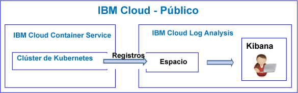
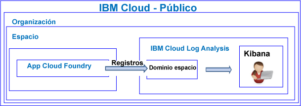

---

copyright:
  years: 2017, 2018

lastupdated: "2018-03-09"

---

{:new_window: target="_blank"}
{:shortdesc: .shortdesc}
{:screen: .screen}
{:pre: .pre}
{:table: .aria-labeledby="caption"}
{:codeblock: .codeblock}
{:tip: .tip}
{:download: .download}

# Guía de aprendizaje de iniciación
{: #getting-started-with-cla}

Utilice esta guía de aprendizaje para aprender cómo empezar a trabajar con el servicio {{site.data.keyword.loganalysislong}} en {{site.data.keyword.Bluemix}}. 
{:shortdesc}

De forma predeterminada, {{site.data.keyword.Bluemix_notm}} ofrece funciones integradas de registro para los servicios seleccionados. Puede utilizar el servicio {{site.data.keyword.loganalysisshort}} para ampliar la capacidad de recopilación y retención cuando trabaje con registros.

## Antes de empezar
{: #prereqs}

Debe tener un ID de usuario que sea miembro o un propietario de una cuenta de {{site.data.keyword.Bluemix_notm}}. Para obtener un ID de usuario de {{site.data.keyword.Bluemix_notm}}, vaya a: [Registro ](https://console.bluemix.net/registration/){:new_window}

## Paso 1: Elegir un recurso de la nube cuyos registros se desea ver
{: #step1}

En {{site.data.keyword.Bluemix_notm}}, las aplicaciones CF, los contenedores que se ejecutan en el {{site.data.keyword.containershort}} y servicios seleccionados recopilan datos de registro automáticamente y los reenvían al servicio {{site.data.keyword.loganalysisshort}}. 

En la tabla siguiente encontrará los distintos recursos de la nube. Consulte la guía de aprendizaje de un recurso para empezar a trabajar con el servicio {{site.data.keyword.loganalysisshort}}:

<table>
  <caption>Guías de aprendizaje para empezar a trabajar con el servicio {{site.data.keyword.loganalysisshort}} </caption>
  <tr>
    <th>Recurso</th>
    <th>Guía de aprendizaje</th>
    <th>Entorno de nube</th>
    <th>Escenario</th>
  </tr>
  <tr>
    <td>Contenedores se ejecutan en {{site.data.keyword.containershort}}</td>
    <td>[Análisis de registros en Kibana para una app desplegada en un clúster de Kubernetes](/docs/services/CloudLogAnalysis/tutorials/container_logs.html#container_logs)</td>
    <td>Público </br>Dedicado</td>
    <td></td>
  </tr>
  <tr>
    <td>Apps de CF</td>
    <td>[Análisis de registros en Kibana para una app de Cloud Foundry](https://console.bluemix.net/docs/tutorials/application-log-analysis.html#generate-access-and-analyze-application-logs)</td>
    <td>Público </td>
    <td></td>
  </tr>
</table>


## Paso 2: Establecer permisos para que un usuario vea registros
{: #step2}

Para controlar las acciones de {{site.data.keyword.loganalysisshort}} que puede realizar un usuario, puede asignar roles y políticas a un usuario. 

Hay dos tipos de permisos de seguridad en {{site.data.keyword.Bluemix_notm}} que controlan las acciones que pueden realizar los usuarios cuando trabajan con el servicio {{site.data.keyword.loganalysisshort}}:

* Roles de Cloud Foundry (CF): Otorgue un rol de CF a un usuario para definir los permisos que tiene el usuario para ver registros en un espacio.
* Roles de IAM: Otorgue una política de IAM a un usuario para definir los permisos que tiene el usuario para ver registros en el dominio de la cuenta, y los permisos que tiene el usuario para gestionar registros almacenados en la Recopilación de registros. 


Siga estos pasos para otorgar permisos a un usuario para ver registros en un espacio:

1. Inicie sesión en la consola de {{site.data.keyword.Bluemix_notm}}.

    Abra un navegador web y lance el panel de control de {{site.data.keyword.Bluemix_notm}}: [http://bluemix.net ](http://bluemix.net){:new_window}
	
	Cuando inicia sesión con su ID de usuario y su contraseña, se abre la interfaz de usuario de {{site.data.keyword.Bluemix_notm}}.

2. En la barra de menús, pulse **Gestionar > Cuenta > Usuarios**. 

    La ventana *Usuarios* muestra una lista de usuarios con sus direcciones de correo electrónico para la cuenta seleccionada actualmente.
	
3. Si el usuario es un miembro de la cuenta, seleccione el nombre de usuario de la lista, o pulse **Gestionar usuario** del menú *Acciones*.

    Si el usuario no es un miembro de la cuenta, consulte [Invitación a usuarios](/docs/iam/iamuserinv.html#iamuserinv).

4. Seleccione **Acceso de Cloud Foundry** y, a continuación, seleccione la organización.

    Se listará la lista de espacios disponibles en dicha organización.

5. Seleccione el espacio donde se suministra el servicio de {{site.data.keyword.loganalysisshort}}. A continuación, desde la acción de menú, seleccione **Editar el rol de espacio**.

6. Seleccione *Auditor*. 

    Puede seleccionar uno o más roles de espacio. Todos los roles siguientes permiten a un usuario ver registros: *Gestor*, *Desarrollador*, y *Auditor*
	
7. Pulse **Guardar rol**.


Para obtener más información, consulte [Concesión de permisos](/docs/services/CloudLogAnalysis/security/grant_permissions.html#grant_permissions_ui_account).


Un usuario debe acceder a Kibana en la región Pública de la nube donde están disponibles los datos de registro para poder ver y analizar los datos de registro. 

Por ejemplo, para iniciar Kibana en la región EE.UU. sur, abra un navegador web y escriba el siguiente URL:

```
https://logging.ng.bluemix.net/ 
```
{: codeblock}


Para obtener más información sobre cómo iniciar Kibana en otras regiones, consulte [Navegación a Kibana desde un navegador web](/docs/services/CloudLogAnalysis/kibana/launch.html#launch_Kibana_from_browser).

**Nota:** Cuando inicie Kibana, si obtiene un mensaje que indica *señal de transporte no válida*, compruebe sus permisos en el espacio. Este mensaje es una indicación de que el ID de usuario no tiene permisos para ver registros.

## Pasos siguientes 
{: #next_steps}

Personalice Kibana para ver y analizar sus datos de registro. Para obtener más información, consulte [Visualización y análisis de registros](/docs/services/CloudLogAnalysis/kibana/analyzing_logs_Kibana.html#analyzing_logs_Kibana).
    


