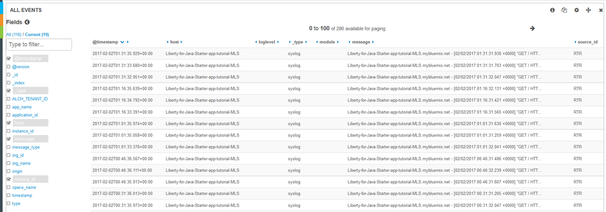

---

copyright:
  years: 2015, 2018

lastupdated: "2018-01-10"

---
{:new_window: target="_blank"}
{:shortdesc: .shortdesc}
{:screen:.screen}
{:codeblock:.codeblock}

# Filtrado de registros de apps de Cloud Foundry por tipo de registro en Kibana
{: #logging_kibana_component_filter}

Puede ver y filtrar registros de aplicaciones de {{site.data.keyword.Bluemix_notm}} por componente (tipo de registro) en el panel de control de Kibana. Puede acceder al panel de control de Kibana desde el separador **Registros** de la app de Cloud Foundry.
{:shortdesc}

Lleve a cabo las tareas siguientes para ver y filtrar los registros de la app de Cloud Foundry por tipo de registro en el panel de control de Kibana:

1. Acceda al separador **Registros** de la app de Cloud Foundry. 

    1. Pulse el nombre de la app en el panel de control **Apps** de {{site.data.keyword.Bluemix_notm}}.
    2. Pulse el separador **Registros**. 
    
    Se muestran los registros de la app.

2. Acceso al panel de control de Kibana para su app. Pulse **Vista avanzada** . Se visualiza el panel de control de Kibana.

3. En la ventana **TODOS LOS SUCESOS**, pulse el icono de flecha hacia la derecha para mostrar todos los campos. 

    

4. En el panel **Campos**, seleccione **source_id** para visualizar el componente que ha generado cada entrada del registro en la ventana **TODOS LOS SUCESOS**.

    

5. En la ventana **TODOS LOS SUCESOS**, pulse una fila de suceso de registro para ver los detalles de dicho suceso.Elija un suceso que muestre el source_id que desea filtrar.

    

6. Añada un filtro para incluir o excluir información correspondiente a un componente (tipo de registro). 

    * Para añadir un filtro que incluya un valor de componente, pulse el icono **Lupa**  en la fila source_id de la tabla. 

         

    * Para añadir un filtro que excluya un valor de componente, pulse el icono **Exclusión**  en la fila source_id de la tabla. 
    
          
     
     Se añade una nueva condición de filtro al panel de control de Kibana.

7. Si lo desea, puede repetir el paso anterior y añadir filtros para cada componente. Para ver la lista completa de componentes, consulte [Formato de registro](../logging_view_kibana3.html#kibana_log_format_cf).

    En la imagen siguiente se muestra el panel de control con varios filtros correspondientes a distintos componentes:
    
    

8. Guarde el panel de control. 

    Cuando haya terminado de crear los filtros, pulse el icono **Guardar**  y especifique un nombre para el panel de control. 
      
    **Nota:** si intenta guardar un panel de control con un nombre que contenga espacios en blanco, no se guardará.Escriba un nombre sin espacios y pulse el icono **Guardar**.
    
    

Ha creado un panel de control que filtra las entradas de registro por componente (tipo de registro). Puede cargar el panel de control que ha guardado en cualquier momento pulsando el icono **Carpeta**  y seleccionando el panel de control por nombre.

