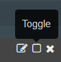

---

copyright:
  years: 2015, 2018

lastupdated: "2018-01-10"

---

{:shortdesc: .shortdesc}
{:new_window: target="_blank"}
{:codeblock: .codeblock}
{:screen: .screen}

# Análisis de registros en Kibana 3 (en desuso)
{: #analyzing_logs_Kibana3}

En {{site.data.keyword.Bluemix}}, puede utilizar Kibana, una plataforma de visualización y análisis de código abierto, para supervisar, buscar, analizar y visualizar datos en diversos gráficos, como diagramas y tablas. Utilice Kibana para realizar tareas avanzadas de análisis.
{:shortdesc}

## Filtrado de datos en un panel de control de Kibana
{: #filter_data_kibana_dashboard}

En {{site.data.keyword.Bluemix}}, puede analizar datos utilizando el panel de control predeterminado de Kibana que se proporciona por recurso o por espacio de {{site.data.keyword.Bluemix}}. De forma predeterminada, estos paneles de control muestran todos los datos disponibles correspondientes a las últimas 24 horas. Sin embargo, puede restringir la información mostrada a través del panel de control. Puede añadir consultas y filtros a un panel de control predeterminado y luego guardarlo para volverlo a utilizar en el futuro.

En un panel de control, puede añadir varias consultas y filtros. Una consulta define un subconjunto de las entradas de registro.  Un filtro ajusta la selección de datos mediante la inclusión o exclusión de información. 

Para las apps Cloud Foundry, la lista siguiente muestra ejemplos de cómo filtrar datos:
* Si está buscando información en los registros que incluya términos clave, puede crear consultas para filtrar por esos términos. Con Kibana, puede comparar consultas visualmente en el panel de control. Para obtener más información, consulte [Filtrado de registros de la app Cloud Foundry con consultas en Kibana](kibana3/logging_kibana_query.html#logging_kibana_query).

* Si busca información dentro de un periodo de tiempo específico, puede filtrar datos dentro de un intervalo de tiempo. Para obtener más información, consulte [Filtrado de registros de la app Cloud Foundry por tiempo en Kibana](kibana3/logging_kibana_filter_by_time_period.html#logging_kibana_time_filter).

* Si está buscando información correspondiente a un determinado ID de específica, puede filtrar datos por ID de instancia. Para obtener más información, consulte [Filtrado de los registros de la app Cloud Foundry por ID de instancia en Kibana](kibana3/logging_kibana_filter_by_instance_id.html#logging_kibana_instance_id) y [Filtrado de los registros de la app Cloud Foundry por ID de aplicación conocida en Kibana](kibana3/logging_kibana_filter_by_known_application_id.html#logging_kibana_known_application_id).

* Si está buscando información correspondiente a un determinado componente, puede filtrar datos por componente (tipo de registro). Para obtener más información, consulte [Filtrado de los registros de la app Cloud Foundry por tipo de registro en Kibana](kibana3/logging_kibana_filter_by_component.html#logging_kibana_component_filter).

* Si está buscando información, por ejemplo mensajes de error, puede filtrar datos por tipo de mensaje. Para obtener más información, consulte [Filtrado de los registros de la app Cloud Foundry por tipo de mensaje en Kibana](kibana3/logging_kibana_filter_by_message_type.html#logging_kibana_message_type_filter).

## Personalización de un panel de control de Kibana
{: #customize_kibana_dashboard}

Hay diferentes tipos de paneles de control que puede personalizar para visualizar y analizar los datos, por ejemplo:
* Panel de control Single-cf-app: es un panel de control que muestra información correspondiente a una sola aplicación Cloud Foundry.  
* Panel de control Multi-cf-app: es un panel de control que muestra información correspondiente a todas las aplicaciones Cloud Foundry desplegadas en el mismo espacio de {{site.data.keyword.Bluemix}}. 

Cuando personaliza un panel de control, puede configurar consultas y filtros para seleccionar un subconjunto de los datos de registro que desea mostrar en el panel de control.

Para visualizar los datos, puede configurar paneles. Kibana incluye distintos paneles, como tabla, tendencias e histograma, que puede utilizar para analizar la información. Puede añadir, eliminar y cambiar la disposición de los paneles del panel de control. El objetivo de cada panel varía. Algunos paneles se organizan en filas que proporcionan los resultados de una o varias consultas. Otros paneles muestran documentos o información personalizada. Por ejemplo, puede configurar un diagrama de barras, un diagrama circular o una tabla para visualizar los datos y analizarlos.  

## Cómo guardar un panel de control de Kibana
{: #save_Kibana_dashboard}

Siga los pasos siguientes para guardar un panel de control de Kibana después de personalizarlo:

1. En la barra de herramientas, pulse el icono **Guardar**.

2. Escriba un nombre para el panel de control.

    **Nota:** si intenta guardar un panel de control con un nombre que contenga espacios en blanco, no se guardará.

3. Junto al campo de nombre, pulse el icono **Guardar**.

## Análisis de registro mediante un panel de control de Kibana
{: #analyze_kibana_logs}

Después de personalizar un panel de control de Kibana, puede visualizar y analizar los datos a través de sus paneles. 

Para buscar información, puede anclar o desanclar consultas. 

* Puede anclar una consulta al panel de control y la búsqueda se activa automáticamente.
* Para eliminar contenido del panel de control, puede desactivar una consulta.

Para filtrar información, puede habilitar o inhabilitar filtros. 

* Puede marcar el recuadro de selección **Conmutar**  en un filtro para habilitarlo.   
* Puede deseleccionar el recuadro **Conmutar**  en un filtro para inhabilitarlo. 

Los gráficos y diagramas del panel de control muestran los datos. Puede utilizar los gráficos y diagramas del panel de control para supervisar los datos. 

Por ejemplo, para un panel de control Single-cf-app, el panel incluye información sobre una aplicación de Cloud Foundry. Los datos que puede visualizar y analizar se limitan a dicha app. Puede utilizar el panel de control para analizar datos correspondientes a todas las instancias de la app. Puede comparar instancias. Puede filtrar la información por ID de instancia. 

Puede definir y marcar una consulta para cada ID de instancia en el panel de control. 

Luego puede activar o desactivar consultas individuales en función de la información de la instancia que desea ver en el panel de control. 

En la figura siguiente se muestra una consulta activada y otra desactivada:

Si desea comparar 2 instancias de un histograma, puede definir dos consultas en el mismo panel de control, una para cada ID de instancia. Puede asignarles un alias y un color exclusivo para identificarlas fácilmente. Kibana gestiona varias consultas uniéndolas con un operador lógico OR. 

En la figura siguiente se muestra el panel para configurar un alias y un color para una consulta, para marcarla en el panel de control y para desactivarla:

