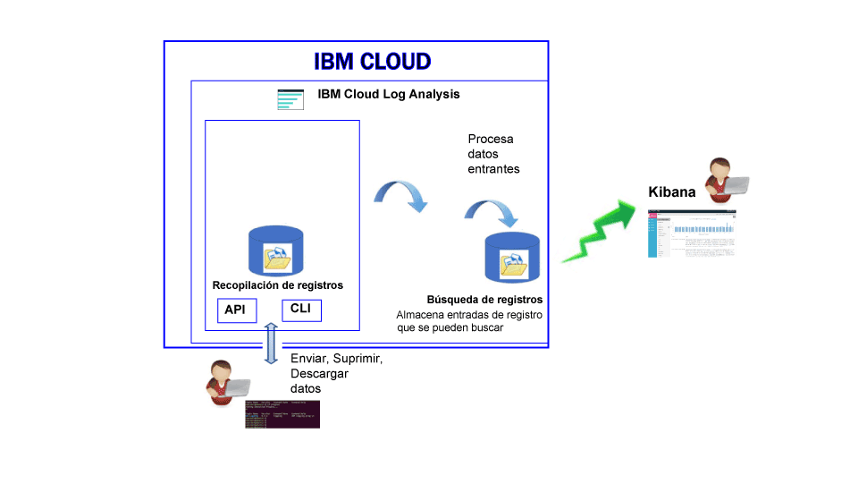

---

copyright:
  years: 2017

lastupdated: "2017-07-19"

---

{:shortdesc: .shortdesc}
{:new_window: target="_blank"}
{:codeblock: .codeblock}
{:screen: .screen}
{:pre: .pre}

# Acerca de
{: #log_analysis_ov}

Utilice el servicio {{site.data.keyword.loganalysisfull}} para ampliar la capacidad de recopilación de registros, de retención de registros y de búsqueda de registros en {{site.data.keyword.Bluemix}}. Autorice a su equipo de DevOps a utilizar características como la agregación de registros de aplicaciones y de entorno para consolidar aplicaciones o ver detalles del entorno, cifrar registros, retener datos de registro tanto como sea necesario y detectar y solucionar problemas con rapidez. Utilice Kibana para las tareas avanzadas de análisis.
{:shortdesc}

Las funciones de registro de {{site.data.keyword.Bluemix_notm}} están integradas en la plataforma:

* La recopilación de datos se habilita automáticamente para los recursos de la nube. De forma predeterminada, {{site.data.keyword.Bluemix_notm}} recopila y muestra los registros correspondientes a sus apps, tiempos de ejecución de apps y tiempos de ejecución del sistema en el que se ejecutan dichas apps. 
* Puede buscar hasta 500 MB de datos por día. 
* Los registros correspondientes a los 3 últimos días se guardan en la búsqueda de registros, un componente del servicio {{site.data.keyword.loganalysisshort}}.

Puede utilizar las funciones de registro de {{site.data.keyword.Bluemix_notm}} para comprender el comportamiento de la plataforma de nube y los recursos que se ejecutan la misma. No se requiere ninguna instrumentación especial para recopilar la salida estándar y los registros de error estándares. Por ejemplo, puede utilizar registros para proporcionar un seguimiento de auditoría para una aplicación, detectar problemas en un servicio, identificar vulnerabilidades, resolver problemas de despliegues de app y de comportamiento del tiempo de ejecución, detectar problemas en la infraestructura en la que se ejecuta la app, realizar un rastreo de la app entre los componentes de la plataforma de nube y detectar patrones que puede utilizar para tomar el control de acciones que podrían afectar al SLA del servicio.

En la siguiente figura se muestra una vista de alto nivel de los componentes del servicio {{site.data.keyword.loganalysisshort}}: 

Para recopilar y buscar registros de los recursos de nube, debe suministrar una instancia del servicio {{site.data.keyword.loganalysisshort}} en el mismo espacio de {{site.data.keyword.Bluemix_notm}} en el que se ejecutan dichos recursos de nube.

Los registros se recopilan y se almacenan de forma predeterminada en el componente de búsqueda de registros. Cuando seleccione un plan de servicio que incluya funciones ampliadas de búsqueda y recopilación, los registros también se recopilan y se almacenan en el componente de recopilación de registros. Los datos de registro que se almacenan en la recopilación de registros están cifrados.

El tamaño del registro que puede recopilar y almacenar en la recopilación de registros viene determinado por el plan de servicio que elija. Se paga por GB de datos al mes por los datos que se almacenan. Los registros se almacenan en el componente de recopilación de registros como JSON.

Puede utilizar 5.1 Kibana para las tareas avanzadas de análisis de búsqueda de registros:

* Cada plan limita el tamaño de registro puede buscar por día. 
* Las búsquedas solo cubren datos correspondiente a los 3 últimos días.

Para acceder a los registros de más de 3 días, puede utilizar la CLI del componente de recopilación de registros o la API de recopilación de registros para descargar registros localmente o bien puede direccionar los registros a otras aplicaciones o servicios de nube de otros proveedores. 

Puede suprimir registros automáticamente definiendo una política de retención o manualmente mediante la CLI de {{site.data.keyword.loganalysisshort}}.

## Por qué utilizar el servicio de registro
{: #value}

1. **Dedique menos tiempo a instrumentar la aplicación y más tiempo a mejorar su valor**

    {{site.data.keyword.loganalysislong_notm}} recopila automáticamente datos de servicios de nube de {{site.data.keyword.IBM_notm}} seleccionados, sin necesidad de instrumentación.
	
	Puede elegir la cantidad de registros que puede buscar por día.  Hay diferentes planes disponibles que puede utilizar para buscar hasta 500 MB, 2 GB, 5 GB y 10 GB de registros por día.

2. **Mantenga los datos de registro cerca de sus cargas de trabajo de aplicaciones y bien protegidos en soluciones de almacenamiento económicas en la nube**

    Recopile y almacene datos de registro de aplicaciones tradicionales y controladas por microservicios que se ejecuten en {{site.data.keyword.IBM_notm}} Cloud en un registro centralizado. Puede conservar los datos de registro tanto como desee.
	
	Los registros se almacenan en el almacenamiento de {{site.data.keyword.IBM_notm}}. Puede descargar registros cuando los necesite.

3. **Obtenga información detallada de su entorno para detectar, diagnosticar e identificar problemas con rapidez**

    Visualice, analice e interactúe con los datos mediante paneles de control que puede personalizar. Basadas en la plataforma Elastic Stack, las funciones de búsqueda de registros le ofrecen la flexibilidad y familiaridad de Kibana para adaptar rápidamente su panel de control a sus necesidades.

4. **Integración potente con las API**

    Integre los datos de registro en sus aplicaciones y operaciones mediante las API del servicio. Utilice las API de servicio {{site.data.keyword.loganalysisshort}} para gestionar los registros retenidos y enviar datos de registro desde fuera de {{site.data.keyword.IBM_notm}} Cloud.

	
## Recopilación de registros
{: #log_collection}

De forma predeterminada, {{site.data.keyword.Bluemix_notm}} almacena datos correspondientes a un máximo de 3 días en el componente de búsqueda de registros:   

* Se almacena un máximo de 500 MB por espacio de datos al día. Cualquier registro que supere dicha capacidad de 500 MB se descartará. Las asignaciones de capacidades se restablecen todos los días a las 12:30 AM UTC.
* Se pueden buscar hasta 1,5 GB de datos para un máximo de 3 días. Los datos de registro se renuevan (Primero en entrar, primero en salir) una vez que se ha alcanzado 1,5 GB de datos o después de 3 días.

El servicio {{site.data.keyword.loganalysisshort}} proporciona planes adicionales que le permiten almacenar registros en la recopilación de registros tanto tiempo como desee. Para obtener más información sobre cada plan, consulte [Planes de servicio](/docs/services/CloudLogAnalysis/log_analysis_ov.html#plans).

## Supresión de registros
{: #log_deletion}

Los registros que se almacenan en búsqueda de registros se suprimen transcurridos 3 días.

Los registros que se almacenan en el componente de recopilación de registros se suprimen automáticamente transcurridos 30 días, a menos que configure una política de retención. 

* Puede configurar una política de retención de registros para definir el número de días que desea conservar los registros en la recopilación de registros. Para obtener más información, consulte [Política de retención de registros](/docs/services/CloudLogAnalysis/log_analysis_ov.html#policies).

* Para inhabilitar la política, establezca su valor en *-1*. 

Puede utilizar la API de recopilación de registros o la CLI de recopilación de registros para suprimir registros manualmente del componente de recopilación de registros. Para obtener más información sobre cómo suprimir registros manualmente mediante la CLI, consulte [cf logging delete](/docs/services/CloudLogAnalysis/reference/logging_cli.html#delete).

## Ingestión de registros
{: #log_ingestion}

Todos los planes de servicio de {{site.data.keyword.loganalysisshort}}, excepto el plan *Lite*, incluyen la posibilidad de enviar registros al componente de recopilación de registros desde fuera de {{site.data.keyword.IBM_notm}} Cloud. Para obtener más información sobre los planes, consulte [Planes de servicio](/docs/services/CloudLogAnalysis/log_analysis_ov.html#plans).

Puede enviar registros a {{site.data.keyword.loganalysisshort}} mediante el reenviador de Logstash multiarrendatario. Para obtener más información, consulte el apartado sobre [Envío de datos de registro mediante el reenviador de Logstash multiarrendatario (mt-logstash-forwarder).](/docs/services/CloudLogAnalysis/how-to/send-data/send_data_mt.html#send_data_mt).

## Búsquedas en los registros
{: #log_search}

De forma predeterminada, puede utilizar Kibana 5.1 para buscar un máximo de 500 MB de registros por día en {{site.data.keyword.Bluemix_notm}}. 

El servicio {{site.data.keyword.loganalysisshort}} proporciona varios planes. Cada plan tiene distintas funciones de búsqueda de registros; por ejemplo, el plan *Recopilación de registros* le permite buscar un máximo de 1 GB de datos al día. Para obtener más información sobre los planes, consulte [Planes de servicio](/docs/services/CloudLogAnalysis/log_analysis_ov.html#plans).

## Análisis de registro en Bluemix
{: #logging_bmx_ov_ui}

En {{site.data.keyword.Bluemix_notm}}, puede ver el reciente los registros recientes o los registros de cola en tiempo real para las apps o contenedores de CF desplegados en una infraestructura gestionada por {{site.data.keyword.Bluemix_notm}}:

* Puede ver, filtrar y analizar registros a través de la interfaz de usuario. Para obtener más información, consulte [Análisis de registros desde la consola de Bluemix](/docs/services/CloudLogAnalysis/logging_view_dashboard.html#analyzing_logs_bmx_ui).

* Puede ver, filtrar y analizar registros mediante la línea de mandatos para gestionar registros mediante programación. Para obtener más información, consulte [Análisis de registros desde la interfaz de línea de mandatos](/docs/services/CloudLogAnalysis/logging_view_cli.html#analyzing_logs_cli).

* Puede realizar un análisis avanzado mediante Kibana.

## Análisis avanzado de registros con Kibana
{: #logging_bmx_ov_kibana}

En {{site.data.keyword.Bluemix_notm}}, puede utilizar Kibana, una plataforma de visualización y análisis de código abierto, para supervisar, buscar, analizar y visualizar datos en diversos gráficos, como diagramas y tablas. Para obtener más información, consulte [Análisis avanzado de registros con Kibana](/docs/services/CloudLogAnalysis/kibana/analyzing_logs_Kibana.html#analyzing_logs_Kibana).

## Gestión de registros mediante la CLI
{: #managing_logs}

Utilice la CLI de {{site.data.keyword.loganalysisshort}} para gestionar registros.

* Para ver cómo se instala la CLI, consulte [Instalación de la CLI de registro](/docs/services/CloudLogAnalysis/how-to/manage-logs/config_log_collection_cli.html#config_log_collection_cli).
* Para comprobar la versión de la CLI, ejecute el mandato [cf logging](/docs/services/CloudLogAnalysis/reference/logging_cli.html#base) con el parámetro * -version*.
* Para obtener ayuda sobre cómo se ejecutan los mandatos, consulte [Obtención de ayuda en línea de mandatos para ejecutar mandatos](/docs/services/CloudLogAnalysis/how-to/manage-logs/config_log_collection_cli.html#cli_help).

Para obtener información general sobre los registros, utilice el mandato `cf logging status`. Por ejemplo, puede realizar lo siguiente:

* [Obtenga información sobre los registros durante un periodo de tiempo](/docs/services/CloudLogAnalysis/how-to/manage-logs/viewing_log_information.html#viewing_logs).
* [Obtenga información sobre un tipo de registro durante un periodo de tiempo](/docs/services/CloudLogAnalysis/how-to/manage-logs/viewing_log_information.html#viewing_logs_by_log_type).
* [Obtenga información de cuenta sobre los registros](/docs/services/CloudLogAnalysis/how-to/manage-logs/viewing_log_information.html#viewing_logs_account).

Para mantener el coste bajo control, es posible que desee supervisar el tamaño de los registros de sus apps durante un periodo de tiempo. Por ejemplo, quizás desee saber el tamaño de cada tipo de registro durante una semana para un espacio de {{site.data.keyword.Bluemix_notm}} a fin de identificar si alguna app o servicio está generando más registros de los esperados. Para comprobar el tamaño de los registros, utilice el mandato `cf logging status`. Para obtener más información, consulte [Visualización de la información de registro](/docs/services/CloudLogAnalysis/how-to/manage-logs/viewing_log_information.html#viewing_log_status).

Puede buscar los registros correspondientes a los 3 últimos días en Kibana. Para poder analizar datos de registro más antiguos, puede descargar los registros en un archivo local, o bien puede dirigir estos registros a otros programas como, por ejemplo, Elastic Stack local. Para obtener más información, consulte [Descarga de registros](/docs/services/CloudLogAnalysis/how-to/manage-logs/downloading_logs.html#downloading_logs).

Para suprimir manualmente los registros que ya no necesita, utilice el mandato [cf logging delete](/docs/services/CloudLogAnalysis/reference/logging_cli.html#delete). 

## Políticas
{: #policies}

**Política de retención de registros**

Puede utilizar la CLI de {{site.data.keyword.loganalysisshort}} para ver y configurar la política de retención de registros. Esta política especifica el número de días que los registros se conservan en el componente de recopilación de registros. 

* De forma predeterminada, los registros se conservan durante 30 días. 
* Una vez transcurrido el periodo de retención, los registros se suprimen automáticamente del componente de recopilación de registros y no se pueden recuperar.
* Puede especificar un periodo de retención para una cuenta. El periodo de retención se configura automáticamente para todos los espacios de esa cuenta. 
* Puede especificar un periodo de retención para un espacio de {{site.data.keyword.Bluemix_notm}}.
* Puede cambiar la política de retención siempre que lo desee.
* Para inhabilitar la política, establezca su valor en *-1*. 

**Nota:** Cuando se inhabilita la política de retención de registros, se deben mantener los registros en el componente de recopilación de registros. Puede utilizar el mandato de la CLI [cf logging delete](/docs/services/CloudLogAnalysis/reference/logging_cli.html#delete) para suprimir los registros antiguos.

Para obtener más información, consulte [Visualización y configuración de la política de retención de registros](/docs/services/CloudLogAnalysis/how-to/manage-logs/configuring_retention_policy.html#configuring_retention_policy).

## Planes de servicio
{: #plans}

El servicio {{site.data.keyword.loganalysisshort}} proporciona varios planes. Cada plan tiene distinta capacidad de recopilación de registros y de búsqueda de registros. 

Puede cambiar un plan mediante la interfaz de usuario de {{site.data.keyword.Bluemix_notm}} o a través de la línea de mandatos. Puede actualizar o reducir el plan siempre que lo desee. Para obtener más información sobre las actualizaciones de los planes de servicio en {{site.data.keyword.Bluemix_notm}}, consulte [Cambio del plan](/docs/services/CloudLogAnalysis/plan/change_plan.html#change_plan). 

En la tabla siguiente se muestran los planes disponibles:

<table>
    <caption>Resumen de la capacidad de búsqueda de registros y de recopilación de registros por plan</caption>
      <tr>
        <th>Plan</th>
        <th>Ingestión de registros</th>
        <th>Retención de anotaciones</th>
        <th>Cifrado de datos</th>
        <th>Búsqueda de registros</th>
      </tr>
      <tr>
        <td>Lite (predeterminado)</td>
        <td>No</td>
        <td>Últimos 3 días</td>
        <td>No</td>
        <td>Búsqueda de hasta 500 MB</td>
      </tr>
      <tr>
        <td>Recopilación de registros</td>
        <td>Sí</td>
        <td>Número de días que se puede configurar</td>
        <td>Sí</td>
        <td>Búsqueda de hasta 500 MB al día</td>
      </tr>
      <tr>
        <td>Recopilación de registros con búsqueda de 2 GB/día</td>
        <td>Sí</td>
        <td>Número de días que se puede configurar</td>
        <td>Sí</td>
        <td>Búsqueda de hasta 2 GB al día</td>
      </tr>
      <tr>
        <td>Recopilación de registros con búsqueda de 5 GB/día</td>
        <td>Sí</td>
        <td>Número de días que se puede configurar</td>
        <td>Sí</td>
        <td>Búsqueda de hasta 5 GB al día</td>
      </tr>
       <tr>
        <td>Recopilación de registros con búsqueda de 10 GB/día</td>
        <td>Sí</td>
        <td>Número de días que se puede configurar</td>
        <td>Sí</td>
        <td>Búsqueda de hasta 10 GB al día</td>
      </tr>
</table>

**Nota:** el coste mensual del almacenamiento en la recopilación de registros se calcula como promedio del ciclo de facturación.

## Regiones
{: #regions}

El servicio {{site.data.keyword.loganalysisfull_notm}} está disponible en la siguiente región:

* EE.UU. sur

