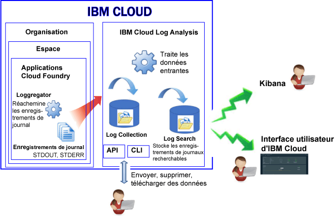

---

copyright:
  years: 2017

lastupdated: "2017-07-19"

---

{:shortdesc: .shortdesc}
{:new_window: target="_blank"}
{:codeblock: .codeblock}
{:screen: .screen}
{:pre: .pre}

# Journalisation des applications Cloud Foundry dans Bluemix
{: #logging_bluemix_cf_apps}

Dans {{site.data.keyword.Bluemix}}, vous pouvez visualiser, filtrer et analyser des journaux Cloud Foundry (CF) via le tableau de bord {{site.data.keyword.Bluemix_notm}}, Kibana, et l'interface de ligne de commande. En outre, vous pouvez compacter des enregistrements de journal dans un outil de gestion de journal externe. 
{:shortdesc}

{{site.data.keyword.Bluemix_notm}} enregistre les données de journal générées par la plateforme Cloud Foundry et par les applications Cloud Foundry. Ces journaux comportent les erreurs, les avertissements et les messages d'information qui sont générés pour votre application. 

Lorsque vous exécutez vos applications dans une plateforme sous forme de services cloud, telle que Cloud Foundry sur {{site.data.keyword.Bluemix_notm}}, vous ne pouvez pas ouvrir une session SSH ou FTP dans l'infrastructure sur laquelle vos applications s'exécutent pour accéder aux journaux. La plateforme est contrôlée par le fournisseur de cloud. Les applications Cloud Foundry qui s'exécutent sur {{site.data.keyword.Bluemix_notm}} utilisent le composant Loggrerator pour réacheminer des enregistrements de journal depuis l'infrastructure Cloud Foundry. Le composant Loggregator prélève automatiquement des données de sortie standard et d'erreur standard. Vous pouvez visualiser et analyser ces journaux via le tableau de bord {{site.data.keyword.Bluemix_notm}}, la plateforme Kibana et l'interface de ligne de commande.

La figure suivante montre une vue générale de la journalisation des applications Cloud Foundry dans {{site.data.keyword.Bluemix_notm}} :

 
La journalisation des applications Cloud Foundry est activée automatiquement lorsque vous utilisez l'infrastructure Cloud Foundry pour exécuter vos applications sur {{site.data.keyword.Bluemix_notm}}. Pour consulter les journaux d'exécution de Cloud Foundry, vous devez consigner vos journaux dans les fichiers STDOUT et STDERR. Pour plus d'informations, voir [Journalisation d'application d'exécution via des applications CF](/docs/services/CloudLogAnalysis/cfapps/logging_writing_to_log_from_cf_app.html#logging_writing_to_log_from_cf_app).

{{site.data.keyword.Bluemix_notm}} conserve une quantité limitée d'informations de journal. Lorsque des informations sont journalisées, les anciennes informations sont remplacées par les informations plus récentes. Si vous devez vous mettre en conformité avec des politiques d'organisation ou d'industrie qui nécessitent de conserver une partie ou la totalité des informations de journal à des fins d'audit ou autres, vous pouvez compacter vos journaux sur un hôte de journaux externe, par exemple, un service de gestion des
journaux tiers ou sur un autre hôte. Pour plus d'informations, voir [Configuration d'hôtes de journaux externes](/docs/services/CloudLogAnalysis/external/logging_external_hosts.html#thirdparty_logging).

## Ingestion de journaux
{: #log_ingestion}

Le service {{site.data.keyword.loganalysisshort}} propose différents plans. Chaque plan définit si vous pouvez envoyer des journaux à la collecte de journaux ou non. Tous les
plans, à l'exception du plan *Lite*, offrent la possibilité d'envoyer des journaux à la collecte de journaux. Pour plus d'informations sur les plans, voir
[Plans de service](/docs/services/CloudLogAnalysis/log_analysis_ov.html#plans).

Vous pouvez envoyer des journaux dans {{site.data.keyword.loganalysisshort}} à l'aide du réexpéditeur Logstash à service partagé. Pour plus d'informations, voir [Envoyer des données de journaux à l'aide d'un réexpéditeur Logstash à service partagé (mt-logstash-forwarder).](/docs/services/CloudLogAnalysis/how-to/send-data/send_data_mt.html#send_data_mt).

## Collecte de journaux
{: #log_collection}

Par défaut, {{site.data.keyword.Bluemix_notm}} stocke les données de journal dans Log Search pendant un maximum de 3 jours :   

* Un maximum de 500 Mo par espace de données est stocké par jour. Les journaux dépassant le plafond de 500 Mo sont rejetés. Les allocations de plafond sont réinitialisées chaque jour à 00h30 (temps universel coordonné).
* Il est possible de rechercher jusqu'à 1,5 Go de données sur un maximum de 3 jours. Les données de journal sont écrasées (sur la base Premier entré, premier sorti) une fois que la
limite de 1,5 Go de données est atteinte ou au bout de 3 jours.

Le service {{site.data.keyword.loganalysisshort}} fournit des plans additionnels qui vous permettent de stocker des journaux dans la collecte de journaux aussi longtemps que vous
en avez besoin. Pour obtenir plus d'informations sur le tarif de chaque plan, voir [Plans de service](/docs/services/CloudLogAnalysis/log_analysis_ov.html#plans).

Vous pouvez configurer une règle de conservation des journaux que vous pouvez utiliser pour définir le nombre de jours pendant lesquels vous souhaitez conserver les journaux dans la
collecte de journaux. Pour plus d'informations, voir [Règle de conservation des journaux](/docs/services/CloudLogAnalysis/log_analysis_ov.html#policies).

## Recherche de journaux
{: #log_search}

Par défaut, vous pouvez utiliser Kibana pour rechercher jusqu'à 500 Mo de journaux par jour dans {{site.data.keyword.Bluemix_notm}}. 

Le service {{site.data.keyword.loganalysisshort}} offre plusieurs plans. Chaque plan offre des fonctions de recherche de journaux différentes. Par exemple, le plan *Collecte
de journaux* vous permet de rechercher jusqu'à 1 Go de données par jour. Pour plus d'informations sur les plans, voir
[Plans de service](/docs/services/CloudLogAnalysis/log_analysis_ov.html#plans).

## Méthodes d'analyse de journaux d'application CF
{: #logging_bluemix_cf_apps_log_methods}

Vous pouvez choisir l'une des méthodes suivantes pour analyser les journaux de votre application Cloud Foundry :

* Analyser le journal dans {{site.data.keyword.Bluemix_notm}} pour visualiser la dernière activité de l'application.
    
    Dans {{site.data.keyword.Bluemix_notm}}, vous pouvez visualiser, filtrer et analyser des journaux via l'onglet **Journal** disponible pour chaque application Cloud Foundry. Pour plus d'informations, voir [Analyse des journaux d'application CF dans le tableau de bord Bluemix](/docs/services/CloudLogAnalysis/logging_view_dashboard.html#analyzing_logs_bmx_ui).
    
* Analyser les journaux dans Kibana pour effectuer des tâches analytiques avancées.
    
    Dans {{site.data.keyword.Bluemix_notm}}, vous pouvez utiliser la plateforme de visualisation et d'analyse open source Kibana pour surveiller, rechercher, analyser et visualiser des données dans différents graphiques, par exemple, des diagrammes et des tableaux. Pour plus d'informations, voir [Analyse des journaux dans Kibana](/docs/services/CloudLogAnalysis/kibana/analyzing_logs_Kibana.html#analyzing_logs_Kibana).
	
	**Astuce :** pour lancer Kibana, voir [Accès à Kibana depuis le
tableau de bord d'une application CF](/docs/services/CloudLogAnalysis/kibana/launch.html#launch_Kibana_from_cf_app).

* Analyser des journaux via l'interface de ligne de commande pour utiliser des commandes permettant de gérer des journaux à l'aide d'un programme.
    
    Dans {{site.data.keyword.Bluemix_notm}}, vous pouvez visualiser, filtrer et analyser des journaux via l'interface de ligne de commande à l'aide de la commande **cf logs**. Pour plus d'informations, voir [Analyse des journaux d'application Cloud Foundry depuis l'interface de ligne de commande](/docs/services/CloudLogAnalysis/logging_view_cli.html#analyzing_logs_cli).

## Sources de journal pour applications CF déployées sur Diego
{: #cf_apps_log_sources_diego}

Les sources de journal suivantes sont disponibles pour les applications Cloud Foundry (CF) qui sont déployées dans l'architecture Cloud Foundry reposant sur Diego :
    
| Source de journal | Nom du composant | Description | 
|------------|----------------|-------------|
| LGR | Loggregator | Le composant LGR fournit des informations sur Cloud Foundry Loggregator, lequel réachemine des journaux depuis Cloud Foundry. |
| RTR | Router | Le composant RTR fournit des informations sur les requêtes HTTP adressées à une application. | 
| STG | Staging | Le composant STG fournit des informations sur la manière dont une application est constituée ou reconstituée. | 
| APP | Application | Le composant APP fournit des journaux issus de l'application. C'est là que la sortie standard et l'erreur standard de votre code apparaîtront. | 
| API | Cloud Foundry API | Le composant API fournit des informations sur les actions en interne résultant d'une demande utilisateur pour modifier l'état d'une application. | 
| CELL | Diego cell | Le composant CELL fournit des informations sur le démarrage, l'arrêt ou la panne d'une application.|
| SSH | SSH | Le composant SSH fournit des informations chaque fois qu'un utilisateur accède à une application via la commande **cf ssh**. |
{: caption="Tableau 1. Sources de journal des applications CF déployées dans une architecture CF basée sur Diego" caption-side="top"}

La figure suivante montre les différents composants (sources de journal) dans une architecture Cloud Foundry basée sur Diego : 

 dans une architecture Cloud Foundry basée sur Diego.")
	
## Sources de journal des applications CF déployées sur DEA
{: #logging_bluemix_cf_apps_log_sources}

Les sources de journal suivantes sont disponibles pour les applications Cloud Foundry (CF) qui sont déployées sur une architecture Droplet Execution Agent (DEA) :
    
| Source de journal | Nom du composant | Description | 
|------------|----------------|-------------|
| LGR | Loggregator | Le composant LGR fournit des informations sur Cloud Foundry Loggregator, lequel réachemine des journaux depuis Cloud Foundry. |
| RTR | Router | Le composant RTR fournit des informations sur les requêtes HTTP adressées à une application. | 
| STG | Staging | Le composant STG fournit des informations sur la manière dont une application est constituée ou reconstituée. | 
| APP | Application | Le composant APP fournit des journaux issus de l'application. C'est là que la sortie standard et l'erreur standard de votre code apparaîtront. | 
| API | Cloud Foundry API | Le composant API fournit des informations sur les actions en interne résultant d'une demande utilisateur pour modifier l'état d'une application. | 
| DEA | Droplet Execution Agent | Le composant DEA fournit des informations sur le démarrage, l'arrêt ou la panne d'une application.   Ce composant est disponible uniquement si votre application est déployée dans l'architecture Cloud Foundry qui est basée sur DEA. | 
{: caption="Tableau 2. Sources de journal pour les applications CF qui sont déployées dans une architecture CF basée sur DEA" caption-side="top"}

La figure suivante montre les différents composants (sources de journal) dans une architecture Cloud Foundry basée sur DEA : 

 dans une architecture Cloud Foundry basée sur Droplet Execution Agent (DEA).")

