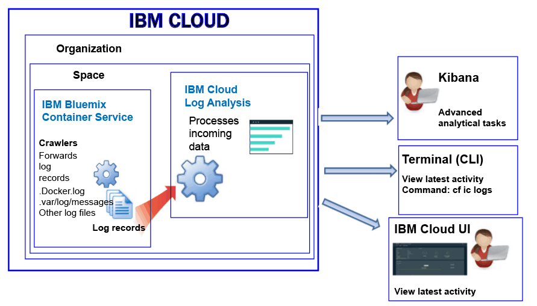

---

copyright:
  years: 2017, 2018

lastupdated: "2018-01-10"

---

{:shortdesc: .shortdesc}
{:new_window: target="_blank"}
{:codeblock: .codeblock}
{:screen: .screen}
{:pre: .pre}

# Journalisation pour un conteneur géré par IBM Cloud (déprécié)
{: #containers_bluemix}

Vous pouvez afficher, filtrer et analyser les journaux pour les conteneurs Docker qui sont déployés dans l'infrastructure gérée par {{site.data.keyword.IBM}}.
{:shortdesc}

Les journaux de conteneur sont surveillés et retransmis depuis un emplacement hors du conteneur par le biais de moteurs de balayage. Les données sont envoyées par les moteurs de balayage à un service partagé Elasticsearch dans {{site.data.keyword.Bluemix_notm}}.

Le diagramme suivant présente une vue d'ensemble de la journalisation pour {{site.data.keyword.containershort}} :

Par défaut, les journaux suivants sont collectés pour un conteneur déployé dans l'infrastructure de cloud gérée par {{site.data.keyword.Bluemix_notm}} :

<table>
  <caption>Tableau 2. Journaux collectés pour les conteneurs déployés dans l'infrastructure gérée par {{site.data.keyword.Bluemix_notm}}</caption>
  <tbody>
    <tr>
      <th align="center">Journal</th>
      <th align="center">Description</th>
    </tr>
    <tr>
      <td align="left" width="30%">/var/log/messages</td>
      <td align="left" width="70%"> Par défaut, les messages Docker sont consignés dans le dossier /var/log/messages du conteneur. Ce journal inclut les messages système.
      </td>
    </tr>
    <tr>
      <td align="left">./docker.log</td>
      <td align="left">Il s'agit du journal Docker.   Le fichier journal Docker n'est pas stocké sous la forme d'un fichier dans le conteneur mais il est tout de même collecté. Ce fichier journal est collecté par défaut conformément à la convention Docker standard relative à l'exposition des informations de la sortie standard (stdout) et de l'erreur standard (stderr) pour le conteneur. Les informations de tous les processus de conteneur consignées dans la sortie standard ou l'erreur standard sont collectées.
      </td>
     </tr>
  </tbody>
</table>

## Analyse des journaux
{: #logging_containers_ov_methods}

Afin d'analyser les données de journal de conteneur, utilisez Kibana pour effectuer des tâches analytiques avancées. Vous pouvez utiliser la plateforme de visualisation et d'analyse open source Kibana pour surveiller, rechercher, analyser et afficher des données dans différents graphiques, par exemple dans des diagrammes et des tableaux. Pour plus d'informations, voir [Analyse des journaux dans Kibana](/docs/services/CloudLogAnalysis/kibana/analyzing_logs_Kibana.html#analyzing_logs_Kibana).

## Collecte de journaux personnalisés
{: #collect_custom_logs}

Pour collecter des informations de journaux supplémentaires, ajoutez la variable d'environnement **LOG_LOCATIONS** en spécifiant le chemin d'accès au fichier journal lorsque vous créez le conteneur. 

Vous pouvez ajouter plusieurs fichiers journaux en les séparant par des virgules. 

Pour plus d'informations, voir [Collecte de données de journaux autres que celles par défaut d'un conteneur](logging_containers_other_logs.html#logging_containers_collect_data).

## Recherche des journaux
{: #log_search}

Par défaut, vous pouvez utiliser Kibana pour rechercher jusqu'à 500 Mo de journaux par jour dans {{site.data.keyword.Bluemix_notm}}. 

Le service {{site.data.keyword.loganalysisshort}} fournit plusieurs plans. Chaque plan offre des fonctions de recherche de journaux différentes. Par exemple, le plan
*Collecte de journaux* vous permet de rechercher jusqu'à 1 Go de données par jour. Pour plus d'informations sur les plans, voir
[Plans de service](/docs/services/CloudLogAnalysis/log_analysis_ov.html#plans).

## Envoi de journaux pour pouvoir utiliser les zones dans un message comme zones de recherche Kibana
{: #send_data_in_json}

Par défaut, la journalisation est automatiquement activée pour les conteneurs. Chaque entrée du fichier journal Docker est affichée dans Kibana dans la zone `message`. Si vous avez besoin de filtrer et d'analyser vos données dans Kibana en utilisant une zone spécifique figurant dans l'entrée de journal de conteneur, configurez votre application afin d'envoyer une sortie au format JSON valide.

Procédez comme suit pour envoyer des journaux dans lesquels les entrées de journal de conteneur sont analysées en tant que zones individuelles :

1. Consignez le message dans un fichier. 
2. Ajoutez le fichier journal à la liste des journaux non définis par défaut qui sont disponibles pour l'analyse à partir d'un conteneur. Pour plus d'informations, voir [Collecte des données de journaux autres que celles par défaut d'un conteneur](logging_containers_other_logs.html#logging_containers_collect_data). 
    
Lorsque des entrées de journal JSON sont envoyées au fichier de journal Docker d'un conteneur sous la forme d'une sortie standard (STDOUT), elles ne sont pas analysées en tant qu'entrées JSON. 
    
Si vous consignez un message dans un fichier et qu'il constitue une structure JSON valide, les zones sont analysées et de nouvelles zones sont créées pour chaque zone du message. Seules les valeurs de zone de type chaîne sont disponibles pour le filtrage et le tri dans Kibana.

## Stockage des journaux dans le composant Log Collection
{: #store_logs}

Par défaut, {{site.data.keyword.Bluemix_notm}} stocke les données de journal jusqu'à 3 jours :   

* Un maximum de 500 Mo de données par espace est stocké par jour. Les journaux dépassant le plafond de 500 Mo sont rejetés. Les allocations de plafond sont réinitialisées chaque jour à 00h30 (temps universel coordonné).
* Il est possible de rechercher jusqu'à 1,5 Go de données sur un maximum de 3 jours. Les données de journal sont écrasées (sur la base Premier entré, premier sorti) une fois que la
limite de 1,5 Go de données est atteinte ou au bout de 3 jours.

Le service {{site.data.keyword.loganalysisshort}} fournit des plans additionnels qui vous permettent de stocker des journaux dans Log Collection aussi longtemps que vous
en avez besoin. Pour obtenir plus d'informations sur le tarif de chaque plan, voir [Plans de service](/docs/services/CloudLogAnalysis/log_analysis_ov.html#plans).

Si vous devez stocker les journaux ou effectuer des recherches dans des journaux plus volumineux, vous pouvez mettre à disposition le service {{site.data.keyword.loganalysisshort}} et choisir un autre plan de service. Les plans supplémentaires permettent de stocker les journaux dans Log Collection aussi longtemps que nécessaire et d'effectuer des recherches dans des journaux plus volumineux. Pour plus d'informations, voir [Plans de service](/docs/services/CloudLogAnalysis/log_analysis_ov.html#plans).

## Affichage des journaux
{: #logging_containers_ov_methods_view_bmx}

Vous pouvez afficher les journaux les plus récents pour un conteneur déployé dans l'infrastructure gérée par {{site.data.keyword.Bluemix_notm}} en appliquant l'une des méthodes suivantes :

* Affichage des journaux via l'interface utilisateur {{site.data.keyword.Bluemix_notm}} pour consulter l'activité la plus récente du conteneur.
    
    Vous pouvez afficher, filtrer et analyser des journaux via l'onglet **Surveillance et journaux** présent pour chaque conteneur. 
	
	Pour afficher les journaux de déploiement ou d'exécution d'un conteneur Docker déployé ans l'infrastructure gérée par {{site.data.keyword.IBM_notm}}, procédez comme suit :

    1. Dans le tableau de bord Applications, cliquez sur le nom du conteneur unique ou du groupe de conteneurs. 
    
    2. Dans la page des informations d'application détaillées, cliquez sur **Surveillance et journaux**.

    3. Sélectionnez l'onglet **Journalisation**. Depuis l'onglet **Journalisation**, vous pouvez afficher les journaux récents de votre conteneur ou suivre des journaux en temps réel. 
	
* Affichage des journaux via l'interface de ligne de commande {{site.data.keyword.containershort}}. Utilisez des commandes pour gérer les journaux à l'aide d'un programme.
    
    Vous pouvez afficher, filtrer et analyser des journaux via l'interface de ligne de commande en utilisant la commande **cf ic logs**. 
	
	Utilisez la commande `bx cf ic logs` pour afficher les journaux depuis un conteneur dans {{site.data.keyword.Bluemix_notm}}. Par exemple, vous pouvez utiliser les journaux pour comprendre pourquoi un conteneur s'est arrêté ou pour examiner la sortie du conteneur. 
	
	Pour que vous puissiez examiner les erreurs d'application de l'application s'exécutant dans un conteneur via la commande `cf ic logs`, l'application doit consigner ses journaux dans les flux de sortie standard (STDOUT) et d'erreur standard (STDERR). Si vous concevez votre application en vue de la consignation dans ces flux de sortie standard, vous pouvez consulter les journaux via la ligne de commande même si le conteneur est arrêté ou en panne.

    Pour plus d'informations sur la commande `cf ic logs`, voir [Commande cf ic logs](/docs/containers/container_cli_reference_cfic.html#container_cli_reference_cfic__logs).

