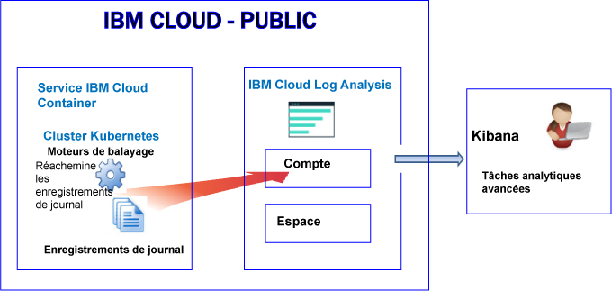
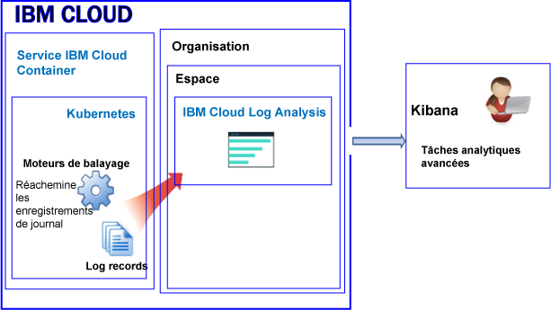
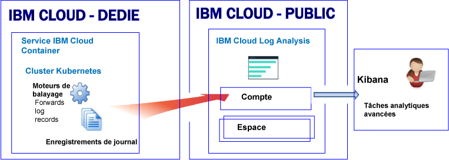

---

copyright:
  years: 2017, 2018

lastupdated: "2018-02-01"

---

{:new_window: target="_blank"}
{:shortdesc: .shortdesc}
{:screen: .screen}
{:pre: .pre}
{:table: .aria-labeledby="caption"}
{:codeblock: .codeblock}
{:tip: .tip}
{:download: .download}


# Journalisation des ressources dans un cluster Kubernetes
{: #containers_kubernetes}

Vous pouvez afficher, filtrer et analyser des journaux pour les ressources d'un cluster Kubernetes via le service {{site.data.keyword.loganalysisshort}} dans {{site.data.keyword.Bluemix_notm}}.
{:shortdesc}

Par défaut, l'envoi de journaux depuis un cluster au service {{site.data.keyword.loganalysisshort}} n'est pas activé automatiquement. **Remarque :** il s'agit d'une modification récente pour les nouveaux clusters. Auparavant, lorsque vous créiez un cluster, les informations qu'un processus de conteneur enregistrait dans la sortie standard (stdout) et l'erreur standard (stderr) étaient collectées automatiquement par {{site.data.keyword.containershort}} et transmises au service {{site.data.keyword.loganalysisshort}}. Désormais, vous devez créer une ou plusieurs configurations de journalisation dans le cluster pour transférer automatiquement des journaux au service {{site.data.keyword.loganalysisshort}}. 

Tenez compte des informations suivantes lorsque vous utilisez des journaux de cluster : 

* L'envoi d'informations à la sortie standard (stdout) et à l'erreur standard (stderr) est la convention Docker standard pour l'exposition des informations d'un conteneur.
* Les journaux de conteneur sont surveillés et retransmis depuis un emplacement hors du conteneur par le biais de moteurs de balayage. 
* Les données sont envoyées par les moteurs de balayage à un service partagé Elasticsearch dans {{site.data.keyword.Bluemix_notm}}. 
* Vous pouvez configurer votre cluster pour qu'il transfère les journaux de sortie standard et d'erreur standard, ainsi que d'autres journaux d'applications, des journaux de noeud d'agent, les journaux de composant système Kubernetes et les journaux de contrôleur Ingress au service {{site.data.keyword.loganalysisshort}}. Pour plus d'informations, voir [Collecte de journaux d'application et de cluster supplémentaires](/docs/services/CloudLogAnalysis/containers/containers_kubernetes.html#collect_logs).

## A propos de la journalisation dans l'environnement public
{: #public}

Dans {{site.data.keyword.Bluemix_notm}}, vous pouvez utiliser le service {{site.data.keyword.loganalysisshort}} pour stocker et analyser des journaux de conteneur et des journaux de cluster Kubernetes qui sont collectés automatiquement par {{site.data.keyword.containershort}} dans l'environnement public.

Vous pouvez disposer d'un ou de plusieurs clusters Kubernetes sur votre compte. Les journaux sont collectés automatiquement par {{site.data.keyword.containershort}} dès que le cluster est mis à disposition. 

* Les journaux d'application sont collectés dès que le pod est déployé. 
* Les informations qu'un processus de conteneur affiche dans la sortie standard (stdout) et l'erreur standard (stderr) sont collectées automatiquement par le service {{site.data.keyword.containershort}}. 

Pour que ces journaux soient disponibles pour l'analyse dans le service {{site.data.keyword.loganalysisshort}}, vous devez configurer votre cluster pour le transfert des journaux de cluster dans {{site.data.keyword.loganalysisshort}}. Vous pouvez transférer les journaux à votre domaine de compte ou à un domaine d'espace sur votre compte. 

* Pour les clusters disponibles dans la région Sud des Etats-Unis, envoyez les journaux au service {{site.data.keyword.loganalysisshort}} qui est disponible dans la région Sud des Etats-Unis.
* Pour les clusters disponibles dans la région Est des Etats-Unis, envoyez les journaux au service {{site.data.keyword.loganalysisshort}} qui est disponible dans la région Sud des Etats-Unis.
* Pour les clusters disponibles dans la région Allemagne, envoyez les journaux au service {{site.data.keyword.loganalysisshort}} qui est disponible dans la région Allemagne.
* Pour les clusters disponibles dans la région Sydney, envoyez les journaux au service {{site.data.keyword.loganalysisshort}} qui est disponible dans la région Sydney.
* Pour les clusters disponibles dans la région Royaume-Uni, envoyez les journaux au service {{site.data.keyword.loganalysisshort}} qui est disponible dans la région Allemagne.


Si vous voulez analyser des données de journal dans Kibana pour un cluster, tenez compte des informations suivantes : 

* Vous devez lancer Kibana dans la région publique dans laquelle l'instance {{site.data.keyword.loganalysisshort}} que vous utilisez pour afficher les journaux a été mise à disposition. 
* Votre ID utilisateur doit disposer des droits permettant d'afficher les journaux. 

    Pour pouvoir afficher les journaux dans le domaine de compte, un utilisateur a besoin d'une règle IAM pour le service {{site.data.keyword.loganalysisshort}}. Il requiert les droits **Afficheur**. 
    
    Pour pouvoir afficher les journaux dans le domaine d'espace, l'utilisateur requiert le rôle CF. Pour plus d'informations, voir [Rôles requis par un utilisateur pour afficher les journaux](/docs/services/CloudLogAnalysis/kibana/analyzing_logs_Kibana.html#roles).

Pour pouvoir gérer les données de journal dans l'espace de stockage à long terme (Log Collection), votre ID utilisateur doit être associé à une règle IAM afin de pouvoir utiliser le service {{site.data.keyword.loganalysisshort}}. Il doit disposer des droits **Administrateur** ou **Editeur**.  Pour plus d'informations, voir [Rôles requis par un utilisateur pour gérer les journaux](/docs/services/CloudLogAnalysis/manage_logs.html#roles).

**Remarque :** si vous utilisez un cluster Kubernetes, les espaces de nom *ibm-system* et *kube-system* sont réservés. Vous ne devez pas créer, supprimer, modifier ou changer les droits d'accès aux ressources disponibles dans ces espaces. Les journaux de ces espaces de nom sont destinés à une utilisation par {{site.data.keyword.IBM_notm}}.


### Vue générale de la journalisation pour un cluster qui transfère des journaux au domaine de compte 
{: #acc}


Le diagramme ci-dessous offre une vue d'ensemble de la journalisation dans l'environnement public pour {{site.data.keyword.containershort}} lorsque le cluster transmet des journaux au domaine de compte. 




### Vue générale de la journalisation pour un cluster qui transfère des journaux à un domaine d'espace 
{: #space}

Le diagramme ci-dessous offre une vue d'ensemble de la journalisation dans l'environnement public pour {{site.data.keyword.containershort}} lorsque le cluster transmet des journaux au domaine d'espace. 




   


## A propos de la journalisation dans l'environnement dédié
{: #dedicated}

Dans {{site.data.keyword.Bluemix_notm}}, vous pouvez utiliser le service {{site.data.keyword.loganalysisshort}} dans l'environnement public pour stocker et analyser des journaux de conteneur et des journaux de cluster Kubernetes qui sont collectés automatiquement par {{site.data.keyword.containershort}} dans l'environnement dédié.

Prenez en compte les informations :

* Vous pouvez disposer d'un ou de plusieurs clusters Kubernetes sur votre compte. Les journaux sont collectés automatiquement par {{site.data.keyword.containershort}} dès qu'un cluster est mis à disposition.  
* Pour pouvoir afficher les journaux d'application et de cluster via le service {{site.data.keyword.loganalysisshort}}, vous devez définir une ou plusieurs configurations de journalisation dans un cluster. Chaque entrée de configuration définit quelles sont les informations qui sont transmises au service {{site.data.keyword.loganalysisshort}}. Par exemple, les données de journal de la sortie standard et de l'erreur standard sont collectées dès que le pod est déployé. Pour pouvoir transférer ces journaux, vous devez définir une configuration de journalisation pour une source de journal de type *conteneur*. 
* Lorsque vous définissez une configuration de journalisation, vous choisissez d'envoyer les journaux au domaine de compte ou à un domaine d'espace. **Remarque :** actuellement, le domaine de compte présente un quota de recherche maximal de 500 Mo par jour et vous ne pouvez pas stocker les journaux à long terme dans le composant Log Collection. Pour pouvoir rechercher des journaux plus volumineux et pour stocker des journaux dans le composant Log Collection, envoyez vos journaux dans un domaine d'espace. 
* Lorsque vous définissez une configuration de journalisation pour envoyer les journaux au domaine de compte, les journaux sont transférés au domaine de compte dans la région publique dans laquelle le service dédié {{site.data.keyword.containershort}} s'exécute. 

    Pour les clusters disponibles dans la région Sud des Etats-Unis, envoyez les journaux au service {{site.data.keyword.loganalysisshort}} qui est disponible dans la région Sud des Etats-Unis.</br>
    Pour les clusters disponibles dans la région Est des Etats-Unis, envoyez les journaux au service {{site.data.keyword.loganalysisshort}} qui est disponible dans la région Sud des Etats-Unis. </br>
    Pour les clusters disponibles dans la région Allemagne, envoyez les journaux au service {{site.data.keyword.loganalysisshort}} qui est disponible dans la région Allemagne. </br>
    Pour les clusters disponibles dans la région Sydney, envoyez les journaux au service {{site.data.keyword.loganalysisshort}} qui est disponible dans la région Sydney. </br>
    Pour les clusters disponibles dans la région Royaume-Uni, envoyez les journaux au service {{site.data.keyword.loganalysisshort}} qui est disponible dans la région Allemagne.


Si vous voulez afficher et analyser des données de journal pour un cluster dans Kibana, tenez compte des informations suivantes :

* Vous devez lancer Kibana dans la région publique de cloud dans laquelle l'instance {{site.data.keyword.loganalysisshort}} a été mise à disposition. 
* Votre ID utilisateur doit être associé à une règle IAM pour pouvoir utiliser le service {{site.data.keyword.loganalysisshort}}. Vous devez disposer des droits **Afficheur** pour pouvoir afficher les journaux dans le domaine de compte.  

Pour pouvoir gérer les données de journal dans l'espace de stockage à long terme (Log Collection), votre ID utilisateur doit être associé à une règle IAM afin de pouvoir utiliser le service {{site.data.keyword.loganalysisshort}}. Vous devez disposer des droits **Administrateur** ou **Editeur**.  

Le diagramme suivant offre une vue d'ensemble de la journalisation dans l'environnement dédié pour {{site.data.keyword.containershort}} :




## Sources de journal 
{: #log_sources}


Vous pouvez configurer votre cluster pour le transfert des journaux au service {{site.data.keyword.loganalysisshort}}. Le tableau ci-dessous répertorie les différentes sources de journal que vous pouvez activer pour le transfert des journaux au service {{site.data.keyword.loganalysisshort}}. 

<table>
  <caption>Sources de journal pour un cluster Kubernetes</caption>
  <tr>
    <th>Source de journal</th>
	<th>Description</th>
	<th>Chemins d'accès aux journaux</th>
  </tr>
  <tr>
    <td>Conteneur</td>
	<td>Journaux de conteneur. </td>
	<td>Journaux de sortie standard (stdout) et d'erreur standard (stderr). </td>
  </tr>
  <tr>
    <td>Application</td>
	<td>Journaux de votre application qui s'exécute dans un cluster Kubernetes.</td>
	<td>`/var/log/apps/**/*.log`  </br>`/var/log/apps/**/*.err`</br>**REMARQUE :** dans un pod, les journaux peuvent être consignés dans `/var/logs/apps/` ou dans tout sous-répertoire de `/var/logs/apps/`. Sur l'agent, vous devez monter `/var/log/apps/` dans le répertoire du pod dans lequel votre application consigne les journaux. </td>
  </tr>
  <tr>
    <td>Agent</td>
	<td>Journaux des noeuds d'agent de machine virtuelle dans un cluster Kubernetes. </td>
	<td>`/var/log/syslog` </br>`/var/log/auth.log`</td>
  </tr>
  <tr>
    <td>Composant système Kubernetes</td>
	<td>Journaux de composant système Kubernetes.</td>
	<td>*/var/log/kubelet.log* </br>*/var/log/kube-proxy.log*</td>
  </tr>
  <tr>
    <td>Contrôleur Ingress</td>
	<td>Journaux d'un contrôleur Ingress qui gère le trafic réseau entrant dans un cluster Kubernetes.</td>
	<td>`/var/log/alb/ids/*.log` </br>`/var/log/alb/ids/*.err` </br>`/var/log/alb/customerlogs/*.log` </br>`/var/log/alb/customerlogs/*.err`</td>
  </tr>
</table>


## Remarques relatives au transfert des journaux d'application 
{: #forward_app_logs}

Pour activer le transfert des journaux d'application, vous devez définir une configuration de journalisation de cluster où **Source de journal** a pour valeur **application**.

Prenez connaissance des aspects suivants concernant le transfert des journaux d'application :

* Vous pouvez transférer les journaux qui sont disponibles dans un répertoire spécifique sur le noeud hôte. Pour ce faire, montez un volume de chemin d'accès d'hôte dans vos conteneurs avec un chemin de montage. Ce chemin de montage sert de répertoire dans les conteneurs où sont envoyés les journaux d'application. Le répertoire de chemin d'accès d'hôte prédéfini, `/var/log/apps`, est automatiquement créé à la création du montage du volume.

    Examinez les exemples des sections volumeMounts et volumes d'un descripteur de déploiement : 

    ```
    volumeMounts:
            - mountPath: /var/app
              name: application-log
    volumes:
        - name: application-log
          hostPath:
            path: /var/log/apps

    ```
    {: codeblock}

* Les journaux sont lus de façon récursive depuis le chemin `/var/log/apps`. Vous pouvez placer des journaux d'application dans des sous-répertoires du chemin `/var/log/apps`. 
    
* Seuls les fichiers journaux d'application ayant l'extension **.log** ou **.err** sont transférés.

* Lorsque vous activez le transfert de journaux pour la première fois, les journaux d'application sont lus depuis la fin au lieu du début. 

    Le contenu des journaux déjà présents avant l'activation du transfert de journaux n'est pas lu. Les journaux sont lus à partir du moment où la consignation a été activée. Toutefois, après l'activation initiale du transfert de journaux, ceux-ci sont toujours prélevés à partir du point de la dernière collecte. 

* Lorsque vous montez le volume de chemin d'hôte */var/log/apps* dans plusieurs conteneurs, tous les conteneurs écrivent les données dans le même répertoire sur l'hôte (agent). Si vos conteneurs écrivent les données dans un fichier du même nom, cela signifie qu'ils écrivent les données dans un même fichier sur l'hôte et que les données sont écrasées.  

    **REMARQUE :** lorsque tous les conteneurs écrivent les données dans un fichier du même nom, n'activez pas le transfert des journaux en associant Source de journal à la valeur *application* afin de transférer les journaux d'application lorsqu'il existe plusieurs ensembles de répliques. A la place, vous pouvez consigner les journaux d'application dans la sortie standard (STDOUT) et l'erreur standard (STDERR), qui sont prélevées comme des journaux de conteneur. Pour transférer des journaux d'application consignés dans la sortie standard et l'erreur standard, activez le transfert des journaux en associant Source de journal à la valeur *container*.


## Remarques relatives au transfert des journaux à un domaine de journaux 
{: #forward_logs_domain}

Vous pouvez configurer votre cluster pour le transfert des fichiers journaux au service {{site.data.keyword.loganalysisshort}}.  

Les journaux peuvent être transférés dans le domaine de compte ou dans un domaine d'espace. 

Tenez compte des informations suivantes lorsque vous choisissez de transférer les journaux dans un domaine d'espace ou dans le domaine de compte : 

* Si vous envoyez des journaux au domaine de compte, le quota de recherche est de 500 Mo par jour et vous ne pouvez pas stocker les journaux à long terme dans le composant Log Collection. 
* Si vous envoyez des journaux à un domaine d'espace, vous pouvez choisir un plan de service {{site.data.keyword.loganalysisshort}} qui définit le quota de recherche par jour, et vous pouvez stocker les journaux à long terme dans le composant Log Collection. 


## Transfert des journaux d'application et de cluster 
{: #forward_logs}

Pour configurer votre cluster afin de transférer les journaux au service {{site.data.keyword.loganalysisshort}}, procédez comme suit :

1. Vérifiez que votre ID utilisateur dispose des droits permettant d'ajouter une configuration de journalisation au cluster.  

    Seuls les utilisateurs associés à une règle IAM pour {{site.data.keyword.containershort}} et disposant des droits permettant de gérer les clusters peuvent créer, mettre à jour ou supprimer une configuration de journalisation de cluster. L'un des rôles suivants est requis : Administrateur ou Opérateur. 

2. Ouvrez un terminal et configurez le contexte de cluster. 

3. Créez vos configurations de journalisation pour le cluster. Vous pouvez choisir les journaux de cluster à transférer au service Log Analysis. 

    Pour activer la collecte et le transfert automatiques de la sortie et de l'erreur standard, voir [Activation de la collecte et du transfert automatiques des journaux de conteneur](/docs/services/CloudLogAnalysis/containers/containers_kube_other_logs.html#containers).</br>
    Pour activer la collecte et le transfert automatiques des journaux
d'application, voir
[Activation
de la collecte et du transfert automatiques des journaux d'application](/docs/services/CloudLogAnalysis/containers/containers_kube_other_logs.html#apps). </br>
    Pour activer la collecte et le transfert automatiques des journaux
d'agent, voir
[Activation
de la collecte et du transfert automatiques des journaux d'agent](/docs/services/CloudLogAnalysis/containers/containers_kube_other_logs.html#workers). </br>
    Pour activer la collecte et le transfert automatiques des journaux de composant système Kubernetes, voir [Activation de la collecte et du transfert automatiques des journaux de composant système Kubernetes](/docs/services/CloudLogAnalysis/containers/containers_kube_other_logs.html#system). </br>
    Pour activer la collecte et le transfert automatiques des journaux de
contrôleur Ingress, voir
[Activation
de la collecte et du transfert automatiques des journaux de contrôleur Ingress Kubernetes](/docs/services/CloudLogAnalysis/containers/containers_kube_other_logs.html#controller).
    
4. Lorsque vous transférez des journaux dans un espace, vous devez aussi accorder des droits Cloud Foundry (CF) au propriétaire de clé {{site.data.keyword.containershort}} dans l'organisation et l'espace. Le propriétaire de clé requiert le rôle *orgManager* pour l'organisation et les rôles *SpaceManager* et *Developer* pour l'espace. 

Pour plus d'informations sur la configuration de votre cluster pour le transfert des fichiers journaux au service {{site.data.keyword.loganalysisshort}}, voir la section [Activation de la collecte automatique des journaux de cluster](/docs/services/CloudLogAnalysis/containers/containers_kube_other_logs.html#containers_kube_other_logs).


## Configuration du trafic réseau pour les configurations de pare-feu personnalisées dans {{site.data.keyword.Bluemix_notm}}
{: #ports}

Lorsqu'un pare-feu supplémentaire est configuré ou si vous avez personnalisé les paramètres de pare-feu dans votre infrastructure {{site.data.keyword.Bluemix_notm}} (SoftLayer), vous devez autoriser le trafic réseau sortant du noeud d'agent vers le service {{site.data.keyword.loganalysisshort}}. 

Vous devez ouvrir le port TCP 443 et le port TCP 9091 depuis chaque agent vers le service {{site.data.keyword.loganalysisshort}} pour les adresses IP suivantes dans votre pare-feu personnalisé :

<table>
  <tr>
    <th>Région</th>
    <th>URL d'ingestion</th>
	<th>Adresses IP publiques</th>
  </tr>
  <tr>
    <td>Allemagne</td>
	<td>ingest-eu-fra.logging.bluemix.net</td>
	<td>158.177.88.43 <br>159.122.87.107</td>
  </tr>
  <tr>
    <td>Royaume-Uni</td>
	<td>ingest.logging.eu-gb.bluemix.net</td>
	<td>169.50.115.113</td>
  </tr>
  <tr>
    <td>Sud des États-Unis</td>
	<td>ingest.logging.ng.bluemix.net</td>
	<td>169.48.79.236 <br>169.46.186.113</td>
  </tr>
  <tr>
    <td>Sydney</td>
	<td>ingest-au-syd.logging.bluemix.net</td>
	<td>130.198.76.125 <br>168.1.209.20</td>
  </tr>
</table>


## Recherche des journaux
{: #log_search}

Par défaut, vous pouvez utiliser Kibana pour rechercher jusqu'à 500 Mo de journaux par jour dans {{site.data.keyword.Bluemix_notm}}. 

Pour rechercher des journaux plus volumineux, vous pouvez utiliser le service {{site.data.keyword.loganalysisshort}}. Celui-ci fournit plusieurs plans. Chaque plan offre des fonctions de recherche de journaux différentes. Par exemple, le plan
*Collecte de journaux* vous permet de rechercher jusqu'à 1 Go de données par jour. Pour plus d'informations sur les plans disponibles, voir [Plans de service](/docs/services/CloudLogAnalysis/log_analysis_ov.html#plans).

Lorsque vous effectuez une recherche dans vos journaux, tenez compte des zones suivantes disponibles dans Kibana :

Les zones communes à toutes les entrées de journal :

<table>
  <caption>Liste des zones communes</caption>
  <tr>
    <th>Nom de la zone</th>
	<th>Description</th>
	<th>Valeur</th>
  </tr>
  <tr>
    <td>ibm-containers.region_str</td>
	<td>Région dans laquelle le cluster est disponible</td>
	<td>Par exemple, `us-south` est la valeur pour un cluster disponible dans la région Sud des Etats-Unis.</td>
  </tr>
  <tr>
    <td>ibm-containers.account_id_str</td>
	<td>ID de compte</td>
	<td></td>
  </tr>
  <tr>
    <td>ibm-containers.cluster_id_str</td>
	<td>ID de cluster</td>
	<td></td>
	<tr>
    <td>ibm-containers.cluster_name_str</td>
	<td>Nom du cluster </td>
	<td></td>
  </tr>
</table>

Zones pouvant être utiles lors de l'analyse des journaux de sortie standard et d'erreur standard de conteneur : 

<table>
  <caption>Liste des zones pour les applications</caption>
  <tr>
    <th>Nom de la zone</th>
	<th>Description</th>
	<th>Valeur</th>
  </tr>
  <tr>
    <td>kubernetes.container_name_str</td>
	<td>Nom du conteneur</td>
	<td></td>
  </tr>
  <tr>
    <td>kubernetes.namespace_name_str</td>
	<td>Nom de l'espace de nom dans lequel l'application s'exécute dans la cluster</td>
	<td></td>
  </tr>
  <tr>
    <td>stream_str</td>
	<td>Type de journal</td>
	<td>*stdout* </br>*stderr *</td>
  </tr>
</table>

Zones pouvant être utiles lors de l'analyse des journaux d'agent :

<table>
  <caption>Liste des zones pertinentes pour les agents</caption>
  <tr>
    <th>Nom de la zone</th>
	<th>Description</th>
	<th>Valeur</th>
  </tr>
  
  <tr>
    <td>filename_str</td>
	<td>Chemin d'accès et nom du fichier</td>
	<td>*/var/log/syslog*  </br>*/var/log/auth.log*</td>
  </tr>
  <tr>
    <td>tag_str</td>
	<td>Type de journal</td>
	<td>*logfiles.worker.var.log.syslog* </br>*logfiles.worker.var.log.auth.log*</td>
  </tr>
  <tr>
    <td>worker_str</td>
	<td>Nom de l'agent</td>
	<td>Exemple : *w1*</td>
  </tr>
</table>

Zones pouvant être utiles lors de l'analyse des journaux de composant système Kubernetes :

<table>
  <caption>Liste des zones pertinentes pour le composant système Kubernetes</caption>
  <tr>
    <th>Nom de la zone</th>
	<th>Description</th>
	<th>Valeur</th>
  </tr>
  <tr>
    <td>tag_str</td>
	<td>Type de journal</td>
	<td>*logfiles.kubernetes.var.log.kubelet.log* </br>*logfiles.kubernetes.var.log.kube-proxy.log*</td>
  </tr>
  <tr>
    <td>filename_str</td>
	<td>Chemin d'accès et nom du fichier</td>
	<td>*/var/log/kubelet.log* </br>*/var/log/kube-proxy.log*</td>
  </tr>
 </table>

Zones pouvant être utiles lors de l'analyse des journaux de contrôleur Ingress :
 
<table>
  <caption>Liste des zones pertinentes pour le contrôleur Ingress</caption>
  <tr>
    <th>Nom de la zone</th>
	<th>Description</th>
	<th>Valeur</th>
  </tr>
 <tr>
    <td>tag_str</td>
	<td>Type de journal</td>
	<td></td>
  </tr>
  <tr>
    <td>filename_str</td>
	<td>Chemin d'accès et nom du fichier</td>
	<td>*/var/log/alb/ids/*.log* </br>*/var/log/alb/ids/*.err* </br>*/var/log/alb/customerlogs/*.log* </br>*/var/log/alb/customerlogs/*.err*</td>
  </tr>
</table>


## Envoi de journaux pour pouvoir utiliser les zones dans un message comme zones de recherche Kibana
{: #send_data_in_json}

Par défaut, la journalisation est activée automatiquement pour les conteneurs. Chaque entrée du fichier journal Docker est affichée dans Kibana dans la zone **message**. Si vous avez besoin de filtrer et d'analyser vos données dans Kibana en utilisant une zone spécifique figurant dans l'entrée de journal du conteneur, configurez votre application afin d'envoyer une sortie au format JSON valide. Par exemple, consignez le message au format JSON dans la sortie standard (stdout) et l'erreur standard (stderr).

Chaque zone disponible dans le message est analysée en fonction du type de zone correspondant à sa valeur. Par exemple, chaque zone dans le message JSON suivant :
    
```
{"field1":"string type",
        "field2":123,
        "field3":false,
        "field4":"4567"
    }
```
{: codeblock}
    
est disponible en tant que zone que vous pouvez utiliser pour effectuer un filtrage et des recherches :
    
* `field1` est analysée en tant que `field1_str` de type string (chaîne).
* `field2` est analysée en tant que `field1_int` de type integer (entier).
* `field3` est analysée en tant que `field3_bool` de type boolean (booléen).
* `field4` est analysée en tant que `field4_str` de type string (chaîne).
    

## Stockage des journaux dans le composant Log Collection
{: #log_collection}

Tenez compte des informations suivantes sur le comportement par défaut dans {{site.data.keyword.Bluemix_notm}} lorsque vous utilisez des journaux : 

* {{site.data.keyword.Bluemix_notm}} peut stocker des données de journal pendant 3 jours. 
* Un maximum de 500 Mo de données est stocké par jour. Les journaux dépassant le plafond de 500 Mo sont rejetés. Les allocations de plafond sont réinitialisées chaque jour à 00h30 (temps universel coordonné).
* Il est possible de rechercher jusqu'à 1,5 Go de données sur un maximum de 3 jours. Les données de journal sont écrasées (sur la base Premier entré, premier sorti) une fois que la
limite de 1,5 Go de données est atteinte ou au bout de 3 jours.
* Les journaux ne sont pas stockés à long terme dans le composant Log Collection. 

Le service {{site.data.keyword.loganalysisshort}} fournit des plans additionnels qui vous permettent de stocker des journaux dans Log Collection aussi longtemps que vous
en avez besoin. Pour obtenir plus d'informations sur le tarif de chaque plan, voir [Plans de service](/docs/services/CloudLogAnalysis/log_analysis_ov.html#plans). 

Pour la gestion des journaux dans le composant Log Collection, tenez compte des informations suivantes :

* Vous pouvez configurer une règle de conservation des journaux que vous pouvez utiliser pour définir le nombre de jours pendant lequel vous souhaitez conserver les journaux dans Log Collection. Pour plus d'informations, voir [Règle de conservation des journaux](/docs/services/CloudLogAnalysis/log_analysis_ov.html#policies).
* Vous pouvez supprimer des journaux manuellement via l'interface de ligne de commande du composant Log Collection ou l'API Log Collection. 
* Pour pouvoir gérer les journaux dans le composant Log Collection, un utilisateur requiert une règle IAM avec des droits permettant d'utiliser le service {{site.data.keyword.loganalysisshort}} dans {{site.data.keyword.Bluemix_notm}}. Pour plus d'informations, voir [Rôles IAM](/docs/services/CloudLogAnalysis/security_ov.html#iam_roles).

## Affichage et analyse des journaux
{: #logging_containers_ov_methods}

Afin d'analyser les données de journal, utilisez Kibana pour effectuer des tâches analytiques avancées. Kibana est une plateforme de visualisation et d'analyse open source que vous pouvez utiliser pour surveiller, analyser et afficher vos données, et pour effectuer des recherches dans vos données, dans divers graphiques, comme des diagrammes et des tables. Pour plus d'informations, voir [Analyse des journaux dans Kibana](/docs/services/CloudLogAnalysis/kibana/analyzing_logs_Kibana.html#analyzing_logs_Kibana).

* Vous pouvez lancer Kibana directement depuis un navigateur Web. Pour plus d'informations, voir [Accès à Kibana depuis un navigateur Web](/docs/services/CloudLogAnalysis/kibana/launch.html#launch_Kibana_from_browser).
* vous pouvez lancer Kibana depuis l'interface utilisateur {{site.data.keyword.Bluemix_notm}} dans le contexte d'un cluster. Pour plus d'informations, voir [Accès à Kibana depuis le tableau de bord d'un conteneur déployé dans un cluster Kubernetes](/docs/services/CloudLogAnalysis/kibana/launch.html#launch_Kibana_for_containers_kube).

Si vous transmettez au collecteur de journal Docker les données de journal d'une application qui s'exécute dans un conteneur au format JSON, vous pouvez rechercher et analyser ces données dans Kibana à l'aide de zones JSON. Pour plus d'informations, voir [Configuration de zones personnalisées sous forme de zones de recherche Kibana](logging_containers_ov.html#send_data_in_json).

Lorsque vous affichez des journaux dans Kibana, tenez compte des informations suivantes :

* Pour pouvoir afficher les journaux dans un domaine d'espace, l'utilisateur doit posséder le rôle **Auditeur** ou **Développeur** dans l'espace associé au cluster. 
* Pour pouvoir afficher les journaux dans le domaine de compte, l'utilisateur doit être associé à une règle IAM pour pouvoir utiliser le service {{site.data.keyword.loganalysisshort}}. Le rôle minimal permettant d'afficher les entrées de journal est **Afficheur**.


## Tutoriel : Analyse dans Kibana des journaux d'une application déployée dans un cluster Kubernetes
{: #tutorial1}

Afin d'apprendre à utiliser Kibana pour analyser les journaux d'un conteneur déployé dans un cluster Kubernetes, voir [Analyse dans Kibana des journaux d'une application déployée dans un cluster Kubernetes](/docs/services/CloudLogAnalysis/tutorials/container_logs.html#container_logs).
