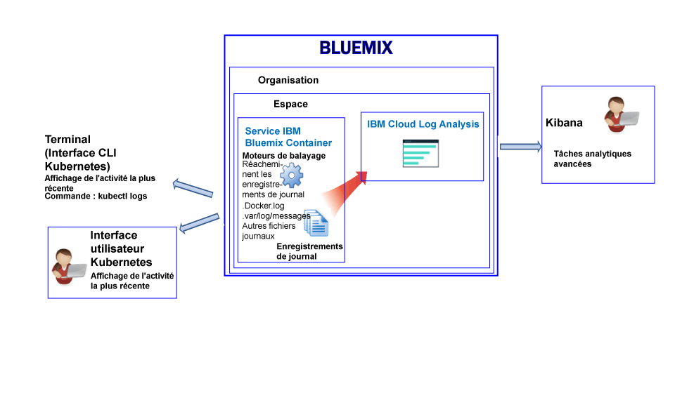

---

copyright:
  years: 2017

lastupdated: "2017-07-19"

---

{:shortdesc: .shortdesc}
{:new_window: target="_blank"}
{:codeblock: .codeblock}
{:screen: .screen}
{:pre: .pre}


# Journalisation pour IBM Bluemix Container Service
{: #logging_containers_ov}

Vous pouvez afficher, filtrer, et analyser les journaux de conteneurs Docker déployés dans l'infrastructure de cloud gérée par {{site.data.keyword.IBM}} et de conteneurs Docker opérant dans des clusters Kubernetes. La journalisation des conteneurs est automatiquement activée lorsque vous déployez un conteneur dans {{site.data.keyword.Bluemix_notm}} ou dans un cluster Kuberentes.
{:shortdesc}

Les journaux de conteneurs sont surveillés et retransmis depuis l'extérieur du conteneur par le biais de moteurs de balayage. Les données sont envoyés par les moteurs de balayage à un service partagé Elasticsearch dans {{site.data.keyword.Bluemix_notm}}.


## Collecte de journaux pour un conteneur opérant dans un cluster Kubernetes
{: #logging_containers_ov_logs_collected_kubernetes}

Le diagramme suivant offre une vue d'ensemble de la journalisation pour {{site.data.keyword.containershort}}:




Dans {{site.data.keyword.Bluemix_notm}}, lorsque vous déployez des applications dans un cluster Kubernetes, prenez en compte les informations suivantes :

* Dans un compte {{site.data.keyword.Bluemix_notm}}, vous pouvez avoir 1 ou plusieurs organisations. 
* Chaque organisation peut disposer d'un ou des plusieurs espaces {{site.data.keyword.Bluemix_notm}} . 
* Vous pouvez avoir 1 ou plusieurs clusters Kubernetes dans une organisation. 
* La collecte de journaux est automatiquement activée lorsque vous créez un cluster Kubernetes. 
* Un cluster Kubernetes est indépendant des espaces {{site.data.keyword.Bluemix_notm}}. Toutefois, les données de journal d'un cluster et de ses ressources portent sur un espace {{site.data.keyword.Bluemix_notm}}.
* Les données de journal sont collectées pour une application dès que la nacelle est déployée.
* Pour analyser les données de journal pour un cluster, vous devez accéder aux tableaux de bord Kibana pour la région Cloud Public où le cluster a été créé.

Avant de créer un cluster via l'interface utilisateur [{{site.data.keyword.Bluemix_notm}} ](/docs/containers/cs_cluster.html#cs_cluster_ui) ou
via la [ligne de commande](/docs/containers/cs_cluster.html#cs_cluster_cli), vous devez vous connecter à un espace, à un compte, à une organisation ou à une région
{{site.data.keyword.Bluemix_notm}}. L'espace auquel vous vous êtes connecté est celui pour lequel des données de journal sur le cluster et ses ressources sont collectées.

Par défaut, les informations de tous les processus de conteneur consignées dans le flux stdout (sortie standard) et stderr (erreur standard) sont collectées. L'envoi d'informations aux flux stdout et stderr est la convention Docker standard pour l'exposition des informations d'un conteneur. 

Si vous transmettez au format JSON au collecteur de journal Docker les données de journal d'une application qui s'exécute dans un conteneur, vous pouvez rechercher et analyser ces données dans Kibana à l'aide de zones JSON. Pour plus d'informations, voir [Configuration de zones personnalisées sous forme de zones de recherche Kibana](logging_containers_ov.html#send_data_in_json).

**Remarque :** si vous utilisez un cluster Kubernetes, les espaces de nom *ibm-system* et *kube-system* sont réservés. Vous ne devez pas créer, supprimer, modifier ou changer les droits d'accès aux ressources disponibles dans ces espaces. Les journaux de ces espaces de nom sont destinés à une utilisation par {{site.data.keyword.IBM_notm}}.


## Collecte de journaux pour un conteneur géré dans Bluemix
{: #logging_containers_ov_logs_collected}

Le diagramme suivant offre une vue d'ensemble de la journalisation pour {{site.data.keyword.containershort}}:


Par défaut, les journaux suivants sont collectés pour un conteneur déployé dans l'infrastructure de cloud gérée par {{site.data.keyword.Bluemix_notm}} :

<table>
  <caption>Tableau 2. Journaux collectés pour les conteneurs déployés dans l'infrastructure de cloud gérée par Bluemix</caption>
  <tbody>
    <tr>
      <th align="center">Journal</th>
      <th align="center">Description</th>
    </tr>
    <tr>
      <td align="left" width="30%">/var/log/messages</td>
      <td align="left" width="70%"> Par défaut, les messages Docker sont consignés dans le dossier /var/log/messages du conteneur. Ce journal inclut les messages système.
      </td>
    </tr>
    <tr>
      <td align="left">./docker.log</td>
      <td align="left">Il s'agit du journal Docker. <br> Le fichier journal Docker n'est pas stocké sous la forme d'un fichier dans le conteneur mais il est quand même collecté. Ce fichier journal est collecté par défaut vu qu'il s'agit de la convention Docker standard pour exposition des informations du fichier stdout (sortie standard) et du fichier stderr (erreur standard) pour le conteneur. Les informations de tous les processus de conteneur consignées dans le flux stdout ou stderr sont collectées. 
      </td>
     </tr>
  </tbody>
</table>

Pour collecter des informations de journaux supplémentaires, ajoutez la variable d'environnement **LOG_LOCATIONS** en spécifiant le chemin d'accès du fichier journal concerné lorsque vous créez le conteneur. Vous pouvez ajouter plusieurs fichiers journaux en les séparant par des virgules. Pour plus d'informations, voir [Collecte de données de journaux autres que ceux par défaut d'un conteneur](logging_containers_other_logs.html#logging_containers_collect_data).


##  Configuration de zones personnalisées sous forme de zones de recherche Kibana 
{: #send_data_in_json}

Par défaut, la journalisation est automatiquement activée pour les conteneurs. Chaque entrée du fichier journal Docker est affichée dans Kibana dans la zone `message`. Si vous avez besoin de filtrer et d'analyser vos données dans Kibana en utilisant une zone spécifique figurant dans l'entrée de journal du conteneur,  configurez votre application afin d'envoyer une sortie au format JSON valide.

Prenez en compte les informations :

* Pour les conteneurs déployés dans un cluster Kubernetes, consignez le message au format JSON vers le flux stdout (sortie standard) et stderr (erreur standard).

    Chaque zone disponible dans le message est analysée en fonction du type de zone correspondant à sa valeur. Par exemple, chaque zone dans le message JSON suivant :
    
    ```
    {"field1":"string type",
        "field2":123,
        "field3":false,
        "field4":"4567"
    }
    ```
    
    est disponible en tant que zone que vous pouvez utiliser pour effectuer un filtrage et des recherches :
    
    * `field1` est analysée en tant que `field1_str` de type string (chaîne).
    * `field2` est analysée en tant que `field1_int` de type integer (entier).
    * `field3` est analysée en tant que `field3_bool` de type boolean (booléen).
    * `field4` est analysée en tant que `field4_str` de type string (chaîne).
    
* Pour les conteneurs déployés dans l'infrastructure de cloud gérée par {{site.data.keyword.Bluemix_notm}}, procédez comme suit pour analyser les entrées de journal de conteneur en tant que zones individuelles :

    1. Consignez le message dans un fichier. 
    2. Ajoutez le fichier journal à la liste des journaux non définis par défaut qui sont disponibles pour analyse à partir d'un conteneur. Pour plus d'informations, voir [Collecte de données de journaux autres que ceux par défaut d'un conteneur](logging_containers_other_logs.html#logging_containers_collect_data). 
    
    Lorsque des entrées de journal JSON sont envoyées au fichier de journal Docker d'un conteneur sous la forme de sortie standard STDOUT, elles ne sont pas analysées en tant qu'entrées JSON. 
    
    Si vous consignez un message dans un fichier et qu'il constitue une structure JSON valide, les zones sont analysées et de nouvelles zones sont créées pour chaque zone du message. Seules les valeurs de zones de type string (chaîne) sont disponibles pour filtrage et tri dans Kibana.

## Ingestion de journaux
{: #log_ingestion}

Le service {{site.data.keyword.loganalysisshort}} propose différents plans. Chaque plan définit si vous pouvez envoyer des journaux à la collecte de journaux ou non. Tous les
plans, à l'exception du plan *Lite*, offrent la possibilité d'envoyer des journaux à la collecte de journaux. Pour plus d'informations sur les plans, voir
[Plans de service](/docs/services/CloudLogAnalysis/log_analysis_ov.html#plans).

Vous pouvez envoyer des journaux dans {site.data.keyword.loganalysisshort}} à l'aide du réexpéditeur Logstash à service partagé. Pour plus d'informations, voir [Envoyer des données de journaux à l'aide d'un réexpéditeur Logstash à service partagé (mt-logstash-forwarder).](/docs/services/CloudLogAnalysis/how-to/send-data/send_data_mt.html#send_data_mt).


## Collecte de journaux
{: #log_collection}

Par défaut, {{site.data.keyword.Bluemix_notm}} stocke les données de journaux pendant 3 jours maximum :   

* Un maximum de 500 Mo par espace de données est stocké par jour. Les journaux dépassant le plafond de 500 Mo sont rejetés. Les allocations de plafond sont réinitialisées chaque jour à 00h30 (temps universel coordonné).
* Il est possible de rechercher jusqu'à 1,5 Go de données sur un maximum de 3 jours. Les données de journal sont écrasées (sur la base Premier entré, premier sorti) une fois que la
limite de 1,5 Go de données est atteinte ou au bout de 3 jours.

Le service {{site.data.keyword.loganalysisshort}} fournit des plans additionnels qui vous permettent de stocker des journaux dans la collecte de journaux aussi longtemps que vous
en avez besoin. Pour obtenir plus d'informations sur le tarif de chaque plan, voir [Plans de service](/docs/services/CloudLogAnalysis/log_analysis_ov.html#plans).

Vous pouvez configurer une règle de conservation des journaux que vous pouvez utiliser pour définir le nombre de jours pendant lesquels vous souhaitez conserver les journaux dans la
collecte de journaux. Pour plus d'informations, voir [Règle de conservation des journaux](/docs/services/CloudLogAnalysis/log_analysis_ov.html#policies).


## Recherche de journaux
{: #log_search}

Par défaut, vous pouvez utiliser Kibana pour rechercher jusqu'à 500 Mo de journaux par jour dans {{site.data.keyword.Bluemix_notm}}. 

Le service {{site.data.keyword.loganalysisshort}} fournit plusieurs plans. Chaque plan offre des fonctions de recherche de journaux différentes. Par exemple, le plan
*Collecte de journaux* vous permet de rechercher jusqu'à 1 Go de données par jour. Pour plus d'informations sur les plans, voir
[Plans de service](/docs/services/CloudLogAnalysis/log_analysis_ov.html#plans).


## Affichage des journaux de conteneur d'un conteneur opérant dans un cluster Kubernetes
{: #logging_containers_ov_methods_view_kube}

Vous pouvez examiner les journaux les plus récents d'un conteneur dans une nacelle Kubernetes à l'aide d'une des méthodes suivantes :

* Affichage des journaux via l'interface utilisateur de Kubernetes. Vous pouvez sélectionner n'importe quelle nacelle et accéder à ses journaux. Pour plus d'informations, voir [Tableau de bord de l'interface utilisateur Web ](https://kubernetes.io/docs/tasks/access-application-cluster/web-ui-dashboard/){: new_window}.

* Affichage des journaux via la commande CLI suivante de Kubernetes : [kubectl logs ](https://kubernetes-v1-4.github.io/docs/user-guide/kubectl/kubectl_logs/){: new_window}. 

Pour afficher des journaux portant sur de longues périodes, vous pouvez utiliser Kibana. Recherchez dans les [plans de service](/docs/services/CloudLogAnalysis/log_analysis_ov.html#plans) des informations sur les règles relatives à la durée de conservation des données. 


## Affichage des journaux de conteneur d'un conteneur géré par Bluemix
{: #logging_containers_ov_methods_view_bmx}

Vous pouvez examiner les journaux les plus récents d'un conteneur déployé dans l'infrastructure de cloud gérée par {{site.data.keyword.Bluemix_notm}} à l'aide d'une des méthodes suivantes :

* Affichage des journaux via l'interface utilisateur de {{site.data.keyword.Bluemix_notm}} pour consulter l'activité la plus récente du conteneur.
    
    Vous pouvez visualiser, filtrer et analyser des journaux via l'onglet **Surveillance et journaux** présent pour chaque conteneur. Pour plus d'informations, voir [Analyse des journaux depuis le tableau de bord Bluemix](/docs/services/CloudLogAnalysis/logging_view_dashboard.html#analyzing_logs_bmx_ui).
    
    
* Affichage des journaux via l'interface CLI {{site.data.keyword.containershort}}. Utilisez des commandes pour gérer les journaux à l'aide d'un programme.
    
    Vous pouvez visualiser, filtrer et analyser des journaux via l'interface de ligne de commande en utilisant la commande **cf ic logs**. Pour plus d'informations, voir [Analyse de journaux depuis l'interface de ligne de commande](/docs/services/CloudLogAnalysis/logging_view_cli.html#analyzing_logs_cli).


## Analyse des journaux de conteneurs
{: #logging_containers_ov_methods}

Pour analyser les données de journal de conteneur, utilisez Kibana pour effectuer des tâches analytiques avancées. Vous pouvez utiliser la plateforme de visualisation et d'analyse open source Kibana pour surveiller, rechercher, analyser et visualiser des données dans différents graphiques, par exemple, dans des diagrammes et des tableaux. Pour plus d'informations, voir [Analyse des journaux dans Kibana](/docs/services/CloudLogAnalysis/kibana/analyzing_logs_Kibana.html#analyzing_logs_Kibana).


## Tutoriel : Analyse dans Kibana des journaux d'une application déployée dans un cluster Kubernetes
{: #tutorial1}

Pour découvrir comment utiliser Kibana pour analyser les journaux d'un conteneur déployé dans un cluster Kubernetes, consultez la rubrique [Tutoriel : Analyse dans Kibana des journaux d'une application déployée dans un cluster Kubernetes](/docs/services/CloudLogAnalysis/containers/tutorials/kibana_tutorial_1.html#kibana_tutorial_1).


