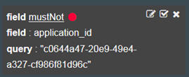
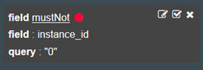
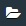

---

copyright:
  years: 2015, 2018

lastupdated: "2018-01-10"

---
{:new_window: target="_blank"}
{:shortdesc: .shortdesc}
{:screen:.screen}
{:codeblock:.codeblock}

# Filtrage de vos journaux d'application Cloud Foundry par ID d'instance dans Kibana
{: #logging_kibana_instance_id}

Affichez et filtrez des journaux d'instance {{site.data.keyword.Bluemix_notm}} en fonction de l'ID d'instance (instance_id) de votre application sur le tableau de bord Kibana. Vous pouvez accéder au tableau de bord Kibana à partir de l'onglet **Journaux** de votre application Cloud Foundry. 
{:shortdesc}

Procédez comme suit pour afficher et filtrer vos journaux d'application Cloud Foundry par ID d'instance (zone instance_id) sur le tableau de bord Kibana :

1. Accédez à l'onglet **Journaux** de votre application Cloud Foundry. 

    1. Cliquez sur le nom d'application dans le tableau de bord **Applications** de {{site.data.keyword.Bluemix_notm}}.
    2. Cliquez sur l'onglet **Journaux**. 
    
    Les journaux de votre application s'affichent.

2. Accédez au tableau de bord Kibana de votre application. Cliquez sur **Vue avancée** . Le tableau de bord Kibana s'affiche.

3. Dans le tableau de bord Kibana, cliquez sur l'icône **Accès aux éléments par défaut sauvegardés**  pour afficher tous les journaux d'un espace. Dans la fenêtre **Tous les événements**, cliquez sur l'icône en forme de flèche vers la droite pour afficher toutes les zones. 

    

4. Dans le panneau **Zones**, sélectionnez **application_id** et **instance_id** pour afficher les zones application_id et instance_id dans la fenêtre **Tous les événements**.

    

5. Dans la fenêtre **Tous les événements**, cliquez sur une ligne d'événement de journal pour afficher les détails relatifs à l'événement. Choisissez un événement qui affiche la valeur instance_id à filtrer.

    

6. Ajoutez un filtre pour inclure ou exclure des informations concernant un ID d'application. 

    * Pour ajouter un filtre incluant les informations sur un ID d'application spécifique, cliquez sur l'icône **Loupe**  sur la ligne application_id dans le tableau. 
    
           
    
    * Pour ajouter un filtre excluant les informations sur un ID d'application spécifique, cliquez sur l'icône **Exclusion**  sur la ligne application_id dans le tableau. 
    
           
    
    Une nouvelle condition de filtre est ajoutée au tableau de bord Kibana.
 

7. Ajoutez un filtre pour inclure ou exclure des informations concernant un ID d'instance d'application. 

    * Pour ajouter un filtre incluant des informations sur un ID d'instance spécifique, cliquez sur l'icône **Loupe**  sur la ligne instance_id dans le tableau. 

    

     * Pour ajouter un filtre excluant des informations sur un ID d'instance spécifique, cliquez sur l'icône **Exclusion**  sur la ligne instance_id dans le tableau. 
    
           
    
    Une nouvelle condition de filtre est ajoutée au tableau de bord Kibana.

9. Sauvegardez le tableau de bord. Lorsque vous avez fini de créer votre filtre, cliquez sur l'icône **Sauvegarder**  et entrez un nom pour votre tableau de bord. 

    **Remarque :** Si vous tentez de sauvegarder un tableau de bord avec un nom contenant des espaces vides, l'opération échoue. Entrez un nom ne contenant pas d'espaces et cliquez sur l'icône de **sauvegarde**.

    .

Vous avez créé un tableau de bord qui filtre vos entrées de journal par ID d'instance. Vous pouvez charger votre tableau de bord sauvegardé à tout moment en cliquant sur l'icône **Dossier**  et en sélectionnant le nom de votre tableau de bord. 
