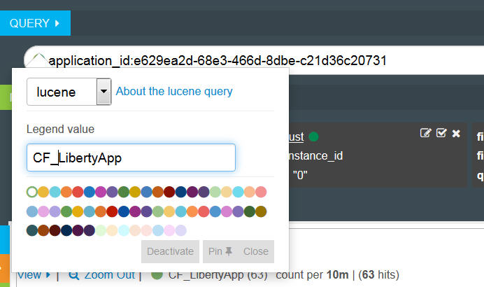

---

copyright:
  years: 2015, 2018

lastupdated: "2018-01-10"

---

{:shortdesc: .shortdesc}
{:new_window: target="_blank"}
{:codeblock: .codeblock}
{:screen: .screen}

# Analyse de journaux dans Kibana 3 (obsolète)
{: #analyzing_logs_Kibana3}

Dans {{site.data.keyword.Bluemix}}, vous pouvez utiliser la plateforme de visualisation et d'analyse open source Kibana pour surveiller, rechercher, analyser et visualiser des données dans différents graphiques, par exemple, des diagrammes et des tableaux. Utilisez Kibana pour effectuer des tâches analytiques avancées.
{:shortdesc}

## Filtrage des données dans un tableau de bord Kibana
{: #filter_data_kibana_dashboard}

Dans {{site.data.keyword.Bluemix}}, vous pouvez analyser des données à l'aide du tableau de bord Kibana par défaut fourni pour chaque ressource ou pour chaque espace {{site.data.keyword.Bluemix}}. Par défaut, ces tableaux de bord affichent toutes les données disponibles depuis les 24 dernières heures. Vous pouvez toutefois limiter les informations affichées par un tableau de bord. Vous pouvez ajouter des requêtes et des filtres à un tableau de bord par défaut, puis sauvegarder ce dernier afin de le réutiliser ultérieurement.

Dans un tableau de bord, vous pouvez ajouter plusieurs requêtes et filtres. Une requête définit un sous-ensemble d'entrées de journal.  Un filtre affine la sélection de données en incluant ou en excluant des informations. 

La liste suivante présente des exemples de filtrage de données pour les applications Cloud Foundry :
* Si vous recherchez dans vos journaux des informations qui contiennent des termes clés, vous pouvez créer des requêtes afin d'effectuer un filtrage à l'aide de ces termes. Kibana vous permet de comparer visuellement des requêtes sur le tableau de bord. Pour plus d'informations, voir [Filtrage de vos journaux d'application Cloud Foundry à l'aide de requêtes dans Kibana](kibana3/logging_kibana_query.html#logging_kibana_query).

* Si vous recherchez des informations pour une période donnée, vous pouvez filtrer les données par période. Pour plus d'informations, voir [Filtrage de vos journaux d'application Cloud Foundry par période dans Kibana](kibana3/logging_kibana_filter_by_time_period.html#logging_kibana_time_filter).

* Si vous recherchez des informations pour un ID d'instance donné, vous pouvez filtrer les données par ID d'instance. Pour plus d'informations, voir [Filtrage de vos journaux d'application Cloud Foundry par ID d'instance dans Kibana](kibana3/logging_kibana_filter_by_instance_id.html#logging_kibana_instance_id) et [Filtrage de vos journaux d'application Cloud Foundry par ID d'application connu dans Kibana](kibana3/logging_kibana_filter_by_known_application_id.html#logging_kibana_known_application_id).

* Si vous recherchez des informations pour un composant donné, vous pouvez filtrer les données par composant (type de journal). Pour plus d'informations, voir [Filtrage de vos journaux d'application Cloud Foundry par type de journal dans Kibana](kibana3/logging_kibana_filter_by_component.html#logging_kibana_component_filter).

* Si vous recherchez des informations, par exemple, des messages d'erreur, vous pouvez filtrer les données par type de message. Pour plus d'informations, voir [Filtrage de vos journaux d'application Cloud Foundry par type de message dans Kibana](kibana3/logging_kibana_filter_by_message_type.html#logging_kibana_message_type_filter).

## Personnalisation d'un tableau de bord Kibana
{: #customize_kibana_dashboard}

Différents types de tableaux de bord peuvent être personnalisés pour visualiser et analyser les données, par exemple :
* Tableau de bord de type single-cf-app : tableau de bord qui affiche des informations sur une application Cloud Foundry.  
* Tableau de bord de type Multi-cf-app : tableau de bord qui affiche des informations sur toutes les applications Cloud Foundry déployées dans le même espace {{site.data.keyword.Bluemix}}. 

Lorsque vous personnalisez un tableau de bord, vous pouvez configurer des requêtes et des filtres pour sélectionner un sous-ensemble des données de journal à afficher via le tableau de bord.

Pour visualiser les données, vous pouvez configurer des panneaux. Kibana inclut différents panneaux, tels que des tableaux, des tendances et des histogrammes, que vous pouvez utiliser pour analyser les informations. Vous pouvez ajouter, retirer et réorganiser des panneaux dans le tableau de bord. L'objectif de chaque panneau est différent. Certains panneaux sont organisés en lignes qui fournissent les résultats d'une ou de plusieurs requêtes. D'autres panneaux affichent des documents ou des informations personnalisées. Par exemple, vous pouvez configurer un graphique à barres, un graphique circulaire ou un tableau pour visualiser les données et les analyser.  

## Sauvegarde d'un tableau de bord Kibana
{: #save_Kibana_dashboard}

Procédez comme suit pour sauvegarder un tableau de bord Kibana après l'avoir personnalisé :

1. Dans la barre d'outils, cliquez sur l'icône de **sauvegarde**.

2. Entrez un nom pour le tableau de bord.

    **Remarque :** Si vous tentez de sauvegarder un tableau de bord avec un nom contenant des espaces vides, l'opération échoue.

3. Cliquez sur l'icône de **sauvegarde** en regard de la zone de nom.

## Analyse des journaux via un tableau de bord Kibana
{: #analyze_kibana_logs}

Après avoir personnalisé un tableau de bord Kibana, vous pouvez visualiser et analyser les données via ses panneaux. 

Pour rechercher des informations, vous pouvez épingler ou libérer des requêtes. 

* Vous pouvez épingler une requête au tableau de bord, ce qui active automatiquement la recherche.
* Pour retirer un contenu du tableau de bord, vous pouvez désactiver une requête.

Pour filtrer des informations, vous pouvez activer ou désactiver des filtres. 

* Vous pouvez cocher la case **Basculer**  dans un filtre pour l'activer.   
* Vous pouvez décocher la case **Basculer**  dans un filtre pour le désactiver. 

Les diagrammes et graphiques présents dans votre tableau de bord affichent les données. Vous pouvez utiliser les diagrammes et les graphiques présents dans votre tableau de bord pour surveiller les données. 

Par exemple, avec un tableau de bord de type single-cf-app, les informations affichées concernent une application Cloud Foundry. Les données que vous pouvez visualiser et analyser sont limitées à cette application. Vous pouvez utiliser le tableau de bord pour analyser les données de toutes les instances de l'application. Vous pouvez comparer des instances. Vous pouvez filtrer les informations par ID d'instance. 

Vous pouvez définir et épingler une requête pour chaque ID d'instance au tableau de bord. 

Vous pouvez ensuite activer ou désactiver des requêtes individuelles en fonction des informations d'instance que vous souhaitez afficher dans le tableau de bord. 

L'illustration suivante présente une requête activée et une requête désactivée :

Si vous souhaitez comparer 2 instances dans un histogramme, vous pouvez définir deux requêtes dans le même tableau de bord, une pour chaque ID d'instance. Vous pouvez leur affecter un alias et une couleur unique afin de les identifier facilement. Kibana traite plusieurs requêtes en les reliant par un opérateur OR logique. 

L'illustration suivante présente le panneau permettant de configurer un alias et une couleur pour une requête, d'épingler celle-ci au tableau de bord et de la désactiver :

