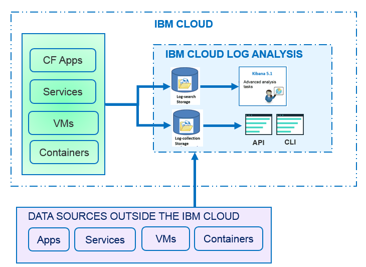

---

copyright:
  years: 2017

lastupdated: "2017-07-19"

---

{:shortdesc: .shortdesc}
{:new_window: target="_blank"}
{:codeblock: .codeblock}
{:screen: .screen}
{:pre: .pre}

# A propos d'
{: #log_analysis_ov}

Utilisez le service {{site.data.keyword.loganalysisfull}} pour étendre votre collecte de journaux, la conservation des journaux et les possibilités de recherche de journaux dans {{site.data.keyword.Bluemix}}. Donnez à votre équipe DevOps des fonctions telles que l'ajout de journaux d'environnement et d'application pour obtenir un meilleur aperçu de l'application et de l'environnement, pour chiffrer
les journaux et conserver les données de journaux aussi longtemps que nécessaire ainsi que pour une rapide détection et résolution des problèmes. Utilisez Kibana pour les tâches d'analyse
avancées.
{:shortdesc}

Les fonctions de journalisation de {{site.data.keyword.Bluemix_notm}} sont intégrées dans la plateforme :

* La collecte des données est automatiquement activée pour les ressources de cloud. Par défaut, {{site.data.keyword.Bluemix_notm}} collecte et affiche des journaux pour vos applications, vos contextes d'exécution d'application et vos contexte d'exécution de traitement dans lesquels ces applications s'exécutent. 
* Vous pouvez rechercher jusqu'à 500 Mo de journaux par jour. 
* Les journaux des 3 derniers jours sont stockés dans Log Search, un composant du service {{site.data.keyword.loganalysisshort}}.

Vous pouvez utiliser les fonctions de journalisation de {{site.data.keyword.Bluemix_notm}} pour comprendre le comportement de la plateforme cloud et les ressources qui s'exécutent sur cette dernière. Aucune instrumentation spéciale n'est requise pour collecter les journaux de sortie standard et d'erreur standard. Par exemple, vous pouvez utiliser des journaux pour fournir une analyse rétrospective relative à une application, détecter des problèmes dans votre service, identifier des vulnérabilités, dépanner vos déploiements d'application et le comportement d'exécution, détecter des problèmes dans l'infrastructure où vos applications s'exécutent, suivre votre application parmi les composants de la plateforme cloud et détecter des modèles que vous pouvez utiliser pour préempter des actions qui pourraient affecter votre accord sur les niveaux de service.

La figure suivante offre une vue d'ensemble des composants du service {{site.data.keyword.loganalysisshort}} : 

Pour collecter et rechercher les journaux de ressources de cloud, vous devez fournir une instance du service {{site.data.keyword.loganalysisshort}}
dans le même espace {{site.data.keyword.Bluemix_notm}} que celui dans lequel ces ressources de cloud s'exécutent.

Les journaux sont collectés et stockés par défaut dans Log Search. Lorsque vous sélectionnez un plan de service incluant des fonctions de recherche et de collecte étendues, les
journaux sont également collectés et stockés dans le composant Log Collection. Les données de journal qui sont stockées dans Log Collection sont chiffrées.

La taille du journal que vous pouvez collecter et stocker dans Log Collection est déterminée par le plan de service que vous choisissez. Vous payez par gigaoctet de données par
mois pour les données qui sont stockées. Les journaux sont stockés dans Log Collection au format JSON.

Vous pouvez utiliser Kibana 5.1 pour les tâches d'analyse des recherches de journaux avancées :

* Chaque plan limite la taille du journal que vous pouvez rechercher par jour. 
* Les recherches couvrent uniquement les données des 3 derniers jours.

Pour accéder aux journaux antérieurs à 3 jours, vous pouvez utiliser l'interface de ligne de commande Log Collection ou l'API Log Collection pour
télécharger les journaux localement ou vous pouvez diriger les journaux vers d'autres applications ou services de cloud tiers. 

Vous pouvez supprimer les journaux automatiquement en définissant une règle de conservation ou manuellement à l'aide de l'interface de ligne de commande
{{site.data.keyword.loganalysisshort}}.

## Pourquoi utiliser le service de journalisation ?
{: #value}

1. **Passez moins de temps à instrumenter votre application et davantage de temps à développer sa valeur ajoutée.**

    {{site.data.keyword.loganalysislong_notm}} collecte automatiquement les données des services de cloud {{site.data.keyword.IBM_notm}} sélectionnés, aucune
instrumentation n'est nécessaire.
	
	Vous pouvez choisir la quantité de journaux sur lesquels la recherche doit porter par jour. Différents plans sont disponibles, mais vous pouvez choisir de rechercher jusqu'à 500 Mo, 2 Go, 5 Go et 10 Go de journaux par jour. 

2. **Conservez vos données de journal près de vos charges de travail d'application et en sécurité grâce à des solutions de stockage économiques basées sur le cloud**

    Collectez et stockez les données de journal dans des applications traditionnelles et microservice exécutées dans le cloud {{site.data.keyword.IBM_notm}}, dans un journal centralisé. Conservez les données
de journal aussi longtemps que nécessaire.
	
	Les journaux sont stockés dans le stockage en cloud {{site.data.keyword.IBM_notm}}. Vous pouvez télécharger des journaux lorsque vous en avez besoin. 

3. **Obtenez une meilleure vision de votre environnement afin de détecter, diagnostiquer et identifier les problèmes**

    Visualisez, analysez et interagissez avec vos données à travers des tableaux de bord personnalisables. Basée sur la plateforme de pile Elastic, les fonctions de recherche des
journaux vous offrent la flexibilité et la familiarité de Kibana pour générer rapidement votre tableau de bord en fonction des besoins de vos applications.

4. **Solide intégration aux API**

    Intégrez vos données de journal à vos applications et à vos opérations via les API du service. Utilisez les API de service {{site.data.keyword.loganalysisshort}} pour gérer vos journaux conservés et envoyer des données de journal à partir de l'extérieur d'{{site.data.keyword.IBM_notm}} Cloud.

	
## Collecte des journaux
{: #log_collection}

Par défaut, {{site.data.keyword.Bluemix_notm}} stocke les données de journal pendant un maximum de 3 jours dans Log Search :   

* Un maximum de 500 Mo par espace de données est stocké par jour. Les journaux dépassant le plafond de 500 Mo sont rejetés. Les allocations de plafond sont réinitialisées chaque jour à
00h30 (temps universel coordonné).
* Il est possible de rechercher jusqu'à 1,5 Go de données sur un maximum de 3 jours. Les données de journal sont écrasées (sur la base Premier entré, premier sorti) une fois que la
limite de 1,5 Go de données est atteinte ou au bout de 3 jours.

Le service {{site.data.keyword.loganalysisshort}} fournit des plans additionnels qui vous permettent de stocker des journaux dans la collecte de journaux aussi longtemps que vous
en avez besoin. Pour plus d'informations sur chaque plan, voir [Plans de service](/docs/services/CloudLogAnalysis/log_analysis_ov.html#plans).

## Suppression de journaux
{: #log_deletion}

Les journaux sont stockés dans Log Search et supprimés au bout de 3 jours.

Les journaux qui sont stockés dans Log Collection sont automatiquement supprimés au bout de 30 jours à moins que vous ne configuriez une règle de conservation. 

* Vous pouvez configurer une règle de conservation des journaux pour définir le nombre de jours pendant lequel vous souhaitez conserver les journaux dans Log Collection. Pour plus d'informations, voir [Règle de conservation des journaux](/docs/services/CloudLogAnalysis/log_analysis_ov.html#policies).

* Vous pouvez désactiver la règle en définissant sa valeur sur *-1*. 

Vous pouvez utiliser l'API Log Collection ou l'interface de ligne de commande Log Collection pour supprimer les journaux manuellement de la collecte de journaux. Pour
en savoir plus sur la suppression manuelle des journaux via l'interface de ligne de commande, voir [cf logging delete](/docs/services/CloudLogAnalysis/reference/logging_cli.html#delete).

## Ingestion de journaux
{: #log_ingestion}

Tous les plans de service {{site.data.keyword.loganalysisshort}} à l'exception du plan *Lite* offrent la possibilité d'envoyer des journaux à Log Collection depuis l'extérieur du cloud {{site.data.keyword.IBM_notm}}. Pour plus d'informations sur les plans, voir
[Plans de service](/docs/services/CloudLogAnalysis/log_analysis_ov.html#plans).

Vous pouvez envoyer des journaux dans {{site.data.keyword.loganalysisshort}} à l'aide du réexpéditeur Logstash à service partagé. Pour plus d'informations, voir
[Envoyer des données de journaux à l'aide d'un réexpéditeur Logstash à service partagé
(mt-logstash-forwarder).](/docs/services/CloudLogAnalysis/how-to/send-data/send_data_mt.html#send_data_mt).

## Recherche des journaux
{: #log_search}

Par défaut, vous pouvez utiliser Kibana 5.1 pour rechercher jusqu'à 500 Mo de journaux par jour dans {{site.data.keyword.Bluemix_notm}}. 

Le service {{site.data.keyword.loganalysisshort}} offre plusieurs plans. Chaque plan offre des fonctions de recherche de journaux différentes. Par exemple, le plan *Collecte
de journaux* vous permet de rechercher jusqu'à 1 Go de données par jour. Pour plus d'informations sur les plans, voir
[Plans de service](/docs/services/CloudLogAnalysis/log_analysis_ov.html#plans).

## Analyse de journal dans Bluemix
{: #logging_bmx_ov_ui}

Dans {{site.data.keyword.Bluemix_notm}}, vous pouvez afficher des journaux récents ou des journaux de queue en temps réel pour les applications CF ou les conteneurs qui sont
déployés dans une infrastructure gérée par {{site.data.keyword.Bluemix_notm}} :

* Vous pouvez visualiser, filtrer et analyser des journaux depuis l'interface utilisateur. Pour plus d'informations, voir [Analyse des journaux depuis la console Bluemix](/docs/services/CloudLogAnalysis/logging_view_dashboard.html#analyzing_logs_bmx_ui).

* Vous pouvez visualiser, filtrer et analyser des journaux depuis la ligne de commande afin de les gérer à l'aide d'un programme. Pour plus d'informations, voir [Analyse des journaux depuis l'interface de ligne de commande](/docs/services/CloudLogAnalysis/logging_view_cli.html#analyzing_logs_cli).

* Vous pouvez réaliser une analyse avancée à l'aide de Kibana.

## Analyse de journal avancée avec Kibana
{: #logging_bmx_ov_kibana}

Dans {{site.data.keyword.Bluemix_notm}}, vous pouvez utiliser la plateforme de visualisation et d'analyse open source Kibana pour surveiller, rechercher, analyser et visualiser des données dans différents graphiques, par exemple, des diagrammes et des tableaux. Pour plus d'informations, voir [Analyse de journal avancée avec Kibana](/docs/services/CloudLogAnalysis/kibana/analyzing_logs_Kibana.html#analyzing_logs_Kibana).

## Gestion des journaux via l'interface de ligne de commande
{: #managing_logs}

Utilisez l'interface de ligne de commande {{site.data.keyword.loganalysisshort}} pour gérer les journaux.

* Pour savoir comment installer l'interface de ligne de commande, voir
[Installation de l'interface de ligne de commande de journalisation](/docs/services/CloudLogAnalysis/how-to/manage-logs/config_log_collection_cli.html#config_log_collection_cli).
* Pour vérifier la version de l'interface de ligne de commande, exécutez la commande [cf logging](/docs/services/CloudLogAnalysis/reference/logging_cli.html#base) avec le paramètre * -version*.
* Pour obtenir de l'aide sur l'exécution des commandes, voir [Aide sur
l'utilisation de la ligne de commande pour exécuter les commandes](/docs/services/CloudLogAnalysis/how-to/manage-logs/config_log_collection_cli.html#cli_help).

Pour obtenir des informations générales sur vos journaux, utilisez la commande `cf logging status`. Par exemple, vous pouvez :

* [Obtenir des informations sur les journaux durant une période définie](/docs/services/CloudLogAnalysis/how-to/manage-logs/viewing_log_information.html#viewing_logs).
* [Obtenir des informations sur un type de journal durant une période
définie](/docs/services/CloudLogAnalysis/how-to/manage-logs/viewing_log_information.html#viewing_logs_by_log_type).
* [Obtenir des informations de compte sur les journaux](/docs/services/CloudLogAnalysis/how-to/manage-logs/viewing_log_information.html#viewing_logs_account).

Pour contrôler les coûts, vous pouvez contrôler la taille des journaux de vos applications durant une période déterminée. Par exemple, vous pouvez souhaiter connaître la taille de chaque
type de journal pendant une semaine pour un espace {{site.data.keyword.Bluemix_notm}} afin d'identifier si une application ou un service génère plus de journaux que prévu. Pour vérifier la
taille de vos journaux, utilisez la commande `cf logging status`. Pour plus d'informations, voir [Affichage des informations de journal](/docs/services/CloudLogAnalysis/how-to/manage-logs/viewing_log_information.html#viewing_log_status).

Dans Kibana, vous pouvez rechercher les journaux des 3 derniers jours. Pour pouvoir analyser des données de journal plus anciennes, vous pouvez télécharger les journaux vers un fichier
local ou les diriger vers d'autres programmes comme par exemple une pile Elastic locale. Pour plus d'informations, voir
[Téléchargement des journaux](/docs/services/CloudLogAnalysis/how-to/manage-logs/downloading_logs.html#downloading_logs).

Pour supprimer manuellement les journaux dont vous n'avez plus besoin, utilisez la commande [cf logging delete](/docs/services/CloudLogAnalysis/reference/logging_cli.html#delete). 

## Règles
{: #policies}

**Règle de conservation des journaux**

Vous pouvez utiliser l'interface de ligne de commande {{site.data.keyword.loganalysisshort}} pour afficher et configurer la règle de conservation des journaux. Cette règle spécifie
le nombre de jours pendant lesquels ces journaux sont conservés dans Log Collection. 

* Par défaut, les journaux sont conservés pendant 30 jours. 
* Une fois que la période de conservation a expiré, les journaux sont automatiquement supprimés de Log Collection et ils ne peuvent pas être récupérés.
* Vous pouvez spécifier une période de conservation pour un compte. La période de conservation est automatiquement configurée pour tous les espaces de ce compte. 
* Vous pouvez spécifier une période de conservation pour un espace {{site.data.keyword.Bluemix_notm}}.
* Vous pouvez modifier la règle de conservation à tout moment.
* Vous pouvez désactiver la règle en définissant sa valeur sur *-1*. 

**Remarque :** lorsque vous désactivez la règle de conservation des journaux, vous
devez maintenir les journaux dans Log Collection. Vous pouvez utiliser la commande de l'interface de ligne de commande
[cf logging delete](/docs/services/CloudLogAnalysis/reference/logging_cli.html#delete) pour supprimer les journaux anciens.

Pour plus d'informations, voir [Affichage et configuration de
la règle de conservation des journaux](/docs/services/CloudLogAnalysis/how-to/manage-logs/configuring_retention_policy.html#configuring_retention_policy).

## Plans de service
{: #plans}

Le service {{site.data.keyword.loganalysisshort}} offre plusieurs plans. Chaque plan possède des fonctions différentes de recherche et de collecte des journaux. 

Vous pouvez modifier un plan via l'interface utilisateur {{site.data.keyword.Bluemix_notm}} ou via la ligne de commande. Vous pouvez mettre à niveau ou réduire votre plan à tout
moment. Pour plus d'informations sur les mises à niveau des plans de service dans {{site.data.keyword.Bluemix_notm}},
voir [Modification du plan](/docs/services/CloudLogAnalysis/plan/change_plan.html#change_plan). 

Le tableau suivant présente les plans disponibles :

<table>
    <caption>Récapitulatif des fonctions Log Search et Log Collection par plan</caption>
      <tr>
        <th>Plan</th>
        <th>Ingestion de journaux</th>
        <th>Conservation des journaux</th>
        <th>Chiffrement des données</th>
        <th>Recherche de journaux</th>
      </tr>
      <tr>
        <td>Lite (valeur par défaut)</td>
        <td>Non</td>
        <td>3 derniers jours</td>
        <td>Non</td>
        <td>Recherche jusqu'à 500 Mo</td>
      </tr>
      <tr>
        <td>Collecte de journaux</td>
        <td>Oui</td>
        <td>Nombre de jours configurable.</td>
        <td>Oui</td>
        <td>Recherche jusqu'à 500 Mo par jour</td>
      </tr>
      <tr>
        <td>Collecte de journaux avec recherche de 2 Go/jour</td>
        <td>Oui</td>
        <td>Nombre de jours configurable.</td>
        <td>Oui</td>
        <td>Recherche jusqu'à 2 Go par jour</td>
      </tr>
      <tr>
        <td>Collecte de journaux avec recherche de 5 Go/jour</td>
        <td>Oui</td>
        <td>Nombre de jours configurable.</td>
        <td>Oui</td>
        <td>Recherche jusqu'à 5 Go par jour</td>
      </tr>
       <tr>
        <td>Collecte de journaux avec recherche de 10 Go/jour</td>
        <td>Oui</td>
        <td>Nombre de jours configurable.</td>
        <td>Oui</td>
        <td>Recherche jusqu'à 10 Go par jour</td>
      </tr>
</table>

**Remarque :** le coût mensuel du stockage Log Collection est calculé comme moyenne du cycle de facturation. 

## Régions
{: #regions}

Le service {{site.data.keyword.loganalysisfull_notm}} est disponible dans la région suivante :

* Sud des États-Unis

