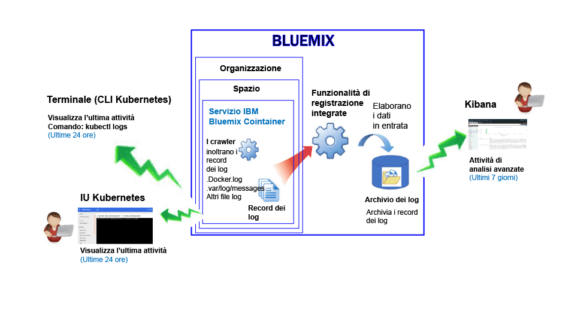
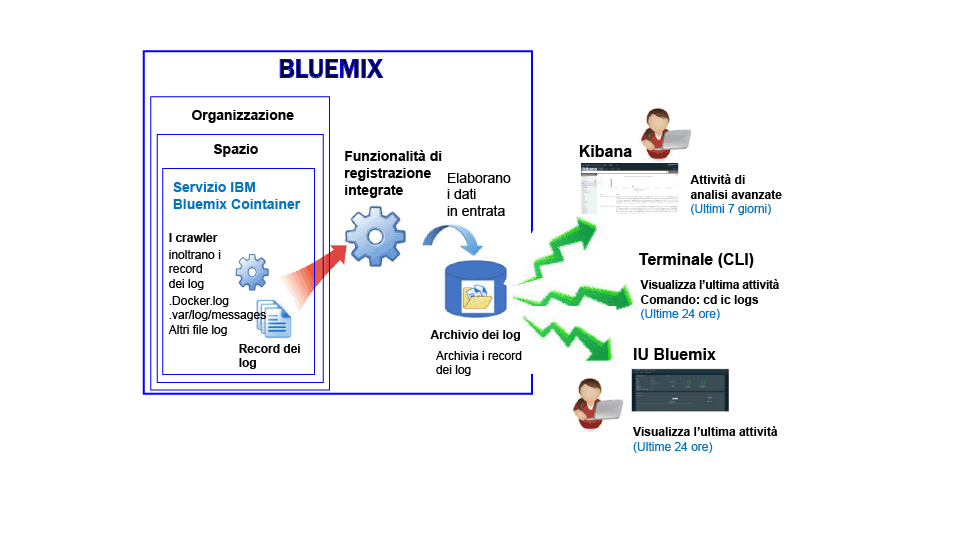

---

copyright:
  years: 2017

lastupdated: "2017-07-19"

---

{:shortdesc: .shortdesc}
{:new_window: target="_blank"}
{:codeblock: .codeblock}
{:screen: .screen}
{:pre: .pre}


# Registrazione del servizio IBM Bluemix Container
{: #logging_containers_ov}

Puoi visualizzare, filtrare e analizzare i log per i contenitori Docker distribuiti nell'infrastruttura cloud gestita da {{site.data.keyword.IBM}} e per i contenitori Docker che vengono eseguiti nei cluster Kubernetes. La registrazione dei contenitori è abilitata automaticamente quando distribuisci un contenitore in {{site.data.keyword.Bluemix_notm}} o in un cluster Kubernetes.
{:shortdesc}

I log del contenitore sono monitorati e inoltrati dall'esterno del contenitore utilizzando i crawler. I dati vengono inviati dai crawler a un Elasticsearch a più tenant in {{site.data.keyword.Bluemix_notm}}.


## Raccolta dei log per un contenitore che viene eseguito in un cluster Kubernetes
{: #logging_containers_ov_logs_collected_kubernetes}

La seguente figura mostra una vista di alto livello della registrazione per {{site.data.keyword.containershort}}:



In {{site.data.keyword.Bluemix_notm}}, quando distribuisci le applicazioni in un cluster Kubernetes, tieni conto delle seguenti informazioni:

* In un account {{site.data.keyword.Bluemix_notm}}, puoi avere 1 o più organizzazioni. 
* Ciascuna organizzazione può avere 1 o più spazi {{site.data.keyword.Bluemix_notm}}. 
* Puoi avere 1 o più cluster Kubernetes in un'organizzazione. 
* La raccolta dei log è abilitata automaticamente quando crei un cluster Kubernetes. 
* Un cluster Kubernetes è indipendente dagli spazi {{site.data.keyword.Bluemix_notm}}. Tuttavia, i dati di log di un cluster e le relative risorse sono associati a uno spazio {{site.data.keyword.Bluemix_notm}}.
* I dati di log vengono raccolti per un'applicazione appena il pod viene distribuito.
* Per analizzare i dati di log per un cluster, devi accedere ai dashboard Kibana per la regione di cloud pubblico dove viene creato il cluster.

Prima di creare un cluster, tramite l'interfaccia utente [{{site.data.keyword.Bluemix_notm}} UI](/docs/containers/cs_cluster.html#cs_cluster_ui) o tramite la [riga di comando](/docs/containers/cs_cluster.html#cs_cluster_cli), devi eseguire l'accesso a una regione, un account, un'organizzazione e uno spazio {{site.data.keyword.Bluemix_notm}} specifici. Lo spazio dove hai eseguito l'accesso è quello in cui vengono raccolti i dati di registrazione per il cluster e le relative risorse.

Per impostazione predefinita, vengono raccolte le informazioni inserite dai processi di contenitore in stdout (output standard) e stderr (errore standard). L'invio di informazioni a stdout e stderr è la convenzione Docker standard per esporre le informazioni di un contenitore. 

Se inoltri i dati di log di un'applicazione che viene eseguita in un contenitore al raccoglitore di log Docker in formato JSON, puoi cercare nei dati di log e analizzarli in Kibana utilizzando campi JSON. Per maggiori informazioni, vedi [Configurazione di campi personalizzati come campi di ricerca Kibana](logging_containers_ov.html#send_data_in_json).

**Nota:** quando lavori con un cluster Kubernetes, gli spazi dei nomi *ibm-system* e *kube-system* sono riservati. Non creare, eliminare, modificare o cambiare le autorizzazioni delle risorse disponibili in tali spazi dei nomi. L'uso dei log per questi spazi dei nomi è riservato a {{site.data.keyword.IBM_notm}}.


## Raccolta dei log per un contenitore gestito da Bluemix
{: #logging_containers_ov_logs_collected}

La seguente figura mostra una vista di alto livello della registrazione per {{site.data.keyword.containershort}}:



Per impostazione predefinita, i seguenti log sono raccolti per un contenitore distribuito nell'infrastruttura cloud gestita da {{site.data.keyword.Bluemix_notm}}:

<table>
  <caption>Tabella 2. Log raccolti per i contenitori distribuiti nell'infrastruttura cloud gestita da Bluemix</caption>
  <tbody>
    <tr>
      <th align="center">Log</th>
      <th align="center">Descrizione</th>
    </tr>
    <tr>
      <td align="left" width="30%">/var/log/messages</td>
      <td align="left" width="70%"> Per impostazione predefinita, i messaggi Docker vengono archiviati nella cartella /var/log/messages del contenitore. Questo log include i messaggi di sistema.
      </td>
    </tr>
    <tr>
      <td align="left">./docker.log</td>
      <td align="left">Questo log è il log Docker. <br> Il file di log Docker non è memorizzato come file interno di un contenitore, ma viene raccolto comunque. Questo file di log viene raccolto per impostazione predefinita poiché è la convenzione Docker standard per esporre le informazioni stdout (output standard) e stderr (errore standard) per il contenitore. Vengono raccolte le informazioni inserite in stdout o stderr dai processi del contenitore. 
      </td>
     </tr>
  </tbody>
</table>

Per raccogliere ulteriori log, aggiungi la variabile di ambiente **LOG_LOCATIONS** con un percorso al file di log quando crei il contenitore. Puoi aggiungere più file di log separandoli con le virgole. Per ulteriori informazioni, vedi [Raccolta di dati di log non predefiniti da un contenitore](logging_containers_other_logs.html#logging_containers_collect_data).


##  Configurazione di campi personalizzati come campi di ricerca Kibana 
{: #send_data_in_json}

Per impostazione predefinita, la registrazione è abilitata automaticamente per i contenitori. Ogni voce nel file di log Docker viene visualizzata in Kibana nel campo `message`. Se hai bisogno di filtrare e analizzare i tuoi dati in Kibana utilizzando uno specifico campo che fa parte della voce di log del contenitore, configura la tua applicazione per inviare un output in formato JSON valido.

Tieni conto delle seguenti informazioni:

* Per i contenitori distribuiti in un cluster Kubernetes, registra il messaggio in formato JSON in stdout (output standard) e stderr (errore standard).

    Ciascun campo disponibile nel messaggio viene analizzato al tipo di campo che corrisponde al suo valore. Ad esempio, ciascun campo nel seguente messaggio JSON:
    
    ```
    {"field1":"string type",
        "field2":123,
        "field3":false,
        "field4":"4567"
    }
    ```
    
    è disponibile come un campo che puoi utilizzare per attività di filtro e ricerca:
    
    * `field1` viene analizzato come `field1_str` di tipo stringa.
    * `field2` viene analizzato come `field1_int` di tipo numero intero.
    * `field3` viene analizzato come `field3_bool` di tipo booleano.
    * `field4` viene analizzato come `field4_str` di tipo stringa.
    
* Per i contenitori distribuiti nell'infrastruttura cloud gestita da {{site.data.keyword.Bluemix_notm}}, completa la seguente procedura per analizzare le voci di log del contenitore in singoli campi:

    1. Registra il messaggio in un file. 
    2. Aggiungi il file di log all'elenco di log non predefiniti che sono disponibili per l'analisi da un contenitore. Per ulteriori informazioni, vedi [Raccolta di dati di log non predefiniti da un contenitore](logging_containers_other_logs.html#logging_containers_collect_data). 
    
    Quando le voci di log JSON vengono inviate al file di log Docker di un contenitore come STDOUT, non vengono analizzate come JSON. 
    
    Se registri il messaggio in un file, e viene determinato che un messaggio è in JSON valido, i campi vengono analizzati e vengono creati dei nuovi campi per ciascun campo nel messaggio. Solo i valori dei campi di tipo stringa sono disponibili per il filtro e l'ordinamento in Kibana.

## Inserimento log
{: #log_ingestion}

Il servizio {{site.data.keyword.loganalysisshort}} offre diversi piani. Ogni piano definisce se è possibile o meno accedere alla raccolta dei log. Tutti i piani, con l'eccezione del piano *Lite*, includono la capacità di inviare log alla raccolta dei log. Per ulteriori informazioni sui piani, vedi [Piani di servizio](/docs/services/CloudLogAnalysis/log_analysis_ov.html#plans).

Puoi inviare log in {site.data.keyword.loganalysisshort}} utilizzando il logstash forwarder a più tenant. Per maggiori informazioni, vedi [Invia dati di log utilizzando un logstash forwarder a più tenant (mt-logstash-forwarder)](/docs/services/CloudLogAnalysis/how-to/send-data/send_data_mt.html#send_data_mt).


## Raccolta di log
{: #log_collection}

Per impostazione predefinita, {{site.data.keyword.Bluemix_notm}} archivia i dati dei log per 3 giorni:   

* Viene archiviato un massimo di 500MB per spazio di dati al giorno. Tutti i log che superano i 500 MB vengono scartati. Le assegnazioni dei limiti vengono
reimpostate ogni giorno alle ore 12:30 UTC.
* Sono ricercabili fino a 1,5 GB di dati per una massimo di 3 giorni. Viene eseguito il rollover (la prima voce inserita è la prima a essere eliminata) dei dati di log quando vengono raggiunti i 1,5 GB di dati o vengono superati i 3 giorni.

Il servizio {{site.data.keyword.loganalysisshort}} fornisce ulteriori piani che ti consentono di archiviare i log nella raccolta dei log per quanto tempo desideri. Per ulteriori informazioni sul prezzo di ogni piano, vedi [Piani di servizio](/docs/services/CloudLogAnalysis/log_analysis_ov.html#plans).

Puoi configurare una politica di conservazione log che puoi utilizzare per definire il numero di giorni in cui desideri conservare i log nella raccolta dei log. Per maggiori informazioni, vedi [Politica di conservazione log](/docs/services/CloudLogAnalysis/log_analysis_ov.html#policies).


## Ricerca log
{: #log_search}

Per impostazione predefinita, puoi utilizzare Kibana per ricercare fino a 500 MB di log al giorno in {{site.data.keyword.Bluemix_notm}}. 

Il servizio {{site.data.keyword.loganalysisshort}} fornisce più piani. Ogni piano ha diverse capacità di ricerca log, ad esempio, il piano *Raccolta di log* ti consente di ricercare fino a 1 GB di dati al giorno. Per ulteriori informazioni sui piani, vedi [Piani di servizio](/docs/services/CloudLogAnalysis/log_analysis_ov.html#plans).


## Visualizzazione dei log del contenitore per un contenitore in esecuzione in un cluster Kubernetes
{: #logging_containers_ov_methods_view_kube}

Puoi visualizzare i log più recenti per un contenitore in un pod Kubernetes utilizzando uno qualsiasi dei seguenti metodi:

* Visualizza i log tramite l'interfaccia utente Kubernetes. Per ciascun pod, puoi operarne la selezione e accedere ai suoi log. Per ulteriori informazioni, vedi [Dashboard interfaccia utente web ](https://kubernetes.io/docs/tasks/access-application-cluster/web-ui-dashboard/ "Icona link esterno"){: new_window}.

* Visualizza i log utilizzando il comando CLI Kubernetes [kubectl logs ](https://kubernetes-v1-4.github.io/docs/user-guide/kubectl/kubectl_logs/ "Icona link esterno"){: new_window}. 

Per visualizzare i log a lungo termine, puoi utilizzare Kibana. Controlla i [piani di servizio](/docs/services/CloudLogAnalysis/log_analysis_ov.html#plans) per informazioni sulle politiche relative al periodo di conservazione dei dati.


## Visualizzazione dei log del contenitore per un contenitore gestito da Bluemix
{: #logging_containers_ov_methods_view_bmx}

Puoi visualizzare i log più recenti per un contenitore distribuito nell'infrastruttura cloud gestita da {{site.data.keyword.Bluemix_notm}} utilizzando uno qualsiasi dei seguenti metodi:

* Visualizza i log tramite l'interfaccia utente {{site.data.keyword.Bluemix_notm}} per monitorare l'attività più recente del contenitore.
    
    Puoi visualizzare, filtrare e analizzare i log attraverso la scheda **Monitoraggio e log** disponibile per ogni contenitore. Per ulteriori informazioni, vedi [Analisi dei log dal dashboard Bluemix](/docs/services/CloudLogAnalysis/logging_view_dashboard.html#analyzing_logs_bmx_ui).
    
    
* Visualizza i log utilizzando la CLI {{site.data.keyword.containershort}}. Utilizza i comandi per gestire i log a livello di programmazione.
    
    Puoi visualizzare, filtrare e analizzare i log attraverso l'interfaccia riga di comando utilizzando il comando **cf ic logs**. Per ulteriori informazioni, vedi [Analisi dei log dall'interfaccia riga di comando](/docs/services/CloudLogAnalysis/logging_view_cli.html#analyzing_logs_cli).


## Analisi dei log del contenitore
{: #logging_containers_ov_methods}

Per analizzare i dati dei log del contenitore, usa Kibana per eseguire delle attività di analisi avanzate. Puoi utilizzare Kibana, una piattaforma di analisi e visualizzazione open source, per monitorare, ricercare, analizzare e visualizzare i tuoi dati in una varietà di grafici, ad esempio, diagrammi e tabelle. Per maggiori informazioni, vedi [Analisi dei log in Kibana](/docs/services/CloudLogAnalysis/kibana/analyzing_logs_Kibana.html#analyzing_logs_Kibana).


## Esercitazione: analizza i log in Kibana per un'applicazione distribuita in un cluster Kubernetes
{: #tutorial1}

Per informazioni su come utilizzare Kibana per analizzare i log di un contenitore distribuito in un cluster Kubernetes, vedi [Esercitazione: analizza i log in Kibana per un'applicazione distribuita in un cluster Kubernetes](/docs/services/CloudLogAnalysis/containers/tutorials/kibana_tutorial_1.html#kibana_tutorial_1).


