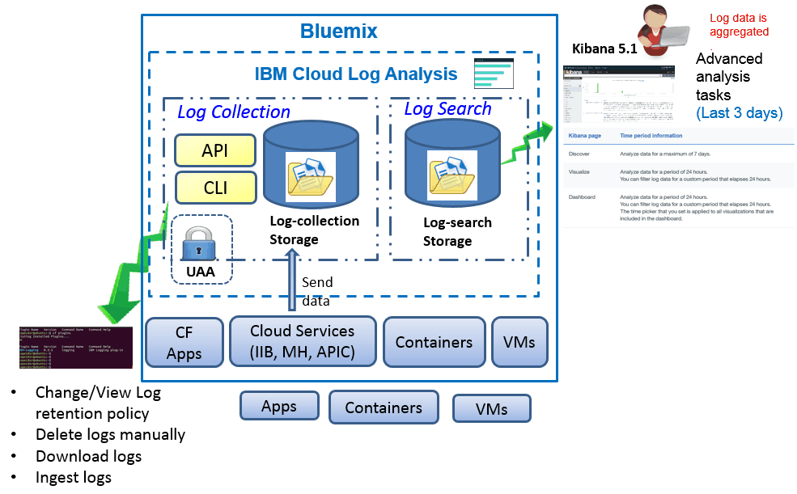

---

copyright:
  years: 2017

lastupdated: "2017-07-19"

---

{:shortdesc: .shortdesc}
{:new_window: target="_blank"}
{:codeblock: .codeblock}
{:screen: .screen}
{:pre: .pre}

# Informazioni
{: #log_analysis_ov}

Utilizza il servizio {{site.data.keyword.loganalysisfull}} per espandere le tue funzionalità di raccolta dei log, conservazione dei log e ricerca dei log in {{site.data.keyword.Bluemix}}. Aggiungi al tuo team DevOps funzioni come l'aggregazione dell'applicazione e dei log dell'ambiente per l'applicazione consolidata o le informazioni approfondite sull'ambiente, la codifica dei log, la conservazione dei dati di log per il tempo necessario e il rapido rilevamento e risoluzione dei problemi. Utilizza Kibana per le attività di analisi avanzata.
{:shortdesc}

Le funzionalità di registrazione di {{site.data.keyword.Bluemix_notm}} sono integrate nella piattaforma:

* La raccolta dei dati è abilitata automaticamente per le risorse cloud. Per impostazione predefinita, {{site.data.keyword.Bluemix_notm}}, raccoglie e visualizza i log per le tue applicazioni, i runtime delle applicazioni e i runtime di calcolo in cui queste applicazioni vengono eseguite. 
* Puoi ricercare fino a 500 MB di dati al giorno. 
* I log vengono archiviati per gli ultimi 3 giorni nella Ricerca dei log, un componente del servizio {{site.data.keyword.loganalysisshort}}.

Puoi utilizzare le funzionalità di registrazione in {{site.data.keyword.Bluemix_notm}} per comprendere il funzionamento della piattaforma cloud e delle risorse eseguite al suo interno. Non è richiesta alcuna strumentazione speciale per raccogliere i log di output standard e di errore standard. Ad esempio, puoi utilizzare i log per fornire un audit trail per un'applicazione, rilevare problemi nel tuo servizio, identificare vulnerabilità, risolvere problemi relativi alle distribuzioni delle applicazioni e al funzionamento del runtime, rilevare problemi nell'infrastruttura in cui è in esecuzione l'applicazione, tracciare la tua applicazione tra i componenti della piattaforma cloud e individuare dei modelli da utilizzare per prevenire azioni che potrebbero compromettere il tuo servizio SLA.

La seguente figura mostra una vista di alto livello dei componenti del servizio {{site.data.keyword.loganalysisshort}}: 

Per raccogliere e ricercare i log delle risorse cloud, devi eseguire il provisioning di un'istanza del servizio {{site.data.keyword.loganalysisshort}} nello stesso spazio {{site.data.keyword.Bluemix_notm}} in cui sono in esecuzione queste risorse cloud.

I log vengono raccolti e archiviati nella Ricerca dei log per impostazione predefinita. Quando selezioni un piano del servizio che include le funzionalità di raccolta e ricerca estese, i log vengono inoltre raccolti e archiviati nel componente Raccolta dei log. I dati dei log che vengono archiviati nella Raccolta dei log sono crittografati.

La dimensione dei log che puoi raccogliere e archiviare nella Raccolta dei log è determinata dal piano del servizio che hai scelto. Paghi per GB di dati al mese per i dati che archivi. I log sono archiviati nella raccolta dei log come JSON.

Puoi utilizzare Kibana 5.1 per le attività di analisi della ricerca dei log avanzate:

* Ogni piano limita la dimensione dei log che puoi ricercare al giorno. 
* Le ricerche coprono soltanto i dati degli ultimi 3 giorni.

Per accedere ai log più vecchi di 3 giorni, puoi utilizzare la CLI o l'API della raccolta dei log per scaricare i log localmente o puoi inviare i log a un'altra applicazione o a servizi cloud di terze parti. 

Puoi eliminare i log automaticamente configurando una politica di conservazione o manualmente utilizzando la CLI {{site.data.keyword.loganalysisshort}}.

## Perché utilizzare il servizio Registrazione
{: #value}

1. **Impieghi meno tempo a strumentare la tua applicazione e più tempo a migliorarne la qualità**

    {{site.data.keyword.loganalysislong_notm}} raccoglia automaticamente i dati dai servizi cloud {{site.data.keyword.IBM_notm}} selezionati, non è necessaria la strumentazione.
	
	Puoi scegliere la quantità di log su cui puoi eseguire ricerche al giorno.  Sono disponibili diversi piani che puoi usare per eseguire ricerche su un massimo di 500MB, 2GB, 5GB e 10GB di log al giorno.

2. **Conservi i tuoi dati di log vicino ai tuoi carichi di lavoro dell'applicazione e proteggi le soluzioni di archiviazione economiche della classe cloud**

    Raccogli e archivi i dati di log dalle applicazioni basate sui microservizi e tradizionali in esecuzione nel cloud {{site.data.keyword.IBM_notm}} in un log centralizzato. Conservi i dati di log per tutto il tempo necessario.
	
	I log sono archiviati nell'archiviazione cloud {{site.data.keyword.IBM_notm}}. Puoi scaricare i log, quando ne hai bisogno.

3. **Ottieni informazioni approfondite sul tuo ambiente per individuare, diagnosticare e identificare velocemente i problemi**

    Visualizzi, analizzi e interagisci con i tuoi dati tramite dashboard personalizzabili. Basate sulla piattaforma stack Elastic, le funzioni di ricerca dei log ti offrono la flessibilità e la familiarità di Kibana per creare velocemente i tuoi dashboard per i bisogni della tua applicazione.

4. **Integrazione solida con le API**

    Integra i tuoi dati di log nelle tue applicazioni e operazioni tramite le API del servizio. Utilizza le API del servizio {{site.data.keyword.loganalysisshort}} per gestire i tuoi log conservati e inviare i dati di log dall'esterno del cloud {{site.data.keyword.IBM_notm}}.

	
## Raccolta dei log
{: #log_collection}

Per impostazione predefinita, {{site.data.keyword.Bluemix_notm}} archivia i dati dei log per 3 giorni nella Ricerca dei log:   

* Viene archiviato un massimo di 500MB per spazio di dati al giorno. Tutti i log che superano i 500 MB vengono scartati. Le assegnazioni dei limiti vengono
reimpostate ogni giorno alle ore 12:30 UTC.
* Sono ricercabili fino a 1,5 GB di dati per una massimo di 3 giorni. Viene eseguito il rollover (la prima voce inserita è la prima a essere eliminata) dei dati di log quando vengono raggiunti i 1,5 GB di dati o vengono superati i 3 giorni.

Il servizio {{site.data.keyword.loganalysisshort}} fornisce ulteriori piani che ti consentono di archiviare i log nella raccolta dei log per quanto tempo desideri. Per ulteriori informazioni su ciascun piano, vedi [Piani di servizio](/docs/services/CloudLogAnalysis/log_analysis_ov.html#plans).

## Eliminazione dei log
{: #log_deletion}

I log archiviati nella Ricerca dei log vengono eliminati dopo 3 giorni.

I log archiviati nella Raccolta dei log vengono automaticamente eliminati dopo 30 giorni a meno che non configuri una politica di conservazione. 

* Puoi configurare una politica di conservazione log per definire il numero di giorni in cui desideri conservare i log nella raccolta dei log. Per maggiori informazioni, vedi [Politica di conservazione log](/docs/services/CloudLogAnalysis/log_analysis_ov.html#policies).

* Puoi disabilitare la politica impostandone il valore su *-1*. 

Puoi utilizzare l'API o la CLI della Raccolta dei log per eliminare i log manualmente dalla Raccolta dei log. Per ulteriori informazioni sull'eliminazione dei log manualmente tramite la CLI, vedi [cf logging delete](/docs/services/CloudLogAnalysis/reference/logging_cli.html#delete).

## Inserimento dei log
{: #log_ingestion}

Tutti i piani del servizio {{site.data.keyword.loganalysisshort}}, con l'eccezione del piano *Lite*, includono la capacità di inviare log alla raccolta dei log all'esterno del cloud {{site.data.keyword.IBM_notm}}. Per ulteriori informazioni sui piani, vedi [Piani di servizio](/docs/services/CloudLogAnalysis/log_analysis_ov.html#plans).

Puoi inviare log in {{site.data.keyword.loganalysisshort}} utilizzando il logstash forwarder a più tenant. Per maggiori informazioni, vedi [Invia dati di log utilizzando un logstash forwarder a più tenant (mt-logstash-forwarder)](/docs/services/CloudLogAnalysis/how-to/send-data/send_data_mt.html#send_data_mt).

## Ricerca dei log
{: #log_search}

Per impostazione predefinita, puoi utilizzare Kibana 5.1 per ricercare fino a 500 MB di log al giorno in {{site.data.keyword.Bluemix_notm}}. 

Il servizio {{site.data.keyword.loganalysisshort}} fornisce più piani. Ogni piano ha diverse capacità di ricerca log, ad esempio, il piano *Raccolta di log* ti consente di ricercare fino a 1 GB di dati al giorno. Per ulteriori informazioni sui piani, vedi [Piani di servizio](/docs/services/CloudLogAnalysis/log_analysis_ov.html#plans).

## Analisi dei log in Bluemix
{: #logging_bmx_ov_ui}

In {{site.data.keyword.Bluemix_notm}}, puoi visualizzare in tempo reale i log recenti o le parti finali dei log distribuiti a un'infrastruttura gestita da {{site.data.keyword.Bluemix_notm}}:

* Puoi visualizzare, filtrare e analizzare i log attraverso la IU. Per ulteriori informazioni, vedi [Analisi dei log dalla console Bluemix](/docs/services/CloudLogAnalysis/logging_view_dashboard.html#analyzing_logs_bmx_ui).

* Puoi visualizzare, filtrare e analizzare i log utilizzando la riga di comando per gestire i log a livello di programmazione. Per ulteriori informazioni, vedi [Analisi dei log dalla CLI](/docs/services/CloudLogAnalysis/logging_view_cli.html#analyzing_logs_cli).

* Puoi eseguire le analisi avanzate utilizzando Kibana.

## Analisi log avanzata con Kibana
{: #logging_bmx_ov_kibana}

In {{site.data.keyword.Bluemix_notm}}, puoi utilizzare Kibana, una piattaforma di analisi e visualizzazione open source, per monitorare, ricercare, analizzare e visualizzare i tuoi dati in una varietà di grafici, ad esempio, diagrammi e tabelle. Per maggiori informazioni, vedi [Analisi log avanzata con Kibana](/docs/services/CloudLogAnalysis/kibana/analyzing_logs_Kibana.html#analyzing_logs_Kibana).

## Gestione di log tramite la CLI
{: #managing_logs}

Utilizza la CLI {{site.data.keyword.loganalysisshort}} per gestire i log.

* Per informazioni su come installare la CLI, vedi [Installazione della CLI di registrazione](/docs/services/CloudLogAnalysis/how-to/manage-logs/config_log_collection_cli.html#config_log_collection_cli).
* Per controllare la versione della CLI, esegui il comando [cf logging](/docs/services/CloudLogAnalysis/reference/logging_cli.html#base) con il parametro * -version*.
* Per ottenere supporto su come eseguire i comandi, vedi [Come ottenere supporto per la riga di comando per eseguire i comandi](/docs/services/CloudLogAnalysis/how-to/manage-logs/config_log_collection_cli.html#cli_help).

Per ottenere informazioni generali sui tuoi log, utilizza il comando `cf logging status`. Ad esempio, puoi:

* [Ottenere informazioni sui tuoi log per un periodo di tempo](/docs/services/CloudLogAnalysis/how-to/manage-logs/viewing_log_information.html#viewing_logs).
* [Ottenere informazioni su un tipo di log per un periodo di tempo](/docs/services/CloudLogAnalysis/how-to/manage-logs/viewing_log_information.html#viewing_logs_by_log_type).
* [Ottenere informazioni sull'account sui log](/docs/services/CloudLogAnalysis/how-to/manage-logs/viewing_log_information.html#viewing_logs_account).

Per mantenere i costi sotto controllo, potresti voler monitorare la dimensione dei log delle tue applicazioni per un periodo di tempo. Ad esempio, potresti voler conoscere la dimensione di ogni tipo di log durante una settimana per uno spazio {{site.data.keyword.Bluemix_notm}} per identificare se un'applicazione o un servizio sta generando più log del previsto. Per verificare la dimensione dei tuoi log, utilizza il comando `cf logging status`. Per ulteriori informazioni, vedi [Visualizzazione delle informazioni sul log](/docs/services/CloudLogAnalysis/how-to/manage-logs/viewing_log_information.html#viewing_log_status).

Puoi ricercare i log degli ultimi 3 giorni in Kibana. Per poter analizzare i dati di log più vecchi, puoi scaricare i log in un file locale o inserirli in altri programmi come un Elastic Stack locale. Per maggiori informazioni, vedi [Scaricamento dei log](/docs/services/CloudLogAnalysis/how-to/manage-logs/downloading_logs.html#downloading_logs).

Per eliminare i log di cui non hai più bisogno manualmente, utilizza il comando  [cf logging delete](/docs/services/CloudLogAnalysis/reference/logging_cli.html#delete). 

## Politiche
{: #policies}

**Politica di conservazione dei log**

Puoi utilizzare la CLI {{site.data.keyword.loganalysisshort}} per visualizzare e configurare la politica di conservazione dei log. Questa politica specifica il numero di giorni in cui i log vengono conservati nella raccolta dei log. 

* Per impostazione predefinita, i log vengono conservati per 30 giorni. 
* Dopo la scadenza del periodo di conservazione, i log vengono eliminati automaticamente dalla Raccolta dei log e non possono essere ripristinati.
* Puoi specificare una periodo di conservazione per un account. Il periodo di conservazione viene automaticamente configurato per tutti gli spazi in tale account. 
* Puoi specificare un periodo di conservazione per uno spazio {{site.data.keyword.Bluemix_notm}}.
* Puoi modificare in qualsiasi momento la politica di conservazione.
* Puoi disabilitare la politica impostandone il valore su *-1*. 

**Nota:** quando disabiliti la politica di conservazione dei log, devi conservare i log nella Raccolta dei log. Puoi utilizzare il comando CLI [cf logging delete](/docs/services/CloudLogAnalysis/reference/logging_cli.html#delete) per eliminare i log vecchi.

Per maggiori informazioni, vedi [Visualizzazione e configurazione della politica di conservazione dei log](/docs/services/CloudLogAnalysis/how-to/manage-logs/configuring_retention_policy.html#configuring_retention_policy).

## Piani del servizio
{: #plans}

Il servizio {{site.data.keyword.loganalysisshort}} fornisce più piani. Ogni piano ha diverse funzionalità di ricerca e raccolta dei log. 

Puoi modificare un piano tramite la IU {{site.data.keyword.Bluemix_notm}} o la riga di comando. Puoi aggiornare o ridurre il tuo piano in qualsiasi momento. Per ulteriori informazioni sugli aggiornamenti del piano del servizio in {{site.data.keyword.Bluemix_notm}}, vedi [Modifica del piano](/docs/services/CloudLogAnalysis/plan/change_plan.html#change_plan). 

La seguente tabella illustra i piani disponibili:

<table>
    <caption>Riepilogo delle funzionalità di ricerca e raccolta dei log per ogni piano</caption>
      <tr>
        <th>Piano</th>
        <th>Inserimento log</th>
        <th>Conservazione dei log</th>
        <th>Codifica dati</th>
        <th>Ricerca dei log</th>
      </tr>
      <tr>
        <td>Lite (predefinito)</td>
        <td>No</td>
        <td>Ultimi 3 giorni</td>
        <td>No</td>
        <td>Ricerca fino a 500 MB</td>
      </tr>
      <tr>
        <td>Raccolta dei log</td>
        <td>Sì</td>
        <td>Numero configurabile di giorni.</td>
        <td>Sì</td>
        <td>Ricerca fino a 500 MB al giorno</td>
      </tr>
      <tr>
        <td>Raccolta dei log con 2GB/Ricerca al giorno</td>
        <td>Sì</td>
        <td>Numero configurabile di giorni.</td>
        <td>Sì</td>
        <td>Ricerca fino a 2 GB al giorno</td>
      </tr>
      <tr>
        <td>Raccolta dei log con 5GB/Ricerca al giorno</td>
        <td>Sì</td>
        <td>Numero configurabile di giorni.</td>
        <td>Sì</td>
        <td>Ricerca fino a 5 GB al giorno</td>
      </tr>
       <tr>
        <td>Raccolta dei log con 10GB/Ricerca al giorno</td>
        <td>Sì</td>
        <td>Numero configurabile di giorni.</td>
        <td>Sì</td>
        <td>Ricerca fino a 10 GB al giorno</td>
      </tr>
</table>

**Nota:** il costo mensile dell'archiviazione di raccolta dei log viene calcolato come una media del ciclo di fatturazione.

## Regioni
{: #regions}

Il servizio {{site.data.keyword.loganalysisfull_notm}} è disponibile nella seguente regione:

* Stati Uniti Sud

