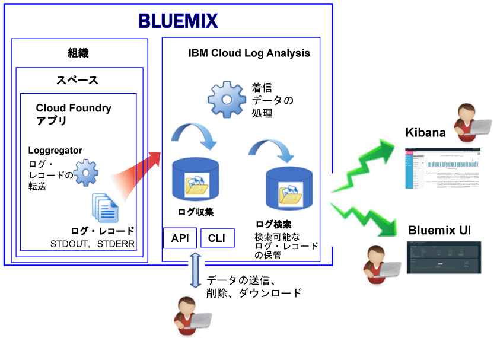

---

copyright:
  years: 2017

lastupdated: "2017-07-19"

---

{:shortdesc: .shortdesc}
{:new_window: target="_blank"}
{:codeblock: .codeblock}
{:screen: .screen}
{:pre: .pre}

# Bluemix での Cloud Foundry アプリのロギング
{: #logging_bluemix_cf_apps}

{{site.data.keyword.Bluemix}} では、 Cloud Foundry (CF) ログの表示、フィルター操作、および分析を、{{site.data.keyword.Bluemix_notm}} ダッシュボード、Kibana、およびコマンド・ライン・インターフェースを介して行うことができます。それに加えて、ログ・レコードを外部ログ管理ツールにストリーミングすることもできます。
{:shortdesc}

{{site.data.keyword.Bluemix_notm}} は、Cloud Foundry プラットフォームによって生成されるログ・データ、および Cloud Foundry アプリケーションによって生成されるログ・データを記録します。ログでは、アプリに対して生成されたエラー、警告、および情報の各メッセージを表示できます。 

{{site.data.keyword.Bluemix_notm}} 上の Cloud Foundry など、クラウド Platform as a Service (PaaS) でアプリを実行する場合、ログにアクセスするためにアプリの実行場所であるインフラストラクチャーに入る際に SSH または FTP を使用できません。プラットフォームはクラウド・プロバイダーによって制御されています。{{site.data.keyword.Bluemix_notm}} で実行している Cloud Foundry アプリは、Loggerator コンポーネントを使用して、Cloud Foundry インフラストラクチャー内部からログ・レコードを転送します。Loggregator は、STDOUT データと STDERR データを自動的に選出します。{{site.data.keyword.Bluemix_notm}} ダッシュボード、Kibana、およびコマンド・ライン・インターフェースを介して、これらのログの視覚化および分析を行うことができます。

以下の図は、{{site.data.keyword.Bluemix_notm}} での Cloud Foundry アプリのロギングの概略を示します。

 
Cloud Foundry アプリのロギングは、Cloud Foundry インフラストラクチャーを使用して {{site.data.keyword.Bluemix_notm}} 上でアプリを実行すると自動的に有効になります。Cloud Foundry ランタイム・ログを表示するには、ログを STDOUT および STDERR に書き込む必要があります。詳しくは、『[CF アプリを介したランタイム・アプリケーションのロギング](/docs/services/CloudLogAnalysis/cfapps/logging_writing_to_log_from_cf_app.html#logging_writing_to_log_from_cf_app)』を参照してください。

{{site.data.keyword.Bluemix_notm}} は、限られた量のログ情報を保持します。情報がログに記録されると、古い情報が新しい情報に置き換えられます。組織または業界の方針に準拠する必要があり、その方針では監査またはその他の目的のためにすべてのログ情報または一部のログ情報を保持しなければならない場合、外部ログ・ホスト (例えば、サード・パーティーのログ管理サービスまたはその他のホスト) にログをストリーミングできます。詳しくは、『[外部ログ・ホストの構成](/docs/services/CloudLogAnalysis/external/logging_external_hosts.html#thirdparty_logging)』を参照してください。

## ログの取り込み
{: #log_ingestion}

{{site.data.keyword.loganalysisshort}} サービスにはさまざまなプランが用意されています。各プランでは、Log Collection にログを送信できるかどうかが定義されています。*ライト*・プランを除くすべてのプランには、Log Collection にログを送信する機能が含まれています。各種プランについて詳しくは、『[サービス・プラン](/docs/services/CloudLogAnalysis/log_analysis_ov.html#plans)』を参照してください。

マルチテナント Logstash Forwarder を使用することによって、ログを {{site.data.keyword.loganalysisshort}} に送信できます。詳しくは、『[マルチテナント Logstash Forwarder (mt-logstash-forwarder) を使用したログ・データの送信](/docs/services/CloudLogAnalysis/how-to/send-data/send_data_mt.html#send_data_mt)』を参照してください。

## ログ収集
{: #log_collection}

デフォルトでは、{{site.data.keyword.Bluemix_notm}} は Log Search 内にログ・データを最大 3 日間保管します。   

* スペースごとに 1 日に最大で 500 MB のデータが保管されます。500 MB の上限を超えるログは破棄されます。上限割り当ては、毎日午前 12:30 (UTC) にリセットされます。
* 1.5 GB までのデータを最大 3 日間検索可能です。ログ・データは、データが 1.5 GB に達するか 3 日が過ぎると、ロールオーバーします (先入れ先出し)。

{{site.data.keyword.loganalysisshort}} サービスには、必要な期間 Log Collection にログを保管できる追加プランがあります。各プランの料金について詳しくは、『[サービス・プラン](/docs/services/CloudLogAnalysis/log_analysis_ov.html#plans)』を参照してください。

Log Collection 内でログを保持する日数を定義するために使用できるログ保存ポリシーを構成できます。詳しくは、『[ログ保存ポリシー](/docs/services/CloudLogAnalysis/log_analysis_ov.html#policies)』を参照してください。

## ログ検索
{: #log_search}

デフォルトでは、{{site.data.keyword.Bluemix_notm}} では、1 日当たり 500 MB までのログを Kibana を使用して検索できます。 

{{site.data.keyword.loganalysisshort}} サービスには複数のプランが用意されています。ログ検索の機能はプランによって異なります。例えば、*ログ収集*プランでは、1 日当たり 1 GB までのデータを検索できます。各種プランについて詳しくは、『[サービス・プラン](/docs/services/CloudLogAnalysis/log_analysis_ov.html#plans)』を参照してください。

## CF アプリ・ログを分析する方法
{: #logging_bluemix_cf_apps_log_methods}

Cloud Foundry アプリケーションのログを分析するための方法には以下のものがあり、任意の方法を選択できます。

* {{site.data.keyword.Bluemix_notm}} でログを分析して、アプリケーションの最新アクティビティーを表示します。
    
    {{site.data.keyword.Bluemix_notm}} では、Cloud Foundry アプリケーションごとにある**「ログ」**タブを使用して、ログの表示、フィルター操作、および分析を行うことができます。詳しくは、『[Bluemix ダッシュボードからの CF アプリ・ログの分析](/docs/services/CloudLogAnalysis/logging_view_dashboard.html#analyzing_logs_bmx_ui)』を参照してください。
    
* Kibana でログを分析して、高機能な分析タスクを実行します。
    
    {{site.data.keyword.Bluemix_notm}} では、分析および視覚化のためのオープン・ソース・プラットフォームである Kibana を使用して、さまざまなグラフ (図表や表など) でデータのモニター、検索、分析、および視覚化を行うことができます。詳しくは、『[Kibana でのログの分析](/docs/services/CloudLogAnalysis/kibana/analyzing_logs_Kibana.html#analyzing_logs_Kibana)』を参照してください。
	
	**ヒント:** Kibana の起動方法については、『[CF アプリのダッシュボードから Kibana へのナビゲート](/docs/services/CloudLogAnalysis/kibana/launch.html#launch_Kibana_from_cf_app)』を参照してください。

* CLI を介してログを分析して、コマンドを使用してログをプログラマチックに管理します。
    
    {{site.data.keyword.Bluemix_notm}} では、**cf logs** コマンドを使用することによって、ログの表示、フィルター操作、および分析をコマンド・ライン・インターフェースを介して行うことができます。詳しくは、『[コマンド・ライン・インターフェースからの Cloud Foundry アプリ・ログの分析](/docs/services/CloudLogAnalysis/logging_view_cli.html#analyzing_logs_cli)』を参照してください。

## Diego にデプロイされた CF アプリのログ・ソース
{: #cf_apps_log_sources_diego}

Diego に基づく Cloud Foundry (CF) アーキテクチャーにデプロイされた Cloud Foundry アプリケーションでは、以下のログ・ソースが使用可能です。
    
| ログ・ソース| コンポーネント名| 説明| 
|------------|----------------|-------------|
| LGR| Loggregator| LGR コンポーネントは、Cloud Foundry の内部からログを転送する Cloud Foundry Loggregator についての情報を提供します。|
| RTR| ルーター| RTR コンポーネントは、アプリケーションへの HTTP 要求についての情報を提供します。| 
| STG| ステージング中| STG コンポーネントは、アプリケーションがどのようにステージまたは再ステージされるのかについての情報を提供します。| 
| APP| アプリケーション| APP コンポーネントは、アプリケーションからのログを提供します。これは stderr および stdout がコーディングされる場所です。| 
| API| Cloud Foundry API| API コンポーネントは、アプリケーション状況を変更するユーザー要求の結果として生じる内部アクションについての情報を提供します。| 
| CELL| Diego セル| CELL コンポーネントは、アプリケーションの開始、停止、またはクラッシュについての情報を提供します。|
| SSH| SSH| SSH コンポーネントは、**cf ssh** コマンドを使用してユーザーがアプリケーションにアクセスするたびに情報を提供します。|
{: caption="表 1. Diego に基づく CF アーキテクチャーにデプロイされた CF アプリのログ・ソース" caption-side="top"}

以下の図は、Diego に基づく Cloud Foundry アーキテクチャーのさまざまなコンポーネント (ログ・ソース) を示します。 

。")
	
## DEA にデプロイされた CF アプリのログ・ソース
{: #logging_bluemix_cf_apps_log_sources}

Droplet Execution Agent (DEA) アーキテクチャーにデプロイされた Cloud Foundry (CF) アプリケーションでは、以下のログ・ソースが使用可能です。
    
| ログ・ソース| コンポーネント名| 説明 | 
|------------|----------------|-------------|
| LGR| Loggregator| LGR コンポーネントは、Cloud Foundry の内部からログを転送する Cloud Foundry Loggregator についての情報を提供します。|
| RTR| ルーター| RTR コンポーネントは、アプリケーションへの HTTP 要求についての情報を提供します。| 
| STG| ステージング中| STG コンポーネントは、アプリケーションがどのようにステージまたは再ステージされるのかについての情報を提供します。| 
| APP| アプリケーション| APP コンポーネントは、アプリケーションからのログを提供します。これは stderr および stdout がコーディングされる場所です。| 
| API| Cloud Foundry API| API コンポーネントは、アプリケーション状況を変更するユーザー要求の結果として生じる内部アクションについての情報を提供します。| 
| DEA| Droplet Execution Agent| DEA コンポーネントは、アプリケーションの開始、停止、またはクラッシュについての情報を提供します。  このコンポーネントが使用可能なのは、DEA に基づく Cloud Foundry アーキテクチャーにアプリケーションがデプロイされている場合のみです。| 
{: caption="表 2. DEA に基づく CF アーキテクチャーにデプロイされた CF アプリのログ・ソース" caption-side="top"}

以下の図は、DEA に基づく Cloud Foundry アーキテクチャーのさまざまなコンポーネント (ログ・ソース) を示します。 

 に基づく Cloud Foundry アーキテクチャーのコンポーネント (ログ・ソース)。")

