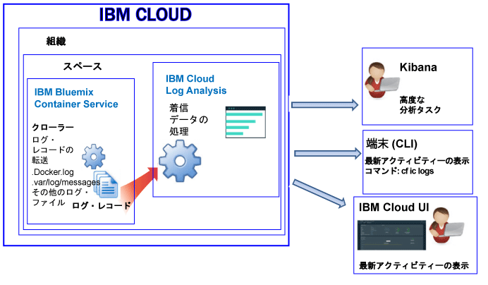

---

copyright:
  years: 2017, 2018

lastupdated: "2018-01-10"

---

{:shortdesc: .shortdesc}
{:new_window: target="_blank"}
{:codeblock: .codeblock}
{:screen: .screen}
{:pre: .pre}

# IBM Cloud によって管理されるコンテナーのロギング (非推奨)
{: #containers_bluemix}

{{site.data.keyword.IBM}} によって管理されるインフラストラクチャーにデプロイされた Docker コンテナーに関するログを表示、フィルター操作、および分析することができます。
{:shortdesc}

コンテナーのログは、クローラーを使用して、コンテナーの外部からモニターおよび転送されます。 データは、クローラーによって {{site.data.keyword.Bluemix_notm}} 内のマルチテナント Elasticsearch に送信されます。

以下の図は、{{site.data.keyword.containershort}} のロギングの概略を示しています。

{{site.data.keyword.Bluemix_notm}} 管理のクラウド・インフラストラクチャーにデプロイされているコンテナーの場合、以下のログがデフォルトで収集されます。

<table>
  <caption>表 2. {{site.data.keyword.Bluemix_notm}} 管理のインフラストラクチャーにデプロイされているコンテナーで収集されるログ</caption>
  <tbody>
    <tr>
      <th align="center">ログ</th>
      <th align="center">説明</th>
    </tr>
    <tr>
      <td align="left" width="30%">/var/log/messages</td>
      <td align="left" width="70%"> デフォルトでは、Docker メッセージは、コンテナーの /var/log/messages フォルダーに保管されます。 このログには、システム・メッセージが含まれます。
      </td>
    </tr>
    <tr>
      <td align="left">./docker.log</td>
      <td align="left">このログは、Docker ログです。   Docker ログ・ファイルはコンテナー内にファイルとして保管されることはありませんが、収集されます。 このログ・ファイルがデフォルトで収集されるのは、それがコンテナーの stdout (標準出力) 情報と stderr (標準エラー) 情報の公開に関する標準 Docker 規則であるためです。 すべてのコンテナー・プロセスが STDOUT または STDERR に出力する情報が収集されます。 
      </td>
     </tr>
  </tbody>
</table>

## ログの分析
{: #logging_containers_ov_methods}

コンテナー・ログ・データを分析するには、Kibana を使用して高度な分析タスクを実行します。 分析および視覚化のためのオープン・ソース・プラットフォームである Kibana を使用して、さまざまなグラフ (図表や表など) でデータのモニター、検索、分析、および視覚化を行うことができます。 詳しくは、『[Kibana でのログの分析](/docs/services/CloudLogAnalysis/kibana/analyzing_logs_Kibana.html#analyzing_logs_Kibana)』を参照してください。

## カスタム・ログの収集
{: #collect_custom_logs}

追加ログを収集するには、コンテナーの作成時にログ・ファイルへのパスを指定した **LOG_LOCATIONS** 環境変数を追加します。 

複数のログ・ファイルをコンマで区切って追加できます。 

詳しくは、『[コンテナーからの非デフォルト・ログ・データの収集](logging_containers_other_logs.html#logging_containers_collect_data)』を参照してください。

## ログの検索
{: #log_search}

デフォルトでは、{{site.data.keyword.Bluemix_notm}} では、1 日当たり 500 MB までのログを Kibana を使用して検索できます。 

{{site.data.keyword.loganalysisshort}} サービスには複数のプランが用意されています。 ログ検索の機能はプランによって異なります。例えば、*Log Collection *プランでは、1 日当たり 1 GB までのデータを検索できます。 各種プランについて詳しくは、『[サービス・プラン](/docs/services/CloudLogAnalysis/log_analysis_ov.html#plans)』を参照してください。

## メッセージ内のフィールドを Kibana 検索フィールドとして使用できるようにするためのログの送信
{: #send_data_in_json}

デフォルトで、コンテナーのロギングは自動的に有効になります。 Docker ログ・ファイルのすべての項目は、Kibana で `message` フィールドに表示されます。 コンテナー・ログ項目の一部である特定のフィールドを使用して、Kibana でデータをフィルター操作および分析する必要がある場合は、有効な JSON フォーマットの出力を送信するようにアプリケーションを構成します。

ログを送信し、コンテナー・ログ項目が解析されて個別フィールドに入れられるようにするには、以下の手順を実行します。

1. メッセージをファイルに記録します。 
2. コンテナーから分析に使用できるデフォルト以外のログのリストにログ・ファイルを追加します。 詳しくは、『[コンテナーからの非デフォルト・ログ・データの収集](logging_containers_other_logs.html#logging_containers_collect_data)』を参照してください。 
    
JSON ログ項目が STDOUT としてコンテナーの Docker ログ・ファイルに送信されると、JSON として構文解析されません。 
    
メッセージをファイルに記録し、メッセージが有効な JSON であると判別されると、フィールドが構文解析され、メッセージ内の各フィールドに対して新しいフィールドが作成されます。 Kibana でのフィルター操作およびソートに使用できるのは、ストリング型のフィールド値のみになります。

## Log Collection へのログの保管
{: #store_logs}

デフォルトでは、{{site.data.keyword.Bluemix_notm}} はログ・データを最大 3 日間保管します。   

* スペースごとに 1 日に最大で 500 MB のデータが保管されます。 500 MB の上限を超えるログは破棄されます。 上限割り当ては、毎日午前 12:30 (UTC) にリセットされます。
* 1.5 GB までのデータを最大 3 日間検索可能です。 ログ・データは、データが 1.5 GB に達するか 3 日が過ぎると、ロールオーバーします (先入れ先出し)。

{{site.data.keyword.loganalysisshort}} サービスには、必要な期間 Log Collection にログを保管できる追加プランがあります。 各プランの料金について詳しくは、『[サービス・プラン](/docs/services/CloudLogAnalysis/log_analysis_ov.html#plans)』を参照してください。

ログの保管または大容量ログの検索が必要な場合、{{site.data.keyword.loganalysisshort}} サービスをプロビジョンし、異なるサービス・プランを選択することができます。 必要な期間にわたって Log Collection にログを保管したり、大きなサイズのログを検索したりできる、追加プランがあります。 詳しくは、『[サービス・プラン](/docs/services/CloudLogAnalysis/log_analysis_ov.html#plans)』を参照してください。

## ログの表示
{: #logging_containers_ov_methods_view_bmx}

{{site.data.keyword.Bluemix_notm}} 管理のインフラストラクチャーにデプロイされているコンテナーの最新ログは、以下のいずれかの方法を使用して表示できます。

* {{site.data.keyword.Bluemix_notm}} UI を介してログを表示して、コンテナーの最新のアクティビティーをモニターします。
    
    各コンテナーに対して使用可能な**「モニターおよびログ (Monitoring and logs)」**のタブを使用してログの表示、フィルタリング、および分析を行うことができます。 
	
	{{site.data.keyword.IBM_notm}} が管理するインフラストラクチャーにデプロイされた Docker コンテナーのデプロイメント・ログまたはランタイム・ログを表示するには、以下のステップを実行します。

    1. 「アプリ」ダッシュボードで単一コンテナーまたはコンテナー・グループをクリックします。 
    
    2. アプリ詳細ページで**「モニターおよびログ (Monitoring and Logs)」**をクリックします。

    3. **「ロギング」**タブを選択します。 **「ロギング」**タブでは、コンテナーの最近のログを表示したり、最新のログ (ログ・ファイルの末尾) をリアルタイムで確認することができます。 
	
* {{site.data.keyword.containershort}} CLI を使用してログを表示します。 コマンドを使用して、プログラマチックにログを管理します。
    
    **cf ic logs** コマンドを使用することによって、ログの表示、フィルター操作、および分析をコマンド・ライン・インターフェースを介して行うことができます。 
	
	`bx cf ic logs` コマンドを使用して、{{site.data.keyword.Bluemix_notm}} 内のコンテナーからのログを表示します。 例えば、ログを使用して、コンテナーが停止した理由を分析したり、コンテナー出力を確認したりすることができます。 
	
	`cf ic logs` コマンドによって、コンテナーで実行されるアプリのアプリケーション・エラーを表示するには、アプリケーションでログを標準出力 (STDOUT) および標準エラー(STDERR) 出力ストリームに書き込む必要があります。 これらの標準出力ストリームに書き込むようにアプリケーションを設計した場合、コンテナーがシャットダウンまたは異常終了した場合でも、コマンド・ラインでログを参照できます。

    `cf ic logs` コマンドについて詳しくは、[cf ic logs コマンド](/docs/containers/container_cli_reference_cfic.html#container_cli_reference_cfic__logs)を参照してください。

