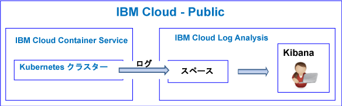
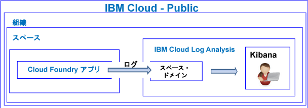

---

copyright:
  years: 2017, 2018

lastupdated: "2018-07-25"

---

{:new_window: target="_blank"}
{:shortdesc: .shortdesc}
{:screen: .screen}
{:pre: .pre}
{:table: .aria-labeledby="caption"}
{:codeblock: .codeblock}
{:tip: .tip}
{:download: .download}

# 概説のチュートリアル
{: #getting-started-with-cla}

このチュートリアルを使用して、{{site.data.keyword.Bluemix}} で {{site.data.keyword.loganalysislong}} サービスを使用した作業を開始する方法を学習します。 
{:shortdesc}

デフォルトでは、{{site.data.keyword.Bluemix_notm}} は、選択されたサービスに対して、統合されたロギング機能を提供します。 ログを処理するときに、収集および保存の機能を {{site.data.keyword.loganalysisshort}} サービスを使用して拡張できます。

## 始める前に
{: #prereqs}

{{site.data.keyword.Bluemix_notm}} アカウントのメンバーまたは所有者であるユーザー ID が必要です。 {{site.data.keyword.Bluemix_notm}} ユーザー ID を取得するには、[「登録」](https://console.bluemix.net/registration/){:new_window} にアクセスしてください。

## ステップ 1: ログを表示したい対象のクラウド・リソースを選択する
{: #step1}

{{site.data.keyword.Bluemix_notm}} では、CF アプリケーション、{{site.data.keyword.containershort}} で実行されているコンテナー、および選択されたサービスは、自動的にログ・データを収集し、それを {{site.data.keyword.loganalysisshort}} サービスに転送します。

以下の表に、各種クラウド・リソースを示します。 {{site.data.keyword.loganalysisshort}} サービスの入門として、いずれかのリソースのチュートリアルを実行してください。

<table>
  <caption>{{site.data.keyword.loganalysisshort}} サービス入門チュートリアル </caption>
  <tr>
    <th>リソース</th>
    <th>チュートリアル</th>
    <th>クラウド環境</th>
    <th>シナリオ</th>
  </tr>
  <tr>
    <td>{{site.data.keyword.containershort}} で実行されているコンテナー</td>
    <td>[Kubernetes クラスターにデプロイされたアプリに関する Kibana でのログの分析](/docs/services/CloudLogAnalysis/tutorials/container_logs.html#container_logs)</td>
    <td>Public </br>Dedicated</td>
    <td></td>
  </tr>
  <tr>
    <td>CF アプリ</td>
    <td>[Cloud Foundry アプリのログの Kibana での分析](https://console.bluemix.net/docs/tutorials/application-log-analysis.html#generate-access-and-analyze-application-logs)</td>
    <td>Public</td>
    <td></td>
  </tr>
</table>


## ステップ 2: ユーザーがログを表示するための許可を設定する
{: #step2}

ユーザーが実行を許可される {{site.data.keyword.loganalysisshort}} アクションを制御するために、ユーザーに役割とポリシーを割り当てることができます。 

{{site.data.keyword.Bluemix_notm}} には 2 つのタイプのセキュリティー権限があり、それらの権限によって、ユーザーが {{site.data.keyword.loganalysisshort}} サービスを使用した処理を行うときに実行できるアクションが制御されます。

* Cloud Foundry (CF) 役割: ユーザーに CF 役割を付与して、ユーザーがスペース内のログを表示するために必要な許可を定義します。
* IAM 役割: ユーザーに IAM ポリシーを付与して、ユーザーがアカウント・ドメイン内のログを表示するために必要な許可と、ユーザーが Log Collection 内に保管されているログを管理するために必要な許可を定義します。 


以下のステップを実行して、スペース内のログを表示するための許可をユーザーに付与します。

1. {{site.data.keyword.Bluemix_notm}} コンソールにログインします。

    Web ブラウザーを開き、{{site.data.keyword.Bluemix_notm}} ダッシュボード: [http://bluemix.net ](http://bluemix.net){:new_window} を起動します。
	
	ユーザー ID とパスワードを使用してログインすると、{{site.data.keyword.Bluemix_notm}} UI が開きます。

2. メニュー・バーから、**「管理」>「アカウント」>「ユーザー」**をクリックします。 

    「*ユーザー*」ウィンドウに、現在選択されているアカウントにおけるユーザーのリストが、E メール・アドレスと共に表示されます。
	
3. ユーザーがアカウントのメンバーである場合、リストからユーザー名を選択するか、または、**「アクション」**メニューから*「ユーザーの管理」*をクリックします。

    ユーザーがアカウントのメンバーでない場合、『[ユーザーの招待](/docs/iam/iamuserinv.html#iamuserinv)』を参照してください。

4. **「Cloud Foundry アクセス権限」**を選択してから、組織を選択します。

    その組織で使用可能なスペースのリストが表示されます。

5. {{site.data.keyword.loganalysisshort}} サービスをプロビジョンしたスペースを選択します。 次に、メニュー・アクションから**「スペースの役割の編集」**を選択します。

6. *監査員* を選択します。 

    1 つ以上のスペースの役割を選択できます。 *管理者*、*開発者*、および*監査員* のすべての役割が、ユーザーにログの表示を許可します。
	
7. **「役割の保存」**をクリックします。


詳しくは、[許可の付与](/docs/services/CloudLogAnalysis/security/grant_permissions.html#grant_permissions_ui_account)を参照してください。


ログ・データを表示および分析するには、ユーザーは、ログ・データがあるクラウド Public 地域で Kibana にアクセスする必要があります。 

例えば、米国南部地域で Kibana を起動するには、Web ブラウザーを開き、次の URL を入力します。

```
https://logging.ng.bluemix.net/ 
```
{: codeblock}


その他の地域の Kibana を起動する方法について詳しくは、[Web ブラウザーから Kibana へのナビゲート](/docs/services/CloudLogAnalysis/kibana/launch.html#launch_Kibana_from_browser)を参照してください。

**注:** Kibana を起動したときに、*「無効なベアラー・トークン」*を示すメッセージが表示された場合、スペース内での許可を確認してください。 このメッセージは、そのユーザー ID にログを表示するための許可がないことを示しています。

## 次のステップ 
{: #next_steps}

ログ・データを表示および分析するために Kibana をカスタマイズします。 詳しくは、『[ログの表示と分析](/docs/services/CloudLogAnalysis/kibana/analyzing_logs_Kibana.html#analyzing_logs_Kibana)』を参照してください。
    


