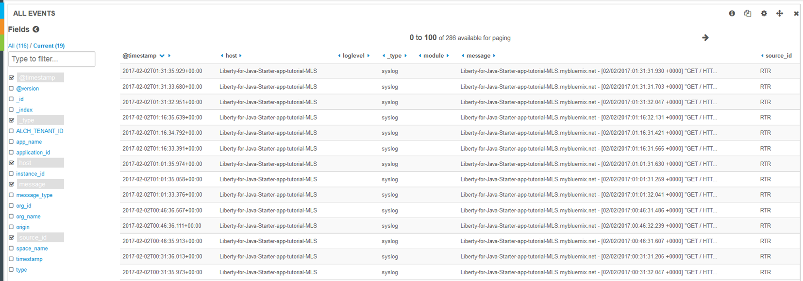
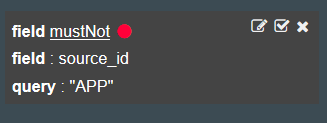
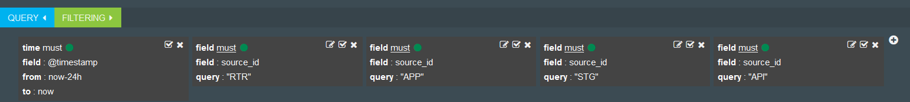

---

copyright:
  years: 2015, 2018

lastupdated: "2018-01-10"

---
{:new_window: target="_blank"}
{:shortdesc: .shortdesc}
{:screen:.screen}
{:codeblock:.codeblock}

# Kibana でのログ・タイプによる Cloud Foundry アプリ・ログのフィルタリング
{: #logging_kibana_component_filter}

Kibana ダッシュボードで {{site.data.keyword.Bluemix_notm}} アプリケーション・ログを表示して、コンポーネント (ログ・タイプ) でフィルタリングします。 Kibana ダッシュボードには、Cloud Foundry アプリの**「ログ」**タブからアクセスできます。 
{:shortdesc}

Kibana ダッシュボードで Cloud Foundry アプリ・ログを表示して、ログ・タイプでフィルタリングするには、以下のタスクを行います。

1. Cloud Foundry アプリの**「ログ」**タブにアクセスします。 

    1. {{site.data.keyword.Bluemix_notm}} **「アプリ」**ダッシュボードでアプリ名をクリックします。
    2. **「ログ」**タブをクリックします。 
    
    アプリのログが表示されます。

2. アプリの Kibana ダッシュボードにアクセスします。 **「詳細ビュー」**  をクリックします。 Kibana ダッシュボードが表示されます。

3. **「ALL EVENTS」**ウィンドウで、右矢印アイコンをクリックしてすべてのフィールドを表示します。 

    

4. **「Fields」**ペインで **source_id** を選択し、各ログ項目を生成したコンポーネントを**「ALL EVENTS」**ウィンドウに表示します。

    

5. **「ALL EVENTS」**ウィンドウで、ログ・イベント行をクリックすると、そのイベントの詳細が表示されます。 フィルタリングする source_id を示しているイベントを選択します。

    

6. 特定のコンポーネント (ログ・タイプ) に関する情報を含める、または除外するためのフィルターを追加します。 

    * 特定のコンポーネント値を含めるフィルターを追加するには、表の source_id 行で**拡大鏡**アイコン  をクリックします。 

         

    * 特定のコンポーネント値を除外するフィルターを追加するには、表の source_id 行で**「Exclusion」**アイコン  をクリックします。 
    
          
     
     Kibana ダッシュボードに新しいフィルター条件が追加されました。

7. オプションで、前のステップを繰り返して、各コンポーネントに関するフィルターを追加できます。 コンポーネントの全リストを表示するには、『[ログのフォーマット (Log format)](../logging_view_kibana3.html#kibana_log_format_cf)』を参照してください。

    以下の図は、さまざまなコンポーネントに関する複数のフィルターを指定したダッシュボードを示しています。
    
    

8. ダッシュボードを保存します。 

    フィルターの追加とダッシュボードのカスタマイズが終了したら、**「Save」**アイコン  をクリックして、ダッシュボードの名前を入力します。 
      
    **注:** スペースを含む名前でダッシュボードを保存しようとすると、保存されません。 スペースを含まない名前を入力し、**「Save」**アイコンをクリックしてください。
    
    

ログ項目をコンポーネント (ログ・タイプ) でフィルタリングするダッシュボードを作成しました。 **「Folder」**アイコン  をクリックし、ダッシュボードを名前で選択することで、保存したダッシュボードをいつでもロードできます。

