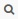
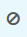

---

copyright:
  years: 2015, 2018

lastupdated: "2018-01-10"

---
{:new_window: target="_blank"}
{:shortdesc: .shortdesc}
{:screen:.screen}
{:codeblock:.codeblock}

# Kibana でのインスタンス ID による Cloud Foundry アプリ・ログのフィルタリング
{: #logging_kibana_instance_id}

Kibana ダッシュボードで {{site.data.keyword.Bluemix_notm}} インスタンス・ログを表示して、アプリのインスタンス ID (instance_id) でフィルタリングします。 Kibana ダッシュボードには、Cloud Foundry アプリの**「ログ」**タブからアクセスできます。 
{:shortdesc}

Kibana ダッシュボードで Cloud Foundry アプリ・ログを表示して、instance_id でフィルタリングするには、以下のタスクを行います。

1. Cloud Foundry アプリの**「ログ」**タブにアクセスします。 

    1. {{site.data.keyword.Bluemix_notm}} **「アプリ」**ダッシュボードでアプリ名をクリックします。
    2. **「ログ」**タブをクリックします。 
    
    アプリのログが表示されます。

2. アプリの Kibana ダッシュボードにアクセスします。 **「詳細ビュー」**  をクリックします。 Kibana ダッシュボードが表示されます。

3. Kibana ダッシュボードで、**「Go to saved default」**アイコン  をクリックし、スペースのすべてのログを表示します。 **「ALL EVENTS」**ウィンドウで、右矢印アイコンをクリックしてすべてのフィールドを表示します。 

    

4. **「フィールド」**ペインで **application_id** と **instance_id** を選択して、**「ALL EVENTS」**ウィンドウに application_id フィールドと instance_id フィールドを表示します。

    

5. **「ALL EVENTS」**ウィンドウで、ログ・イベント行をクリックすると、そのイベントの詳細が表示されます。 フィルターに掛ける instance_id を表示するイベントを選択します。

    

6. 特定のアプリ ID に関する情報を含める、または除外するためのフィルターを追加します。 

    * 特定のアプリケーション ID に関する情報を含めるフィルターを追加するには、表の application_id 行で**拡大鏡**アイコン  をクリックします。 
    
           
    
    * * 特定のアプリケーション ID に関する情報を除外するフィルターを追加するには、表の application_id 行にある**除外**  アイコンをクリックします。 
    
           
    
    Kibana ダッシュボードに新しいフィルター条件が追加されました。
 

7. 特定のアプリ ID に関する情報を含める、または除外するためのフィルターを追加します。 

    * 特定のインスタンス ID に関する情報を含めるフィルターを追加するには、表の instance_id 行で**拡大鏡**  アイコンをクリックします。 

    

     * 特定のインスタンス ID に関する情報を除外するフィルターを追加するには、表の instance_id 行で**除外**  アイコンをクリックします。 
    
           
    
    Kibana ダッシュボードに新しいフィルター条件が追加されました。

9. ダッシュボードを保存します。 フィルターの作成が終了したら、**「Save」**アイコン  をクリックして、ダッシュボードの名前を入力します。 

    **注:** スペースを含む名前でダッシュボードを保存しようとすると、保存されません。 スペースを含まない名前を入力し、**「Save」**アイコンをクリックしてください。

    

ログ項目を instance_id でフィルタリングするダッシュボードを作成しました。 **「Folder」**アイコン  をクリックし、ダッシュボードを名前で選択することで、保存したダッシュボードをいつでもロードできます。 
