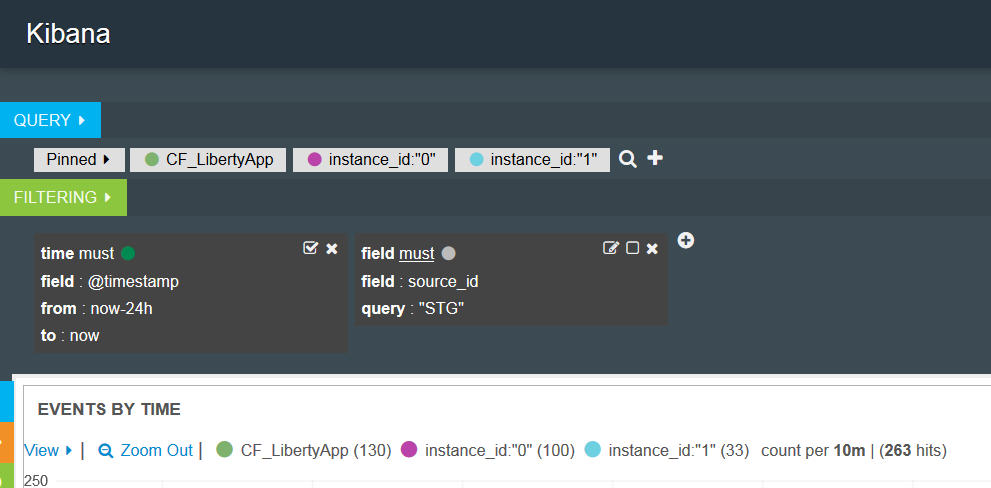
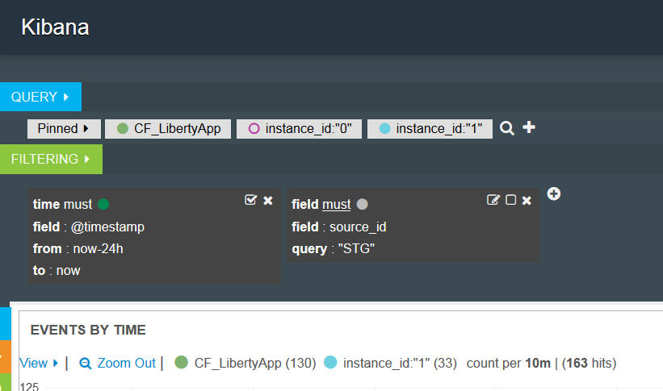

---

copyright:
  years: 2015, 2018

lastupdated: "2018-01-10"

---

{:shortdesc: .shortdesc}
{:new_window: target="_blank"}
{:codeblock: .codeblock}
{:screen: .screen}

# Kibana 3 でのログの分析 (非推奨)
{: #analyzing_logs_Kibana3}

{{site.data.keyword.Bluemix}} では、分析および視覚化のためのオープン・ソース・プラットフォームである Kibana を使用して、さまざまなグラフ (図表や表など) でデータのモニター、検索、分析、および視覚化を行うことができます。 高機能な分析タスクを実行するには、Kibana を使用してください。
{:shortdesc}

## Kibana ダッシュボードでのデータのフィルタリング
{: #filter_data_kibana_dashboard}

{{site.data.keyword.Bluemix}} では、リソースごと、または {{site.data.keyword.Bluemix}} スペースごとに提供されるデフォルト Kibana ダッシュボードを使用して、データを分析できます。 デフォルトでは、これらのダッシュボードには、最近 24 時間についての使用可能なすべてのデータが表示されます。 ただし、ダッシュボードで表示される情報を制限することができます。 デフォルト・ダッシュボードに照会およびフィルターを追加することができ、その後で、そのダッシュボードを将来の再使用のために保存できます。

1 つのダッシュボードで、複数の照会およびフィルターを追加できます。 照会は、ログ項目のサブセットを定義します。  フィルターは、情報の包含または除外によって、データ選択を詳細化します。 

以下のリストに、Cloud Foundry アプリについてのデータをフィルタリングする方法を示す例の概要を示します。
* 重要用語を含む情報をログから探す場合、それらの用語でフィルター操作するような照会を作成できます。 Kibana を使用すると、ダッシュボードで照会を視覚的に比較することができます。 詳しくは、『[Kibana での照会を使用した Cloud Foundry アプリ・ログのフィルタリング](kibana3/logging_kibana_query.html#logging_kibana_query)』を参照してください。

* 特定の期間内の情報を探す場合、時刻範囲内のデータをフィルター操作できます。 詳しくは、『[Kibana での時刻による Cloud Foundry アプリ・ログのフィルタリング](kibana3/logging_kibana_filter_by_time_period.html#logging_kibana_time_filter)』を参照してください。

* 特定のインスタンス ID の情報を探す場合、インスタンス ID でデータをフィルター操作できます。 詳しくは、『[Kibana でのインスタンス ID による Cloud Foundry アプリ・ログのフィルタリング](kibana3/logging_kibana_filter_by_instance_id.html#logging_kibana_instance_id)』および『[Kibana での既知のアプリケーション ID による Cloud Foundry アプリ・ログのフィルタリング](kibana3/logging_kibana_filter_by_known_application_id.html#logging_kibana_known_application_id)』を参照してください。

* 特定のコンポーネントの情報を探す場合、コンポーネント (ログ・タイプ) でデータをフィルター操作できます。 詳しくは、『[Kibana でのログ・タイプによる Cloud Foundry アプリ・ログのフィルタリング](kibana3/logging_kibana_filter_by_component.html#logging_kibana_component_filter)』を参照してください。

* 例えばエラー・メッセージの情報を探す場合、メッセージ・タイプでデータをフィルター操作できます。 詳しくは、『[Kibana でのメッセージ・タイプによる Cloud Foundry アプリ・ログのフィルタリング](kibana3/logging_kibana_filter_by_message_type.html#logging_kibana_message_type_filter)』を参照してください。

## Kibana ダッシュボードのカスタマイズ
{: #customize_kibana_dashboard}

異なるタイプのダッシュボードがあり、それらをカスタマイズしてデータを視覚化および分析できます。以下に例を示します。
* single-cf-app ダッシュボード: これは、単一の Cloud Foundry アプリケーションの情報を表示するダッシュボードです。  
* multi-cf-app ダッシュボード: これは、同じ {{site.data.keyword.Bluemix}} スペースにデプロイされているすべての Cloud Foundry アプリケーションの情報を表示するダッシュボードです。 

ダッシュボードをカスタマイズする際、照会およびフィルターを構成して、そのダッシュボードで表示するログ・データのサブセットを選択することができます。

データを視覚化するために、パネルを構成できます。 Kibana には、さまざまなパネル (表、トレンド、ヒストグラムなど) が組み込まれているので、情報を分析するためにそれらを利用できます。 ダッシュボード内のパネルの追加、削除、並べ替えを行うことができます。 各パネルの目標は異なります。 一部のパネルは、1 つ以上の照会の結果を表す行に編成されています。 その他のパネルは、文書またはカスタム情報を表示します。 データを視覚化し、分析するために、例えば、棒グラフ、円グラフ、または表を構成することができます。  

## Kibana ダッシュボードの保存
{: #save_Kibana_dashboard}

カスタマイズした Kibana ダッシュボードを保存するには、以下のステップを実行します。

1. ツールバーで、**「保存」**アイコンをクリックします。

2. ダッシュボードの名前を入力します。

    **注:** スペースを含む名前でダッシュボードを保存しようとすると、保存されません。

3. 名前フィールドの横の**「保存」**アイコンをクリックします。

## Kibana ダッシュボードを使用したログの分析
{: #analyze_kibana_logs}

Kibana ダッシュボードをカスタマイズした後、そのダッシュボードのパネルを使用してデータの視覚化および分析を行うことができます。 

情報を検索するために、照会をピン留めしたり、ピン留めを解除したりできます。 

* ダッシュボードに照会をピン留めすることができ、その検索は自動的にアクティブになります。
* 照会を非アクティブにすると、ダッシュボードから内容を削除できます。

情報をフィルター操作するために、フィルターを有効にしたり、無効にしたりできます。 

* フィルターの**「トグル」**チェック・ボックス  を選択して、そのフィルターを有効にすることができます。   
* フィルターの**「トグル」**チェック・ボックス  を選択解除して、そのフィルターを無効にすることができます。 

ダッシュボードのグラフおよび図表でデータが表示されます。 ダッシュボードのグラフおよび図表を使用して、データをモニターできます。 

例えば、single-cf-app ダッシュボードには、1 つの Cloud Foundry アプリケーションについての情報が含まれます。 視覚化および分析できるデータは、そのアプリケーションに限定されます。 そのアプリケーションのすべてのインスタンスについてのデータをこのダッシュボードを使用して分析できます。 インスタンス同士を比較することができます。 インスタンス ID で情報をフィルター操作することができます。 

インスタンス ID ごとに照会を定義し、ダッシュボードにピン留めすることができます。 

次に、ダッシュボードに表示したいインスタンス情報に基づいて、個々の照会をアクティブ化または非アクティブ化できます。 

以下の図では、1 つの照会がアクティブであり、他の照会は非アクティブになっています。

1 つのヒストグラムを使用して 2 つのインスタンスを比較したい場合、同じダッシュボードに 2 つの照会 (インスタンス ID ごとに 1 つ) を定義できます。 それらを簡単に識別できるように、別名を付け、固有の色にすることができます。 Kibana は、複数の照会を論理 OR で結合して処理します。 

以下の図に示すパネルでは、照会の別名と色を構成し、その照会をダッシュボードにピン留めし、非アクティブにすることができます。

