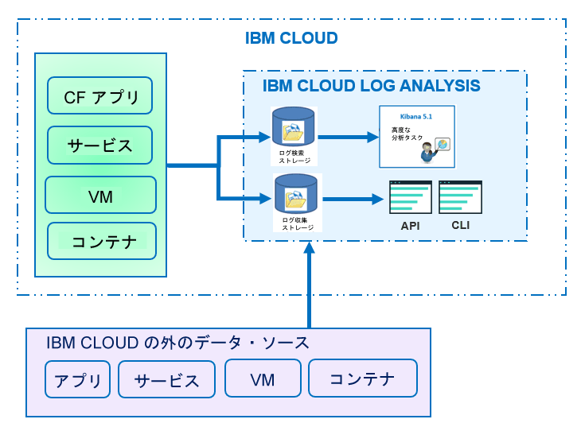

---

copyright:
  years: 2017

lastupdated: "2017-07-19"

---

{:shortdesc: .shortdesc}
{:new_window: target="_blank"}
{:codeblock: .codeblock}
{:screen: .screen}
{:pre: .pre}

# 製品情報
{: #log_analysis_ov}

{{site.data.keyword.loganalysisfull}} サービスを使用して、{{site.data.keyword.Bluemix}} におけるログ収集、ログ保存、およびログ検索の機能を拡張できます。アプリケーションまたは環境に関する総合的な洞察を得るためにアプリケーションおよび環境のログを集約する機能や、ログを暗号化する機能、必要な期間だけログ・データを保存する機能、問題を素早く検出してトラブルシューティングする機能などを DevOps チームで使用できるようになります。高度な分析タスクを実行するため、Kibana を使用します。
{:shortdesc}

{{site.data.keyword.Bluemix_notm}} ロギング機能はプラットフォームに組み込まれています。

* クラウド・リソースに関するデータ収集は自動的に有効になります。{{site.data.keyword.Bluemix_notm}} は、デフォルトで、アプリ、アプリ・ランタイム、およびそれらのアプリの実行場所である計算ランタイムについて、ログの収集と表示を行います。 
* 1 日当たり 500 MB までのログを検索できます。 
* {{site.data.keyword.loganalysisshort}} サービスのコンポーネントの 1 つである Log Search に、最近 3 日間のログが保管されます。

{{site.data.keyword.Bluemix_notm}} のロギング機能を使用して、クラウド・プラットフォームと、そこで稼働しているリソースの動作を理解することができます。標準出力と標準エラーのログを収集するために特別な計測装置は必要ありません。例えば、ログを使用することによって、アプリケーションの監査証跡の提供、ご使用のサービスにおける問題の検出、脆弱性の識別、アプリケーション・デプロイメントおよびランタイム動作の障害追及、アプリを実行しているインフラストラクチャーの問題の検出、クラウド・プラットフォームの複数のコンポーネントにわたるアプリのトレース、および、サービス SLA に影響する可能性のあるアクションを回避するために使用できるパターンの検出を行うことができます。

以下の図は、{{site.data.keyword.loganalysisshort}} サービスのコンポーネントの概要を示しています。 

クラウド・リソースのログを収集および検索するには、{{site.data.keyword.loganalysisshort}} サービスのインスタンスを、それらのクラウド・リソースが稼働している同じ {{site.data.keyword.Bluemix_notm}} スペース内でプロビジョンする必要があります。

デフォルトで、ログは収集され、Log Search に保管されます。高度な検索機能および収集機能が含まれるサービス・プランを選択すると、ログは収集され、Log Collection コンポーネントにも保管されます。Log Collection に保管されるログ・データは暗号化されます。

収集して Log Collection に保管できるログのサイズは、選択するサービス・プランによって決まります。保管されるデータの GB 単位で月ごとに支払い料金が算出されます。ログはログ収集に JSON として保管されます。

高度なログ検索分析タスクのために Kibana 5.1 を使用できます。

* プランに応じて、1 日当たりに検索できるログのサイズが制限されます。 
* 検索でカバーされるのは過去 3 日分のデータのみです。

Log Collection CLI または Log Collection API を使用して、ログをローカルにダウンロードするか、または、他のアプリケーションまたはサード・パーティー製クラウド・サービスにログをパイプすることによって、3 日間よりも古いログにアクセスできます。 

ログの削除は、保存ポリシーを設定することによって自動的に行うか、または、{{site.data.keyword.loganalysisshort}} CLI を使用して手動で行うことができます。

## ロギング・サービスを使用する理由
{: #value}

1. **アプリケーションでの計測に費やす時間を減らし、アプリケーションの価値を強化することにより多くの時間をかけることができます**

    {{site.data.keyword.loganalysislong_notm}} は、選択された {{site.data.keyword.IBM_notm}} クラウド・サービスからデータを自動的に収集し、計測機能は必要ありません。
	
	1 日当たりに検索できるログの量を選択することができます。1 日当たり最大 500MB、2GB、5GB、および 10GB のログを検索するために使用できるさまざまなプランが使用可能です。

2. **ログ・データをアプリケーション・ワークロードの近くで保持し、クラウド・クラスの安価な保管ソリューションで安全に保護することができます**

    {{site.data.keyword.IBM_notm}} クラウドで実行されている従来のアプリケーションやマイクロサービス駆動型アプリケーションからのログ・データを集中ログに収集して保管します。ログ・データは必要な期間保存できます。
	
	ログは {{site.data.keyword.IBM_notm}} クラウド・ストレージに保管されます。ログは、必要に応じてダウンロードできます。

3. **環境についての洞察を得て、問題を迅速に検出、診断、特定することができます**

    カスタマイズ可能なダッシュボードを使用して、データの視覚化および分析、データとの対話を行うことができます。ログ検索機能は、Elastic スタック・プラットフォームに構築され、Kibana の柔軟性、使い慣れた操作性を提供します。そのため、ユーザーはダッシュボードを自分のアプリケーションのニーズに合わせて素早く構築することができます。

4. **API との堅固な統合**

    サービスの API を介して、ログ・データをアプリケーションやオペレーションに統合できます。保存されたログを管理して、ログ・データを {{site.data.keyword.IBM_notm}} クラウドの外部から送信するには、{{site.data.keyword.loganalysisshort}} サービス API を使用します。

	
## ログの収集
{: #log_collection}

デフォルトでは、{{site.data.keyword.Bluemix_notm}} は Log Search 内にログ・データを最大 3 日間保管します。   

* スペースごとに 1 日に最大で 500 MB のデータが保管されます。500 MB の上限を超えるログは破棄されます。上限割り当ては、毎日午前 12:30 (UTC) にリセットされます。
* 1.5 GB までのデータを最大 3 日間検索可能です。ログ・データは、データが 1.5 GB に達するか 3 日が過ぎると、ロールオーバーします (先入れ先出し)。

{{site.data.keyword.loganalysisshort}} サービスには、必要な期間 Log Collection にログを保管できる追加プランがあります。各プランについて詳しくは、『[サービス・プラン](/docs/services/CloudLogAnalysis/log_analysis_ov.html#plans)』を参照してください。

## ログの削除
{: #log_deletion}

Log Search に保管されたログは、3 日後に削除されます。

Log Collection に保管されたログは、保存ポリシーが構成されている場合を除いて、30 日後に自動的に削除されます。 

* ログ保存ポリシーを構成して、Log Collection 内でログを保持する日数を定義できます。詳しくは、『[ログ保存ポリシー](/docs/services/CloudLogAnalysis/log_analysis_ov.html#policies)』を参照してください。

* ポリシーの値を *-1* に設定することによって、ポリシーを無効にすることができます。 

Log Collection API または Log Collection CLI を使用して、Log Collection からログを手動で削除できます。CLI を使用してログを手動で削除することについて詳しくは、『[cf logging delete](/docs/services/CloudLogAnalysis/reference/logging_cli.html#delete)』を参照してください。

## ログの取り込み
{: #log_ingestion}

*ライト*・プランを除くすべての {{site.data.keyword.loganalysisshort}} サービス・プランには、{{site.data.keyword.IBM_notm}} Cloud の外側から Log Collection にログを送信する機能が含まれています。各種プランについて詳しくは、『[サービス・プラン](/docs/services/CloudLogAnalysis/log_analysis_ov.html#plans)』を参照してください。

マルチテナント Logstash Forwarder を使用することによって、ログを {{site.data.keyword.loganalysisshort}} に送信できます。詳しくは、『[マルチテナント Logstash Forwarder (mt-logstash-forwarder) を使用したログ・データの送信](/docs/services/CloudLogAnalysis/how-to/send-data/send_data_mt.html#send_data_mt)』を参照してください。

## ログの検索
{: #log_search}

デフォルトでは、{{site.data.keyword.Bluemix_notm}} で、1 日当たり 500 MB までのログを Kibana 5.1 を使用して検索できます。 

{{site.data.keyword.loganalysisshort}} サービスには複数のプランが用意されています。ログ検索の機能はプランによって異なります。例えば、*ログ収集*プランでは、1 日当たり 1 GB までのデータを検索できます。各種プランについて詳しくは、『[サービス・プラン](/docs/services/CloudLogAnalysis/log_analysis_ov.html#plans)』を参照してください。

## Bluemix でのログ分析
{: #logging_bmx_ov_ui}

{{site.data.keyword.Bluemix_notm}} では、CF アプリ、または、{{site.data.keyword.Bluemix_notm}} が管理するインフラストラクチャーにデプロイされたコンテナーについて、最近のログを表示したり、リアルタイムでログを追尾したりできます。

* ログの表示、フィルター操作、および分析を UI を介して行うことができます。詳しくは、『[Bluemix コンソールからのログの分析](/docs/services/CloudLogAnalysis/logging_view_dashboard.html#analyzing_logs_bmx_ui)』を参照してください。

* コマンド・ラインを使用して、ログの表示、フィルター操作、および分析を行い、ログをプログラムで管理できます。詳しくは、『[CLI からのログの分析](/docs/services/CloudLogAnalysis/logging_view_cli.html#analyzing_logs_cli)』を参照してください。

* Kibana を使用することによって、高度な分析を実行できます。

## Kibana での高度なログ分析
{: #logging_bmx_ov_kibana}

{{site.data.keyword.Bluemix_notm}} では、分析および視覚化のためのオープン・ソース・プラットフォームである Kibana を使用して、さまざまなグラフ (図表や表など) でデータのモニター、検索、分析、および視覚化を行うことができます。詳しくは、『[Kibana での高度なログ分析](/docs/services/CloudLogAnalysis/kibana/analyzing_logs_Kibana.html#analyzing_logs_Kibana)』を参照してください。

## CLI を使用したログの管理
{: #managing_logs}

{{site.data.keyword.loganalysisshort}} CLI を使用してログを管理します。

* CLI のインストール方法について詳しくは、『[ロギング CLI のインストール](/docs/services/CloudLogAnalysis/how-to/manage-logs/config_log_collection_cli.html#config_log_collection_cli)』を参照してください。
* CLI のバージョンを確認するには、パラメーター「-version」を付けて [cf logging](/docs/services/CloudLogAnalysis/reference/logging_cli.html#base) コマンドを実行します。
* コマンドの実行方法についてのヘルプを利用するには、『[コマンドの実行に関するコマンド・ライン・ヘルプの利用](/docs/services/CloudLogAnalysis/how-to/manage-logs/config_log_collection_cli.html#cli_help)』を参照してください。

ログに関する一般情報を取得するには、`cf logging status` コマンドを使用してください。例えば、次のことができます。

* [特定の期間のログに関する情報の取得](/docs/services/CloudLogAnalysis/how-to/manage-logs/viewing_log_information.html#viewing_logs)。
* [特定の期間の特定のタイプのログに関する情報の取得](/docs/services/CloudLogAnalysis/how-to/manage-logs/viewing_log_information.html#viewing_logs_by_log_type)。
* [ログに関するアカウント情報の取得](/docs/services/CloudLogAnalysis/how-to/manage-logs/viewing_log_information.html#viewing_logs_account)。

コストを抑えるため、一定の期間におけるアプリのログのサイズをモニターしたい場合があります。例えば、予想より多いログを生成しているアプリまたはサービスがあるかどうかを調べるため、ある {{site.data.keyword.Bluemix_notm}} スペースについて、1 週間における各ログ・タイプのサイズを把握したいといった場合が考えられます。ログのサイズを確認するには、`cf logging status` コマンドを使用します。詳しくは、『[ログ情報の表示](/docs/services/CloudLogAnalysis/how-to/manage-logs/viewing_log_information.html#viewing_log_status)』を参照してください。

過去 3 日間のログを Kibana で検索できます。より古いログ・データを分析できるように、ログをローカル・ファイルにダウンロードしたり、これらのログを他のプログラム (ローカル Elastic スタックなど) にパイプしたりすることができます。詳しくは、『[ログのダウンロード](/docs/services/CloudLogAnalysis/how-to/manage-logs/downloading_logs.html#downloading_logs)』を参照してください。

不要になったログを手動で削除するには、コマンド [cf logging delete](/docs/services/CloudLogAnalysis/reference/logging_cli.html#delete) を使用します。 

## ポリシー
{: #policies}

**ログ保存ポリシー**

{{site.data.keyword.loganalysisshort}} CLI を使用して、ログ保存ポリシーを表示および構成できます。このポリシーは、ログが Log Collection 内に保持される日数を指定します。 

* デフォルトでは、ログは 30 日間保存されます。 
* 保存期間を過ぎると、ログは Log Collection から自動的に削除され、復旧することはできません。
* アカウントに対して保存期間を指定できます。その保存期間が、そのアカウントのすべてのスペースに対して自動的に構成されます。 
* {{site.data.keyword.Bluemix_notm}} スペースに対して保存期間を指定できます。
* 保存ポリシーはいつでも変更できます。
* ポリシーの値を *-1* に設定することによって、ポリシーを無効にすることができます。 

**注:** ログ保存ポリシーを無効にする場合、Log Collection 内のログをユーザー自身が保守する必要があります。CLI コマンド [cf logging delete](/docs/services/CloudLogAnalysis/reference/logging_cli.html#delete) を使用して、古いログを削除できます。

詳しくは、『[ログ保存ポリシーの表示および構成](/docs/services/CloudLogAnalysis/how-to/manage-logs/configuring_retention_policy.html#configuring_retention_policy)』を参照してください。

## サービス・プラン
{: #plans}

{{site.data.keyword.loganalysisshort}} サービスには複数のプランが用意されています。ログ収集機能およびログ検索機能はプランによって異なります。 

プランは {{site.data.keyword.Bluemix_notm}} UI またはコマンド・ラインを使用して変更できます。プランはいつでもアップグレードまたは削減することができます。{{site.data.keyword.Bluemix_notm}} でのサービス・プランのアップグレードについて詳しくは、『[プランの変更](/docs/services/CloudLogAnalysis/plan/change_plan.html#change_plan)』を参照してください。 

使用可能なプランの概要を次の表に示します。

<table>
    <caption>プランごとのログ検索およびログ収集機能の概要</caption>
      <tr>
        <th>プラン</th>
        <th>ログの取り込み</th>
        <th>ログの保存</th>
        <th>データ暗号化</th>
        <th>ログ検索</th>
      </tr>
      <tr>
        <td>ライト (デフォルト)</td>
        <td>いいえ</td>
        <td>過去 3 日間</td>
        <td>いいえ</td>
        <td>500 MB まで検索</td>
      </tr>
      <tr>
        <td>ログ収集</td>
        <td>はい</td>
        <td>構成可能な日数。</td>
        <td>はい</td>
        <td>1 日当たり 500 MB まで検索</td>
      </tr>
      <tr>
        <td>ログ収集と 2 GB/日の検索</td>
        <td>はい</td>
        <td>構成可能な日数。</td>
        <td>はい</td>
        <td>1 日当たり 2 GB まで検索</td>
      </tr>
      <tr>
        <td>ログ収集と 5 GB/日の検索</td>
        <td>はい</td>
        <td>構成可能な日数。</td>
        <td>はい</td>
        <td>1 日当たり 5 GB まで検索</td>
      </tr>
       <tr>
        <td>ログ収集と 10 GB/日の検索</td>
        <td>はい</td>
        <td>構成可能な日数。</td>
        <td>はい</td>
        <td>1 日当たり 10 GB まで検索</td>
      </tr>
</table>

**注:** ログ収集ストレージの 1 カ月のコストは、請求サイクルの平均として計算されます。

## 地域
{: #regions}

{{site.data.keyword.loganalysisfull_notm}} サービスは、以下の地域で使用可能です。

* 米国南部

