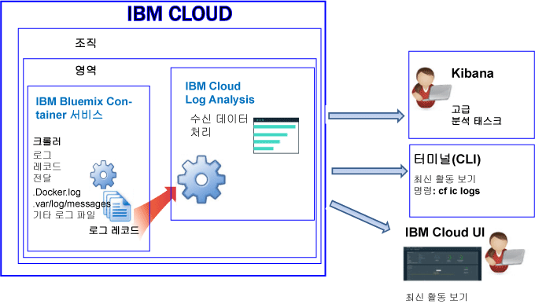

---

copyright:
  years: 2017, 2018

lastupdated: "2018-01-10"

---

{:shortdesc: .shortdesc}
{:new_window: target="_blank"}
{:codeblock: .codeblock}
{:screen: .screen}
{:pre: .pre}

# IBM Cloud에서 관리하는 컨테이너에 대한 로깅(더 이상 사용되지 않음)
{: #containers_bluemix}

{{site.data.keyword.IBM}} 관리 인프라에 배치된 Docker 컨테이너에 대한 로그를 보고 필터링하고 분석할 수 있습니다.
{:shortdesc}

컨테이너 로그는 크롤러를 사용하여 컨테이너의 외부에서 모니터되고 전달됩니다. 데이터는 크롤러에 의해 {{site.data.keyword.Bluemix_notm}}의 다중 테넌트 Elasticsearch로 전송됩니다. 

다음 그림에는 {{site.data.keyword.containershort}}에 대한 로깅의 상위 레벨 보기가 표시됩니다.

기본적으로 {{site.data.keyword.Bluemix_notm}} 관리 클라우드 인프라에서 배치된 컨테이너에 대해 다음과 같은 로그가 수집됩니다. 

<table>
  <caption>표 2. {{site.data.keyword.Bluemix_notm}} 관리 인프라에 배치된 컨테이너에 대해 수집된 로그</caption>
  <tbody>
    <tr>
      <th align="center">로그</th>
      <th align="center">설명</th>
    </tr>
    <tr>
      <td align="left" width="30%">/var/log/messages</td>
      <td align="left" width="70%"> 기본적으로 Docker 메시지는 컨테이너의 /var/log/messages 폴더에 저장됩니다. 이 로그에는 시스템 메시지가 포함됩니다.
      </td>
    </tr>
    <tr>
      <td align="left">./docker.log</td>
      <td align="left">이 로그는 Docker 로그입니다.   Docker 로그 파일은 컨테이너의 내부에 파일로 저장되지는 않지만 수집됩니다. 컨테이너에 대한 stdout(표준 출력) 및 stderr(표준 오류) 정보를 노출하기 위한 표준 Docker 규약이기 때문에 이 로그 파일은 기본적으로 수집됩니다. 컨테이너 프로세스가 stdout 또는 stderr에 출력하는 정보가 수집됩니다.
      </td>
     </tr>
  </tbody>
</table>

## 로그 분석
{: #logging_containers_ov_methods}

컨테이너 로그 데이터를 분석하려면 Kibana를 사용하여 고급 분석 태스크를 수행하십시오. 오픈 소스 분석 및 시각화 플랫폼인 Kibana를 사용하여 다양한 그래프(예: 차트, 표)로 된 데이터를 모니터, 검색, 분석 및 시각화할 수 있습니다. 자세한 정보는 [Kibana에서 로그 분석](/docs/services/CloudLogAnalysis/kibana/analyzing_logs_Kibana.html#analyzing_logs_Kibana)을 참조하십시오.

## 사용자 정의 로그 수집
{: #collect_custom_logs}

추가 로그를 수집하려면 컨테이너를 작성할 때 로그 파일에 대한 경로와 함께 **LOG_LOCATIONS** 환경 변수를 추가하십시오.  

쉼표로 구분하여 여러 개의 로그 파일을 추가할 수 있습니다. 

자세한 정보는 [컨테이너에서 기본이 아닌 로그 데이터 수집](logging_containers_other_logs.html#logging_containers_collect_data)을 참조하십시오.

## 로그 검색
{: #log_search}

기본적으로 Kibana를 사용하여 {{site.data.keyword.Bluemix_notm}}에서 하루에 최대 500MB의 로그를 검색할 수 있습니다.  

{{site.data.keyword.loganalysisshort}} 서비스는 여러 가지 플랜을 제공합니다. 각 플랜에는 각기 다른 로그 검색 기능이 있으며, 예를 들어 *로그 콜렉션* 플랜은 하루에 최대 1GB의 데이터를 검색하도록 허용합니다. 플랜에 대한 자세한 정보는 [서비스 플랜](/docs/services/CloudLogAnalysis/log_analysis_ov.html#plans)을 참조하십시오.

## 메시지의 필드를 Kibana 검색 필드로 사용할 수 있도록 로그 전송
{: #send_data_in_json}

기본적으로 로깅은 자동으로 컨테이너에 사용 가능하게 설정됩니다. Docker 로그 파일의 모든 항목은 Kibana에서 `message` 필드에 표시됩니다. 컨테이너 로그 항목의 일부인 특정 필드를 사용하여 Kibana의 데이터를 필터링하고 분석해야 하는 경우, 올바른 JSON 형식화된 출력을 전송하도록 애플리케이션을 구성하십시오. 

컨테이너 로그 항목이 개별 필드로 구문 분석되는 로그를 보내려면 다음 단계를 완료하십시오. 

1. 메시지를 파일에 로그하십시오. 
2. 컨테이너에서 분석에 사용할 수 있는 기본이 아닌 로그의 목록에 로그 파일을 추가하십시오. 자세한 정보는 [컨테이너에서 기본이 아닌 로그 데이터 수집](logging_containers_other_logs.html#logging_containers_collect_data)을 참조하십시오. 
    
JSON 로그 항목이 STDOUT로서 컨테이너의 Docker 로그 파일에 전송되면 JSON으로 구문 분석되지 않습니다. 
    
메시지를 파일에 로그하고 메시지가 올바른 JSON으로 판별되는 경우, 필드가 구문 분석되며 메시지의 각 필드에 대해 새 필드가 작성됩니다. 문자열-유형 필드 값만 Kibana에서 필터링 및 정렬에 사용 가능합니다. 

## 로그 콜렉션에 로그 저장
{: #store_logs}

기본적으로 {{site.data.keyword.Bluemix_notm}}는 최대 3일 동안의 로그 데이터를 저장합니다.    

* 하루에 영역당 최대 500MB의 데이터가 저장됩니다. 500MB 상한을 넘는 로그는 버려집니다. 상한 분배는 매일 오전
12:30 UTC에 재설정됩니다.
* 최대 1.5GB의 데이터를 최대 3일 동안 검색할 수 있습니다. 로그 데이터는 1.5GB의 데이터에 도달하거나 3일 이후에 롤오버(FIFO)됩니다.

{{site.data.keyword.loganalysisshort}} 서비스는 필요한 기간 만큼 로그 콜렉션에 로그를 저장하도록 허용하는 추가 플랜을 제공합니다. 각 플랜의 가격에 대한 자세한 정보는 [서비스 플랜](/docs/services/CloudLogAnalysis/log_analysis_ov.html#plans)을 참조하십시오.

로그를 저장하거나 더 큰 로그를 검색해야 하는 경우 {{site.data.keyword.loganalysisshort}} 서비스를 프로비저닝하고 다른 서비스 플랜을 선택할 수 있습니다. 필요에 따라 추가 플랜을 사용하여 로그를 로그 콜렉션에 저장하고 더 큰 로그 크기를 검색할 수 있습니다. 자세한 정보는 [서비스 플랜](/docs/services/CloudLogAnalysis/log_analysis_ov.html#plans)을 참조하십시오. 

## 로그 보기
{: #logging_containers_ov_methods_view_bmx}

다음 방법을 사용하여 {{site.data.keyword.Bluemix_notm}} 관리 인프라에 배치된 컨테이너에 대한 최신 로그를 볼 수 있습니다.

* 컨테이너의 최신 활동을 모니터하기 위해 {{site.data.keyword.Bluemix_notm}} UI를 통해 로그를 봅니다.
    
    각 컨테이너에 사용 가능한 **모니터링 및 로그** 탭을 통해 로그 보기, 필터링 및 분석을 수행할 수 있습니다.  
	
	{{site.data.keyword.IBM_notm}} 관리 인프라에 배치된 Docker 컨테이너의 런타임 로그 또는 배치를 보려면 다음 단계를 완료하십시오. 

    1. 앱 대시보드에서 단일 컨테이너 또는 컨테이너 그룹을 클릭하십시오. 
    
    2. 앱 세부사항 페이지에서 **모니터링 및 로그**를 클릭하십시오.

    3. **로깅** 탭을 선택하십시오. **로깅** 탭에서 컨테이너의 최신 로그를 보거나 실시간으로 로그를 수행할 수 있습니다.  
	
* {{site.data.keyword.containershort}} CLI를 사용하여 로그를 보십시오. 로그를 프로그래밍 방식으로 관리하려면 명령을 사용하십시오. 
    
    **cf ic logs** 명령을 사용하여 명령행 인터페이스를 통해 로그 보기, 필터링 및 분석을 할 수 있습니다.  
	
	`bx cf ic logs` 명령을 사용하여 {{site.data.keyword.Bluemix_notm}}에 있는 컨테이너의 로그를 표시하십시오. 예를 들면, 컨테이너가 중지된 이유를 분석하거나 컨테이너 출력을 검토하기 위해 로그를 사용할 수 있습니다. 
	
	`cf ic logs` 명령을 통해 컨테이너에서 실행되는 앱에 대한 애플리케이션 오류를 보려면 애플리케이션이 표준 출력(STDOUT) 및 표준 오류(STDERR) 출력 스트림에 해당 로그를 작성해야 합니다. 이러한 표준 출력 스트림을 작성하도록 애플리케이션을 설계하는 경우, 컨테이너가 종료되거나 충돌하는 경우에도 명령행을 통해 로그를 볼 수 있습니다.

    `cf ic logs` 명령에 대한 자세한 정보는 [cf ic logs 명령](/docs/containers/container_cli_reference_cfic.html#container_cli_reference_cfic__logs)을 참조하십시오.

