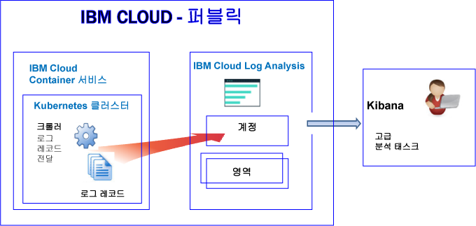
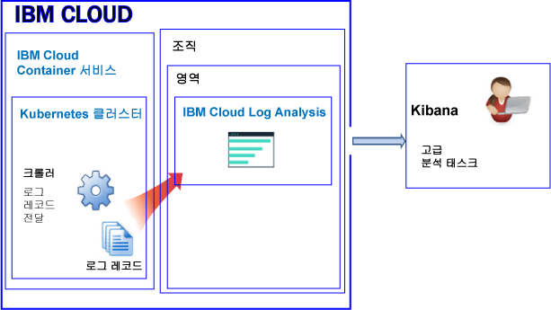
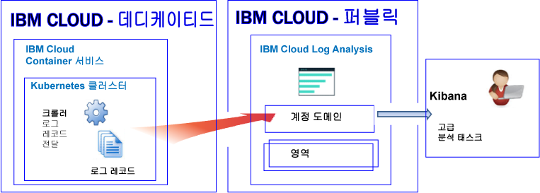

---

copyright:
  years: 2017, 2018

lastupdated: "2018-02-01"

---

{:new_window: target="_blank"}
{:shortdesc: .shortdesc}
{:screen: .screen}
{:pre: .pre}
{:table: .aria-labeledby="caption"}
{:codeblock: .codeblock}
{:tip: .tip}
{:download: .download}


# Kubernetes 클러스터의 리소스에 대한 로깅
{: #containers_kubernetes}

{{site.data.keyword.Bluemix_notm}}에서 {{site.data.keyword.loganalysisshort}} 서비스를 통해 Kubernetes 클러스터의 리소스에 대한 로그를 보고 필터링하고 분석할 수 있습니다.
{:shortdesc}

기본적으로 클러스터에서 {{site.data.keyword.loganalysisshort}} 서비스로 로그 전송은 자동으로 사용 가능하게 설정됩니다. **참고:** 이는 새 클러스터에 대한 최근 변경사항입니다. 이전에는 클러스터를 작성할 때 컨테이너 프로세스가 stdout(표준 출력) 및 stderr(표준 오류)로 인쇄하는 정보를 {{site.data.keyword.containershort}}에서 자동으로 수집하여 {{site.data.keyword.loganalysisshort}} 서비스로 전달했습니다. 이제 자동으로 로그를 {{site.data.keyword.loganalysisshort}} 서비스로 전달하려면 클러스터에서 하나 이상의 로깅 구성을 작성해야 합니다.

클러스터 로그에 대해 작업할 때 다음 정보를 고려하십시오.

* 정보를 stdout 및 stderr에 전송하는 것은 컨테이너의 정보를 노출하기 위한 표준 Docker 규약입니다.
* 컨테이너 로그는 크롤러를 사용하여 컨테이너의 외부에서 모니터되고 전달됩니다.  
* 데이터는 크롤러에 의해 {{site.data.keyword.Bluemix_notm}}의 다중 테넌트 Elasticsearch로 전송됩니다.  
* stdout 및 stderr 로그, 다른 애플리케이션 로그, 작업자 노드 로그, Kubernetes 시스템 컴포넌트 로그 및 Ingress 제어기 로그를 {{site.data.keyword.loganalysisshort}} 서비스로 전달하도록 클러스터를 구성할 수 있습니다. 자세한 정보는 [추가 애플리케이션 및 클러스터 로그 수집](/docs/services/CloudLogAnalysis/containers/containers_kubernetes.html#collect_logs)을 참조하십시오. 

## 공용에서의 로깅에 대한 정보
{: #public}

{{site.data.keyword.Bluemix_notm}}에서 {{site.data.keyword.loganalysisshort}} 서비스를 사용하여 {{site.data.keyword.containershort}}가 공용으로 자동으로 수집하는 컨테이너 로그 및 Kubernetes 클러스터 로그를 저장하고 분석할 수 있습니다. 

계정에 1개 이상의 Kubernetes 클러스터가 있을 수 있습니다. 클러스터가 프로비저닝되는 즉시 {{site.data.keyword.containershort}}가 자동으로 로그를 수집합니다.  

* 포드가 배치되는 즉시 애플리케이션 로그가 수집됩니다.  
* {{site.data.keyword.containershort}}는 컨테이너 프로세스가 stdout(표준 출력) 및 stderr(표준 오류)로 인쇄하는 정보를 자동으로 수집합니다.

{{site.data.keyword.loganalysisshort}} 서비스에 해당 로그를 분석할 수 있도록 하려면 클러스터 로그를 {{site.data.keyword.loganalysisshort}}로 전달하도록 클러스터를 구성해야 합니다. 로그를 계정 도메인 또는 계정의 영역 도메인으로 전달할 수 있습니다.

* 미국 남부 지역에서 사용 가능한 클러스터가 미국 남부 지역에서 사용 가능한 {{site.data.keyword.loganalysisshort}} 서비스로 로그를 보냅니다.
* 미국 동부 지역에서 사용 가능한 클러스터가 미국 남부 지역에서 사용 가능한 {{site.data.keyword.loganalysisshort}} 서비스로 로그를 보냅니다.
* 독일 지역에서 사용 가능한 클러스터가 독일 지역에서 사용 가능한 {{site.data.keyword.loganalysisshort}} 서비스로 로그를 보냅니다.
* 시드니 지역에서 사용 가능한 클러스터가 시드니 지역에서 사용 가능한 {{site.data.keyword.loganalysisshort}} 서비스로 로그를 보냅니다.
* 영국 지역에서 사용 가능한 클러스터가 독일 지역에서 사용 가능한 {{site.data.keyword.loganalysisshort}} 서비스로 로그를 보냅니다.


Kibana에서 클러스터에 대한 로그 데이터를 분석하려면 다음 정보를 고려하십시오.

* 로그를 보기 위해 사용하는 {{site.data.keyword.loganalysisshort}} 인스턴스가 프로비저닝된 공용 지역에서 Kibana를 실행해야 합니다.  
* 사용자 ID에 로그를 볼 수 있는 권한이 있어야 합니다.  

    계정 도메인에서 로그를 보려면 사용자는 {{site.data.keyword.loganalysisshort}} 서비스에 대한 IAM 정책이 필요합니다. 사용자에게 **뷰어** 권한이 있어야 합니다.  
    
    영역 도메인에서 로그를 보려면 사용자에게 CF 역할이 필요합니다. 자세한 정보는 [로그 보기를 위해 사용자에게 필요한 역할](/docs/services/CloudLogAnalysis/kibana/analyzing_logs_Kibana.html#roles)을 참조하십시오.

장기 스토리지(로그 콜렉션)에 있는 로그 데이터를 관리하려면 사용자 ID에 {{site.data.keyword.loganalysisshort}} 서비스에 대한 작업을 수행하기 위한 IAM 정책이 있어야 합니다. 사용자 ID에 **관리자** 권한 또는 **편집자** 권한이 있어야 합니다. 자세한 정보는 [로그 관리를 위해 사용자에게 필요한 역할](/docs/services/CloudLogAnalysis/manage_logs.html#roles)을 참조하십시오.

**참고:** Kubernetes 클러스터로 작업하는 경우, 네임스페이스 *ibm-system* 및 *kube-system*이 예약됩니다. 해당 네임스페이스에서 사용 가능한 리소스의 권한을 작성, 삭제, 수정 또는 변경하지 마십시오. 이러한 네임스페이스에 대한 로그는 {{site.data.keyword.IBM_notm}} 사용을 위한 것입니다.


### 로그를 계정 도메인으로 전달하는 클러스터에 대한 로깅의 상위 레벨 보기
{: #acc}


다음 그림은 클러스터가 로그를 계정 도메인으로 전달하는 경우 {{site.data.keyword.containershort}}의 공용 로깅에 대한 상위 레벨 보기를 보여줍니다.




### 로그를 영역 도메인으로 전달하는 클러스터에 대한 로깅의 상위 레벨 보기
{: #space}

다음 그림은 클러스터가 로그를 영역 도메인으로 전달하는 경우 {{site.data.keyword.containershort}}의 공용 로깅에 대한 상위 레벨 보기를 보여줍니다.



   


## 전용에서의 로깅에 대한 정보
{: #dedicated}

{{site.data.keyword.Bluemix_notm}}에서 {{site.data.keyword.loganalysisshort}} 서비스를 공용으로 사용하여 {{site.data.keyword.containershort}}가 전용으로 자동으로 수집하는 컨테이너 로그 및 Kubernetes 클러스터 로그를 저장하고 분석할 수 있습니다. 

다음 정보를 고려하십시오.

* 계정에 1개 이상의 Kubernetes 클러스터가 있을 수 있습니다. 클러스터가 프로비저닝되는 즉시 {{site.data.keyword.containershort}}가 자동으로 로그를 수집합니다. 
* {{site.data.keyword.loganalysisshort}} 서비스를 통해 애플리케이션 및 클러스터 로그를 보려면 클러스터에서 하나 이상의 로깅 구성을 정의해야 합니다. 각 구성 항목은 {{site.data.keyword.loganalysisshort}} 서비스에 전달되는 로그 정보를 정의합니다. 예를 들어, 포드가 배치되는 즉시 stdout 및 stderr 로그 데이터가 수집됩니다. 이러한 로그를 전달하려면 *컨테이너* 유형의 로그 소스에 대한 로깅 구성을 정의해야 합니다.
* 로깅 구성을 정의할 때 로그를 계정 도메인 또는 영역 도메인으로 보낼지를 결정합니다. **참고:** 현재 계정 도메인의 검색 할당량은 일별 500MB로 제한되어 있으며 장기 스토리지용 로그 콜렉션에 로그를 저장할 수 없습니다. 더 큰 로그를 검색할 수 있고 로그 콜렉션에 로그를 저장하려면 로그를 영역 도메인으로 보내십시오.
* 로그를 계정 도메인으로 보내도록 로깅 구성을 정의하면 {{site.data.keyword.containershort}}가 실행 중인 것과 동일한 공용 지역에 있는 계정 도메인으로 로그가 전달됩니다.

    미국 남부 지역에서 사용 가능한 클러스터가 미국 남부 지역에서 사용 가능한 {{site.data.keyword.loganalysisshort}} 서비스로 로그를 보냅니다.</br>
미국 동부 지역에서 사용 가능한 클러스터가 미국 남부 지역에서 사용 가능한 {{site.data.keyword.loganalysisshort}} 서비스로 로그를 보냅니다.</br>
독일 지역에서 사용 가능한 클러스터가 독일 지역에서 사용 가능한 {{site.data.keyword.loganalysisshort}} 서비스로 로그를 보냅니다.</br>
시드니 지역에서 사용 가능한 클러스터가 시드니 지역에서 사용 가능한 {{site.data.keyword.loganalysisshort}} 서비스로 로그를 보냅니다.</br>
영국 지역에서 사용 가능한 클러스터가 독일 지역에서 사용 가능한 {{site.data.keyword.loganalysisshort}} 서비스로 로그를 보냅니다.


Kibana에서 클러스터에 대한 로그 데이터를 보고 분석하려면 다음 정보를 고려하십시오.

* {{site.data.keyword.loganalysisshort}} 인스턴스가 프로비저닝되는 Clould 퍼블릭 지역에 대한 Kibana를 실행해야 합니다.  
* 사용자 ID에 {{site.data.keyword.loganalysisshort}} 서비스에 대해 작업하기 위한 IAM 정책이 있어야 합니다. 계정 도메인에서 로그를 보려면 **뷰어** 권한이 있어야 합니다.  

장기 스토리지(로그 콜렉션)에 있는 로그 데이터를 관리하려면 사용자 ID에 {{site.data.keyword.loganalysisshort}} 서비스에 대해 작업하기 위한 IAM 정책이 있어야 합니다. 사용자에게 **관리자** 권한 또는 **편집자** 권한이 있어야 합니다.   

다음 그림은 {{site.data.keyword.containershort}}의 전용 로깅에 대한 상위 레벨 보기를 보여줍니다. 




## 로그 소스
{: #log_sources}


로그를 {{site.data.keyword.loganalysisshort}} 서비스로 전달하도록 클러스터를 구성할 수 있습니다. 다음 표에는 로그를 {{site.data.keyword.loganalysisshort}} 서비스로 전달하기 위해 사용할 수 있는 여러 로그 소스가 나열되어 있습니다.

<table>
  <caption>Kuberenetes 클러스터에 대한 로그 소스</caption>
  <tr>
    <th>로그 소스 </th>
	<th>설명</th>
	<th>로그 경로</th>
  </tr>
  <tr>
    <td>컨테이너</td>
	<td>컨테이너 로그입니다.</td>
	<td>표준 출력(stdout) 및 표준 오류(stderr) 로그입니다.</td>
  </tr>
  <tr>
    <td>애플리케이션 </td>
	<td>Kubernetes 클러스터에서 실행되는 애플리케이션에 대한 로그입니다. </td>
	<td>`/var/log/apps/**/*.log`  </br>`/var/log/apps/**/*.err`</br>**참고:** 포드에서는 로그가 `/var/logs/apps/` 또는 `/var/logs/apps/` 아래의 서브디렉토리에 작성될 수 있습니다. 작업자에서는 앱이 포드의 로그를 작성 중인 포드의 디렉토리에 `/var/log/apps/`를 마운트해야 합니다.</td>
  </tr>
  <tr>
    <td>작업자</td>
	<td>Kubernetes 클러스터 내의 가상 머신 작업자 노드에 대한 로그입니다. </td>
	<td>`/var/log/syslog` </br>`/var/log/auth.log`</td>
  </tr>
  <tr>
    <td>Kubernetes 시스템 컴포넌트</td>
	<td>Kubernetes 시스템 컴포넌트에 대한 로그입니다.</td>
	<td>*/var/log/kubelet.log* </br>*/var/log/kube-proxy.log*</td>
  </tr>
  <tr>
    <td>Ingress 제어기</td>
	<td>Kubernetes 클러스터에 들어오는 네트워크 트래픽을 관리하는 Ingress 제어기에 대한 로그입니다. </td>
	<td>`/var/log/alb/ids/*.log` </br>`/var/log/alb/ids/*.err` </br>`/var/log/alb/customerlogs/*.log` </br>`/var/log/alb/customerlogs/*.err`</td>
  </tr>
</table>


## 애플리케이션 로그 전달 시 고려사항
{: #forward_app_logs}

애플리케이션 로그를 전달할 수 있도록 하려면 **로그 소스**가 **애플리케이션**으로 설정된 클러스터 로깅 구성을 정의해야 합니다.

애플리케이션 로그 전달에 대한 다음 측면을 검토하십시오.

* 호스트 노드의 특정 디렉토리에서 사용 가능한 로그를 전달할 수 있습니다. 컨테이너의 호스트 경로 볼륨을 마운트 경로로 마운트하여 이를 수행할 수 있습니다. 이 마운트 경로는 애플리케이션 로그가 전송되는 컨테이너의 디렉토리로 사용됩니다. 볼륨 마운트를 작성할 때 사전 정의된 호스트 경로 디렉토리 `/var/log/apps`가 자동으로 작성됩니다.

    예를 들어, 배치 디스크립터 volumeMounts 섹션과 volumes 섹션의 샘플을 참조하십시오.

    ```
    volumeMounts:
            - mountPath: /var/app
              name: application-log
    volumes:
        - name: application-log
          hostPath:
            path: /var/log/apps

    ```
    {: codeblock}

* `/var/log/apps` 경로에서 재귀적으로 로그를 읽습니다. `/var/log/apps` 경로의 서브디렉토리에 애플리케이션 로그를 배치할 수 있습니다.
    
* 파일 확장자가 **.log** 또는 **.err**인 애플리케이션 로그 파일만 전달됩니다.

* 처음으로 로그 전달을 사용으로 설정하는 경우 맨 윗부분부터 애플리케이션 로그를 읽지 않고 끝부분부터 읽습니다. 

    애플리케이션 로깅이 사용으로 설정되기 전에 이미 있었던 로그의 컨텐츠는 읽지 않습니다. 로깅이 사용으로 설정된 지점부터 로그를 읽습니다. 그러나 처음으로 로그 전달이 사용으로 설정된 후에는 항상 마지막으로 중단된 위치에서 로그가 선택됩니다.

* 다중 컨테이너에서 */var/log/apps* 호스트 경로 볼륨을 마운트하는 경우 모든 컨테이너가 호스트(작업자)의 동일한 디렉토리에 작성합니다. 컨테이너가 동일한 파일 이름에 작성하는 경우 호스트에 있는 정확히 동일한 파일에 작성하며 겹쳐쓰여집니다. 

    **참고:** 모든 컨테이너가 동일한 파일 이름에 작성하는 경우 로그 소스가 *애플리케이션*으로 설정된 로그의 로그 전달이 1보다 큰 ReplicaSet에 대한 애플리케이션 로그를 전달하지 않도록 하십시오. 대신 애플리케이션의 로그를 컨테이너 로그로 선택된 STDOUT 및 STDERR에 작성할 수 있습니다. STDOUT 및 STDERR에 작성된 애플리케이션 로그를 전달하려면 로그 소스가 *컨테이너*로 설정된 로그 전달을 사용으로 설정하십시오.


## 로그 도메인으로 로그 전달 시 고려사항
{: #forward_logs_domain}

로그 파일을 {{site.data.keyword.loganalysisshort}} 서비스로 전달하도록 클러스터를 구성할 수 있습니다. 

로그를 계정 도메인 또는 영역 도메인으로 전달할 수 있습니다.

로그를 영역 도메인 또는 계정 도메인으로 전달할지 결정할 때 다음 정보를 고려하십시오.

* 로그를 계정 도메인으로 보내는 경우 검색 할당량이 일별 500MB이며 장기 스토리지용 로그 콜렉션에 로그를 저장할 수 없습니다.
* 로그를 영역 도메인으로 보내는 경우 일별 검색 할당량을 정의하는 {{site.data.keyword.loganalysisshort}} 서비스 플랜을 선택할 수 있으며 장기 스토리지용 로그 콜렉션에 로그를 저장할 수 있습니다.


## 애플리케이션 및 클러스터 로그 전달
{: #forward_logs}

로그를 {{site.data.keyword.loganalysisshort}} 서비스에 전달하도록 클러스터를 구성하려면 다음 단계를 완료해야 합니다.

1. 사용자 ID에 로깅 구성을 클러스터에 추가할 수 있는 권한이 있는지 확인하십시오. 

    클러스터 관리 권한이 있는 {{site.data.keyword.containershort}}에 대한 IAM 정책을 보유하는 사용자만 클러스터 로깅 구성을 작성, 업데이트 또는 삭제할 수 있습니다. 관리자 또는 운영자 역할이 필요합니다.

2. 터미널을 열고 클러스터 컨텍스트를 설정하십시오.

3. 클러스터에 대한 로깅 구성을 작성하십시오. Log Analysis 서비스로 전달하는 클러스터 로그를 선택할 수 있습니다.

    자동 로그 수집을 사용하고 stdout 및 stderr을 전달하려면 [자동 로그 수집 사용 및 컨테이너 로그 전달](/docs/services/CloudLogAnalysis/containers/containers_kube_other_logs.html#containers)을 참조하십시오.</br>
자동 로그 수집을 사용하고 애플리케이션 로그를 전달하려면 [자동 로그 수집 사용 및 애플리케이션 로그 전달](/docs/services/CloudLogAnalysis/containers/containers_kube_other_logs.html#apps)을 참조하십시오.</br>
자동 로그 수집을 사용하고 작업자 로그를 전달하려면 [자동 로그 수집 사용 및 작업자 로그 전달](/docs/services/CloudLogAnalysis/containers/containers_kube_other_logs.html#workers)을 참조하십시오.</br>
자동 로그 수집을 사용하고 Kubernetes 시스템 컴포넌트 로그를 전달하려면 [자동 로그 수집 사용 및 Kubernetes 시스템 컴포넌트 로그 전달](/docs/services/CloudLogAnalysis/containers/containers_kube_other_logs.html#system)을 참조하십시오.</br>
자동 로그 수집을 사용하고 Kubernetes Ingress 제어기 로그를 전달하려면 [자동 로그 수집 사용 및 Kubernetes 유입 제어기 로그 전달](/docs/services/CloudLogAnalysis/containers/containers_kube_other_logs.html#controller)을 참조하십시오.
    
4. 로그를 영역으로 전달하는 경우 조직 및 영역의 {{site.data.keyword.containershort}} 키 소유자에게 CF(Cloud Foundry) 권한을 부여해야 합니다. 키 소유자에는 조직에 대한 *orgManager* 역할과 영역에 대한 *SpaceManager* 및 *개발자*가 필요합니다.

로그 파일을 {{site.data.keyword.loganalysisshort}} 서비스로 전달하도록 클러스터를 구성하는 방법에 대한 자세한 정보는 [클러스터 로그의 자동 수집 사용](/docs/services/CloudLogAnalysis/containers/containers_kube_other_logs.html#containers_kube_other_logs) 섹션을 참조하십시오. 


## {{site.data.keyword.Bluemix_notm}}에서 사용자 정의 방화벽 구성에 대한 네트워크 트래픽 구성
{: #ports}

추가 방화벽이 설치되었거나 {{site.data.keyword.Bluemix_notm}} 인프라(SoftLayer)에서 방화벽 설정을 사용자 정의한 경우 작업자 노드에서 {{site.data.keyword.loganalysisshort}} 서비스로 발신 네트워크 트래픽을 허용해야 합니다.  

사용자 정의 방화벽에서 다음 IP 주소에 대해 각 작업자에서 {{site.data.keyword.loganalysisshort}} 서비스로 TCP 포트 443 및 TCP 포트 9091을 열어야 합니다. 

<table>
  <tr>
    <th>지역</th>
    <th>수집 URL</th>
	<th>공인 IP 주소</th>
  </tr>
  <tr>
    <td>독일</td>
	<td>ingest-eu-fra.logging.bluemix.net</td>
	<td>158.177.88.43 <br>159.122.87.107</td>
  </tr>
  <tr>
    <td>영국</td>
	<td>ingest.logging.eu-gb.bluemix.net</td>
	<td>169.50.115.113</td>
  </tr>
  <tr>
    <td>미국 남부</td>
	<td>ingest.logging.ng.bluemix.net</td>
	<td>169.48.79.236 <br>169.46.186.113</td>
  </tr>
  <tr>
    <td>시드니</td>
	<td>ingest-au-syd.logging.bluemix.net</td>
	<td>130.198.76.125 <br>168.1.209.20</td>
  </tr>
</table>


## 로그 검색
{: #log_search}

기본적으로 Kibana를 사용하여 {{site.data.keyword.Bluemix_notm}}에서 하루에 최대 500MB의 로그를 검색할 수 있습니다.  

더 큰 로그를 검색하기 위해 {{site.data.keyword.loganalysisshort}} 서비스를 사용할 수 있습니다. 서비스는 여러 가지 플랜을 제공합니다. 각 플랜에는 각기 다른 로그 검색 기능이 있으며, 예를 들어 *로그 콜렉션* 플랜은 하루에 최대 1GB의 데이터를 검색하도록 허용합니다. 사용 가능한 플랜에 대한 자세한 정보는 [서비스 플랜](/docs/services/CloudLogAnalysis/log_analysis_ov.html#plans)을 참조하십시오.

로그를 검색할 때 Kibana에서 사용 가능한 다음 필드를 고려하십시오. 

모든 로그 항목에 공통되는 필드:

<table>
  <caption>공통 필드 목록</caption>
  <tr>
    <th>필드 이름</th>
	<th>설명</th>
	<th>값</th>
  </tr>
  <tr>
    <td>ibm-containers.region_str </td>
	<td>클러스터가 사용 가능한 지역</td>
	<td>예를 들어 `us-south`는 미국 남주 지역에서 사용 가능한 클러스터의 값입니다. </td>
  </tr>
  <tr>
    <td>ibm-containers.account_id_str</td>
	<td>계정 ID</td>
	<td></td>
  </tr>
  <tr>
    <td>ibm-containers.cluster_id_str </td>
	<td>클러스터 ID</td>
	<td></td>
	<tr>
    <td>ibm-containers.cluster_name_str</td>
	<td>클러스터 이름</td>
	<td></td>
  </tr>
</table>

컨테이너 stdout 및 stderr 로그를 분석할 때 유용할 수 있는 필드:

<table>
  <caption>애플리케이션에 대한 필드 목록</caption>
  <tr>
    <th>필드 이름</th>
	<th>설명</th>
	<th>값</th>
  </tr>
  <tr>
    <td>kubernetes.container_name_str </td>
	<td>컨테이너 이름</td>
	<td></td>
  </tr>
  <tr>
    <td>kubernetes.namespace_name_str </td>
	<td>애플리케이션이 클러스터에서 실행 중인 네임스페이스 이름</td>
	<td></td>
  </tr>
  <tr>
    <td>stream_str </td>
	<td>로그 유형</td>
	<td>*stdout* </br>*stderr *</td>
  </tr>
</table>

작업자 로그를 분석할 때 유용할 수 있는 필드:

<table>
  <caption>작업자 관련 필드 목록</caption>
  <tr>
    <th>필드 이름</th>
	<th>설명</th>
	<th>값</th>
  </tr>
  
  <tr>
    <td>filename_str</td>
	<td>파일의 경로 및 이름</td>
	<td>*/var/log/syslog*  </br>*/var/log/auth.log*</td>
  </tr>
  <tr>
    <td>tag_str </td>
	<td>로그 유형</td>
	<td>*logfiles.worker.var.log.syslog* </br>*logfiles.worker.var.log.auth.log*</td>
  </tr>
  <tr>
    <td>worker_str</td>
	<td>작업자 이름</td>
	<td>예: *w1*</td>
  </tr>
</table>

Kubernetes 시스템 컴포넌트 로그를 분석할 때 유용할 수 있는 필드:

<table>
  <caption>Kubernetes 시스템 컴포넌트 관련 필드 목록</caption>
  <tr>
    <th>필드 이름</th>
	<th>설명</th>
	<th>값</th>
  </tr>
  <tr>
    <td>tag_str </td>
	<td>로그 유형</td>
	<td>*logfiles.kubernetes.var.log.kubelet.log* </br>*logfiles.kubernetes.var.log.kube-proxy.log*</td>
  </tr>
  <tr>
    <td>filename_str</td>
	<td>파일의 경로 및 이름</td>
	<td>*/var/log/kubelet.log* </br>*/var/log/kube-proxy.log*</td>
  </tr>
 </table>

Ingress 제어기 로그를 분석할 때 유용할 수 있는 필드:
 
<table>
  <caption>Ingress 제어기 관련 필드 목록</caption>
  <tr>
    <th>필드 이름</th>
	<th>설명</th>
	<th>값</th>
  </tr>
 <tr>
    <td>tag_str </td>
	<td>로그 유형</td>
	<td></td>
  </tr>
  <tr>
    <td>filename_str</td>
	<td>파일의 경로 및 이름</td>
	<td>*/var/log/alb/ids/*.log* </br>*/var/log/alb/ids/*.err* </br>*/var/log/alb/customerlogs/*.log* </br>*/var/log/alb/customerlogs/*.err*</td>
  </tr>
</table>


## 메시지의 필드를 Kibana 검색 필드로 사용할 수 있도록 로그 전송
{: #send_data_in_json}

기본적으로 로깅은 자동으로 컨테이너에 사용 가능하게 설정됩니다. Docker 로그 파일의 모든 항목은 Kibana에서 **message** 필드에 표시됩니다. 컨테이너 로그 항목의 일부인 특정 필드를 사용하여 Kibana의 데이터를 필터링하고 분석해야 하는 경우, 올바른 JSON 형식화된 출력을 전송하도록 애플리케이션을 구성하십시오. 예를 들어 메시지를 JSON 형식으로 stdout(표준 출력) 및 stderr(표준 오류)로 로깅하십시오. 

메시지에서 사용 가능한 각 필드는 값과 일치하는 필드의 유형으로 구문 분석됩니다. 예를 들면, 다음과 같은 JSON 메시지의 각 필드입니다. 
    
```
    {"field1":"string type",
        "field2":123,
        "field3":false,
        "field4":"4567"
    }
    ```
{: codeblock}
    
필터링과 검색에 사용할 수 있는 필드로서 사용 가능합니다. 
    
* `field1`은 문자열 유형의 `field1_str`로 구문 분석됩니다.
* `field2`는 정수 유형의 `field1_int`로 구문 분석됩니다.
* `field3`은 부울 유형의 `field3_bool`로 구문 분석됩니다.
* `field4`는 문자열 유형의 `field4_str`로 구문 분석됩니다.
    

## 로그 콜렉션에 로그 저장
{: #log_collection}

로그에 대해 작업할 때 {{site.data.keyword.Bluemix_notm}}의 기본 동작에 대한 다음 정보를 고려하십시오.

* {{site.data.keyword.Bluemix_notm}}는 최대 3일 동안 로그 데이터를 저장합니다.
* 일별 최대 500MB의 데이터가 저장됩니다. 500MB 상한을 넘는 로그는 버려집니다. 상한 분배는 매일 오전
12:30 UTC에 재설정됩니다.
* 최대 1.5GB의 데이터를 최대 3일 동안 검색할 수 있습니다. 로그 데이터는 1.5GB의 데이터에 도달하거나 3일 이후에 롤오버(FIFO)됩니다.
* 로그가 장기 스토리지용 로그 콜렉션에 저장되지 않습니다.

{{site.data.keyword.loganalysisshort}} 서비스는 필요한 기간 만큼 로그 콜렉션에 로그를 저장하도록 허용하는 추가 플랜을 제공합니다. 각 플랜의 가격에 대한 자세한 정보는 [서비스 플랜](/docs/services/CloudLogAnalysis/log_analysis_ov.html#plans)을 참조하십시오. 

로그 콜렉션의 로그를 관리하려면 다음 정보를 고려하십시오.

* 로그 콜렉션에 로그를 보존하기 원하는 일 수를 정의하는 데 사용할 수 있는 로그 보존 정책을 구성할 수 있습니다. 자세한 정보는 [로그 보존 정책](/docs/services/CloudLogAnalysis/log_analysis_ov.html#policies)을 참조하십시오.
* 로그 콜렉션 CLI 또는 로그 콜렉션 API를 사용하여 로그를 수동으로 삭제할 수 있습니다.  
* 로그 콜렉션의 로그를 관리하려면 사용자에게 {{site.data.keyword.Bluemix_notm}}에서 {{site.data.keyword.loganalysisshort}} 서비스에 대해 작업하기 위한 권한이 있는 IAM 정책이 필요합니다. 자세한 정보는 [IAM 역할](/docs/services/CloudLogAnalysis/security_ov.html#iam_roles)을 참조하십시오.

## 로그 보기 및 분석
{: #logging_containers_ov_methods}

로그 데이터를 분석하려면 Kibana를 사용하여 고급 분석 태스크를 수행하십시오. Kibana는 다양한 그래프(예: 차트 및 표)로 된 데이터를 모니터, 검색, 분석 및 시각화하는 데 사용할 수 있는 오픈 소스의 분석 및 시각화 플랫폼입니다. 자세한 정보는 [Kibana에서 로그 분석](/docs/services/CloudLogAnalysis/kibana/analyzing_logs_Kibana.html#analyzing_logs_Kibana)을 참조하십시오.

* 웹 브라우저에서 직접 Kibana를 실행할 수 있습니다. 자세한 정보는 [웹 브라우저에서 Kibana로 이동](/docs/services/CloudLogAnalysis/kibana/launch.html#launch_Kibana_from_browser)을 참조하십시오.
* 클러스터 컨텍스트 내의 {{site.data.keyword.Bluemix_notm}} UI에서 Kibana를 실행할 수 있습니다. 자세한 정보는 [Kubernetes 클러스터에 배치된 컨테이너의 대시보드에서 Kibana로 이동](/docs/services/CloudLogAnalysis/kibana/launch.html#launch_Kibana_for_containers_kube)을 참조하십시오.

컨테이너에서 실행되는 앱의 로그 데이터를 JSON 형식으로 Docker 로그 콜렉터에 전달하는 경우, JSON 필드를 사용하여 Kibana에서 로그 데이터를 검색하고 분석할 수 있습니다. 자세한 정보는 [Kibana 검색 필드로 사용자 정의 필드 구성](logging_containers_ov.html#send_data_in_json)을 참조하십시오.

Kibana에서 로그를 보려면 다음 정보를 고려하십시오.

* 영역 도메인에서 로그를 보려면 사용자에게 클러스터와 연관된 영역의 **감사자** 역할 또는 **개발자** 역할이 있어야 합니다.
* 계정 도메인에서 로그를 보려면 사용자에게 {{site.data.keyword.loganalysisshort}} 서비스에 대해 작업하기 위한 IAM 정책이 있어야 합니다. 로그 항목을 볼 수 있는 최소 역할은 **뷰어**입니다.


## 튜토리얼: Kubernetes 클러스터에 배치된 앱에 대한 Kibana에서 로그 분석
{: #tutorial1}

Kibana를 사용하여 Kubernetes 클러스터에 배치된 컨테이너의 로그를 분석하는 방법을 알아보려면 [Kibana에서 Kubernetes 클러스터에 배치된 앱에 대한 로그 분석](/docs/services/CloudLogAnalysis/tutorials/container_logs.html#container_logs)을 참조하십시오.
