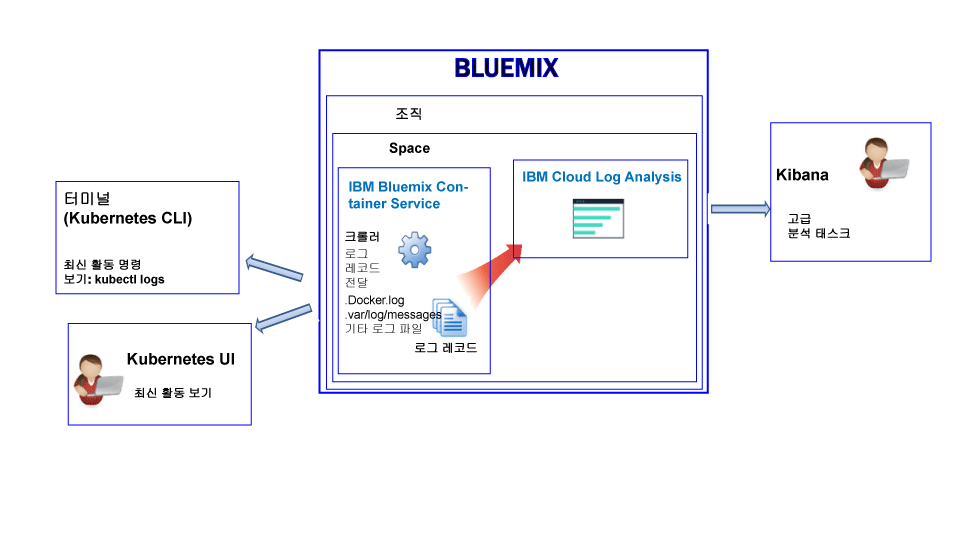
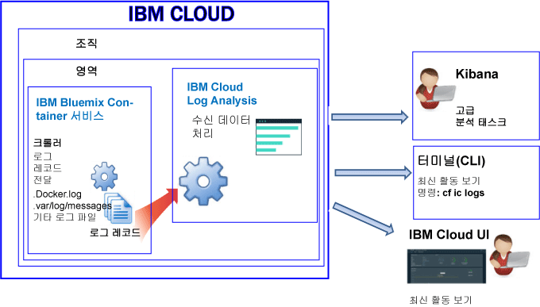

---

copyright:
  years: 2017

lastupdated: "2017-07-19"

---

{:shortdesc: .shortdesc}
{:new_window: target="_blank"}
{:codeblock: .codeblock}
{:screen: .screen}
{:pre: .pre}


# IBM Bluemix Container Service에 대한 로깅
{: #logging_containers_ov}

{{site.data.keyword.IBM}} 관리 클라우드 인프라에서 배치된 Docker 컨테이너 및 Kubernetes 클러스터에서 실행되는 Docker 컨테이너에 대한 로그 보기, 필터링 및 분석을 할 수 있습니다. 컨테이너의 로깅은 {{site.data.keyword.Bluemix_notm}} 또는 Kubernetes 클러스터에서 컨테이너를 배치할 때 자동으로 사용 가능하게 설정됩니다.
{:shortdesc}

컨테이너 로그는 크롤러를 사용하여 컨테이너의 외부에서 모니터되고 전달됩니다. 데이터는 크롤러에 의해
{{site.data.keyword.Bluemix_notm}}의 다중 테넌트 Elasticsearch에 전송됩니다. 


## Kubernetes 클러스터에서 실행되는 컨테이너에 대한 로그 수집
{: #logging_containers_ov_logs_collected_kubernetes}

다음 그림에는 {{site.data.keyword.containershort}}에 대한 로깅의 상위 레벨 보기가 표시됩니다.



{{site.data.keyword.Bluemix_notm}}에서는 Kubernetes 클러스터에서 애플리케이션을 배치할 때 다음과 같은 정보를 고려하십시오. 

* {{site.data.keyword.Bluemix_notm}} 계정에서 1개 이상의 조직이 있을 수 있습니다.  
* 각 조직에는 1개 이상의 {{site.data.keyword.Bluemix_notm}} 영역이 있을 수 있습니다. 
* 조직에 1개 이상의 Kubernetes 클러스터가 있을 수 있습니다. 
* 로그 수집은 Kubernetes 클러스터를 작성할 때 자동으로 사용 가능하게 설정됩니다. 
* Kubernetes 클러스터는 {{site.data.keyword.Bluemix_notm}} 영역을 인지하지 못합니다. 그러나 클러스터 및 해당 리소스의 로그 데이터는 {{site.data.keyword.Bluemix_notm}} 영역과 연관됩니다.
* 로그 데이터는 포드가 배치되면 곧 애플리케이션을 위해 수집됩니다.
* 클러스터에 대한 로그 데이터를 분석하려면 클러스터가 작성된 클라우드 공용 지역에 대한 Kibana 대시보드에 액세스해야 합니다. 

클러스터를 작성하기 전에 [{{site.data.keyword.Bluemix_notm}} UI](/docs/containers/cs_cluster.html#cs_cluster_ui) 또는 [명령행](/docs/containers/cs_cluster.html#cs_cluster_cli)을 통해서 특정 {{site.data.keyword.Bluemix_notm}} 지역, 계정, 조직 및 영역에 로그인해야 합니다. 사용자가 로그인한 영역은 클러스터 및 해당 리소스에 대한 로깅 데이터가 수집되는 영역에 있습니다.

기본적으로 컨테이너 프로세스가 stdout(표준 출력) 및 stderr(표준 오류)로 인쇄하는 정보가 수집됩니다. 정보를 stdout 및 stderr에 전송하는 것은 컨테이너의 정보를 노출하기 위한 표준 Docker 규약입니다. 

컨테이너에서 실행되는 앱의 로그 데이터를 JSON 형식으로 Docker 로그 콜렉터에 전달하는 경우, JSON 필드를 사용하여 Kibana에서 로그 데이터를 검색하고 분석할 수 있습니다. 자세한 정보는 [Kibana 검색 필드로 사용자 정의 필드 구성](logging_containers_ov.html#send_data_in_json)을 참조하십시오.

**참고:** Kubernetes 클러스터로 작업하는 경우, 네임스페이스 *ibm-system* 및 *kube-system*이 예약됩니다. 해당 네임스페이스에서 사용 가능한 리소스의 권한을 작성, 삭제, 수정 또는 변경하지 마십시오. 이러한 네임스페이스에 대한 로그는 {{site.data.keyword.IBM_notm}} 사용을 위한 것입니다.


## Bluemix에서 관리하는 컨테이너에 대한 로그 수집
{: #logging_containers_ov_logs_collected}

다음 그림에는 {{site.data.keyword.containershort}}에 대한 로깅의 상위 레벨 보기가 표시됩니다.



기본적으로 {{site.data.keyword.Bluemix_notm}} 관리 클라우드 인프라에서 배치된 컨테이너에 대해 다음과 같은 로그가 수집됩니다. 

<table>
  <caption>표 2. Bluemix 관리 클라우드 인프라에서 배치된 컨테이너에 대해 수집된 로그</caption>
  <tbody>
    <tr>
      <th align="center">로그</th>
      <th align="center">설명</th>
    </tr>
    <tr>
      <td align="left" width="30%">/var/log/messages</td>
      <td align="left" width="70%"> 기본적으로 Docker 메시지는 컨테이너의 /var/log/messages 폴더에 저장됩니다. 이 로그에는 시스템 메시지가 포함됩니다.
      </td>
    </tr>
    <tr>
      <td align="left">./docker.log</td>
      <td align="left">이 로그는 Docker 로그입니다. <br> Docker 로그 파일은 컨테이너의 내부에 파일로 저장되지는 않지만 수집됩니다. 컨테이너에 대한 stdout(표준 출력) 및 stderr(표준 오류) 정보를 노출하기 위한 표준 Docker 규약이기 때문에 이 로그 파일은 기본적으로 수집됩니다. 컨테이너 프로세스가 stdout 또는 stderr로 인쇄하는 정보가 수집됩니다.
      </td>
     </tr>
  </tbody>
</table>

추가 로그를 수집하려면 컨테이너를 작성할 때 로그 파일에 대한 경로와 함께 **LOG_LOCATIONS** 환경 변수를 추가하십시오. 쉼표로 구분하여 여러 개의 로그 파일을 추가할 수 있습니다.자세한 정보는 [컨테이너에서 기본이 아닌 로그 데이터 수집](logging_containers_other_logs.html#logging_containers_collect_data)을 참조하십시오.


##  Kibana 검색 필드로 사용자 정의 필드 구성 
{: #send_data_in_json}

기본적으로 로깅은 자동으로 컨테이너에 사용 가능하게 설정됩니다. Docker 로그 파일의 모든 항목은 Kibana에서 `message` 필드에 표시됩니다. 컨테이너 로그 항목의 일부인 특정 필드를 사용하여 Kibana의 데이터를 필터링하고 분석해야 하는 경우, 올바른 JSON 형식화된 출력을 전송하도록 애플리케이션을 구성하십시오.

다음 정보를 고려하십시오.

* Kubernetes 클러스터에 배치된 컨테이너의 경우, JSON 형식의 메시지를 stdout(표준 출력) 및 stderr(표준 오류)로 로그하십시오. 

    메시지에서 사용 가능한 각 필드는 값과 일치하는 필드의 유형으로 구문 분석됩니다. 예를 들면, 다음과 같은 JSON 메시지의 각 필드입니다. 
    
    ```
    {"field1":"string type",
        "field2":123,
        "field3":false,
        "field4":"4567"
    }
    ```
    
    필터링과 검색에 사용할 수 있는 필드로서 사용 가능합니다. 
    
    * `field1`은 문자열 유형의 `field1_str`로 구문 분석됩니다.
    * `field2`는 정수 유형의 `field1_int`로 구문 분석됩니다.
    * `field3`은 부울 유형의 `field3_bool`로 구문 분석됩니다.
    * `field4`는 문자열 유형의 `field4_str`로 구문 분석됩니다.
    
* {{site.data.keyword.Bluemix_notm}} 관리 클라우드 인프라에서 배치된 컨테이너의 경우, 컨테이너 로그 항목을 개별 필드로 구문 분석하려면 다음 단계를 완료하십시오.

    1. 메시지를 파일에 로그하십시오. 
    2. 컨테이너에서 분석에 사용할 수 있는 기본이 아닌 로그의 목록에 로그 파일을 추가하십시오. 자세한 정보는 [컨테이너에서 기본이 아닌 로그 데이터 수집](logging_containers_other_logs.html#logging_containers_collect_data)을 참조하십시오. 
    
    JSON 로그 항목이 STDOUT로서 컨테이너의 Docker 로그 파일에 전송되면 JSON으로 구문 분석되지 않습니다. 
    
    메시지를 파일에 로그하고 메시지가 올바른 JSON으로 판별되는 경우, 필드가 구문 분석되며 메시지의 각 필드에 대해 새 필드가 작성됩니다. 문자열-유형 필드 값만 Kibana에서 필터링 및 정렬에 사용 가능합니다. 

## 로그 수집
{: #log_ingestion}

{{site.data.keyword.loganalysisshort}} 서비스는 여러 가지 플랜을 제공합니다. 각 플랜은 로그 콜렉션으로 로그를 전송할 수 있는지 여부를 정의합니다. *라이트* 플랜을 제외한 모든 플랜에는 로그 콜렉션으로 로그를 전송할 수 있는 기능이 포함되어 있습니다. 플랜에 대한 자세한 정보는 [서비스 플랜](/docs/services/CloudLogAnalysis/log_analysis_ov.html#plans)을 참조하십시오.

다중 테넌트 Logstash 포워더를 사용하여 {site.data.keyword.loganalysisshort}}에 로그를 전송할 수 있습니다. 자세한 정보는 [다중 테넌트 Logstash 포워더(mt-logstash-forwarder)를 사용하여 로그 데이터 전송](/docs/services/CloudLogAnalysis/how-to/send-data/send_data_mt.html#send_data_mt)을 참조하십시오.


## 로그 콜렉션
{: #log_collection}

기본적으로 {{site.data.keyword.Bluemix_notm}}는 최대 3일 동안 로그 데이터를 저장합니다.   

* 영역당 최대 500MB의 데이터가 하루에 저장됩니다. 그 500MB 상한을 넘는 로그는 버려집니다. 상한 분배는 매일 오전
12:30 UTC에 재설정됩니다.
* 최대 1.5GB의 데이터를 최대 3일 동안 검색할 수 있습니다. 로그 데이터는 1.5GB의 데이터에 도달하거나 3일 이후에 롤오버(FIFO)됩니다.

{{site.data.keyword.loganalysisshort}} 서비스는 필요한 기간 만큼 로그 콜렉션에 로그를 저장하도록 허용하는 추가 플랜을 제공합니다. 각 플랜의 가격에 대한 자세한 정보는 [서비스 플랜](/docs/services/CloudLogAnalysis/log_analysis_ov.html#plans)을 참조하십시오.

로그 콜렉션에 로그를 보존하기 원하는 일 수를 정의하는 데 사용할 수 있는 로그 보존 정책을 구성할 수 있습니다. 자세한 정보는 [로그 보존 정책](/docs/services/CloudLogAnalysis/log_analysis_ov.html#policies)을 참조하십시오.


## 로그 검색
{: #log_search}

기본적으로 Kibana를 사용하여 {{site.data.keyword.Bluemix_notm}}에서 하루에 최대 500MB의 로그를 검색할 수 있습니다.  

{{site.data.keyword.loganalysisshort}} 서비스는 여러 가지 플랜을 제공합니다. 각 플랜에는 각기 다른 로그 검색 기능이 있으며, 예를 들어 *로그 콜렉션* 플랜은 하루에 최대 1GB의 데이터를 검색하도록 허용합니다. 플랜에 대한 자세한 정보는 [서비스 플랜](/docs/services/CloudLogAnalysis/log_analysis_ov.html#plans)을 참조하십시오.


## Kubernetes 클러스터에서 실행되는 컨테이너에 대한 컨테이너 로그 보기
{: #logging_containers_ov_methods_view_kube}

다음 방법 중에서 사용하여 Kubernetes 포드에서 컨테이너에 대한 최신 로그를 볼 수 있습니다.

* Kubernetes UI를 통해 로그를 봅니다. 각 포드의 경우, 선택해서 그 로그에 액세스할 수 있습니다. 자세한 정보는 [Web UI 대시보드 ](https://kubernetes.io/docs/tasks/access-application-cluster/web-ui-dashboard/ "외부 링크 아이콘"){: new_window}을 참조하십시오.

* Kubernetes CLI 명령 [kubectl logs ](https://kubernetes-v1-4.github.io/docs/user-guide/kubectl/kubectl_logs/ "외부 링크 아이콘"){: new_window}을 사용하여 로그를 봅니다. 

장기 로그를 보려면 Kibana를 사용할 수 있습니다. 데이터 보존 기간 정책에 대한 정보는 [서비스 플랜](/docs/services/CloudLogAnalysis/log_analysis_ov.html#plans)을 확인하십시오. 


## Bluemix에서 관리하는 컨테이너에 대한 컨테이너 로그 보기
{: #logging_containers_ov_methods_view_bmx}

다음 방법 중에서 사용하여 {{site.data.keyword.Bluemix_notm}} 관리 클라우드 인프라에 배치된 컨테이너에 대한 최신 로그를 볼 수 있습니다.

* 컨테이너의 최신 활동을 모니터하기 위해 {{site.data.keyword.Bluemix_notm}} UI를 통해 로그를 봅니다.
    
    각 컨테이너에 사용 가능한 **모니터링 및 로그** 탭을 통해 로그 보기, 필터링 및 분석을 수행할 수 있습니다. 자세한 정보는 [Bluemix 대시보드에서 로그 분석](/docs/services/CloudLogAnalysis/logging_view_dashboard.html#analyzing_logs_bmx_ui)을 참조하십시오.
    
    
* {{site.data.keyword.containershort}} CLI를 사용하여 로그를 보십시오. 로그를 프로그래밍 방식으로 관리하려면 명령을 사용하십시오. 
    
    **cf ic logs** 명령을 사용하여 명령행 인터페이스를 통해 로그 보기, 필터링 및 분석을 할 수 있습니다. 자세한 정보는 [명령행 인터페이스에서 로그 분석](/docs/services/CloudLogAnalysis/logging_view_cli.html#analyzing_logs_cli)을 참조하십시오.


## 컨테이너 로그 분석
{: #logging_containers_ov_methods}

컨테이너 로그 데이터를 분석하려면 Kibana를 사용하여 고급 분석 태스크를 수행하십시오. 오픈 소스 분석 및 시각화 플랫폼인 Kibana를 사용하여 다양한 그래프(예: 차트, 표)로 된 데이터를 모니터, 검색, 분석 및 시각화할 수 있습니다. 자세한 정보는 [Kibana에서 로그 분석](/docs/services/CloudLogAnalysis/kibana/analyzing_logs_Kibana.html#analyzing_logs_Kibana)을 참조하십시오.


## 튜토리얼: Kubernetes 클러스터에 배치된 앱에 대한 Kibana에서 로그 분석
{: #tutorial1}

Kubernetes 클러스터에 배치된 컨테이너의 로그를 분석하기 위해 Kibana를 사용하는 방법에 대해 학습하려면 [튜토리얼: Kubernetes 클러스터에 배치된 앱에 대해 Kibana에서 로그 분석](/docs/services/CloudLogAnalysis/containers/tutorials/kibana_tutorial_1.html#kibana_tutorial_1)을 참조하십시오.


