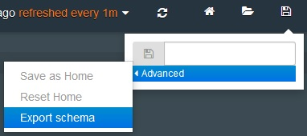

---

copyright:
  years: 2015, 2018

lastupdated: "2018-01-10"

---
{:new_window: target="_blank"}
{:shortdesc: .shortdesc}
{:screen:.screen}
{:codeblock:.codeblock}

# Kibana 대시보드 내보내기 및 공유
{: #exporting_sharing_kibana_dash}

대시보드 스키마를 JSON 파일 형식으로 내보내거나 로그 데이터의 사용자 정의 Kibana 대시보드에 대한 URL을 공유합니다.
{:shortdesc}

Kibana에서 대시보드를 JSON 파일 형식으로 내보내거나 대시보드의 URL을 공유하여 다른 이해 당사자(stakeholder)와 협업할 수 있습니다. 

Kibana 대시보드를 JSON 파일 형식으로 내보내려면 다음 태스크를 완료하십시오. 

1. **저장** 아이콘 을 클릭한 다음 **고급** **>** **스키마 내보내기**를 클릭하십시오. 

    

2. JSON 파일에 대한 의미 있는 이름을 선택한 다음 **저장**을 클릭하십시오. 이 JSON 파일을 가진 사용자는 사용자의 Kibana 대시보드에서 이 파일을 열 수 있습니다.  

Kibana 대시보드에 대한 URL을 작성하고 공유하려면 다음 태스크를 완료하십시오. 

1. Kibana 대시보드에서 **폴더** 아이콘 을 클릭하여 최근의 모든 대시보드를 나열하는 메뉴를 표시하십시오. 이름으로 저장한 대시보드에 추가로 이 메뉴는 다음 형식에 따라 이름이 지정되지 않은 대시보드를 나열합니다. *ALCH_TENANT_ID_application_id*. 

    

2. 공유하려는 대시보드에 대한 **공유** 아이콘 을 클릭하십시오. 공유 가능한 URL이 작성되어 표시됩니다.  

    

    대시보드를 다른 사용자와 공유하려면 URL을 복사하십시오. **닫기**를 클릭하여 대시보드로 돌아오십시오. 
