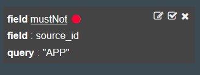
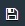

---

copyright:
  years: 2015, 2018

lastupdated: "2018-01-10"

---
{:new_window: target="_blank"}
{:shortdesc: .shortdesc}
{:screen:.screen}
{:codeblock:.codeblock}

# Kibana에서 로그 유형별로 Cloud Foundry 앱 로그 필터링
{: #logging_kibana_component_filter}

Kibana 대시보드에서 컴포넌트(로그 유형)별로 {{site.data.keyword.Bluemix_notm}} 애플리케이션 로그를 보고 필터링합니다. Cloud Foundry 앱의 **로그** 탭에서 Kibana 대시보드에 액세스할 수 있습니다.
{:shortdesc}

Kibana 대시보드에서 로그 유형별로 Cloud Foundry 앱 로그를 보고 필터링하려면 다음 단계를 완료하십시오. 

1. Cloud Foundry 앱의 **로그** 탭에 액세스하십시오.  

    1. {{site.data.keyword.Bluemix_notm}} **앱** 대시보드에서 앱 이름을 클릭하십시오. 
    2. **로그** 탭을 클릭하십시오. 
    
    앱의 로그가 표시됩니다.

2. 앱의 Kibana 대시보드에 액세스하십시오. **고급 보기** 를 클릭하십시오. Kibana 대시보드가 표시됩니다.

3. **모든 이벤트** 창에서 오른쪽 화살표 아이콘을 클릭하여 모든 필드를 표시하십시오. 

    

4. **필드** 분할창에서 **source_id**를 선택하여 **모든 이벤트** 창의 각 항목을 생성한 컴포넌트를 표시하십시오. 

    

5. **ALL EVENTS** 창에서 로그 이벤트 행을 클릭하여 해당 이벤트에 대한 세부사항을 표시하십시오. 필터링하려는 source_id를 표시하는 이벤트를 선택하십시오. 

    

6. 컴포넌트(로그 유형)에 대한 정보를 포함시키거나 제외할 필터를 추가하십시오.  

    * 컴포넌트 값을 포함시키는 필터를 추가하려면 표의 source_id 행에 있는 **돋보기**  아이콘을 클릭하십시오. 

         

    * 컴포넌트 값을 제외하는 필터를 추가하려면 표의 source_id 행에 있는 **제외**  아이콘을 클릭하십시오. 
    
          
     
     새 필터 조건이 Kibana 대시보드에 추가됩니다.

7. 원하는 경우 이전 단계를 반복하여 각 컴포넌트의 필터를 추가할 수 있습니다. 전체 컴포넌트 목록을 보려면 [로그 형식](../logging_view_kibana3.html#kibana_log_format_cf)을 참조하십시오.

    다음 이미지는 다른 컴포넌트에 대한 여러 필터가 있는 대시보드를 보여줍니다.
    
    

8. 대시보드를 저장하십시오.  

    필터 작성 및 대시보드 사용자 정의를 완료하면 **저장** 아이콘 을 클릭하고 대시보드의 이릉을 입력하십시오.  
      
    **참고:** 이름에 공백이 있는 대시보드를 저장하는 경우 저장되지 않습니다. 공백이 없는 이름을 입력하고 **저장** 아이콘을 클릭하십시오. 
    
    

컴포넌트(로그 유형)별로 로그 항목을 필터링하는 대시보드를 작성했습니다. **폴더** 아이콘 을 클릭하고 이름으로 대시보드를 선택하여 저장된 대시보드를 언제든 로드할 수 있습니다. 

