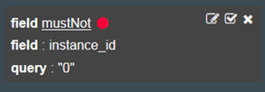

---

copyright:
  years: 2015, 2018

lastupdated: "2018-01-10"

---
{:new_window: target="_blank"}
{:shortdesc: .shortdesc}
{:screen:.screen}
{:codeblock:.codeblock}

# Kibana에서 인스턴스 ID별로 Cloud Foundry 앱 로그 필터링
{: #logging_kibana_instance_id}

Kibana 대시보드에서 앱의 인스턴스 ID(instance_id)별로 {{site.data.keyword.Bluemix_notm}} 인스턴스 로그를 보고 필터링합니다. Cloud Foundry 앱의 **로그** 탭에서 Kibana 대시보드에 액세스할 수 있습니다.
{:shortdesc}

Kibana 대시보드에서 instance_id별로 Cloud Foundry 앱 로그를 보고 필터링하려면 다음 태스크를 완료하십시오. 

1. Cloud Foundry 앱의 **로그** 탭에 액세스하십시오.  

    1. {{site.data.keyword.Bluemix_notm}} **앱** 대시보드에서 앱 이름을 클릭하십시오. 
    2. **로그** 탭을 클릭하십시오. 
    
    앱의 로그가 표시됩니다.

2. 앱의 Kibana 대시보드에 액세스하십시오. **고급 보기** 를 클릭하십시오. Kibana 대시보드가 표시됩니다.

3. Kibana 대시보드에서 **저장된 기본값으로 이동** 아이콘 을 클릭하여 영역의 모든 로그를 표시하십시오. **모든 이벤트** 창에서 오른쪽 화살표 아이콘을 클릭하여 모든 필드를 표시하십시오. 

    

4. **필드** 분할창에서 **application_id** 및 **instance_id**를 선택하여 **모든 이벤트** 창에서 application_id 및 instance_id 필드를 표시하십시오. 

    

5. **ALL EVENTS** 창에서 로그 이벤트 행을 클릭하여 해당 이벤트에 대한 세부사항을 표시하십시오. 필터링하려는 instance_id를 표시하는 이벤트를 선택하십시오. 

    

6. 앱 ID에 대한 정보를 포함시키거나 제외할 필터를 추가하십시오.  

    * 특정 애플리케이션 ID에 대한 정보를 포함시키는 필터를 추가하려면 표의 application_id 행에 있는 **돋보기**  아이콘을 클릭하십시오.  
    
           
    
    * 특정 애플리케이션 ID에 대한 정보를 제외하는 필터를 추가하려면 표의 application_id 행에 있는 **제외**  아이콘을 클릭하십시오.  
    
           
    
    새 필터 조건이 Kibana 대시보드에 추가됩니다.
 

7. 앱 인스턴스 ID에 대한 정보를 포함시키거나 제외할 필터를 추가하십시오.  

    * 특정 인스턴스 ID에 대한 정보를 포함시키는 필터를 추가하려면 표의 instance_id 행에 있는 **돋보기**  아이콘을 클릭하십시오. 

    

     * 특정 인스턴스 ID에 대한 정보를 제외하는 필터를 추가하려면 표의 instance_id 행에 있는 **제외**  아이콘을 클릭하십시오. 
    
           
    
    새 필터 조건이 Kibana 대시보드에 추가됩니다.

9. 대시보드를 저장하십시오. 필터 작성을 완료하면 **저장** 아이콘 을 클릭하고 대시보드의 이릉을 입력하십시오.  

    **참고:** 이름에 공백이 있는 대시보드를 저장하는 경우 저장되지 않습니다. 공백이 없는 이름을 입력하고 **저장** 아이콘을 클릭하십시오. 

    .

instance_id별로 로그 항목을 필터링하는 대시보드를 작성했습니다. **폴더** 아이콘 을 클릭하고 이름으로 대시보드를 선택하여 저장된 대시보드를 언제든 로드할 수 있습니다.  
