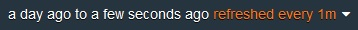
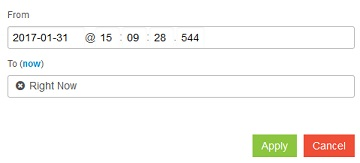

---

copyright:
  years: 2015, 2018

lastupdated: "2018-01-10"

---

{:new_window: target="_blank"}
{:shortdesc: .shortdesc}
{:screen:.screen}
{:codeblock:.codeblock}

# Kibana에서 시간별로 Cloud Foundry 앱 로그 필터링
{: #logging_kibana_time_filter}

Kibana 대시보드에서 시간별로 {{site.data.keyword.Bluemix_notm}} 애플리케이션 로그를 보고 필터링합니다. Cloud Foundry 앱의 **로그** 탭에서 Kibana 대시보드에 액세스할 수 있습니다.
{:shortdesc}

Kibana 대시보드에서 시간별로 Cloud Foundry 앱 로그를 보고 필터링하려면 다음 태스크를 완료하십시오. 

1. Cloud Foundry 앱의 **로그** 탭에 액세스하십시오.  

    1. {{site.data.keyword.Bluemix_notm}} **앱** 대시보드에서 앱 이름을 클릭하십시오. 
    2. **로그** 탭을 클릭하십시오. 
    
    앱의 로그가 표시됩니다.

2. 앱의 Kibana 대시보드에 액세스하십시오. **고급 보기** 를 클릭하십시오. Kibana 대시보드가 표시됩니다.

3. Kibana 대시보드에서 **시간 필터** 를 클릭한 다음 드롭 다운 메뉴에서 **사용자 정의**를 선택하십시오. 다음 창이 표시됩니다. 

    

4. **시작** 및 **종료** 필드를 클릭하여 필터에 대한 시작 및 종료 시간을 편집하십시오.  
    
    지금 시간에 대한 로그를 포함시키려면 **지금** 링크를 클릭하십시오.
    편집한 시간 범위가 맞으면 **적용**을 클릭하십시오.  

이제 Kibana 대시보드에 사용자 정의 시간 필터에 대해 로깅된 이벤트가 표시됩니다. 
