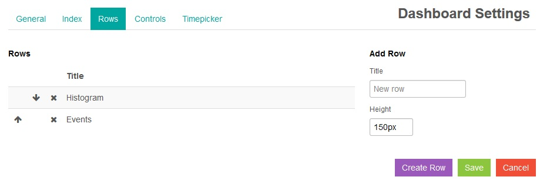
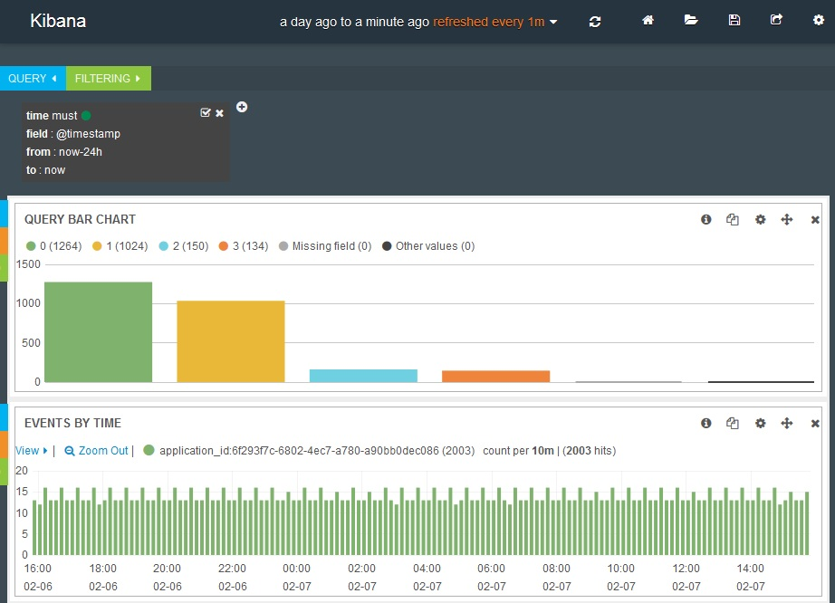

---

copyright:
  years: 2015, 2018

lastupdated: "2018-01-10"

---
{:new_window: target="_blank"}
{:shortdesc: .shortdesc}
{:screen:.screen}
{:codeblock:.codeblock}

# Kibana의 조회에서 표 및 그래프 작성
{: #logging_kibana_tables_graphs}

로그 데이터를 시각화하고 결과를 비교하기 위해 Kibana를 사용하여 조회에 대한 그래프 및 표를 작성하십시오. Cloud Foundry 앱의 **로그** 탭에서 Kibana 대시보드에 액세스할 수 있습니다.
{:shortdesc}

Kibana 대시보드는 일련의 행으로 배치되며, 각 행에는 하나 이상의 패널이 포함됩니다. 데이터의 그래픽 표시를 나타내도록 패널을 구성할 수 있습니다. 조회를 사용하여 표시할 데이터를 결정합니다. 그래프 또는 표를 작성하려면 먼저 공백 행을 작성한 다음 패널을 작성해야 합니다. CF 앱의 **로그** 탭에서 Kibana 대시보드에 액세스하면 대시보드에 히스토그램과 표라는 두 개의 패널이 자동으로 표시됩니다.

Kibana 대시보드에서 그래프나 표를 추가하려면 다음 태스크를 완료하십시오.

1. Cloud Foundry 앱의 **로그** 탭에 액세스하려면 {{site.data.keyword.Bluemix_notm}} **앱** 대시보드의 **Cloud Foundry 앱** 표에서 앱 이름을 클릭한 다음 **로그** 탭을 클릭하십시오. 앱의 로그가 표시됩니다.

2. 앱의 Kibana 대시보드 표시장치에 액세스하려면 **고급 보기** 를 클릭하십시오. Kibana 대시보드가 표시됩니다.

3. Kibana 대시보드에서 대시보드의 맨 아래까지 스크롤한 후 **행 추가** 를 클릭하여 추가할 패널에 대한 행을 작성하십시오. 대시보드 설정 분할창이 표시됩니다. 
	
	
	
	행 추가 분할창에서 **제목** 필드에 행의 이름을 입력한 다음 **행 작성**을 클릭하십시오. 새 행이 추가됩니다. 행 제목 옆에 있는 **위로 화살표** 또는 **아래로 화살표** 아이콘을 클릭하여 행 순서를 조정할 수 있습니다. 행 순서를 설정하면 **저장**을 클릭하십시오. Kibana 대시보드에 빈 행이 작성됩니다. 

4. **빈 행에 패널 추가**를 클릭하여 패널을 추가하십시오. 행 설정 분할창이 표시됩니다. 

    
	
	**패널 유형 선택** 드롭 다운 목록에서 **표**, **히스토그램** 또는 **용어**와 같은 여러 패널 유형을 선택할 수 있습니다. 조회를 기반으로 하여 막대형 차트, 원형 차트 또는 표를 작성하려면 **용어**를 선택하십시오. 구성 옵션의 범위가 행 설정 분할창에 표시됩니다.
	
	
	
	패널을 구성하십시오. 그래픽 표시장치에 대한 **제목**을 입력하십시오. 드롭 다운 목록에서 패널의 **너비**를 선택하십시오. **너비**는 대시보드를 가로지르는 패널 너비를 결정합니다. 매개변수 섹션에서 **필드**의 컨텐츠를 삭제하고 올바른 로그 필드를 입력하십시오(예: `instance_id`). 

5. 보기 옵션 섹션에 있는 **스타일** 드롭 다운 목록에서 **막대형**, **원형** 또는 **표**를 선택하여 막대형 차트, 원형 차트 또는 표를 선택하십시오. 조회 섹션에 있는 **조회** 드롭 다운 목록에서 **선택됨**을 선택하여 대시보드 조회에서 로그 데이터를 사용하십시오. 마지막으로 **저장**을 클릭하십시오. 새 패널이 대시보드에 표시됩니다.

	
	
6. 표를 표시하도록 이 패널을 변경하려면 **구성** 아이콘 을 클릭하십시오. 용어 설정 분할창이 표시됩니다. 

	
	
	**패널** 탭을 클릭한 다음 **스타일** 드롭 다운 목록에서 **표**를 선택하십시오. **저장**을 클릭하여 패널을 업데이트하고 대시보드로 돌아가십시오.

7. 추가 행 및 패널을 대시보드에 추가하십시오. 이를 완료하면 **저장** 아이콘을 클릭하여 변경사항을 이 대시보드에 저장하십시오. 

    **참고:** 이름에 공백이 있는 대시보드를 저장하는 경우 저장되지 않습니다. 공백이 없는 이름을 입력하고 **저장** 아이콘을 클릭하십시오. 

    .

