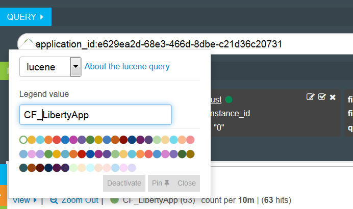

---

copyright:
  years: 2015, 2018

lastupdated: "2018-01-10"

---

{:shortdesc: .shortdesc}
{:new_window: target="_blank"}
{:codeblock: .codeblock}
{:screen: .screen}

# Kibana 3에서 로그 분석(더 이상 사용되지 않음)
{: #analyzing_logs_Kibana3}

{{site.data.keyword.Bluemix}}에서는 오픈 소스 분석 및 시각화 플랫폼인 Kibana를 사용하여 다양한 그래프(예: 차트, 표)로 된 데이터를 모니터, 검색, 분석 및 시각화할 수 있습니다. Kibana를 사용하여 고급 분석 태스크를 수행합니다.
{:shortdesc}

## Kibana 대시보드에서 데이터 필터링
{: #filter_data_kibana_dashboard}

{{site.data.keyword.Bluemix}}에서 리소스별 또는 {{site.data.keyword.Bluemix}} 영역별로 제공되는 기본 Kibana 대시보드를 사용하여 데이터를 분석할 수 있습니다. 이러한 대시보드에서는 기본적으로 지난 24시간 동안 사용 가능한 모든 데이터를 표시합니다. 그러나 대시보드를 통해 표시되는 정보를 제한할 수 있습니다. 기본 대시보드에 조회 및 필터를 추가할 수 있으며 이후에 사용하기 위해 이를 저장할 수 있습니다. 

대시보드에서 여러 개의 조회와 필터를 추가할 수 있습니다. 조회는 로그 항목의 서브세트를 정의합니다. 필터는 정보를 포함하거나 제외하여 데이터 선택을 세분화합니다.  

Cloud Foundry 앱의 경우 다음 목록은 데이터를 필터링하는 방법의 예를 간략하게 보여줍니다. 
* 로그에서 핵심 용어가 포함된 정보를 찾는 경우 해당 용어로 필터링되는 조회를 작성할 수 있습니다. Kibana를 사용하여 대시보드에서 조회를 시각적으로 비교할 수 있습니다. 자세한 정보는 [Kibana에서 조회를 사용하여 Cloud Foundry 앱 로그 필터링](kibana3/logging_kibana_query.html#logging_kibana_query)을 참조하십시오. 

* 특정 기간 내의 정보를 찾는 경우 시간 범위 내의 데이터를 필터링할 수 있습니다. 자세한 정보는 [Kibana에서 시간별로 Cloud Foundry 앱 로그 필터링](kibana3/logging_kibana_filter_by_time_period.html#logging_kibana_time_filter)을 참조하십시오. 

* 특정 인스턴스 ID에 대한 정보를 찾는 경우 인스턴스 ID별로 데이터를 필터링할 수 있습니다. 자세한 정보는 [Kibana에서 인스턴스 ID별로 Cloud Foundry 앱 로그 필터링](kibana3/logging_kibana_filter_by_instance_id.html#logging_kibana_instance_id) 및 [Kibana에서 알려진 애플리케이션 ID별로 Cloud Foundry 앱 로그 필터링](kibana3/logging_kibana_filter_by_known_application_id.html#logging_kibana_known_application_id)을 참조하십시오. 

* 특정 컴포넌트에 대한 정보를 찾는 경우 컴포넌트(로그 유형)별로 데이터를 필터링할 수 있습니다. 자세한 정보는 [Kibana에서 로그 유형별로loud Foundry 앱 로그 필터링](kibana3/logging_kibana_filter_by_component.html#logging_kibana_component_filter)을 참조하십시오. 

* 예를 들어 오류 메시지와 같은 정보를 찾는 경우 메시지 유형별로 데이터를 필터링할 수 있습니다. 자세한 정보는 [Kibana에서 메시지 유형별로 Cloud Foundry 앱 로그 필터링](kibana3/logging_kibana_filter_by_message_type.html#logging_kibana_message_type_filter)을 참조하십시오. 

## Kibana 대시보드 사용자 정의
{: #customize_kibana_dashboard}

데이터를 시각화하고 분석하기 위해 사용자 정의할 수 있는 여러 유형의 대시보드가 있습니다. 예를 들어 다음과 같습니다.
* 단일 cf-app 대시보드: 이는 단일 Cloud Foundry 애플리케이션의 정보를 표시하는 대시보드입니다.   
* 다중 cf-app 대시보드: 이는 동일한 {{site.data.keyword.Bluemix}} 영역에 배치된 모든 Cloud Foundry 애플리케이션의 정보를 표시하는 대시보드입니다.  

대시보드를 사용자 정의하는 경우 대시보드를 통해 보여줄 로그 데이터의 서브세트를 선택하는 조회 및 필터를 구성할 수 있습니다. 

데이터를 시각화하기 위해 패널을 구성할 수 있습니다. Kibana에는 정보를 분석하는 데 사용할 수 있는 표, 동향 및 히스토그램과 같은 여러 가지 패널이 포함되어 있습니다. 대시보드에서 패널을 추가, 제거하고 재배열할 수 있습니다. 각 패널의 목적은 다양합니다. 일부 패널은 하나 이상의 조회 결과를 제공하는 행으로 구성됩니다. 다른 패널은 문서 또는 사용자 정의 정보를 표시합니다. 예를 들어, 데이터를 시각화해서 분석하기 위해 막대형 차트, 원형 차트 또는 표를 구성할 수 있습니다.  

## Kibana 대시보드 저장
{: #save_Kibana_dashboard}

Kibana 대시보드를 사용자 정의한 후에 저장하려면 다음 단계를 완료하십시오. 

1. 도구 모음에서 **저장** 아이콘을 클릭하십시오. 

2. 대시보드의 이름을 입력하십시오.

    **참고:** 이름에 공백이 있는 대시보드를 저장하는 경우 저장되지 않습니다. 

3. 이름 필드 옆에 있는 **저장** 아이콘을 클릭하십시오. 

## Kibana 대시보드를 통해 로그 분석
{: #analyze_kibana_logs}

Kibana 대시보드를 사용자 정의한 후에 해당 패널을 통해 데이터를 시각화하고 분석할 수 있습니다.  

정보를 검색하기 위해 조회를 핀 고정하거나 해제할 수 있습니다. 

* 대시보드에 조회를 핀 고정할 수 있으며 이를 통해 검색이 자동으로 활성화됩니다. 
* 대시보드에서 컨텐츠를 제거하기 위해 조회를 비활성화할 수 있습니다. 

정보를 필터링하기 위해 필터를 사용 또는 사용 안함으로 설정할 수 있습니다.  

* 필터에서 **전환** 선택란 을 선택하여 필터를 사용으로 설정할 수 있습니다.    
* 필터에서 **전환** 선택란 을 선택 취소하여 필터를 사용 안함으로 설정할 수 있습니다.  

대시보드의 그래프와 차트는 데이터를 표시합니다. 대시보드에서 그래프와 차트를 사용하여 데이터를 모니터할 수 있습니다.  

예를 들어 단일 cf-app 대시보드의 경우 대시보드에 한 Cloud Foundry 애플리케이션에 대한 정보가 포함됩니다. 시각화하고 분석할 수 있는 데이터를 해당 앱에 대한 데이터로 제한할 수 있습니다. 이 대시보드를 사용하여 앱의 모든 인스턴스에 대한 데이터를 분석할 수 있습니다. 인스턴스를 비교할 수 있습니다. 정보를 인스턴스 ID별로 필터링할 수 있습니다. 

각 인스턴스 ID에 대한 조회를 정의하여 대시보드에 핀 고정할 수 있습니다.  

그런 다음 대시보드에서 보려는 인스턴스 정보에 따라 개별 조회를 활성화하거나 비활성화할 수 있습니다.  

다음 그림은 하나는 활성화된 조회이고 다른 하나는 비활성화된 조회를 보여줍니다. 

히스토그램에서 두 개의 인스턴스를 비교하려는 경우 동일한 대시보드에서 각 인스턴스 ID당 하나씩, 두 개의 조회를 정의할 수 있습니다. 해당 ID에 별명과 고유 색상을 부여하여 쉽게 식별할 수 있습니다. Kibana는 논리 OR로 조회를 결합하여 여러 조회를 처리합니다.  

다음 그림은 조회에 대한 별명과 색상을 구성하고 조회를 대시보드에 핀 고정하고 조회를 비활성화하는 패널을 보여줍니다. 

